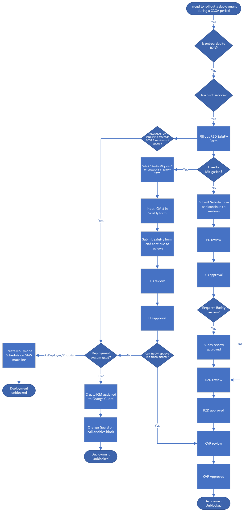

# Pilot Services Overview
Applicable services for this scenario will meet the following criteria: 

1. Services who use Ev2 as a deployment system

2. Onboarded to R2D

3. Is a QC service.  

4. Appears on the [Pilot Service](https://eng.ms/docs/products/fcm-engineering-hub/SafeFlyCCOAExceptions/PilotServices/PilotServices) list

<<<<<<< HEAD
If your service meets the above criteria, refer to our guidence here: [Submitting CCOA Requests for Pilot Services](https://eng.ms/docs/products/fcm-engineering-hub/SafeFlyCCOAExceptions/PilotServices/SubmittingCCOARequestsPilot)
=======
If your service meets the above criteria, refer to our guidence here: [Submitting CCOA Requests for Pilot Services](https://eng.ms/docs/products/fcm-engineering-hub/SafeFlyCCOAExceptions/PilotServices/Ev2PilotServices)
>>>>>>> 1c8ff4e06b78e314c22d1e2bdc1758993d69017e

If you do not meet the above criteria, refer to the table [here](https://eng.ms/docs/products/fcm-engineering-hub/SafeFlyCCOAExceptions/CCOAinSafeFlyOverview#which-exception-process-to-use) for additional guidence on which process applies to you

<!--2. Select list of host services who use AzDeployer as a deployment system. Refer to the table [here](https://eng.ms/docs/products/fcm-engineering-hub/SafeFlyCCOAExceptions/PilotServices/PilotServices) to see if your service is in scope-->

## User Experience Scenarios

Below is a flow chart of the entire user experience for Pilot Services. This wiki is also broken up into specific sections for each scenario where you will find even further drill downs on the specific steps to take when submitting a CCOA request.

## Issues

If you are an Ev2 Service who appears on the [Pilot Service](https://eng.ms/docs/products/fcm-engineering-hub/SafeFlyCCOAExceptions/PilotServices/PilotServices) list, refer to our guidence here: [Ev2 Pilot Services Issues](https://eng.ms/docs/products/fcm-engineering-hub/SafeFlyCCOAExceptions/PilotServices/Errors/Ev2PilotServicesErrors) 

<<<<<<< HEAD
If you are a Host Service (Below Arm) who appears on the [Pilot Service](https://eng.ms/docs/products/fcm-engineering-hub/SafeFlyCCOAExceptions/Errors/PilotServices/PilotServices) list, refer to our guidence here: [Host Pilot Services Issues](https://eng.ms/docs/products/fcm-engineering-hub/SafeFlyCCOAExceptions/PilotServices/Errors/HostPilotServicesErrors) 
=======
If you are a Host Service (Below Arm) who appears on the [Pilot Service](https://eng.ms/docs/products/fcm-engineering-hub/SafeFlyCCOAExceptions/Errors/PilotServices/PilotServices) list, refer to our guidence here: [Host Pilot Services Issues](https://eng.ms/docs/products/fcm-engineering-hub/SafeFlyCCOAExceptions/PilotServices/HostPilotServicesErrors) 
>>>>>>> 1c8ff4e06b78e314c22d1e2bdc1758993d69017e
