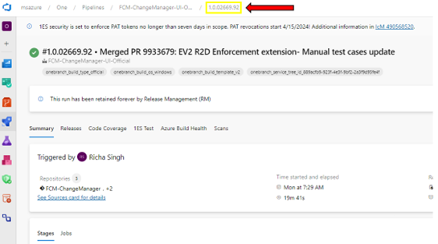

# Submitting CCOA Requests for Pilot Services

<!---->

When submitting a CCOA exception, pilot services will navigate to the SafeFly home page and create a new request. During a CCOA period, a banner will be displayed at the top of the page indicating that there is a CCOA in effect along with a link to the CCOA documentation.  

## Deployment Details

The *Deployment Details* Section will ask for details that are relevant to the deployment system you are using. 

### If your Deployment System is Ev2 

In the *Deployment Details* Section, question 4-e will ask you to enter the build number. It is critical to ensure this information is correct in order for SafeFly to be able to unblock your deployment. This question will show up if you select Ev2 as your deployment system in question 4-b

There are a few ways you can obtain this information. 

1. Navigate to Ev2 and under *Release Details* you will see the Build Number

    

2. In ADO, click on *Artifacts*. In the pop-up, the build version will be available in the navigation at the top. See the images below where the build version is highlighted in yellow.

    
    
    

Once you have the build number, you can either select is from the drop down list or enter the number into the question.

### If your Deployment System is AzDeployer

In the *Deployment Details* Section, you will have to provide the following information:

### If your Deployment System is PilotFish 

In the *Deployment Details* Section, you will have to provide the following information:

## Continuing the R2D Questionnaire

When the user enters a start and end range that falls within a CCOA period along with the qualifying deployment tool, and service selected, a CCOA exception form will appear after the Deployment Details section of the page. 

The form will be automatically populated with the CCOA event that the exception is needed for. 

If the deployment is a Livesite Mitigation, the user will be asked to input an ICM ID for Question 8. *Note: this will bypass R2D Review. See more details* [here](https://eng.ms/docs/products/fcm-engineering-hub/SafeFlyCCOAExceptions/PilotServices/BypassingR2D)

Once the form is submitted, the user will be routed to their request where it will show the reviews they need to complete along with the progress of the reviews. The review process is as follows:

1.	Automatic reviews: occurs immediately and provides a calculated risk, deployment impact, etc.
2.	Service Manager Reviews: this is conditional and is dependent on the service itself
3.	Engineering director reviews
4.	Buddy Reviews: this is conditional and is dependent on the service itself
5.	R2D team reviews: user will need to schedule a meeting with the R2D team
    - Meeting Times:
        - Morning R2D Review: Daily 8:35AM - 9:30AM PT
        - Evening R2D Reviews: Mon/Thu 1:30PM - 2:00PM PT, or as needed we can set up if its high priority deployment request and needs review.
    - What to expect in R2D discussions
        - Safefly request must be “ED (Engineering Director) approved” prior to bringing in R2D pre-deploy forum.
        - Know your payload, engage others in review meetings to provide inputs, as needed.
        - Engineering Managers (Principal +) are required to be part of the R2D review discussions for the service deployment request.
        - Expect R2D council to be actively engaged and learn more about payload risks and quality validation completed to ensure change is safe and avoid shipping bad code to production regions.
        - Ensure the team has information on pending and ongoing repairs corresponding to improving deployment stature for the service (Test/Release, Detection etc.)
    - For CCOA events, users will have the option to bypass R2D reviews for critical changes. By selected “Livesite Mitigation” for question 8 in the SafeFly form, the service will bypass R2D reviews and skip to CVP reviews. See [Bypassing R2D](https://eng.ms/docs/products/fcm-engineering-hub/SafeFlyCCOAExceptions/PilotServices/BypassingR2D) for more information.
6. CVP Reviews
    - If R2D review rejects the request, the CVP still has the ability to overrule the decision and user will be able to proceed with deployment
    - If R2D approves, CVP can reject request
7.	Once all approvals have been met, the deployment will be unblocked and the user will be able to proceed with rolling out their deployment

