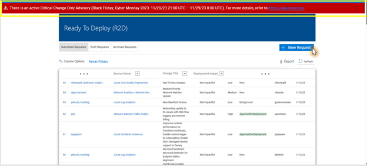
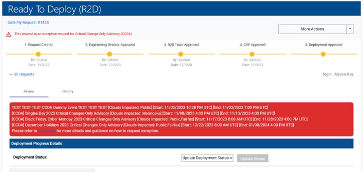
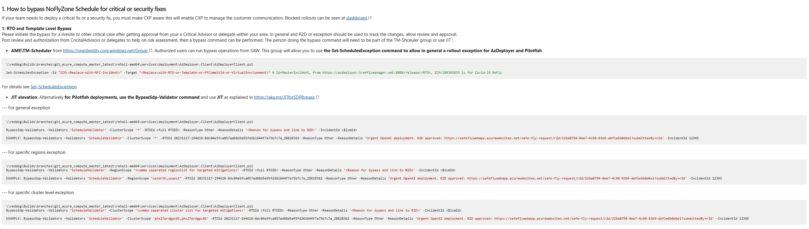

# Services who use AzDeployer, PilotFish, or ApStager as a deployment system, are onboarded to R2D (Non-Pilot)

If your service uses AzDeployer, PilotFish, or ApStager as a deployment system, is onboarded to R2D and does not appear in the [Pilot Services](https://eng.ms/docs/products/fcm-engineering-hub/SafeFlyCCOAExceptions/PilotServices/SubmittingCCOARequests) list, this page will provide guidence for submitting CCOA Exception requests.

## Step 1: Complete R2D review

The first step is for the service to submit an R2D request in SafeFly. They will have to navigate to SafeFly and complete the questionnaire. 

Once the form is submitted, the user will be routed to their request where it will show the reviews they need to complete along with the progress of the reviews. The review process is as follows: 

1.	Automatic reviews: occurs immediately and provides a calculated risk, deployment impact, etc.
2.	Service Manager Reviews: this is conditional and is dependent on the service itself
3.	Engineering director reviews
4.	Buddy Reviews: this is conditional and is dependent on the service itself
5.	R2D team reviews: user will need to schedule a meeting with the R2D team
    - Meeting Times:
        - Morning R2D Review: Daily 8:35AM - 9:30AM PT
        - Evening R2D Reviews: Mon/Thu 1:30PM - 2:00PM PT, or as needed we can set up if its high priority deployment request and needs review.
    - What to expect in R2D discussions
        - Safefly request must be “ED (Engineering Director) approved” prior to bringing in R2D pre-deploy forum.
        - Know your payload, engage others in review meetings to provide inputs, as needed.
        - Engineering Managers (Principal +) are required to be part of the R2D review discussions for the service deployment request.
        - Expect R2D council to be actively engaged and learn more about payload risks and quality validation completed to ensure change is safe and avoid shipping bad code to production regions.
        - Ensure the team has information on pending and ongoing repairs corresponding to improving deployment stature for the service (Test/Release, Detection etc.)
6. CVP Reviews
    - If R2D review rejects the request, the CVP still has the ability to overrule the decision and user will be able to proceed with deployment
    - If R2D approves, CVP can reject request
7.	Once all approvals have been met, the deployment will be unblocked and the user will be able to proceed with rolling out their deployment

## Bypass NoFlyZone Schedule

After the request is approved by R2D, the user will then create a NoFlyZone Set-SchedulesException on their SAW machine if they are part of the AME\TM-Scheduler SG or they can JIT and run a the BypassSDP cmdlet (only for PF deployments). 

Detailed information can be found here: [NoFlyZone Schedule](https://msazure.visualstudio.com/AzureWiki/_wiki/wikis/AzureWiki.wiki/3335/Platform-NoFlyZone-Scheduling?anchor=1.-how-to-bypass-noflyzone-schedule-for-critical-or-security-fixes). 

API for the Set_SchedulesException can be found here: [API_Set_SchedulesException](https://msazure.visualstudio.com/AzureWiki/_wiki/wikis/AzureWiki.wiki/52501/API_Set_SchedulesException)

1. For PF, get JIT approval and then run the BypassSdp command [NoFlyZone Schedule](https://msazure.visualstudio.com/AzureWiki/_wiki/wikis/AzureWiki.wiki/3335/Platform-NoFlyZone-Scheduling?anchor=1.-how-to-bypass-noflyzone-schedule-for-critical-or-security-fixes). They can also run the Set-SchedulesException if they have permissions.

2. For AzDeployer rollouts (non PF), they must run the Set-SchedulesException. (JIT is not an option)
