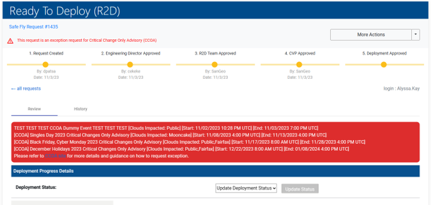
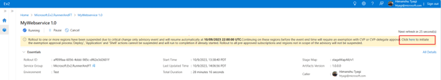
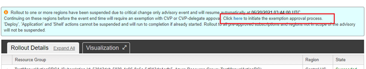

# Services who use Ev2 as a deployment system, are onboarded to R2D (Non-QCS)

If your service uses Ev2 as a deployment system, is onboarded to R2D and does not appear in the [SafeFly CCOA Services](https://eng.ms/docs/products/fcm-engineering-hub/SafeFlyCCOAExceptions/PilotServices/SubmittingCCOARequests) list, this page will provide guidence for submitting CCOA Exception requests.

## Step 1: Complete R2D review

The first step is for the service to submit an R2D request in SafeFly. They will have to navigate to SafeFly and complete the questionnaire. 

Once the form is submitted, the user will be routed to their request where it will show the reviews they need to complete along with the progress of the reviews. The review process is as follows: 

1.	Automatic reviews: occurs immediately and provides a calculated risk, deployment impact, etc.
2.	Service Manager Reviews: this is conditional and is dependent on the service itself
3.	Engineering director reviews
4.	Buddy Reviews: this is conditional and is dependent on the service itself
5.	R2D team reviews: user will need to schedule a meeting with the R2D team
    - Meeting Times:
        - Morning R2D Review: Daily 8:35AM - 9:30AM PT
        - Evening R2D Reviews: Mon/Thu 1:30PM - 2:00PM PT, or as needed we can set up if its high priority deployment request and needs review.
    - What to expect in R2D discussions
        - Safefly request must be “ED (Engineering Director) approved” prior to bringing in R2D pre-deploy forum.
        - Know your payload, engage others in review meetings to provide inputs, as needed.
        - Engineering Managers (Principal +) are required to be part of the R2D review discussions for the service deployment request.
        - Expect R2D council to be actively engaged and learn more about payload risks and quality validation completed to ensure change is safe and avoid shipping bad code to production regions.
        - Ensure the team has information on pending and ongoing repairs corresponding to improving deployment stature for the service (Test/Release, Detection etc.)
6. CVP Reviews
    - If R2D review rejects the request, the CVP still has the ability to overrule the decision and user will be able to proceed with deployment
    - If R2D approves, CVP can reject request
7.	Once all approvals have been met, the deployment will be unblocked and the user will be able to proceed with rolling out their deployment

After the request is approved by R2D, the user will then have to navigate back to Change Guard to submit their CCOA exception request. Ensure you have copied the link with the R2D review result in SafeFly. In the next section is a description of how to submit an Ev2 exception request in Change Guard. 

## Step 2: Submit a CCOA Exception request in Change Guard

In order to submit an exception request in Change Guard, the service will have to meet one of the following criteria:
1.	QCS services who use Ev2 as a deployment system but do not appear on the list of [SafeFly CCOA Services](https://eng.ms/docs/products/fcm-engineering-hub/SafeFlyCCOAExceptions/PilotServices/SubmittingCCOARequests) 
2.	QCS service who use Ev2 as a deployment system but have experienced an error when submitting a CCOA exception request in SafeFly
3.	Services who are onboarded to R2D and have already completed the review process

For a critical deployment that is planned during a Hi-Pri CCOA, navigate to [Change Guard](https://aka.ms/changeguard) to create a new Ev2 request and complete all of the required fields (title, business justification, etc..), click the submit button at the bottom of the form to kick off the approval process.

When the user has completed the R2D review and the deployment was approved, insert the URL from the R2D submission into the justification.

For users who need to create an Ev2 exception request for a critical deployment that is currently blocked during a Hi-Pri CCOA, service owners can raise an Ev2 exception request for their Ev2 rollout from the embedded link from any of the Ev2 entry points: 

1. Via Ev2 portal upon restarting an existing rollout 

    

2. From classic Ev2 portal, select the link in the status field

    

3. From Ev2 cmdlts, select the link from the logs

    

4. Via Ev2 email notification

    

5. Via OneBranch VSRM + Ev2 Compliance Release pipeline task 

    

After navigating from the Ev2 entry point, the Ev2 exception form will automatically be populated and you will only have to complete the required fields in the Change Guard exception form. 

## After Subitting a CCOA request in Change Guard

Information on how service owners and approvers are informed about the current state of an exception request, please naviate [here](https://eng.ms/docs/products/fcm-engineering-hub/changeguard/approversinformed) 

Information on approving/rejecting an exception request can be found [here](https://eng.ms/docs/products/fcm-engineering-hub/changeguard/approveorrejecter)

<!--

 -->

