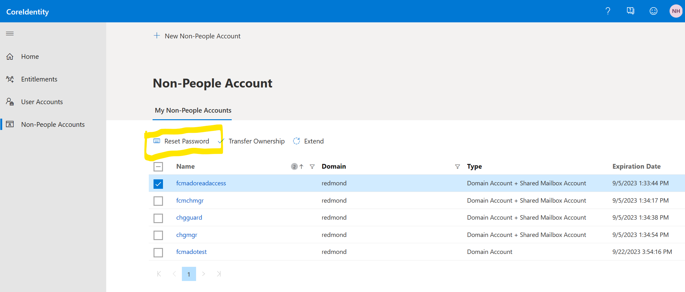
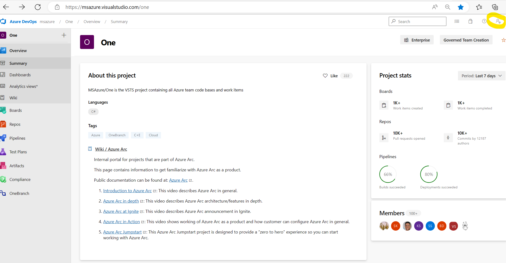
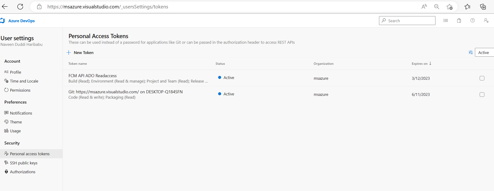
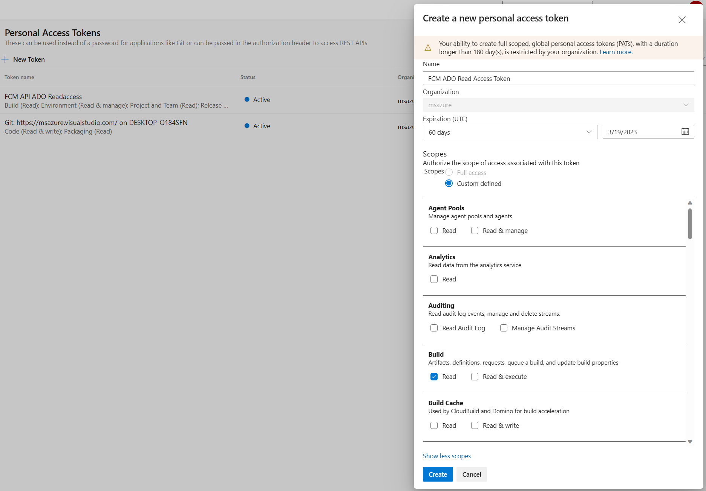

The incident occurs when there is an issue in pulling ADO release details for a EV2 rollout

EV2 rollouts pass info of ADO release that has triggred the rollout, we use the release details in Ev2 and call ADO API's to get ADO Release info.

currently ADOReleaseAPI supports only msazure,msdata and o365exchange orgs, for rest of them , it will return no content.
 

**Alert that triggred the incident**
Note: Use SAW machine while accessing prod subscription, you need to JIT to subscription 

https://ms.portal.azure.com/#@MSAzureCloud.onmicrosoft.com/resource/subscriptions/fbc17084-a3a3-42bf-a9dc-8bc7f996a679/resourceGroups/ADOReleaseEventsAPI/providers/microsoft.insights/components/ADOReleaseEventsAPI/alertsV2

**Appinsights** to get more details in to the errors, make sure you using correct time filters.

https://ms.portal.azure.com/#view/Microsoft_OperationsManagementSuite_Workspace/Logs.ReactView/source/Alerts.EmailLinks/scope~/%7B%22resources%22%3A%5B%7B%22resourceId%22%3A%22%2Fsubscriptions%2Ffbc17084-a3a3-42bf-a9dc-8bc7f996a679%2FresourceGroups%2FADOReleaseEventsAPI%2Fproviders%2Fmicrosoft.insights%2Fcomponents%2FADOReleaseEventsAPI%22%7D%5D%7D/q/eJx1ykEOQEAMAMCv1J7s1Z0X%2BESziia2lbaIxOP5gNNcJgwLOTxwrWQETicZxz1%2BbjD0HaBMUMkdF4KmqASyeJt2ssrurJLy3xGNWQ%2BZUn4B/prettify/1/timespan/2023-01-19T15%3A36%3A42.0000000Z%2F2023-01-19T15%3A51%3A42.0000000Z
Run the sample call and see if the API is working as expected

Below is the sample ADO Release Events API, you can get the function key from ADOReleseEventsAPI in production
https://adoreleaseapi.azurewebsites.net/api/ReleaseInformation?releaseId=9134081&org=msazure&projectId=b32aa71e-8ed2-41b2-9d77-5bc261222004&code=<functionkey>

Link to get Function key, you need to get use SAW machine
https://ms.portal.azure.com/#view/WebsitesExtension/FunctionMenuBlade/~/functionKeys/resourceId/%2Fsubscriptions%2Ffbc17084-a3a3-42bf-a9dc-8bc7f996a679%2FresourceGroups%2FADOReleaseEventsAPI%2Fproviders%2FMicrosoft.Web%2Fsites%2FADOReleaseEventAPI%2Ffunctions%2FReleaseInformation

The query below gives a sample of EV2 rollout and its release details.

https://fcmdata.kusto.windows.net/FCMKustoStore?query=H4sIAAAAAAAEAIWPMYvCQBCFe8H%2fMGxjBAtNr81dCgsbc6SVITvqyO5O2J3EU%2fLjFSLicYL1%2b973eB6VIqPjK9ldx3TOJl9HDAcqOgpa5ZuXvLrHkxks5n7aw%2flIkeCHPZWKvoEVHiRb2ClgsFBKG2sqL0nJQy1BkUPKTPHbREqpy82ADUvflOrIjbKEJwvGJ7y2kQyMRxLfkH9Qi4pmPPrk3JIjTGR6x571fmTeN1FOVCsUVb4V56TVtV0OjrWdPQoc9rL8J74BTAXbnzsBAAA%3d&web=0

materialized_view('ChangeEventV2MaterializedView', 10m)| where TimeStamp >ago(1d) and SourceSystem contains("Expressv2") and ChangeDescription contains "msazure" 
or ChangeDescription  contains "msdata"
and ChangeDescription contains "Release"|limit 100|project EV2RolloutId=ChangeId,Releaseinfo=ChangeDescription

This incident occurs in cases the account "FCMADOReadAccess" doesnt have permissions to access ADO API's. The Access token is stored in the keyvault

if the access token is expired, we need to generate a new access token. Use SAW and login to https://msazure.visualstudio.com
(Note: change the org to msdata or o365 exchange based on the token that needs to be renewed), use `FCMADOReadAccess@microsoft.com` as the user 
and password for the same is stored in [keyvault](https://ms.portal.azure.com/#@microsoft.onmicrosoft.com/asset/Microsoft_Azure_KeyVault/Secret/https://fcmintkv.vault.azure.net/secrets/fcmadoreadaccess-password).
You can also reset the password for FCMADOReadAccess using https://coreidentity.microsoft.com/manage/service under "Non-People Account". 
Make sure you update the password in keyvault, if you reset

  

Once you login to the ADO portal, you can generate a PAT token for "FCMADOReadAccess" account, by clicking on user settings on right hand top corner
and selecting "Personal Access Tokens"
  

Click on NewToken, give any name and select atleast 60days and set the scopes as custom defined.
Make sure you select Read permissions for "Build","Release","Environment","Project".
  
 

once the PAT token is generated, update the secret "Secret-ADOPATToken",
Please note the secret is int the format {"msazure":"<MSAzurePATToken>","msdata":"<MSDataPATToken>","o365exchange":"<o365exchangePATToken>"}
https://ms.portal.azure.com/#@MSAzureCloud.onmicrosoft.com/asset/Microsoft_Azure_KeyVault/Secret/https://fcmproduction-kv.vault.azure.net/secrets/Secret-ADOPATToken

**Tech spec to ingress ADO release details are here**

https://microsoft.sharepoint.com/:w:/r/teams/WAG/EngSys/ServiceMgmt/ChangeMgmt/Shared%20Documents/Design%20Docs/Technical%20design%20to%20ingest%20ReleaseInfo.docx?d=w008ea9d0d1484d178e6dc32cb9619570&csf=1&web=1&e=3BWsR8