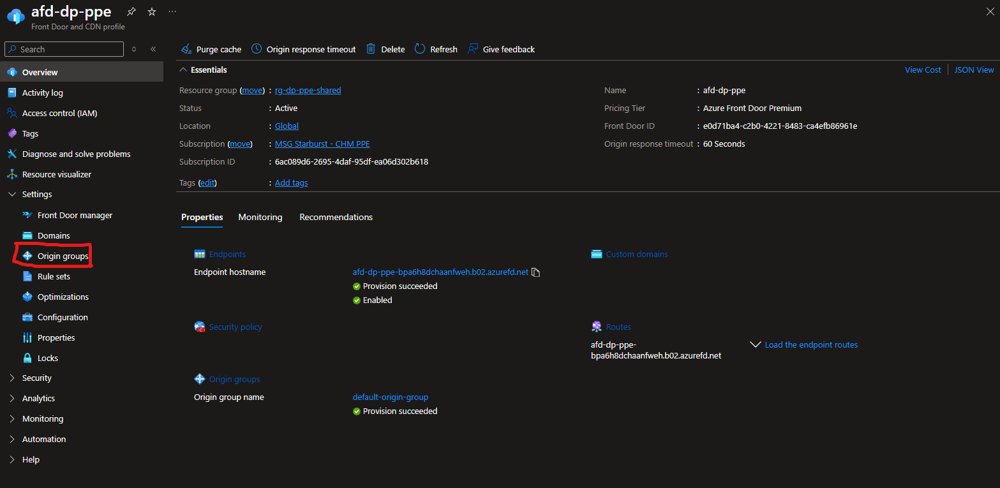
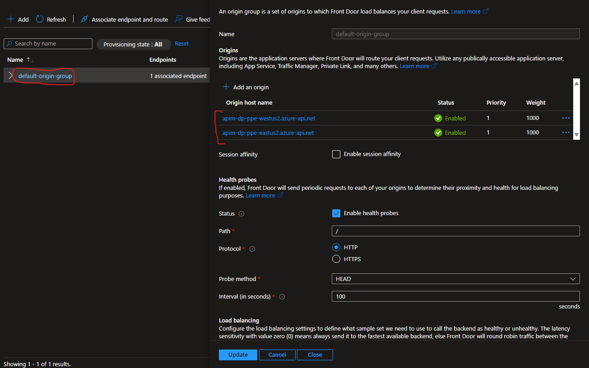
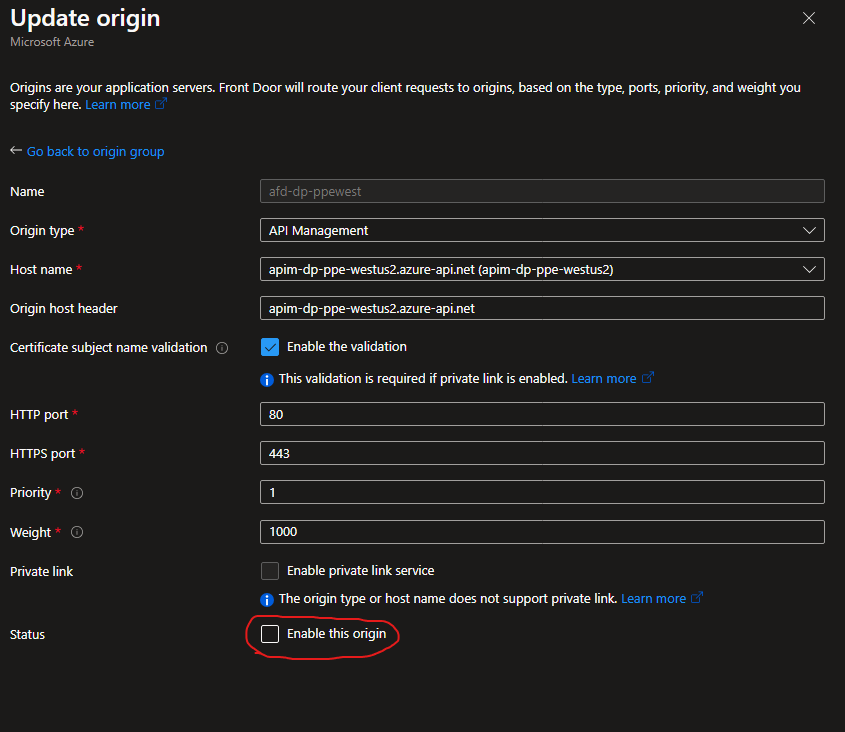
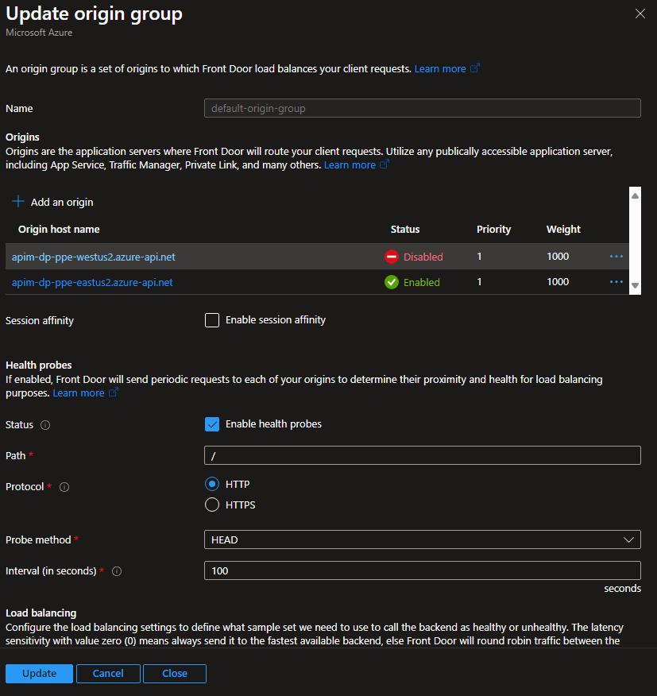
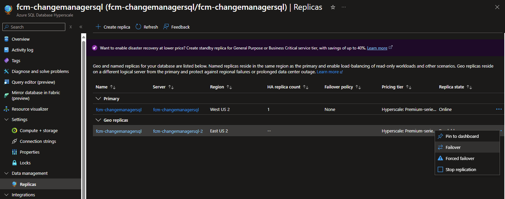
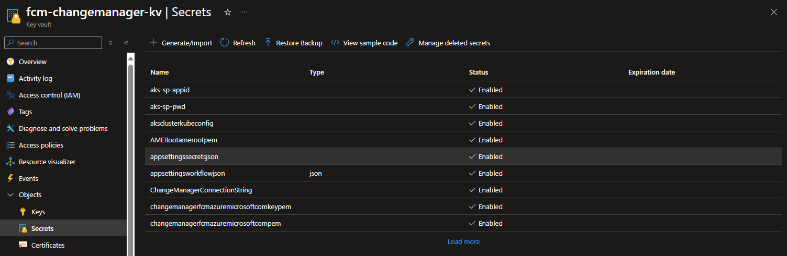
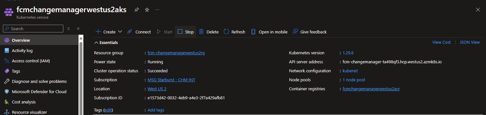
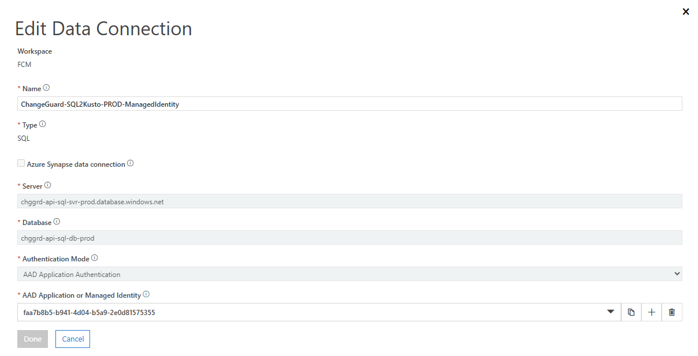

# Failover Plan

## Purpose

The purpose of this Document is to outline the failover steps for the following components:

- DataPlatform APIs (Css, B2d, D2b, P2b)
- FCMAI (FCMCopilot, IEP)
- ChangeGuard

For DP and FCMAI we follow a failover first approach where we route traffic to a healthy region. We currently do not have geo-resiliency for our database backend (Azure Data Explorer) and are working to mitigate this; see [High Availability for ChangeInsights Data Storage](https://microsoft.sharepoint.com/:w:/r/teams/WAG/EngSys/ServiceMgmt/ChangeMgmt/Shared%20Documents/Design%20Docs/High%20availability%20for%20FCM%20data%20storage%20and%20pipelines.docx?d=wd158587d3d884acab429570abdaebe1b&csf=1&web=1&e=iuAVV6). For ChangeGuard, we have a geo-resilient SQL data store but currently operate in a single region; we are working to regionalize our service infrastructure. For more information see [MARIUS ADD LINK]().

### Cross Region Failover

DataPlatform (DP) and FCMAI APIs are multi-region enabled. When we encounter an issue with the service via ICM ticket, our first plan of action is to route traffic to a healthy region. This is done via manual configuration update of the Azure Front Door instance. Follow the steps to failover:

- Identify the AFD instance; they are the following:
  - DP
    - PPE: [afd-dp-ppe](https://ms.portal.azure.com/#@MSAzureCloud.onmicrosoft.com/resource/subscriptions/6ac089d6-2695-4daf-95df-ea06d302b618/resourceGroups/rg-dp-ppe-shared/providers/Microsoft.Cdn/profiles/afd-dp-ppe/overview)
    - PROD: [afd-dp-prod](https://ms.portal.azure.com/#@MSAzureCloud.onmicrosoft.com/resource/subscriptions/8830ba56-a476-4d01-b6ac-d3ee790383dc/resourceGroups/rg-dp-prod-shared/providers/Microsoft.Cdn/profiles/afd-dp-prod/overview)
  - FCMAI
    - PPE: [afd-ai-ppe-eastus2](https://ms.portal.azure.com/#@MSAzureCloud.onmicrosoft.com/resource/subscriptions/6ac089d6-2695-4daf-95df-ea06d302b618/resourceGroups/rg-ai-ppe-eastus2/providers/Microsoft.Cdn/profiles/afd-ai-ppe-eastus2/overview)
    - PROD: [afd-ai-prod-eastus2](https://ms.portal.azure.com/#@MSAzureCloud.onmicrosoft.com/resource/subscriptions/8830ba56-a476-4d01-b6ac-d3ee790383dc/resourceGroups/rg-ai-prod-eastus2/providers/Microsoft.Cdn/profiles/afd-ai-prod-eastus2/origingroups)

- Navigate to the **Origin Group** tab on the right

- Select the **default-origin-group** from the list of groups; you should see API Management (APIM) instances as origins.

- To disable an origin, select the apim instance (**apim-dp-ppe-westsu2** in this example) and uncheck the *Enable this origin* box as shown.

- Finally, after confirming the disable region, select **Update** to rollout the changes. It should take a couple of minutes to complete.

- To renable the region, simply recheck the *Enable this origin* box and rollout the changes as above.

### ChangeGuard

At the moment Change Guard is not multi-region enabled. We are working to regionalize our service infrastructure. 
We have implemented geo-resiliency at the SQL database level, where we have a primary and a readonly replica in another region.
In the event of a failover at the database level, we will need to manually update the connection string to point to the secondary region. 

#### Failover plan
In case the region hosting the primary SQL DB goes down, we can switch to the other region by:
1.	Failing over the primary to the secondary from the azure portal

2.	Updating the appsettings.json secret (named appsettingssecretsjson) from Key Vault to point to the failed over database (the geo-replicated DB will be on another server, residing in another region)

3.	Restarting the AKS cluster to take the new appsettings value. Stop the AKS cluster from the Azure portal and start it again.

4.	Update Lens orchestrator jobs to push data to new Server by updating the Data Connection
