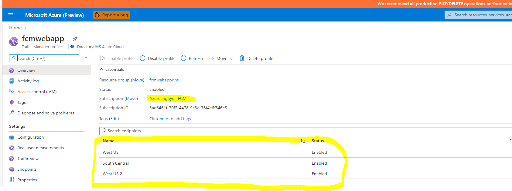
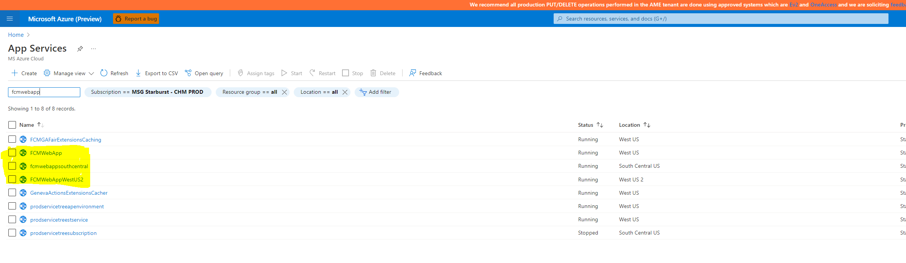
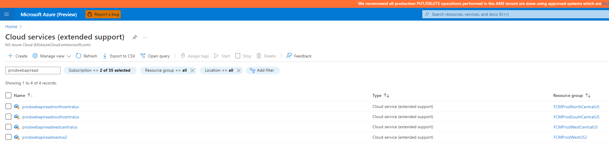
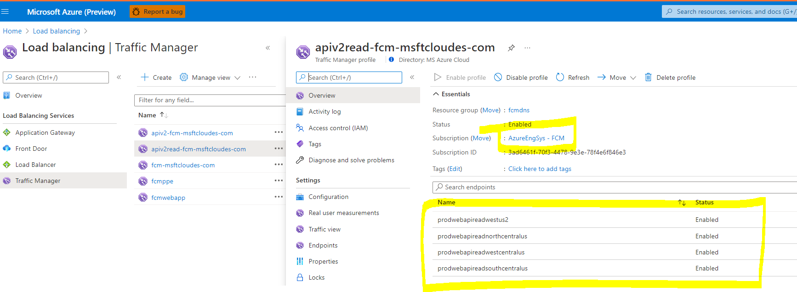
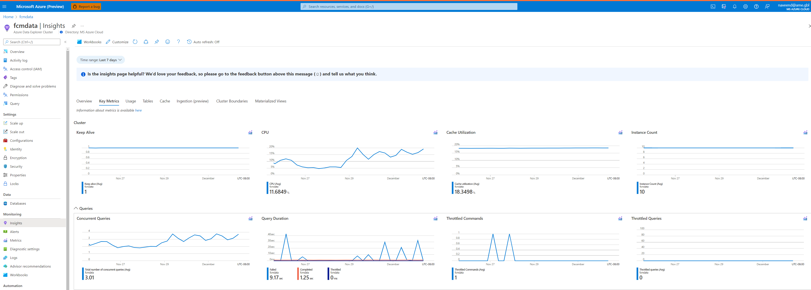

The incident occurs when there are failures in requests to FCM change explorer. 

**Components involved**

 1.**Traffic Manager**

 2.**FCMWebApp**

 3.**WebAPI**

 4.**Kusto**

**Step 1:Traffic Manger**
Check the traffic manager is health and in enabled state.

https://ms.portal.azure.com/#@MSAzureCloud.onmicrosoft.com/resource/subscriptions/3ad6461f-70f3-4478-9e3e-78f4e6f846e3/resourceGroups/fcmwebappdns/providers/Microsoft.Network/trafficmanagerprofiles/fcmwebapp/overview 

Note: Currently the resource is in AzureEngSys – FCM subscription. We need to move it to prod subscription. 

  

**Step 2:FCMWebApp**

We have 3 instances of webapp running 

1. fcmwebappsouthcentral.azurewebsites.net 
2. fcmwebapp.azurewebsites.net 
3. fcmwebappwestus2.azurewebsites.net 
Resource URL:https://ms.portal.azure.com/#@MSAzureCloud.onmicrosoft.com/resource/subscriptions/3ad6461f-70f3-4478-9e3e-78f4e6f846e3/resourceGroups/fcmwebappdns/providers/Microsoft.Network/trafficmanagerprofiles/fcmwebapp/overview 

  
Make sure they are helathy and in running state 

**Check for WebApp Errors **

Appinsights for web apps is FCMNewAppInsights URL:

 https://ms.portal.azure.com/#@MSAzureCloud.onmicrosoft.com/resource/subscriptions/fbc17084-a3a3-42bf-a9dc-8bc7f996a679/resourceGroups/fcmwebapp/providers/microsoft.insights/components/FCMNewAppInsights/overview

Use the below query to check for Errors and troubleshoot the same. 

https://ms.portal.azure.com/#blade/Microsoft_Azure_Monitoring_Logs/LogsBlade/resourceId/%2Fsubscriptions%2Ffbc17084-a3a3-42bf-a9dc-8bc7f996a679%2FresourceGroups%2Ffcmwebapp%2Fproviders%2Fmicrosoft.insights%2Fcomponents%2FFCMNewAppInsights/source/LogsBlade.AnalyticsShareLinkToQuery/q/H4sIAAAAAAAAAytKLSxNLS4pVlCoUSjPSC1KVSguTU5OLS5WtFUKKSpNVQIAkEG9jyEAAAA%253D/timespan/P1D

**Step 3:WebAPI(BackEnd)**

We have 4 instances of WebAPI reads and load balanced using traffic manager  
  
  

Make sure all the instances are healthy and running and traffic manager is enabled and in healthy state. 

Use the below query to check for Errors and troubleshoot the same. 

Go to Log Analytics and run query 
https://ms.portal.azure.com/#blade/Microsoft_Azure_Monitoring_Logs/LogsBlade/resourceId/%2Fsubscriptions%2Ffbc17084-a3a3-42bf-a9dc-8bc7f996a679%2FresourceGroups%2Fprodchangeapiuswest1%2Fproviders%2Fmicrosoft.insights%2Fcomponents%2Fmsdial.change.core.webapi/source/LogsBlade.AnalyticsShareLinkToQuery/q/H4sIAAAAAAAAAzXLMQqAMAwAwK%252BkmdrV3Tco2A%252BEGrCgUZNGFx8vCK4Hp3w6W7MH7oWVwXWFskujKgYR6ahXp0wzJiCZwbwUNoPQY1Zn%252FFBoYwj%252FijgOU8b0AnPHVcpaAAAA/timespan/P1D

**Step 4: Check Kusto Health(Database)** 

The prod kusto cluster is fcmdata 
https://ms.portal.azure.com/#@MSAzureCloud.onmicrosoft.com/resource/subscriptions/fbc17084-a3a3-42bf-a9dc-8bc7f996a679/resourceGroups/fcmkustoresources/providers/Microsoft.Kusto/clusters/fcmdata/overview

Make sure Kusto is in healthy state and accessible. Connect using Kusto explorer and run few queries and veify. 
Check for any Throttled queries in Kusto metrics View In Metrics Explorer ,Ideally you should not see throttling.
Check for increase in concurrent queries and increase in load.
https://ms.portal.azure.com/#@MSAzureCloud.onmicrosoft.com/resource/subscriptions/fbc17084-a3a3-42bf-a9dc-8bc7f996a679/resourceGroups/fcmkustoresources/providers/Microsoft.Kusto/clusters/fcmdata/insights

  

If you see throttling, find the queries being ran and consuming most resources. You can use the below query to look for queries

.show queries | where StartedOn >ago(2h)
| project Text,StartedOn,Duration, MemoryPeak, TotalCpu,State
| order by TotalCpu desc 