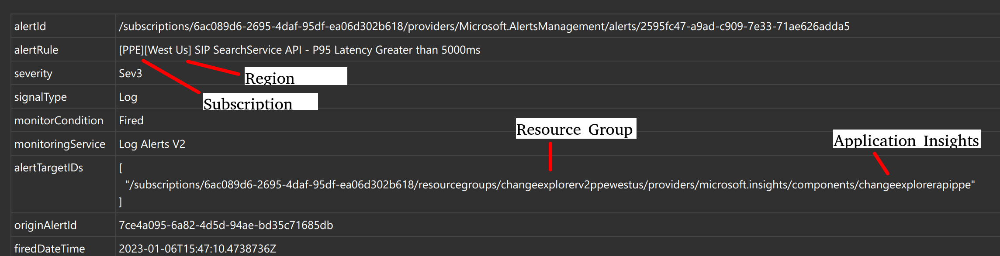
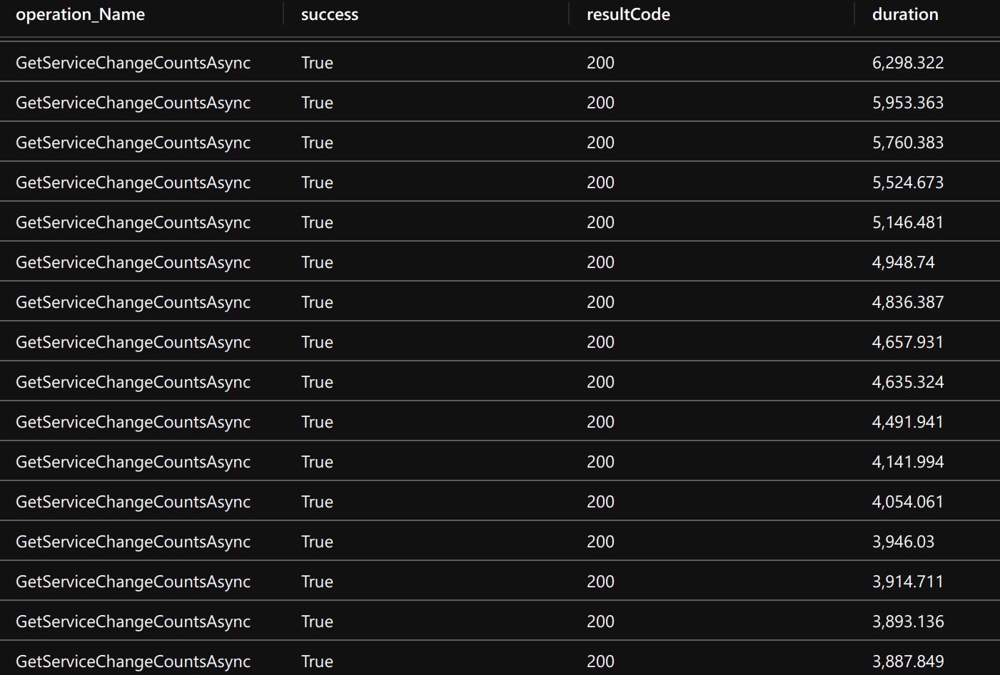
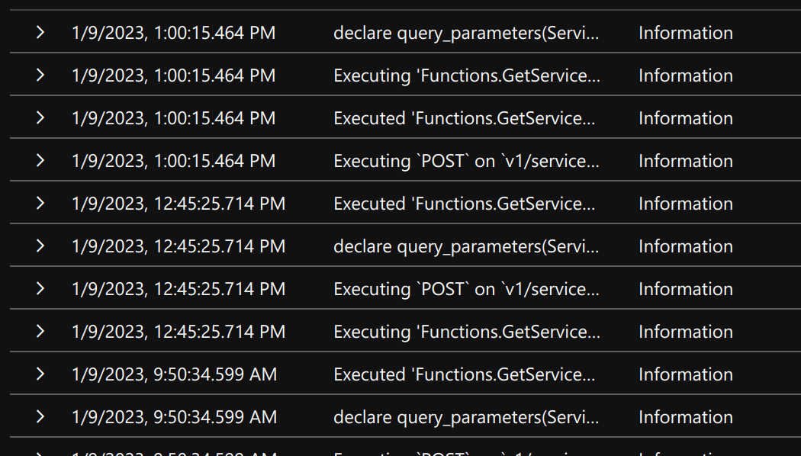

# Location Information Provider API: P95 Latency > X 

## Investigation & Mitigation Steps

> [!TIP] For understanding what we mean by "P95", see the blog *[Understanding Percentiles](https://blog.shalvah.me/posts/understanding-percentiles)*.

> [!TIP] Most of the required access information below can be retrieved directly from the ticket; see the picture below:
> 

The latency for either of the following LIP APIs (`<OPERATION_NAME>`):

- `GetLocationDetailsAsync`
- `GetMultipleLocationDetailsAsync`
- `SearchLocationsByKeywordAsync`

has an elevated P95 for the last three 5-minute data points (increased latency for 15 minutes). Investigate and if possible mitigate by executing the following steps:

- Get JIT access for the relevant subscription (use the auto-cut ticket as request evidence).
  - PPE: 6ac089d6-2695-4daf-95df-ea06d302b618
  - PROD: 8830ba56-a476-4d01-b6ac-d3ee790383dc
- Log into your appropriate `ame.gbl` account on the [Azure Portal](portal.azure.com).
- Go to the related Application Insights.
- Execute the following query to get a list of API requests in descending duration for the past hour (note that you must modify the `<OPERATION_NAME>`, `<ENVIRONMENT>` and `<REGION>` fields in the query below.)

```sql
requests
| project
    timestamp,
    id,
    operation_Name,
    success,
    resultCode,
    duration,
    operation_Id,
    cloud_RoleName,
    invocationId=customDimensions['InvocationId']
| where timestamp > ago(1h)
| where cloud_RoleName =~ 'LocationInformationProvider-<ENVIRONMENT>-<REGION>' and operation_Name =~ '<OPERATION_NAME>'
| order by duration desc
```

- You can inspect the queries directly and make a judgment call on the problem queries. For example, given the data below:



we might optimize with the following query:

```sql
requests
| project
    timestamp,
    id,
    operation_Name,
    success,
    resultCode,
    duration,
    operation_Id,
    cloud_RoleName,
    invocationId=customDimensions['InvocationId']
| where timestamp > ago(1h)
| where cloud_RoleName =~ 'LocationInformationProvider-<ENVIRONMENT>-<REGION>' and operation_Name =~ 'GetServiceChangeCountsAsync'
| where duration > 4000
| order by duration desc
```

- Join with the `traces` and `exceptions` table on `operation_Id` and `invocationId` to see logs:

```sql
requests
| project
    timestamp,
    id,
    operation_Name,
    success,
    resultCode,
    duration,
    operation_Id,
    cloud_RoleName,
    invocationId=customDimensions['InvocationId']
| where timestamp > ago(1h)
| where cloud_RoleName =~ 'LocationInformationProvider-<ENVIRONMENT>-<REGION>' and operation_Name =~ '<OPERATION_NAME>'
| where duration > 4000
| order by duration desc
| join kind = leftouter traces on $left.operation_Id == $right.operation_Id
| join kind = leftouter exceptions on $left.operation_Id == $right.operation_Id
| extend invocationKeyFromTraces = tostring(customDimensions["InvocationId"])
| where invocationId == invocationKeyFromTraces
| project
    timestamp,
    message = iff(message != '', message, iff(innermostMessage != '', innermostMessage, customDimensions.['prop__{OriginalFormat}'])),
    logLevel = customDimensions.['LogLevel']
```

Results in:



- You will now have the logs. Take a look at the logs and execute the queries yourself on [Azure Data Explorer/Kusto](https://dataexplorer.azure.com/) to figure out why they are taking so long. You can get the specific query from the logs, as well as the input data. Make a note of the findings on the tickets.
  - Take a look at the IIP documentation. IIP makes calls to ICM to obtain incident information, so the total latency of `GetIncidentInformationAsync` would be that plus the Kusto calls we make afterwards. 

>[!NOTE] Generally this type of ticket will be auto-mitigated while we investigate latency improvements on our Kusto cluster. However, it is important to understand our data and customer usage patterns, so don't disregard it.

## Common/Known Issues

Use this section to add common/known issues. Additionally, use this section to share learnings with other engineers on how you investigated and resolved a ticket. Utilize the following format

```
### <ICM TICKET ID>: <SOME THOUGHTFUL DESCRIPTION>
```

to add a new sub-section.