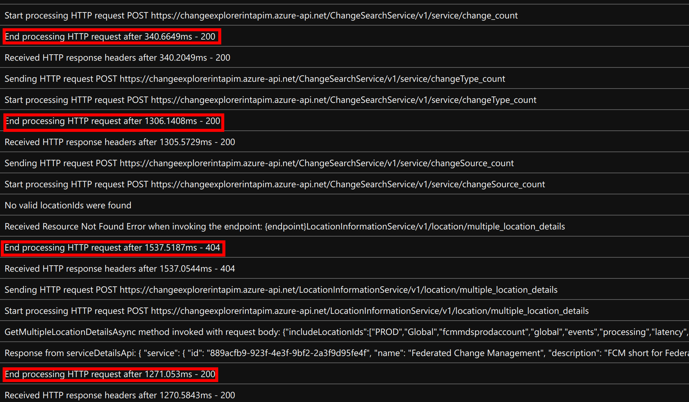

# UI Backend Service API: P95 Latency > X 

## Investigation & Mitigation Steps

> [!TIP] For understanding what we mean by "P95", see the blog *[Understanding Percentiles](https://blog.shalvah.me/posts/understanding-percentiles)*.

> [!TIP] Most of the required access information below can be retrieved directly from the ticket; see the picture below:
> 

The latency for either of the following UIBS APIs (`<OPERATION_NAME>`):

- `SearchByAsync`

has an elevated P95 for the last three 5-minute data points (increased latency for 15 minutes). Investigate and if possible mitigate by executing the following steps:

- Get JIT access for the relevant subscription (use the auto-cut ticket as request evidence).
  - PPE: 6ac089d6-2695-4daf-95df-ea06d302b618
  - PROD: 8830ba56-a476-4d01-b6ac-d3ee790383dc
- Log into your appropriate `ame.gbl` account on the [Azure Portal](portal.azure.com).
- Go to the related Application Insights.
- Execute the following query to get a list of API requests in descending duration for the past hour (note that you must modify the `<OPERATION_NAME>`, `<ENVIRONMENT>` and `<REGION>` fields in the query below.)

```sql
requests
| project
    timestamp,
    id,
    operation_Name,
    success,
    resultCode,
    duration,
    operation_Id,
    cloud_RoleName,
    invocationId=customDimensions['InvocationId']
| where timestamp > ago(1h)
| where cloud_RoleName =~ "uibackendservice<ENVIRONMENT>"  and operation_Name contains "<OPERATION_NAME>"
| order by duration desc
```

- You can inspect the queries directly and make a judgment call on the problem queries. For example, given the data below:


we might optimize with the following query:

```sql
requests
| project
    timestamp,
    id,
    operation_Name,
    success,
    resultCode,
    duration,
    operation_Id,
    cloud_RoleName,
    invocationId=customDimensions['InvocationId']
| where timestamp > ago(1h)
| where cloud_RoleName =~ "uibackendservice<ENVIRONMENT>"  and operation_Name contains "<OPERATION_NAME>"
| where duration > 4000
| order by duration desc
```

- Join with the `traces` and `exceptions` table on `operation_Id` and `invocationId` to see logs:

```sql
requests
| project
    timestamp,
    id,
    operation_Name,
    success,
    resultCode,
    duration,
    operation_Id,
    cloud_RoleName,
    invocationId=customDimensions['InvocationId']
| where timestamp > ago(1h)
| where cloud_RoleName =~ "uibackendservice<ENVIRONMENT>"  and operation_Name contains "<OPERATION_NAME>"
| where duration > 4000
| order by duration desc
| join kind = leftouter traces on $left.operation_Id == $right.operation_Id
| join kind = leftouter exceptions on $left.operation_Id == $right.operation_Id
| extend invocationKeyFromTraces = tostring(customDimensions["InvocationId"])
| where invocationId == invocationKeyFromTraces
| project
    timestamp,
    message = iff(message != '', message, iff(innermostMessage != '', innermostMessage, customDimensions.['prop__{OriginalFormat}'])),
    logLevel = customDimensions.['LogLevel']
```

Results in:


- You will now have the logs. Take a look at the logs and execute the queries yourself on [Azure Data Explorer/Kusto](https://dataexplorer.azure.com/) to figure out why they are taking so long. You can get the specific query from the logs, as well as the input data. Make a note of the findings on the tickets.

### Specific to `SearchByAsync`

There is a lot of information related `SearchByAsync`. I suggest [taking a look at the docs](../../../ServiceDocs/TeamDocs/ChangeExplorerV2/IncidentInformationProvider/incident_information_provider_lld.md) to understand how it works and to determine the ultimate cause of the latency. For example, we can see the various calls made to our backend APIs to retrieve the information needed:



Usually if this API is slow, it means that another component is slow to response. Check if there is an associated component ticket to accompany this ticket.


>[!NOTE] Generally this type of ticket will be auto-mitigated while we investigate latency improvements. However, it is important to understand our data and customer usage patterns, so don't disregard it.

## Common/Known Issues

Use this section to add common/known issues. Additionally, use this section to share learnings with other engineers on how you investigated and resolved a ticket. Utilize the following format

```
### <ICM TICKET ID>: <SOME THOUGHTFUL DESCRIPTION>
```

to add a new sub-section.