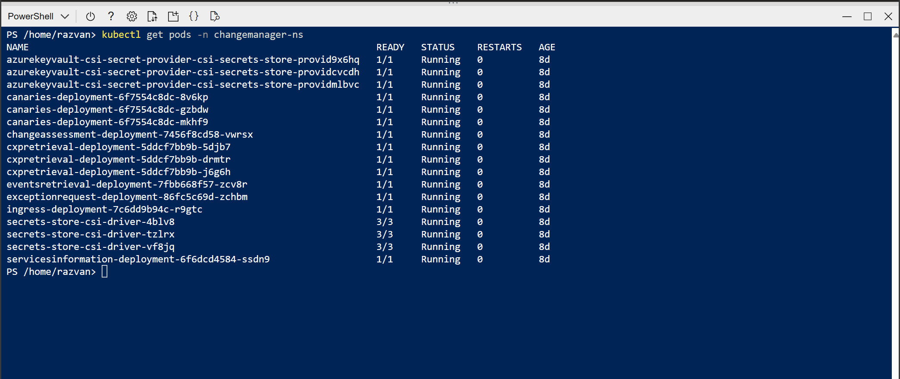

# ChangeGuard - Arcus SDK Error Retrieving BoQ Value

## Overview

The Change Guard APIs are deployed as services inside an AKS cluster.
One of the services is Change Assessment, which is used to load BoQ data from Safefly.

One of the reasons the Change Assessment might fail is due to exceptions thrown because of the request data.

### Steps taken to investigate the issue:

#### 1. Search for the alert that was fired.
In this case, we search for the ApplicationInsights named `chggrd-api-appinsights-prod`, go to Alerts and check the alert that was fired.

#### 2. Go to query results and investigate the logs.
Query: 
```
traces
| where severityLevel >= 4
| where message has "Arcus SDK Error Retrieving BoQ Value" 
```
In this case the logs mentioned that Change Guard can not call the Arcus Sdk service because of an issue in request data:
```
"Arcus SDK Error Retrieving BoQ Value".
```

### Steps taken to investigate the issue:

#### 1. Check the exception message/stacktrace and investigate in the code to see why it occurred.


#### 2. Check the error logs from the Change Assessment system inside the AKS cluster

If you don't have access to the cluster from your local workstation (don't have the kube config locally) you can follow the Step2 from the [README.md](https://msazure.visualstudio.com/One/_git/FCM-ChangeManager?path=/src/README.md). The logs should be checked inside each pods since the pods will not have the same logs. It depends on which pod will handle the problem that fails and will log it to its own logs.
There can be a pods that throws and logs the error and one pods where it worked fine.

Search for the pods inside the cluster
```
kubectl get pods -n changeguard-ns
 ```
The command will list all the pods inside the cluster. Search for the pods that start with `changeassessment-` and copy the name of each of the pods.



Next, get the logs for the `changeassessment` pod you selected (enter the pod name you copied instead of POD_NAME):
```
kubectl logs POD_NAME -n changeguard-ns
 ```


This will return the whole logs for the pods, and you can search for the error message in detail.