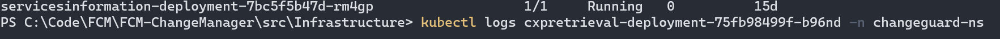

# ChangeGuard - CXP Retrieval Error

## Overview

> [!NOTE] Possible same resolve as this similar [ICM Incident](https://portal.microsofticm.com/imp/v3/incidents/incident/407839716).

The Change Guard APIs are deployed as services inside an AKS cluster.
One of the services is the CXP Retrieval, which calls the CXP team's [Event Readiness API](https://eng.ms/docs/cloud-ai-platform/azure-cxp/cxp-product-and-platform/assist-insights-data-and-engage-aide/event-readiness) 
to retrieve CCOA Event information such as current or future events, dates, services and regions in scope.

> [!NOTE]
> - The Event Readiness API was migrated to use JWT token based authentication, from the previous client certificate based authentication.
> - The system will make a call, using the Managed Identity of the AKS cluster, to the CXP Event Readiness API to get the token.
> - The token will be used in the subsequent calls to retrieve data from the API.
> - The used details for the JWT auth varies from environment to environment and can be seen inside the "appsettingssecrets.json" which can be found inside the environment's KeyVault, under the secret name "appsettingssecretsjson".
> - The clientId, tenantId and resourceId used for the JWT token are found in the appsettings json, under :`jwtAuthentication`.

If the alert fires it means that there is an issue while connecting the API and receiving data back.

### Steps taken to investigate the issue:

#### 1. Search for the alert that was fired.

In this case, we search for the ResourceGroup named `chggrd-api-prod-westus2`, and check the alert that was fired.


#### 2. Go to the alert query investigate the logs.


To get all the errors in a certain time frame, use:
```
traces
| where severityLevel >= 4
```

### 3. Check which system triggered the alarm and what is the error message
What is meaningful is to see `who` triggered the alarm (e.g.: the CXPRetrieval service, method
HttpPostWithClientCertAsync), and what was the `error message`.


#### 4. Check the error logs from the CXP Retrieval system inside the AKS cluster

If you don't have access to the cluster from your local workstation (don't have the kube config locally) you can follow the Step2 from the [README.md](https://msazure.visualstudio.com/One/_git/FCM-ChangeManager?path=/src/README.md).

Search for the pods inside the cluster
```
kubectl get pods -n changeguard-ns
 ```
The command will list all the pods inside the cluster. Search for the pods that start with `cxpretrieval-` and copy the name of one of the pods (it doesn't matter which one 
since they all are identical replicas and will have the same errors).


Next, get the logs for the `cxpretrieval` pod you selected (enter the pod name you copied instead of POD_NAME):
```
kubectl logs POD_NAME -n changeguard-ns
 ```



This will return the whole logs for the pods, and you can search for the error message in detail.


The error message indicates that when connecting to the CXP Event Readiness API, our services receive the following error:
`Unable to read data from the transport connection: Connection reset by peer`.

After investigating this error it points to an issue on the server side which is dropping/refusing connections. In this case the server belongs to the CXP team.

#### 5. Reach out to the CXP team and inform them of the issue

Work with the CXP team (contact: tina.stewart@microsoft.com) to resolve the issue.

#### 6. After the issue is resolved, test the cluster and the Change Guard services to see if everything is working as expected.

The documentation on how to test each part of the system can be found in
the [README.md](https://msazure.visualstudio.com/One/_git/FCM-ChangeManager?path=/src/README.md) file inside the repo.

Additionally check that there is no more error thrown in both the `App Insights Logs` and the `cxpretrieval- pod logs`. 

> [!NOTE]
> - If the testing concludes with everything working, and no alert fired after the initial time window, the incident can be marked as resolved.