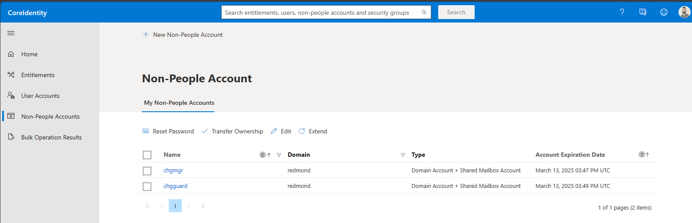
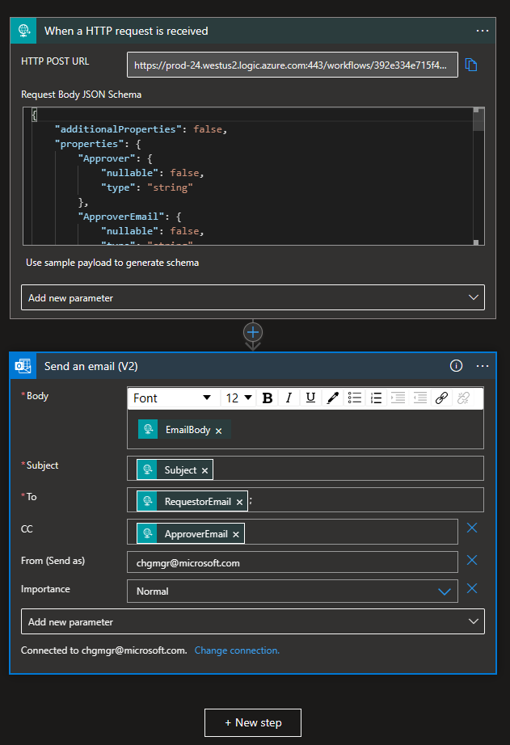
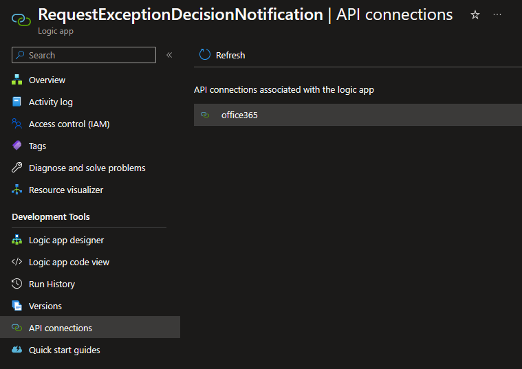
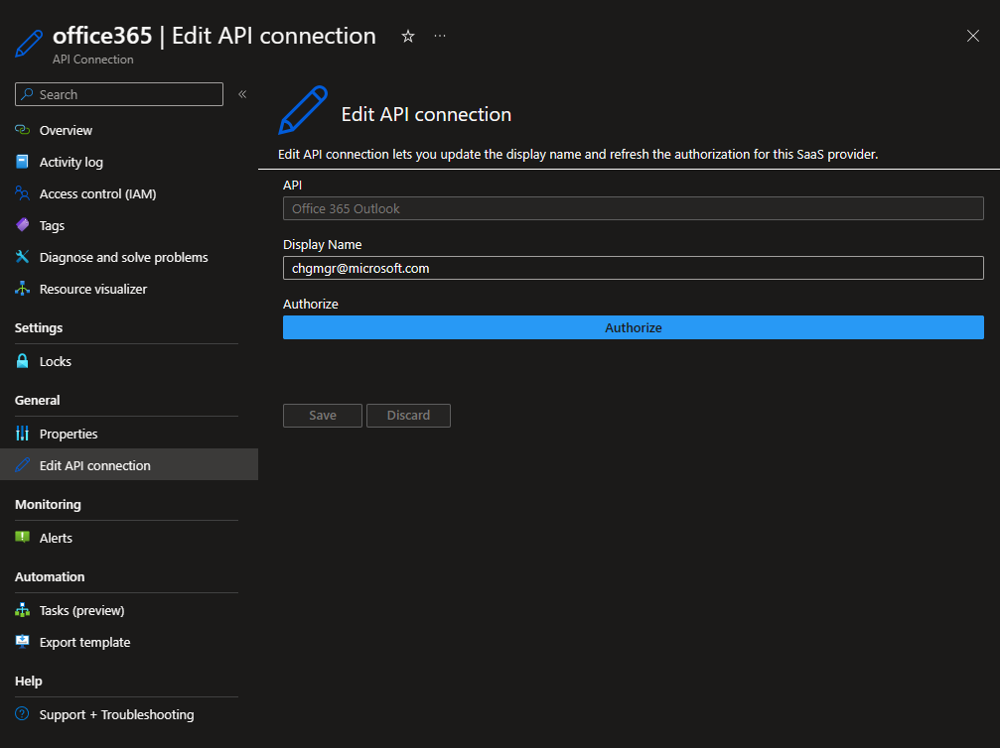

# ChangeGuard - Changes to Non Person Accounts or Email Workflows

## Overview

Change Guard uses Non Person Accounts for email sending workflows. 

These workflows are used when a new Exception is submitted or approved and an email needs to be sent to complete the process. 

There are currently two Non Person Accounts used in Change Guard:
- chgmgr (on INT environment)
- chgguard (on PPE and PROD environments)

### Manage Accounts
To manage the accounts, go to the CoreIdentity portal https://coreidentity.microsoft.com/manage/service, on the `Non-People Accounts` tab.

From here, you can manage the accounts, reset passwords, and extend the expiration date for each account.

### Manage email workflows

To manage the email workflows, go to the Azure portal and navigate to the resource group:
- Resource group: `fcm-changemanagerwestus2rg` for INT environment
- Resource group: `chggrd-api-ppe-westus2` for PPE environment
- Resource group: `chggrd-api-prod-westus2` for PROD environment

In the Workflow's `Logic app designer` check that the `from` email is pointing to the correct Non Person Account, and the connection is using the correct account.

In the `App Connections` section you can manage the connections and check which account is being used.

You can add or edit the API connection to use the correct Non Person Account or refresh the authorization if needed.

