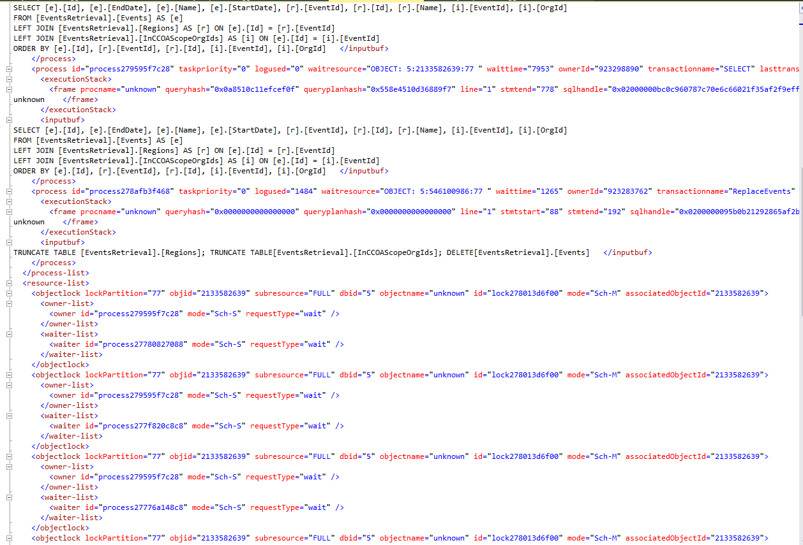

# Database deadlocks causing exceptions

## Overview

The most probable cause for DB deadlocks is the existing refresh mechanism for CXP updates.

## Execution instructions

#### Check if there are deadlocks
- Check **chggrd-api-sql-db-prod.database.windows.net** with this query (requires JIT to FcmProduction):
  - [Query deadlocks for the last hour](https://portal.azure.com/#@MSAzureCloud.onmicrosoft.com/blade/Microsoft_Azure_MonitoringMetrics/Metrics.ReactView/Referer/MetricsExplorer/ResourceId/%2Fsubscriptions%2F8830ba56-a476-4d01-b6ac-d3ee790383dc%2FresourceGroups%2Fchggrd-api-prod-westus2%2Fproviders%2FMicrosoft.Sql%2Fservers%2Fchggrd-api-sql-svr-prod%2Fdatabases%2Fchggrd-api-sql-db-prod/TimeContext/%7B%22absolute%22%3A%7B%22startTime%22%3A%222021-11-23T00%3A00%3A00.000Z%22%2C%22endTime%22%3A%222021-11-26T00%3A00%3A00.000Z%22%7D%2C%22showUTCTime%22%3Atrue%2C%22grain%22%3A1%7D/ChartDefinition/%7B%22v2charts%22%3A%5B%7B%22metrics%22%3A%5B%7B%22resourceMetadata%22%3A%7B%22id%22%3A%22%2Fsubscriptions%2F8830ba56-a476-4d01-b6ac-d3ee790383dc%2FresourceGroups%2Fchggrd-api-prod-westus2%2Fproviders%2FMicrosoft.Sql%2Fservers%2Fchggrd-api-sql-svr-prod%2Fdatabases%2Fchggrd-api-sql-db-prod%22%7D%2C%22name%22%3A%22deadlock%22%2C%22aggregationType%22%3A1%2C%22namespace%22%3A%22microsoft.sql%2Fservers%2Fdatabases%22%2C%22metricVisualization%22%3A%7B%22displayName%22%3A%22Deadlocks%22%7D%7D%5D%2C%22title%22%3A%22Sum%20Deadlocks%20for%20chggrd-api-sql-db-prod%22%2C%22titleKind%22%3A1%2C%22visualization%22%3A%7B%22chartType%22%3A2%2C%22legendVisualization%22%3A%7B%22isVisible%22%3Atrue%2C%22position%22%3A2%2C%22hideSubtitle%22%3Afalse%7D%2C%22axisVisualization%22%3A%7B%22x%22%3A%7B%22isVisible%22%3Atrue%2C%22axisType%22%3A2%7D%2C%22y%22%3A%7B%22isVisible%22%3Atrue%2C%22axisType%22%3A1%7D%7D%7D%7D%5D%7D)
  - Don't forget to update the time range in the chart to include the range of interest.

#### If the graph shows deadlocks:
1. Connect to **chggrd-api-sql-db-prod.database.windows.net** server using SSMS.
    - If SSMS not installed in your computer, see: [SQL Server Management Studio (SSMS)](https://learn.microsoft.com/en-us/sql/ssms/download-sql-server-management-studio-ssms)
    - Username and Password are available
      from [chggrd-api-kv-prod](https://ms.portal.azure.com/#@MSAzureCloud.onmicrosoft.com/resource/subscriptions/8830ba56-a476-4d01-b6ac-d3ee790383dc/resourceGroups/chggrd-api-prod-westus2/providers/Microsoft.Sql/servers/chggrd-api-sql-svr-prod) secrets (requires JIT
      to FcmProduction), under:
        - **chggrd-db-admin-username**
        - **chggrd-db-admin-password**

2. Once logged into SSMS, connect to **master** database and open the query window.
3. Run the following query:
   ``` 
      WITH CTE AS ( 
         SELECT CAST(event_data AS XML)  AS [target_data_XML]   
         FROM sys.fn_xe_telemetry_blob_target_read_file('dl', null, null, null)
      ),
      DEADLOCKS AS(
         SELECT target_data_XML.value('(/event/@timestamp)[1]', 'DateTime2') AS Timestamp,   
         target_data_XML.query('/event/data[@name=''xml_report'']/value/deadlock') AS deadlock_xml,   
         target_data_XML.query('/event/data[@name=''database_name'']/value').value('(/value)[1]', 'nvarchar(100)') AS db_name   
         FROM CTE
      )
      SELECT [Timestamp], [deadlock_xml], [db_name]
      FROM DEADLOCKS
      WHERE [Timestamp] BETWEEN «DEADLOCK-START» AND «DEADLOCK-END»
   ```

   > [!NOTE]
   > Replace **«DEADLOCK-START»** and **«DEADLOCK-END»** with the corresponding UTC time values

4. Click **deadlock_xml** on to see the full content of the XML object.
   - If you see something like the following image, the culprit is the CxpRetrieval process.
     
   - Use the instructions on [Pause CXP Retrieval](PauseCXPRetrieval.md) to the stop the deadlocks. 
