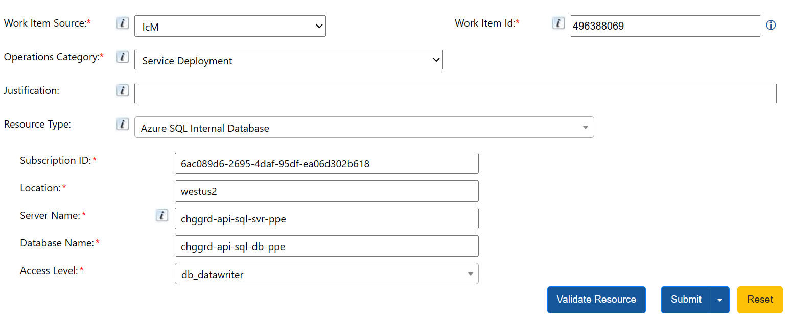

# Granting `write` access to SQL Database through JIT

## Overview

This document provides instructions on how to grant `write` access to the SQL Database for Change Guard.

To access the SQL Database you will need to use Entra ID authentication using your Microsoft (INT) or AME (PPE/ Prod) account.

Read access is already added to all members of the FCM and SafeFly teams. 

For write access, you will need to request access through JIT.

## Execution instructions
The write access to the SQL Database is granted through JIT. 

The steps to request access are as follows:

#### The values for Production are:
- Server Name: chggrd-api-sql-svr-prod
- Subscription: FCMProduction subscription Id
- Location: westus2
- DB Name: chggrd-api-sql-db-prod
- Access level: db_datawriter

#### The values for PPE are:
- Server Name: chggrd-api-sql-svr-ppe
- Subscription: PPE subscription Id
- Location: westus2
- DB Name: chggrd-api-sql-db-ppe
- Access level: db_datawriter

> [!NOTE]
> - There is also an auto-approve policy for the Change Guard DB db_datawriter access, for a Sev2 ICM?
> - For different access levels (e.g. db_owner), replace **db_datawriter** with the new level value.
