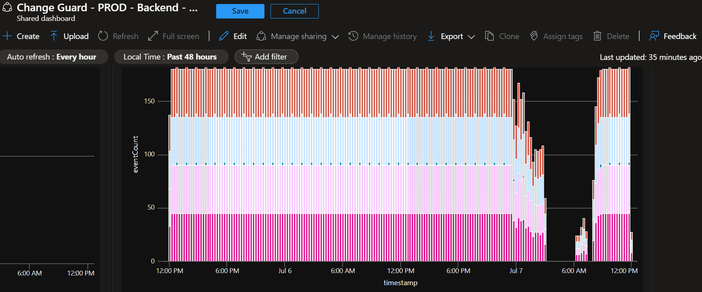
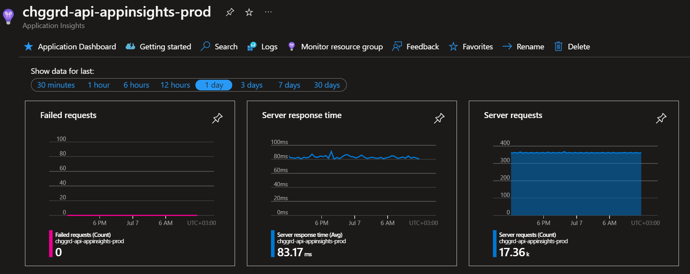
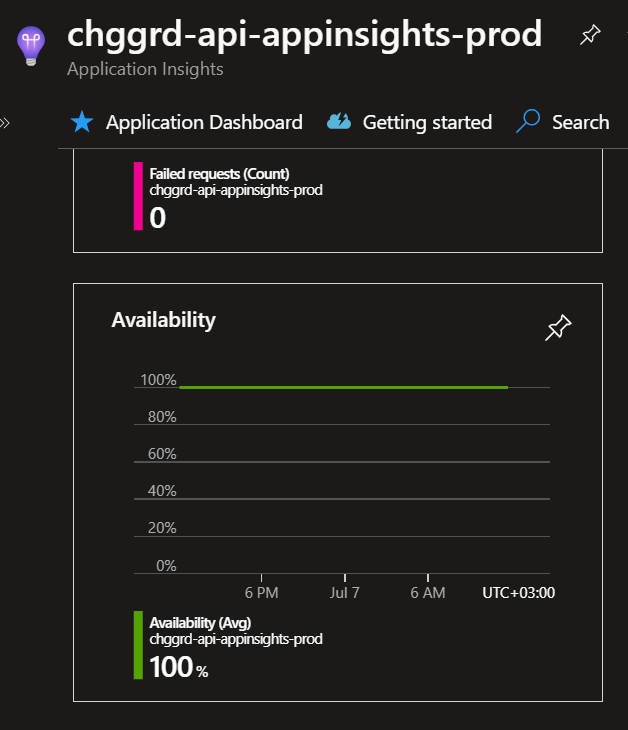
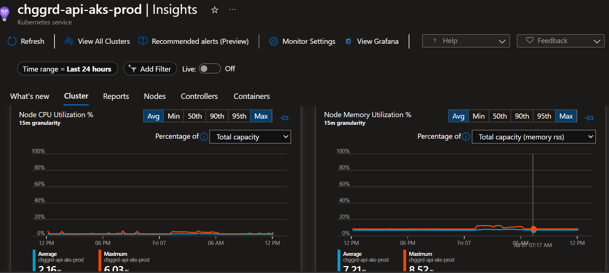
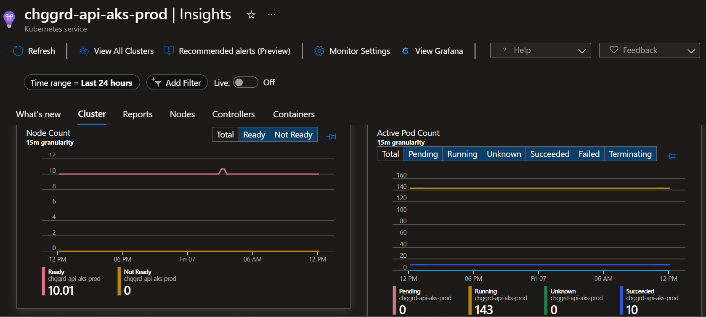
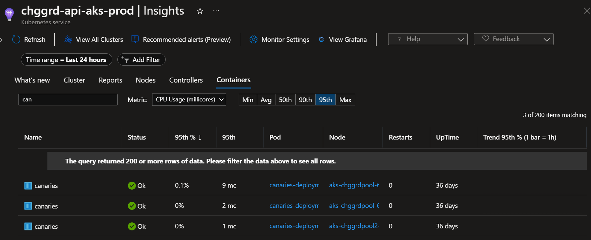
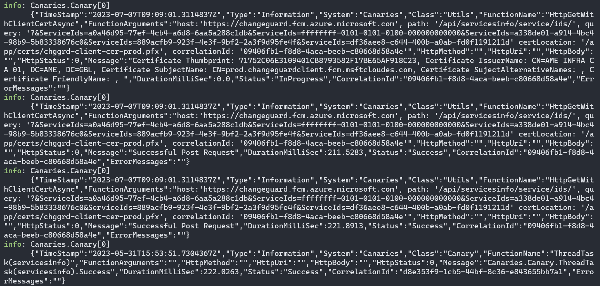
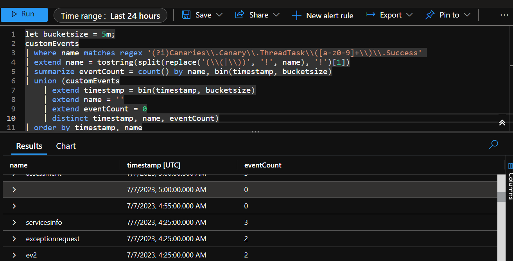
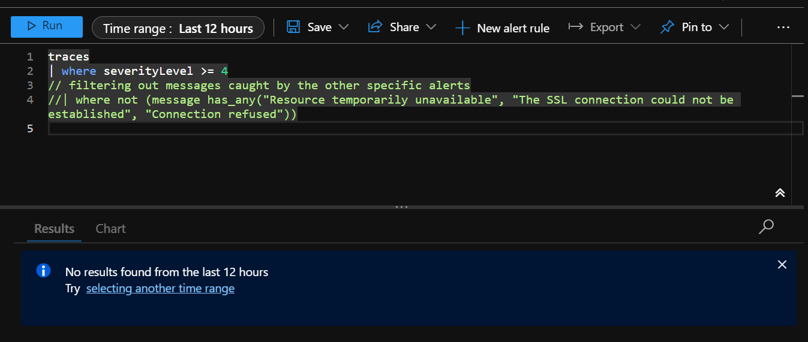
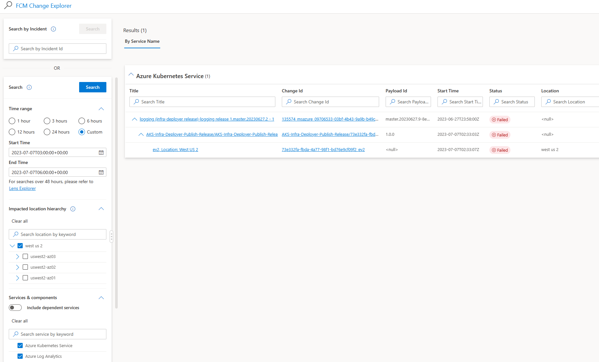

# Sev2:Resolved Application Insights:Log Silent Canaries

## Overview

> [!NOTE] Possible same resolve as this similar [ICM Incident](https://portal.microsofticm.com/imp/v3/incidents/details/404091052/home).

The Change Guard APIs are deployed as services inside an AKS cluster.
One of the services is a Canary, which initiates calls to all the other services at regular intervals, checking the health
of each one.

The current alert fires when there are no logs emitted by the Canaries for a time range.

## Steps taken to investigate the issue:

### 1. Check the Backend Dashboard (`Change Guard - PROD- Backend - Ingress`) for the given time range.
There was a dip in the Canary's `eventCounts` for that given time range, meaning there were no logs received from any of the Canary services.


### 2. Check the App Insights for the Cluster (`chggrd-api-appinsights-prod`)
The app insights looked good without any failed requests or downtime.



`The availability was 100%.`



### 3. Check the AKS cluster (`chggrd-api-aks-prod`) insights
The AKS Insights show a minor increase in memory consumptions for that time interval, from a ~7-8% average to a 12-13% maximum, but it is not problematic 
in itself as the percentage is still low and manageable.



There was also a small increase in node counts during that time which could mean the nodes were updated (created + deleted) during that time. 



Check also the pods/containers for the cluster, searching for the Canary containers.
From the AKS resource point of view, the Canaries looked healthy for the past day.



### 4. Check that the pods in the cluster are in a healthy state. (`kubectl get pods -n changeguard-ns`)
The pods are in a healthy state.


### 5. Check the canaries pod logs (`kubectl logs POD_NAME -n changeguard-ns --since 12h > canarieslogs.log`)
The logs don't have any fail information (the log retention doesn't give back more than a few hours of logs).


### 6. Run manually the query from the triggered alert
Running manually the query that the alert is using shows that there are time ranges where there are fewer or no event counts emitted by the Canary services. 
There are gaps in time range events (for example between 4:25 and 5:00 there were no logs found).


### 7.Check the error traces from the app insights logs (`chggrd-api-appinsights-prod`) for any failures
```
traces
| where severityLevel > 4
```
Running the traces with severity critical doesn't return any issues for the given time range meaning that while the Canaries where emitting logs, the logs didn't mention any failure.


### 8. Check FCM Change Explorer for any possible changes affecting the cluster or the logs:
Looking into [FCM Change Explorer](https://aka.ms/changeexplorer), searching for the time range + "westus2" location + "Azure Kubernetes Service" and "Azure Log Analytics" services results in 
one possible culprit.


### 9. Test everything to see if the problem is resolved.
Steps:
- Check if the alert is still firing.
- Check the app insights logs to see if failures are still appearing.
- Test using the portal.
- Test using Postman calls to the cluster/services.

> [!NOTE] In our current investigation we don't have a certain culprit for the issues but everything points to a transient problem where either the Canaries
were down due to a transient problem in the cluster or the emitted logs weren't received by the log analytics server.

