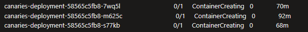
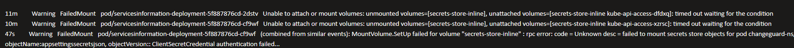

# Sev2:Resolved Application Insights:Log Silent Canaries - Secret Store Errors

## Overview

> [!NOTE] Possible same resolve as this similar [ICM Incident](https://portal.microsofticm.com/imp/v3/incidents/incident/476433071/summary).

The Change Guard APIs are deployed as services inside an AKS cluster.
One of the services is a Canary, which initiates calls to all the other services at regular intervals, checking the health
of each one.

The current alert fires when there are no logs emitted by the Canaries for a time range.

## Steps taken to investigate the issue:

### Start by following the steps presented at - [Log Silent Canaries](LogSilentCanaries.md).

### If the problem is pointing to the Secret Store, follow the steps below.

1.Check the health of the pods from the cluster:
  - ```
    kubectl get pods -n changeguard-ns
    ```
  - If the containers are in a unhealthy state: 'ContainerCreating', it means there was a problem while mounting the volumes or the secrets. 
    - Example: 
      - 
      
2.Check the failing Pod Logs and/or Events, to see what the issue is and if it is related to the Secret Store:
- Get the Logs for the failing pod
    ```
    kubectl logs POD_NAME -n changeguard-ns
    ```
- Get the Events for the failing pod
  ```
  kubectl describe pod POD_NAME -n changeguard-ns
  ```
 
3.Look into the events and logs to see if the Secret Store was failing to mount the secrets
  - Example
    - 
  - How the Secret Store works:
    - The `secret-store-inline` is referencing a kubernetes secret (`secret-store-cred`) used to connect to the Azure Key Vault.
    - The `secret-store-cred secret` needs to be created using a valid `AAD Service Principal Id and Secret`.
    - When the secret-store-inline fails is due to either the kubernetes secret doesn't exist or it has an expired AAD Service Principal secret.

4.Check if the secret exists by running the following command:
  ```
  kubectl get secrets -n changeguard-ns
  ```
- It should return a secret named `secret-store-creds` if it exists or not.

5.Check the AAD Service Principal secret expiration date:
  - The Service Principal used by the AKS cluster can be found inside the KeyVault:
    - The `aks-sp-appid` KeyVault secret holds the App Id used by the AKS cluster.
    - The `aks-sp-pwd` KeyVault secret holds the App Secret used by the AKS cluster.
- Go to the AAD App Id mentioned in the KeyVault secret
  - Go to `Certificates & secrets`
  - Check if the Client secret is expired (search for the client secret with the same value as the `aks-sp-pwd` KeyVault secret)
  - If the secret is expired, create a new one and update the 'aks-sp-pwd' KeyVault secret with the new value.

6.If the AAD App Id (and Key vault secrets) were updated, we need to also update the Kubernetes secret inside the cluster.
  - If the secret-store-creds secret exists (point 4.), delete it and create a new one with the updated AAD App Id and Secret.
    - To delete the secret:
        ```
        kubectl delete secret secret-store-creds -n changeguard-ns
        ```
    - To create the new secret:
      - Get Service Principal Id and Password/Secret from Key Vault
        ```
        $AKS_SP_APPId = az keyvault secret show --vault-name KeyVault_Name --name "aks-sp-appid" --query "value" -o tsv
        $AKS_SP_Pwd = az keyvault secret show --vault-name KeyVault_Name --name "aks-sp-pwd" --query "value" -o tsv
        ```
      - Create the secret
        ```
        kubectl create secret generic secrets-store-creds --from-literal clientid=$AKS_SP_APPId --from-literal clientsecret=$AKS_SP_Pwd -n changeguard-ns
        ```

7.Check that the containers recover and are in a healthy state.

8.Test everything to see if the problem is resolved.
  - Check if the alert is still firing.
  - Check the app insights logs to see if failures are still appearing.
  - Test using the portal.
  - Test using Postman calls to the cluster/services.

