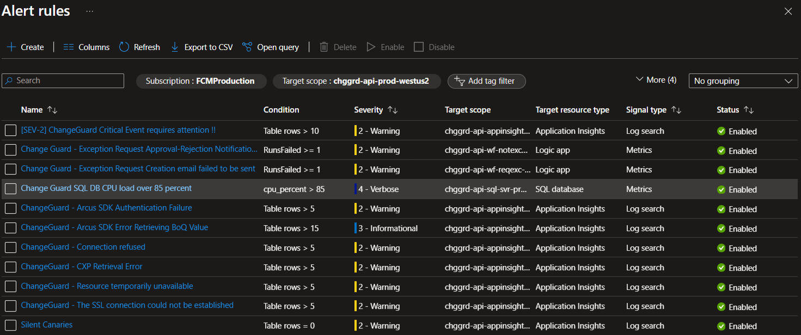
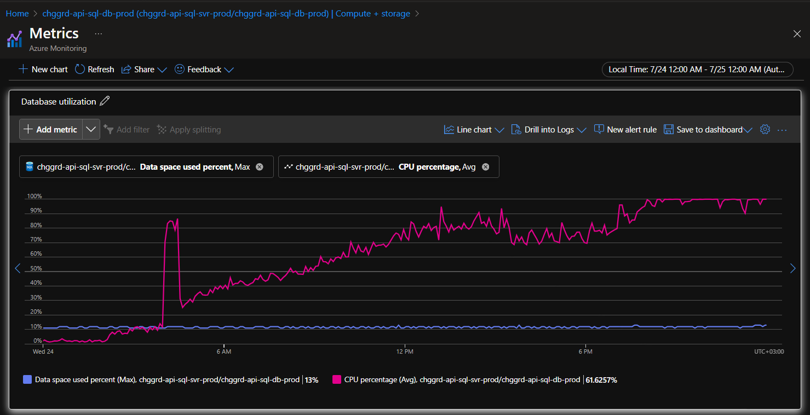
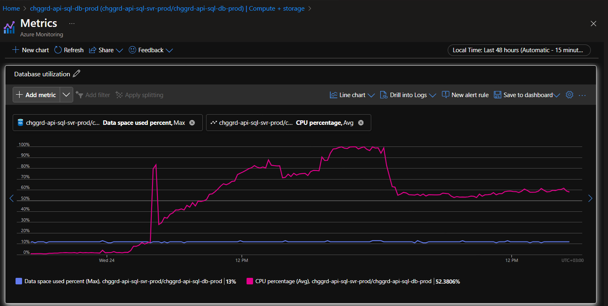

# Change Guard SQL DB CPU load over 85 percent

## Overview

The alert fires when Change Guards SQL DB CPU load is over 85 percent for a certain time frame.
This can be caused by a variety of reasons, such as a high number of queries, a high number of connections, or a high load on the system.

### Steps taken to investigate the issue:

### 1. Search for the alert that was fired and check the condition and thresholds.

In this case, we search for the ResourceGroup named `chggrd-api-prod-westus2`, and check the alert that was fired.

### 2. Go to Change Guard SQL DB and check the CPU metrics for the reported time period

- SQL Server: `chggrd-api-sql-svr-prod`
- SQL DB: `chggrd-api-sql-db-prod`

Go to metrics and add the CPU percentage metric for the time frame when the alert was fired.

We can see that the CPU load is indeed over 85 percent for the reported time frame.

There are 2 obvious solutions to this problem (short term one and long term one): 
1. Scale up the SQL DB to a higher tier/vCore number to handle the load.
2. Investigate the SQL bottlenecks and optimize based on the results.

### 3. Quick solution: Scale up the DB

Go to Settings -> Compute + storage and scale up the DB to a higher tier or a larger number of vCores.

In our case we increased the vCore number from 80 to 128 to add more compute power to the system.

### 4. Monitor the load after scaling up/out the DB

You should see an immediate drop in the CPU load after scaling up the DB.

### 5. Long term solution: Investigate SQL bottlenecks and optimize based on results

This will be a follow-up task to investigate which are the long running or CPU intensive queries, what can be optimized, what big tables can be clened up
and what indexes can be added to speed up the queries.

Also take into account if the current SKU is the right one for the current load and if it needs to be scaled up or out.

> [!NOTE]
> - If the testing concludes with everything working, the load comes down, and no alert fired after the initial time window, the incident can be marked as resolved 
>   and a new PBI will be created for the long term solution.