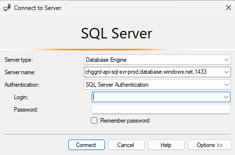

# Search for Subscription

## Overview

Change Guard syncs subscription data from Service Tree using a Lens Orchestrator job that runs every 10 minutes.
There are times when a rollout will both build a new subscription and try to deploy resource to it.
If the subscription is newly created and the sync didn't run yet, it will not be found in our system.

To check if a subscription is available in our system, follow the instructions below.

## Execution instructions

1. Connect to **chggrd-api-sql-svr-prod.database.windows.net** server using SSMS.
    - If SSMS not installed in your computer, see: [SQL Server Management Studio (SSMS)](https://learn.microsoft.com/en-us/sql/ssms/download-sql-server-management-studio-ssms)
    - Username and Password are available
      from [chggrd-api-kv-prod](https://ms.portal.azure.com/#@MSAzureCloud.onmicrosoft.com/resource/subscriptions/8830ba56-a476-4d01-b6ac-d3ee790383dc/resourceGroups/chggrd-api-prod-westus2/providers/Microsoft.KeyVault/vaults/chggrd-api-kv-prod) secrets
        - Access to KeyVault requires JIT to **FcmProduction**
        - To access the secret you need to add yourself to the **Access Policies** of the Key Vault with permissions to **Get & List** Secrets
    - **chggrd-db-admin-username**
    - **chggrd-db-admin-password**
    - 

> [!Note] **Make sure to remove your access policies from the Key Vault after you are done, else it will trigger s360 alerts.**

2. Once logged into SSMS, connect to **chggrd-api-sql-db-prod** database and open the query window.
3. Run the following query:
    - ``` exec [sp_FindSubscription] '<<SubscriptionId>>' ```