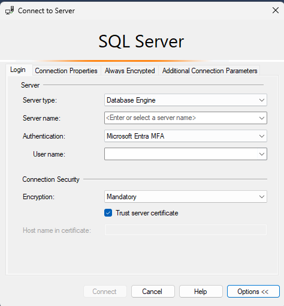

# Whitelist a Build

## Overview

There might be cases where an Exception request cannot be created or approved due to certain reasons.

For these special cases we need a way to whitelist a entire build, so that all deployments to the specific service id, service group and build number are pre-authorized.

Whitelisting a build (ServiceId + ServiceGroupName + BuildNumber) pre-authorizes all deployments to all regions and subscriptions for that specific build.

## Execution instructions

1. Connect to **chggrd-api-sql-svr-prod.database.windows.net** server using SSMS.
   - If SSMS not installed in your computer, see: [SQL Server Management Studio (SSMS)](https://learn.microsoft.com/en-us/sql/ssms/download-sql-server-management-studio-ssms)
   - Use Entra Authentication along with your `@ame.gbl` account to connect to the server.
      - 
   - To get write access to the SQL Database, see: [Granting `write` access to SQL Database through JIT](JITAccessToSQLDatabase.md)

2. Once logged into SSMS, connect to **chggrd-api-sql-db-prod** database and open the query window.
3. Run the following query:
   ``` 
   DECLARE @serviceId nvarchar(50);
   DECLARE @serviceGroupName nvarchar(256);
   DECLARE @buildNumber nvarchar(256);
   DECLARE @isEnabled bit;
   
   SET @serviceId = <<ServiceId>>;
   SET @serviceGroupName = <<ServiceGroupName>>;
   SET @buildNumber = <<BuildNumber>>;
   SET @isEnabled = 1;
   
   INSERT INTO [ServicesInfo].[WhitelistedBuilds]
   ( [ServiceId]
   , [ServiceGroupName]
   , [BuildNumber]
   , [IsEnabled])
   VALUES ( @serviceId
   , @serviceGroupName
   , @buildNumber
   , @isEnabled);

   ``` 
   >    [!NOTE]
   >    - Replace **«ServiceId»** with the service id value.
   >    - Replace **«ServiceGroupName»** with the service group name of the deployment.
   >    - Replace **«BuildNumber»** with the build number of the deployment.
