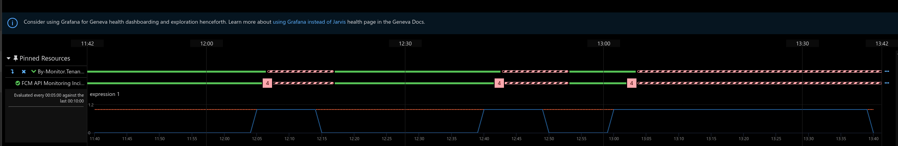

# FCM DataPlatform API Canaries TSG

This alarm will trigger if the Synthetics job that executes the canaries for FCM DataPlatform API is failing; see below for an example.

This could occur     because of several reasons:

1. The service is unavailable (`HttpStatusCode 500`) and there is an availability issue in the service.
2. The response for the given request does not match the expected response (i.e. returning `NoContent 204` rather than `Ok 200`).
3. Metrics emitted during bake time in deployment imply breaking change. The metrics that are being evaluated are availability of FCM DataPlatforms `GetEntityChangeEvent` and `SearchEntityChangeEvent`.

Please execute the following in order:

>[!NOTE] The rectangle boxes (or actions) in the flowchart above are clickable links.