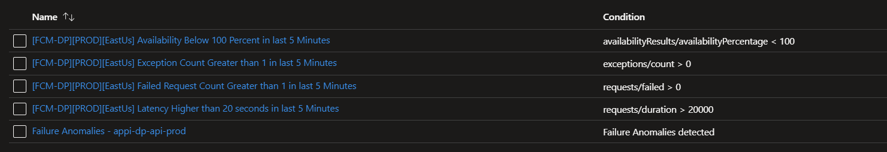
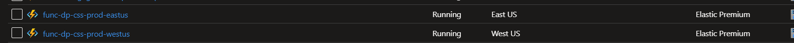
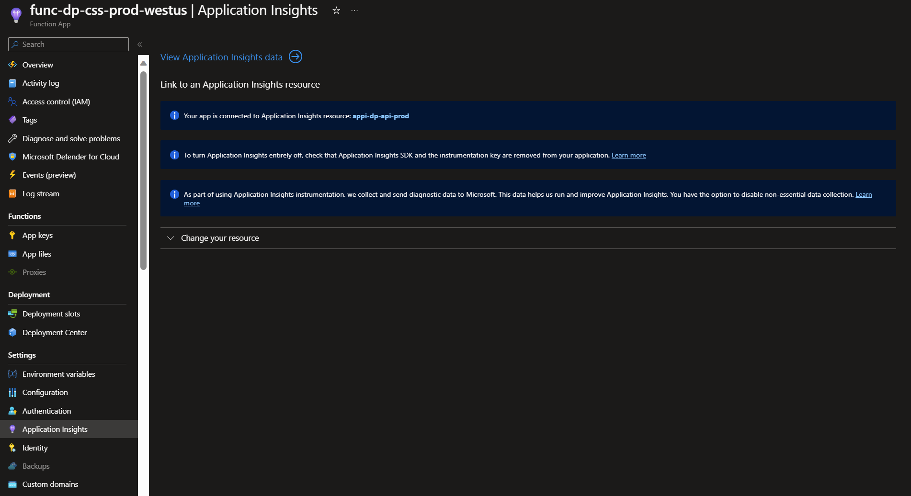
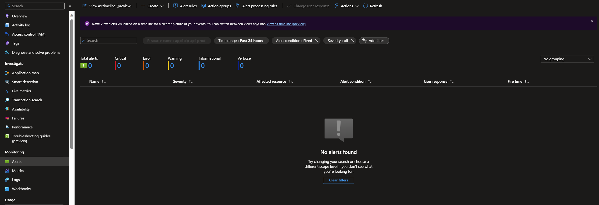
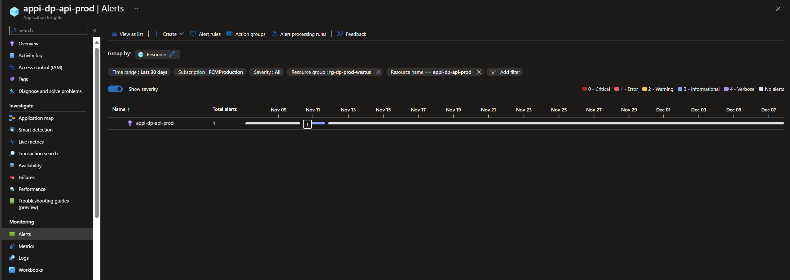
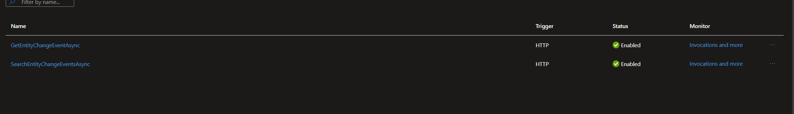
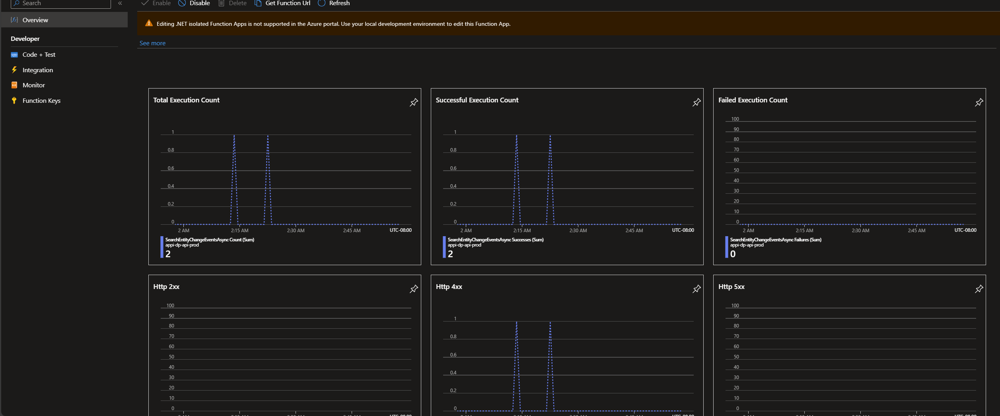
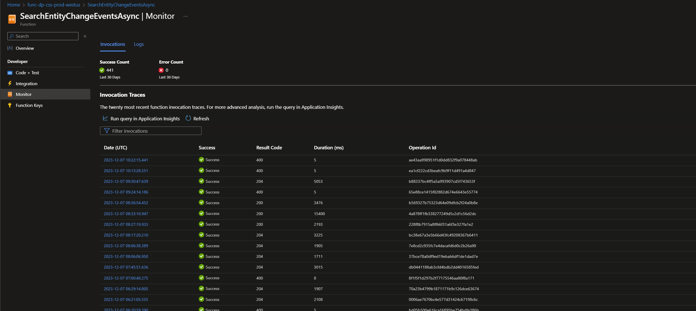
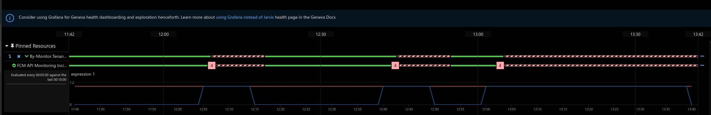
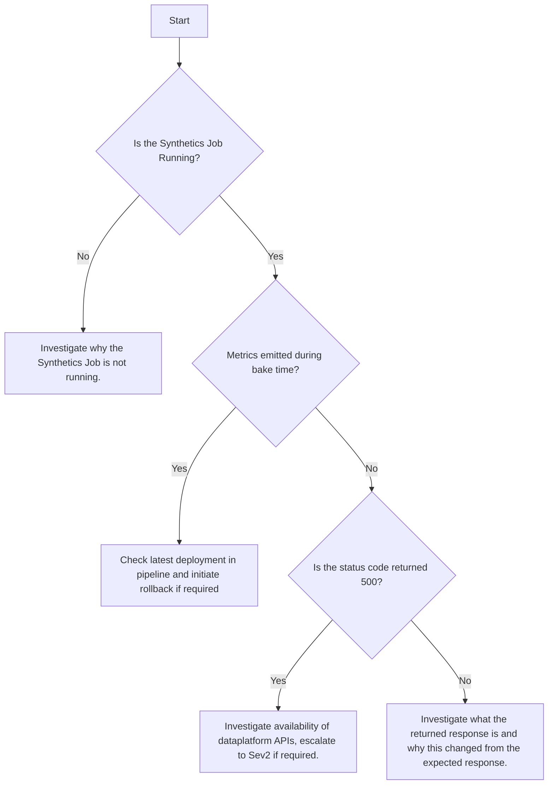

# FCM DataPlatform API TSG

The below TSG is intended to help DRIs debug issues with the FCM DataPlatform APIs. Please update the document whenever something of value (i.e. a faster way to debug or a new tool introduced to developers) is found by the DRI.

## ICM Ticket

There are a total of 5 alerts configured for the PPE/PROD environments. These alerts are configured using the built in functionality of Azure Function/App Insights; that is, we are not configuring queries but using the request results provided by Azure to trigger alerts.

There are two ways of finding issues once you got an alert; method 1 is preferred over method 2. Both of these methods require starting off by finding the resoure in PPE/PROD. For illustration purposes we will utilize the PROD resources:

### Through App Insights

After select the function based on the region in the incident title, select `Application Insights` on the left panel. This should give you a link to the app insight instance the Azure Function is reporting the logs and metrics to.

Once you're in the application insights resource, select `Alerts` on the left panel to open all alarms that are currently triggered. In the instance below, there are no instances triggered but if there were you would be able to start drilling down on the request that met the failure criteria.

If you did not immediately respond to the ticket, you could also get a historical timeline of all alerts that were triggered by selecting the timeline view. This will enable you to look at specific alerts in chronological order.

Use this method to drill down on alert -> request instance.

### Through Function Monitor

If instead you're responding to the ticket and you're pretty quick about it, you can also look at the last 20 invocations and query requests using logs. You can also use this to monitor the logs in real time. From below, select the API that is failing (this will be home page view of the Azure Function):

Take a look at the exception/response counts to see if that API caused an issue:

If you see an issue in the above, select the `Monitor` option in the left pane to drill down on the invocations in the last 20 minutes:

Notice that this is the last 20 invocations; use the app insights links to query for more invocations if desired. 

## Synthetics

>[!NOTE] This synethetics job is currently turned off and will be turned on and rolled out to production at a later point.

This alarm will trigger if the Synthetics job that executes the canaries for FCM DataPlatform API is failing; see below for an example.

This could occur     because of several reasons:

1. The service is unavailable (`HttpStatusCode 500`) and there is an availability issue in the service.
2. The response for the given request does not match the expected response (i.e. returning `NoContent 204` rather than `Ok 200`).
3. Metrics emitted during bake time in deployment imply breaking change. The metrics that are being evaluated are availability of FCM DataPlatforms `GetEntityChangeEvent` and `SearchEntityChangeEvent`.

Please execute the following in order:

>[!NOTE] The rectangle boxes (or actions) in the flowchart above are clickable links.