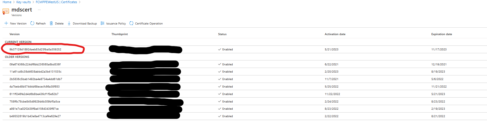
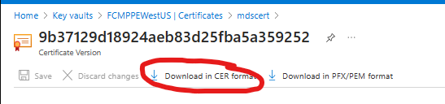
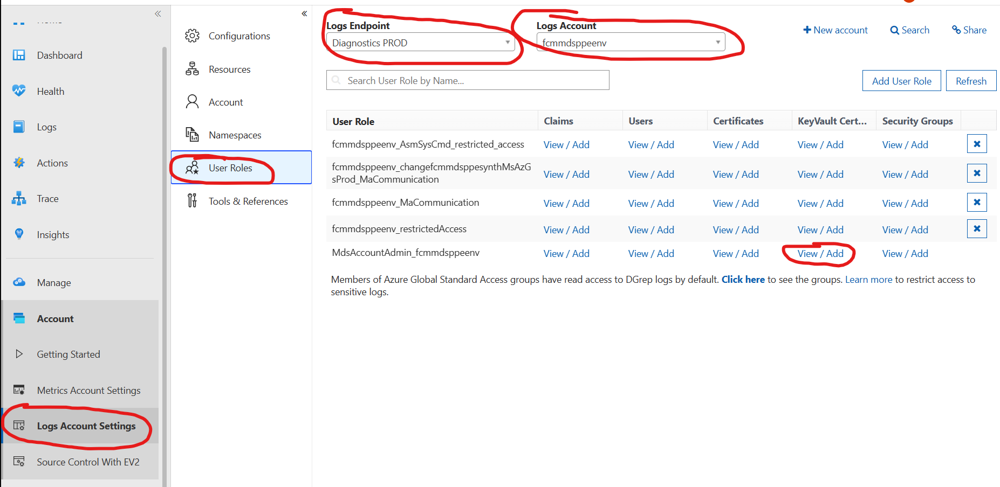
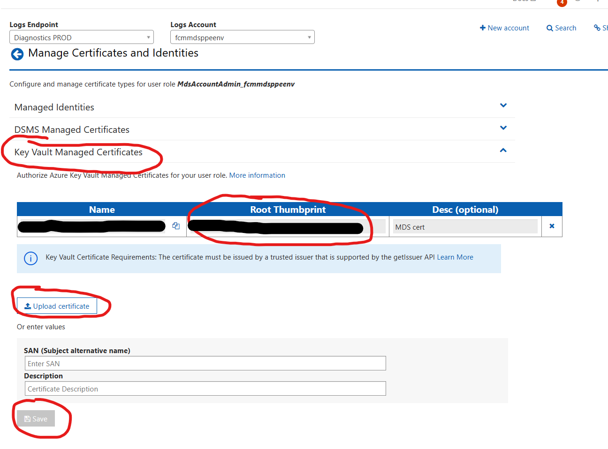

### Summary ###

We will get an incident created by the security team if their scan finds out that a certificate that we are currently using is within the last 25 days of it's expiry date. The incident title will look like this **[Action Required] An In-Use Certificate is expiring in < 25 days: 889acfb9-923f-4e3f-9bf2-2a3f9d95fe4f : Federated Change Management**.

### Mitigation Steps ###
1. Go to https://msit.powerbi.com/groups/819d7da8-8e00-4984-b5ec-9f775c43373f/reports/725a042e-bd3e-433c-a3ae-72245701fee6/ReportSection3?filter=ExpiryCertsICMs/CertServiceName%20eq%20%27Federated%20Change%20Management%27 in order to identify the cert that is expring. This link should be shared with you in the incident summary.
2. Once you identify the cert,
    1. Get JIT access to PPE/PROD subscriptions.
    2. Find the keyvault that the cert resides.
    3. If the latest version of the cert has the flagged thumbprint,
        1. Rotate the certificate
        2. Set auto-rotation policy if it's not already configured.
    4. If the auto-rotated certificate is automatically picked by the applications that are using it, you're done. You can mitigate the incident.
    5. If not, update the certificate in the flagged location with the updated version of the certificate which has the new thumbprint. For example, in order to update the certificate in Geneva:
        1. Go to the latest version of the certificate
        
        2. Download the certificate to your local machine in .cer format
        
        3. Go to Geneva and find the log account that is using the certifcate and click on *View/Add* Keyvault Certificates. Logs Endpoint and LogsAccount is already mentioned in the PowerBI dashboard that is is shared in the incident. However, you need to go to individual UserRoles and find out which UserRole is using the expiring certificate.
        
        4. Once you identify the right UserRole, if the *Root Thumbprint* that is in use matches with the flagged certificate thumbprint but doesn't match with thumbprint of the latest version of the certificate:
            1. Remove the existing certificate from the UserRole.
            2. Click on 'Upload certificate'
            3. Upload the .cer file of the certificate that you downloaded from the Azure Keyvault
            4. Save you changes.
        
         5. Once you see the thumbprint is updated in the UI, you can mitigate the incident.   

