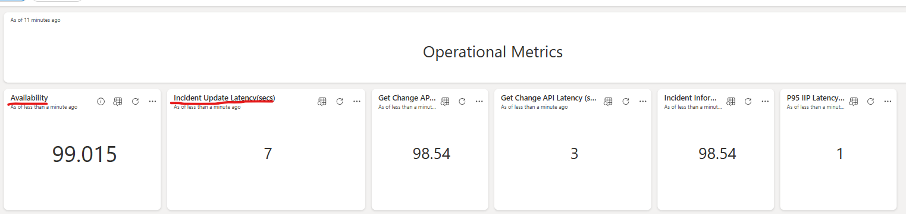
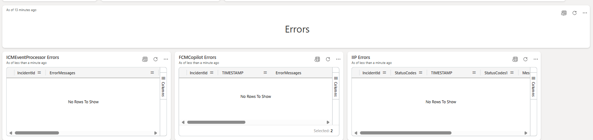
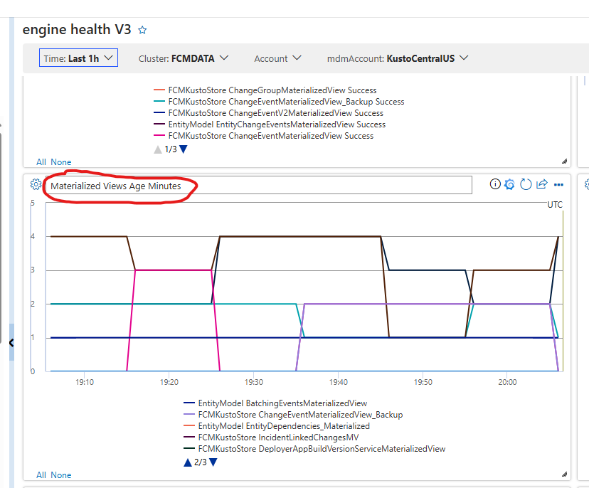
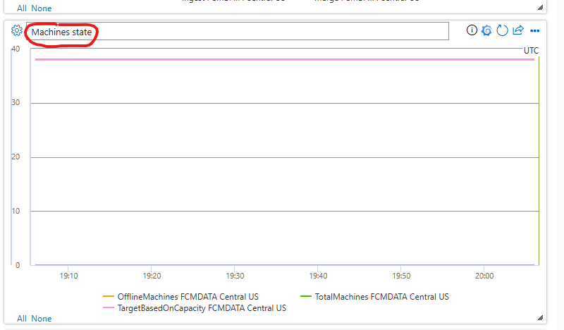
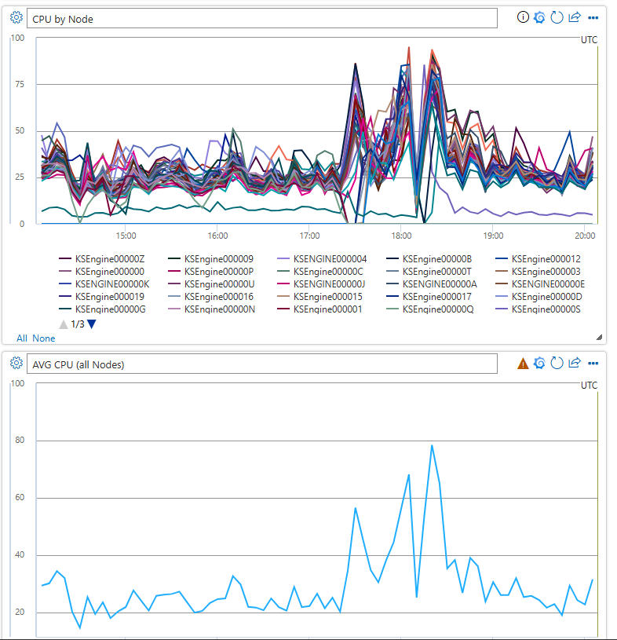
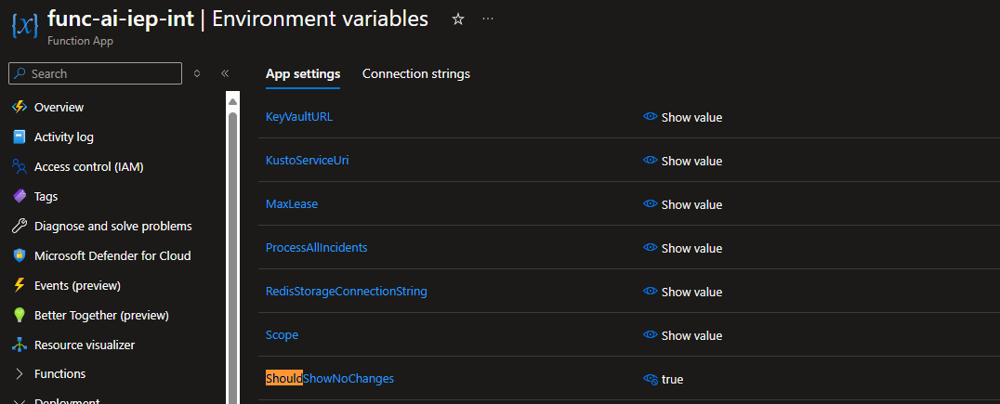
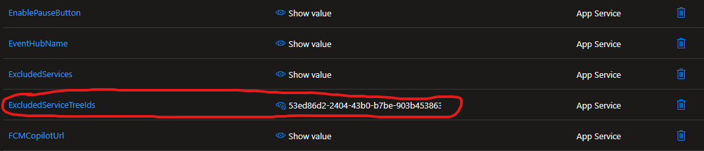

# FCMAI Summary TSG

This TSG should help DRIs to debug any incidents and issues with FCM AI Summary TSG. 

# Operational Metrics Dashboard

When an incident comes regarding FCM AI Summary, DRI should first check the [operational metrics dashboard](https://kusto.azure.com/dashboards/f6687c24-35db-4cfb-a7db-34a85bdc26ec?p-_startTime=1hours&p-_endTime=now&p-_incidentId=all#d8f8e3fd-3c8d-422a-85ba-dc74815658fa). 

In this dashboard, the main tiles to check are
1) **Availability**: Availability of the IEP, this should be more than 98%.
2) **Incident Update Latency(secs)**: This measures the latency from when incident events are ingested into the ICM event hub to when they are processed by IEP. The latency should be around 120 seconds.
3) **ICMEventProcessor Errors**: This table tells you all the errors that are logged by IEP
4) **FCMCopilot Errors**: This table tells you all the errors that are logged by CP
5) **IIP Errors**: This table tells you all the errors that are logged by IIP.





## Common Error Messages and Actions to take

1) **Error Message**: "Error when getting the change from Kusto"


   **Action**: 
    In this case, first run the query below to find out the error message that kusto returns:
    ```
    let incidentId = ""; //Update the incident id here
    let ids = cluster('fcmdata.kusto.windows.net').database('FCMKustoStore').FCMCopilot
    | where IncidentId == incidentId | where severityText contains "Error"
    | distinct env_dt_spanId, env_dt_traceId;
    cluster('fcmdata.kusto.windows.net').database('FCMKustoStore').ChangeProvider
    | join kind=inner ids on env_dt_spanId, env_dt_traceId
    | where severityText =~ 'error'
    ```
    
    If the error is a semantic error, that means either there was a recent change in the C# code when calling Kusto or there is an issue with the parameters that we pass when calling Kusto or there is a change in the `GetChangesCopilot` Kusto function. 

    If the error is not a semantic error but it's related to a query timeout or it's a network error, you need to check whether the our FCMDataFollower kusto cluster and EntityChangeEventsMaterializedView is healthy or not. 
    - [FCMDataFollower](https://portal.microsoftgeneva.com/s/396D4C45?overrides=[{"query":"//*[id='Cluster']","key":"value","replacement":"Fcmdatafollower"},{"query":"//*[id='Account']","key":"value","replacement":""},{"query":"//*[id='TargetCluster']","key":"value","replacement":"Fcmdatafollower"},{"query":"//dataSources","key":"account","replacement":"KustoCentralUS"}]%20)
    - [FCMData](https://portal.microsoftgeneva.com/s/FF83BA1B?overrides=[{"query":"//*[id='Account']","key":"regex","replacement":"*"},{"query":"//*[id='Cluster']","key":"value","replacement":"FCMDATA"},{"query":"//dataSources","key":"account","replacement":"KustoCentralUS"},{"query":"//*[id='TargetCluster']","key":"value","replacement":"FCMDATA"},{"query":"//*[id='Account']","key":"value","replacement":""}]%20)
    - EntityChangeEventsMaterializedView: 
        ``` 
        .show materialized-view EntityChangeEventsMaterializedView
        | project MaterializedTo, LastRun, TimeSinceLastMaterialization = datetime_diff('minute', now(), MaterializedTo)

        ```

    - In the dashboard for the primary Kusto cluster it's important to check `Materialized Views Age Minutes` tile.

    

    - If there is an increase in the materialization view age of EntityChangeEventMaterializedView, it could be due to
        1) There is a job that is changing the schema of the base table, EntityChangeEvents.
        2) There could be a spike in the ingestion from a specific source. 
            - You can determine this by running the following query in Kusto:
            ```
            cluster('fcmdata.kusto.windows.net').database('EntityModel').EntityChangeEvents
            | where ingestion_time() >= ago(2d)
            | summarize count() by Source, bin(Timestamp, 30m)
            | render timechart
            ``` 
        3) There could be an infrastructural issue on our kusto cluster
            - In order to check that, check Machine state tile and also CPUs used by the nodes of Kusto. Check these tiles both in fcmdatafollower and fcmdata kusto cluster. If you see that consistently there are some OfflineMachines or if you see that there is a significant increase in the CPU usage involve Kusto team DRI by creating an incident using [Gaia chatbot](https://aka.ms/gaia)

            
            


    **IMPORTANT**: If the EntityChangeEventsMaterializedView latency is getting close to ~60 mins or if the ingestion latency of the major change systems (OMRollouts, expressv2, azdeployer, pilotfish, ScheduledEvents) is getting larger than 60 mins, you must update IEP to set `ShouldShowNoChanges` environment variable to **false** in order to disable 'Found No Changes' functionality.

    


2) **Error Message**: "Failed to retrieve service details from SIP..."

    **Action**: If this issue is persistent and happening for all the requests, that means SIP is having an outage. Thus, you need to get the log for SIP to understand the rootcause. If this is happening only for 1 or 2 services every once in a while, you can safely ignore this.

3) **Error Message**: "One or more errors occurred. (Failed to retrieve incident details from IIP. IncidentId: {IncidentId}, StatusCode: InternalServerError, Response: FCM was unable to service the request for ICM incident id {IncidentId} at this time. Please try again later."

    **Action**: In this case, you need to check the logs of IIP to understand the errors that are happening. You can find the logs of IIP in the following app insights: 
    - [EastUs](https://ms.portal.azure.com/#@MSAzureCloud.onmicrosoft.com/resource/subscriptions/8830ba56-a476-4d01-b6ac-d3ee790383dc/resourceGroups/ChangeExplorer-PROD-EastUs/providers/microsoft.insights/components/changeexplorerProd/logs)
    - [WestUS](https://ms.portal.azure.com/#@MSAzureCloud.onmicrosoft.com/resource/subscriptions/8830ba56-a476-4d01-b6ac-d3ee790383dc/resourceGroups/ChangeExplorer-PROD-WestUs/providers/microsoft.insights/components/changeexplorerProd/logs) 

    You can run the following query in AppInsights logs to find the exceptions that are happening:
    ```
    let operations = requests | where timestamp >= ago(1h) and resultCode == 500
    | distinct operation_Id;
    exceptions
    | where operation_Id in(operations)
    ```

    Since IIP is also dependent on fcmdatafollower kusto, please also check the health of the fcmdatafollower kusto cluster using this [link](https://portal.microsoftgeneva.com/dashboard/KustoProd/MdmEngineMetrics/engine%2520health%2520V3?overrides=[{%22query%22:%22//*[id%3D%27Account%27]%22,%22key%22:%22regex%22,%22replacement%22:%22*%22},{%22query%22:%22//*[id%3D%27Cluster%27]%22,%22key%22:%22value%22,%22replacement%22:%22FCMDATAFOLLOWER%22},{%22query%22:%22//dataSources%22,%22key%22:%22account%22,%22replacement%22:%22KustoCentralUS%22},{%22query%22:%22//*[id%3D%27TargetCluster%27]%22,%22key%22:%22value%22,%22replacement%22:%22FCMDATAFOLLOWER%22},{%22query%22:%22//*[id%3D%27Account%27]%22,%22key%22:%22value%22,%22replacement%22:%22%22}]%20) by following same the guidelines above. 


4) There might be a case where incidents by a certain team started to cause issues in the system. Even though this is a very edge case scenario, when teams configure new monitors, those new monitors might create incidents with poorly populated values and cause issue in IIP, CP or IEP. In that case, we need to exclude that teams incidents to be processed by IEP. In that case, 
    1) First, find the service tree Id of the team owning service using the query below:
    ```
    let IncidentId='';
    cluster('fcmdata.kusto.windows.net').database('FCMKustoStore').ICMEventProcessor
    | where IncidentId == 'IncidentId'
    | distinct OwningServiceTreeId
    ``` 
    2) Then go to IEP resources, these are resource are following the naming convention of `func-ai-iep-prod-{regionName}` and update the `ExcludedServiceTreeIds` environment variable and add the ServiceTreeId that you got from the previous step to the comma separated list of excludedServiceTreeIds list.

    


## Making A Deployment

In order to make deployment, make sure that all of your changes are merged to `main` branch of [FCMAIChangeSummary](https://msazure.visualstudio.com/One/_git/FCMAIChangeSummary?path=%2F&version=GBmain&_a=contents) repo. 

Once the changes are merged, the [official build pipeline](https://msazure.visualstudio.com/One/_build?definitionId=361254) will create a build that can be deployed using the release pipelines.

In order to make deployment, you should trigger the code deployment of the corresponding product offering (CodeDeploy.IEP, CodeDeploy.CP) in the [release pipeline](https://msazure.visualstudio.com/One/_releaseDefinition?definitionId=65168&_a=environments-editor-preview).

### **!!Important notes as of today**
Currently, IEP is deployed only in West US 2. We are working on deploying to multiple regions that are Azure Pair regions to support geo-resiliency. The name of the resource is `func-ai-iep-prod`. The `staging` deployment slot is currently at stopped state. When deploying to IEP using release pipeline, Swap stage will fail as the both deployment slots needs to be in running state to do a swap. Thus, you need to start the `staging` slot, retry the `swap` stage in the release pipeline and then stop the `staging` slot again manually. We are currently working on finding a way to automate this.


