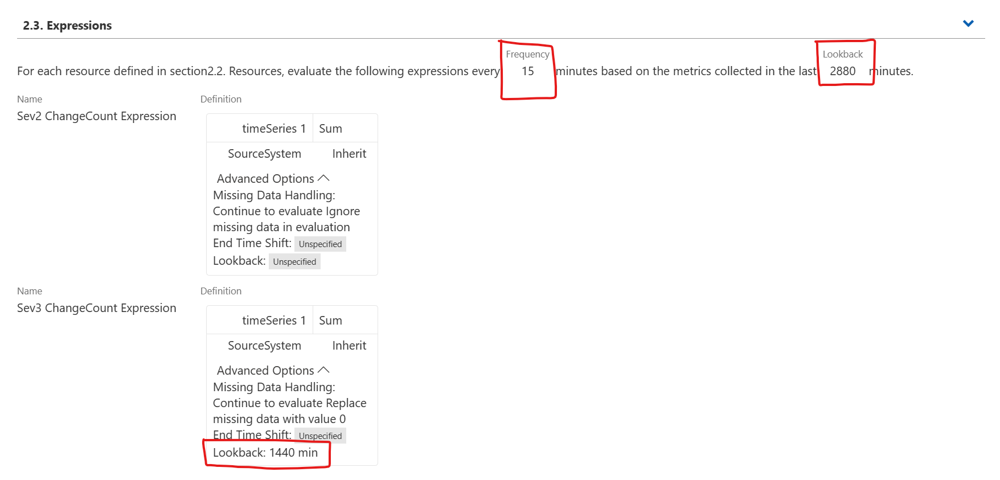
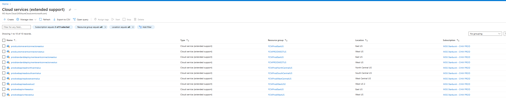
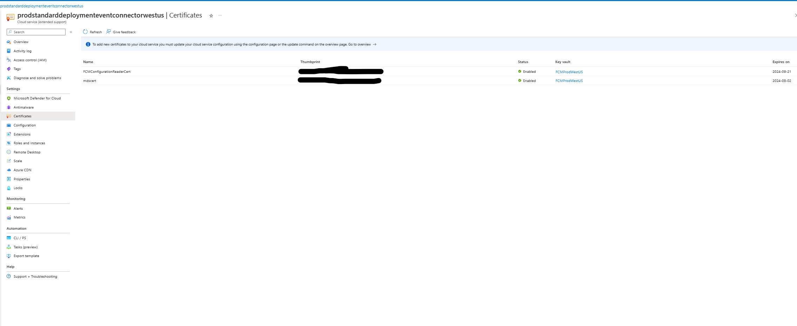
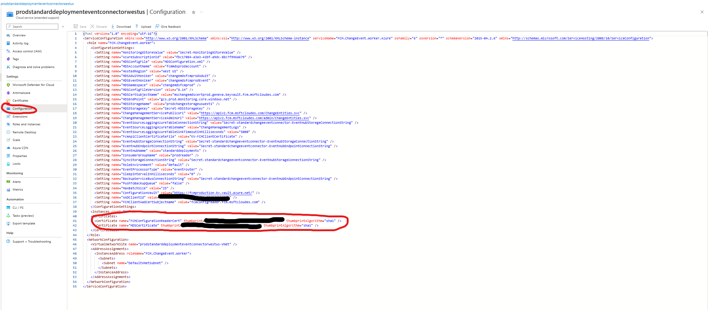

### Summary
1. Metric which is used to trigger the monitor: 
    - Source Code - [EntityModelIngestionCountMetrics](https://msazure.visualstudio.com/One/_git/EngSys-ChangeManagement-FCM?path=/src/FCM/Synthetics/EntityModel/EntityModelIngestionCountMetrics.cs)
    - Geneva Metric - [Metric in fcmmdsprodaccount](https://portal.microsoftgeneva.com/manage/metrics/v1?account=fcmmdsprodaccount&namespace=fcmsyntheticsnamespace&metric=EntityModelIngestionCountMetrics&hideLeftNav=true)
2. List of all monitors using the above metric: [Geneva monitors](https://portal.microsoftgeneva.com/manage/monitors?account=fcmmdsprodaccount&state=[[%22metrics%22,%22%3D%3D%22,[%22EntityModelIngestionCountMetrics%22]]]%20)

### Understanding the Geneva Monitor Parameters
Each monitor has a unique look back based on the frequency at which data is ingested from source. This can be found in section 2.3 of a monitor. 

**Look back:** This is the time period for which the monitor aggregates the data received over the time period mentioned. For example, in the below image, the monitor looksback for a period of 2880 minutes, which is 2 days. Geneva Monitors have a maximum lookback of 2 days. 

**Frequency:** The frequency at which monitor looksback for the data collected by metrics. In the example below, the monitor looks back for metrics collected every 15 minutes.

Understanding the below monitor configuration - we have two expressions, one for Sev2 and the other for Sev3. 

- **Sev2 Expression:** It is run for every 15 minutes, on the metrics collected in the past two days and takes a sum of the collected data.
- **Sev3 Expression:** It is run for every 15 minutes, on the metrics collected in the past one day (1440minutes) and takes a sum of the collected data.



### Debugging zero change count 

When an incident is triggered, it means that the metric has been reading **"Zero" Value** continuously for the given look back period. This can happen because of two reasons -

- There has been no data ingested from the source for the given look back period. This can be analyzed as below -
     1. If this issue is happening with two or more of standard deployment systems, such as EV2, ADORelease, xstore-wadi etc... first check whether the changes are getting ingested into. 
         ```
         cluster('fcmdata.kusto.windows.net').database('FCMKustoStore').ChangeEvent
         | where TIMESTAMP >= ago(30min)
         | where ExternalSourceName in ('expressv2', 'adorelease', 'xstore-wadi')
         | summarize count() by ExternalSourceName
         ```
         If you see changes in these systems, proceed to next steps. If not, check whether there are any errors happening in the connectors in [Jarvis](https://jarvis-west.dc.ad.msft.net/7A9B9B20). If you see that, the connectors are failing due to 401 Unauthorized errors, it means that the certificates that the connectors are using a thumbprint from an expired cert we need to updated them to use the thumbprint from the new version. 
         
         Here is the list of our CloudServices:
         

         In order to rotate the certificates, 
         1. You need to get JIT Access to MSG Starburst - CHM PROD subscription (fbc17084-a3a3-42bf-a9dc-8bc7f996a679).
         1. Check if the certs have expired for each one of the running cloud services.
         
            - If the certs have expired, 
               1. Go to the keyvault that those certs are in (you can find that in the image above.)
               1. Rotate the certificates if they haven't been auto-rotated already and copy the thumbprint of the latest version of the certificate.
                  ```
                  IMPORTANT! Even if the certs are auto-rotated, cloud services won't pick the thumbprint from the new version of the cert automatically unless there was a deployment recently. 
                  ```
               1. Stop the cloud services that you're going to update the certificates of.
                  - if the issue happens with webapi, stop connectors first and then webapi.
               1. Update the configuration file of the cloudservice and set the thumbprints of the certificates to be the thumbprints of the new version of the certificate that you copied above and save your changes.
               
               1. Restart the cloud services, first the Web APIs and then the connectors.
         
     1. Try running the below query on the corresponding database to see if there has actually been no data for the given look back period.
         ```
            EntityChangeEvents
            | where Source == "RedisCache_ControlPlane_V2" // This can be identified from the corresponding monitor under dimension values
            | where ingestion_time() > ago(2880m) // Set this to the lookback time
            | summarize count() by bin(Timestamp,15m) // Set this to the frequency. To decrease the frequency and get a higher level view of the data, you may also give 1h, 2h etc.,
         ```
     1. If this returns zero values, in that case we should be looking at the following:
        - Details like KO job links, QCS team contacts for each of the below steps may be found in the corresponding README.md files of the sources in [FCM-DataPlatform](https://msazure.visualstudio.com/One/_git/FCM-DataPlatform?version=GBdevelop&path=/src/Kusto%20Scripts/EntityModel/Functions/Ingestion) Repository.
        - Have there been any KO job failures for this source system. If there are any, we should have a corresponding Kusto Orchestrator failure incident too. Investigate this as mentioned in the [KO Failures TSG](./changeIngestionUsingKOJobs.md).
        - If there are no failures, please reach out to the corresponding QCS Team member listed in the README.md file to understand what happened on the other end. 
     1. If the above command returns non zero values, that is we have data that was ingested from source periodically, this could possibly be a problem with Synthetics metrics being emitted.
        - Check the logs mentioned here- https://portal.microsoftgeneva.com/s/F90C1424
        - Look for any errors in the logs.
        - To handle the errors, please refer to the [Synthetics and Monitor Issues TSG](./SyntheticsAndMonitorIssues.md)
        - Refer to the [Job status dashboard](https://portal.microsoftgeneva.com/s/CFCF6010?overrides=[{"query":"//*[id='EnvironmentName']","key":"value","replacement":"Prod"},{"query":"//*[id='AccountName']","key":"value","replacement":"fcmmdsprodaccount"},{"query":"//*[id='JobGroupName']","key":"value","replacement":""},{"query":"//*[id='JobName']","key":"value","replacement":""},{"query":"//*[id='InstanceNamePrefix']","key":"value","replacement":""},{"query":"//*[id='Region']","key":"value","replacement":""}]%20) for fcmmdsprodaccount to see the Job statuses. Ensure to select `FCMEntityModelJobGroup` in the filters.