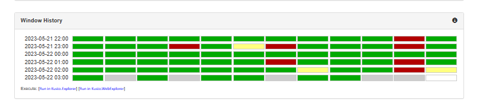
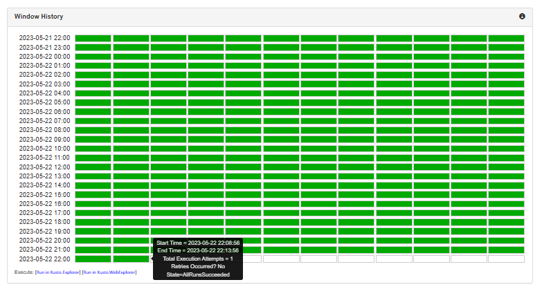
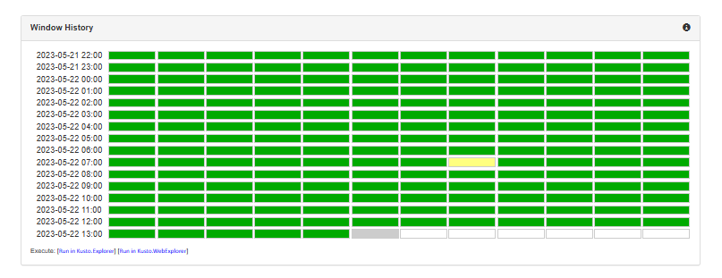
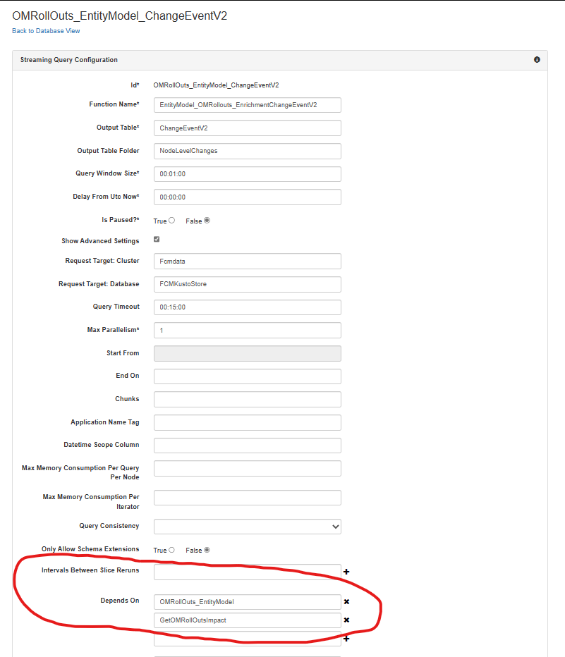
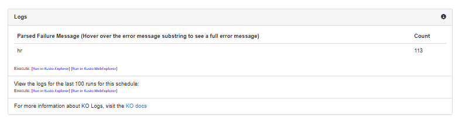
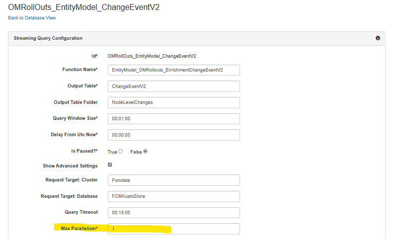
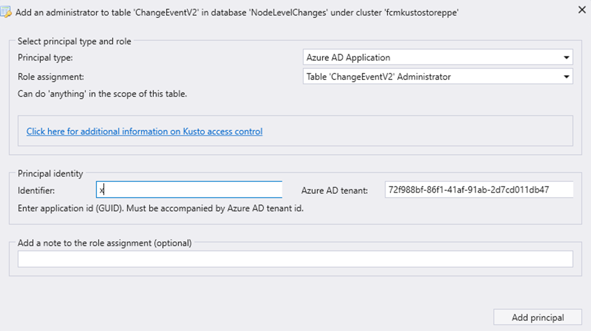
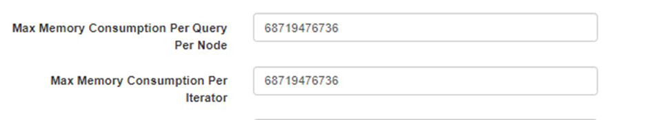

# `TSG For Change Ingestion Using KO Jobs` 

## `Node Level Changes` 
We use Kusto Orchestrator Jobs to ingest node level changes into FCM Kusto (cluster('fcmdata.kusto.windows.net').database('FCMKustoStore')). 

### `What are the systems that we ingest node level changes from?` 

1) OMRollout 

2) OMRollout:SOC 

3) BatchingEvents 

4) OAASRollout 

5) ServiceVersionSwitch 

6) ScheduledEvents_TMMgmt 

7) ScheduledEvents_AzPE 

 
### `What is the source of the data?`

1) For all the systems above except ServiceVersionSwitch, we are getting data from cluster('emplatform.westus.kusto.windows.net').database('EntityModel') Kusto cluster which is owned by EntityModel team under Huaming.  


2) For ServiceVersionSwitch changes, we are getting them directly from the source which is cluster('Azdeployer').database('AzDeployerKusto').ServiceVersionSwitch Kusto cluster. 

### `Summary`
| System | Source |
| --- | ---| 
|OMRollout | cluster('emplatform.westus.kusto.windows.net').database('EntityModel').fEntityChangeEvents() |
| OMRollout:SOC | cluster('emplatform.westus.kusto.windows.net').database('EntityModel').fEntityChangeEvents() |
| BatchingEvents | cluster('emplatform.westus.kusto.windows.net').database('EntityModel').fEntityChangeEvents() |
| OAASRollout   | cluster('emplatform.westus.kusto.windows.net').database('EntityModel').fEntityChangeEvents() |
| ServiceVersionSwitch | cluster('Azdeployer').database('AzDeployerKusto').ServiceVersionSwitch |
| ScheduledEvents_TMMgmt | cluster('emplatform.westus.kusto.windows.net').database('EntityModel').fEntityScheduledEvents() |
| ScheduledEvents_AzPE | cluster('emplatform.westus.kusto.windows.net').database('EntityModel').fEntityScheduledEvents() |


### `How are we ingesting node level changes to FCM?` 

We are using Kusto Orchestrator Jobs to ingest change events into FCM. When creating these Kusto Orchestrator jobs, we follow a three step process. 

1)  We are following a pattern called "Staging Table" pattern. In this pattern the idea is to ingest the events from the source tables as it is or with really minor data manipulation with no joins or any other complex operation to _Staging tables in FCM Kusto cluster. This is to decrease the load we put on the data source Kusto clusters. So first set of KustoOrchestrator jobs read from the Source table above and ingest data in _Staging tables per system. 

2) We create a separate job per system which can be classified as "_EntityModel" . These jobs read the data from _Staging table for a given system and manipulate and enrich the change events, maps them to EntityModel schema and ingest them to EntityChangeEvents table.  

3) We create a separate job per system which can be classified as "_ChangeEventV2". These jobs read the data from EntityChangeEvents table for a given system and manipulate and enrich the change events, maps them to ChangeEventV2 schema and ingest them to ChangeEventV2 table.  

### `Summary`
| System | _Staging KO JOb | _EntityModel KO Job | _ChangeEventV2 KO Job |
| --- | --- | --- | ---| 
| OMRollout | GetOMRollouts_EntityModel_Staging | OMRollOuts_EntityModel | MapOMRollouts_ChangeEventV2 |
| OMRollout:SOC | GetOMRollouts_EntityModel_Staging | OMRollOuts_EntityModel | MapOMRollouts_ChangeEventV2 |
| BatchingEvents | GetBatchingEvents_EntityModel_Staging | MapBatchingEvents_EntityModel |MapBatchingEvents_ChangeEventV2 | 
| OAASRollout | GetOAASRollout_EntityModel_Staging | MapOAASRollout_EntityModel | MapOAASRollout_ChangeEventV2 |
| ScheduledEvents_TMMgmt | GetScheduledEvents_EntityModel_Staging | MapScheduledEvents_EntityModel | MapScheduledEvents_ChangeEventV2 |
| ScheduledEvents_AzPE | GetScheduledEvents_EntityModel_Staging | MapScheduledEvents_EntityModel | MapScheduledEvents_ChangeEventV2 |

 

For **ServiceVersionSwitch**, we do not exactly follow the same pattern as this was the first system we started ingesting the data of. We have an action item to switch using the same pattern for ServiceVersionSwitch as well. Here are the jobs related to ServiceVersionSwitch, in the order of invocation: 

1) GetNodeLevelAppDeploymentsRaw 

2) GetNodeLevelAppDeployments 

3) MoveNodeLevelAppDeploymentsToChangeEventV2 


## `Changes From Other Systems` 

We are also using KO Jobs to ingest data from ChangeEvent table to ChangeEventV2 table.  

We use MapChangeEventV1ToV2 Kusto Function and MapChangeEventV1ToV2 KO job to ingest change events into ChangeEventV2 table. These events are first ingested into ChangeEvent table using our SDK and we use this KO job to map them to V2 Schema. If there is any incident regarding the count or the latency of these change events, you need to follow the steps that are described below for only this KO Job: *[Query Details - KustoOrchestrator (azcompute.com)](https://kustoorchestrator.azcompute.com/Manage/Details?cluster=Fcmdata&database=FCMKustoStore&actorId=MapChangeEventV1ToV2)*


If you cannot find any issue with this KO Job or the Kusto function, then go and check whether there are any issue with the V1 Ingestion pipeline. 


### `Where are these KO Jobs?` 
**KO Prod**: [Database Overview - KustoOrchestrator (azcompute.com)](https://kustoorchestrator.azcompute.com/Manage?cluster=Fcmdata&database=FCMKustoStore) 


### `Incidents:` 

There are three types of incidents that could be created on KO jobs: 

- Incidents that are caused by low change count 

- Incidents that are caused by high latency  

- Incidents that are caused by failing KO jobs. 


### `Monitors:` 

You can find all the monitors for these alarms here: [Monitors | Jarvis (microsoftgeneva.com)](https://portal.microsoftgeneva.com/manage/monitors?account=fcmmdsprodaccount) 


### `How to mitigate these incidents?` 

1) Identify the source that has the issue 

2) Find the KO Jobs that this source is related to using the tables that are mentioned above. 

3) Check: 

    **3.1) Are there any of job instances that are failing?**
     > [!TIP]
     > You can do this by clicking on any of the jobs from the KustoOrchestrator UI and by checking the window history. 

    A healthy job would look like this: 
    

    An unhealthy job would look like this:
     

    **3.2) Is the job falling behind than the current time?**
    > [!TIP] 
    > You can also check this by looking at the window history and comparing the time range of the job that is running with the current timestamp. 
    
    **Example:** Given that the current timestamp is 2023-05-22 22:17 
    
    A job that is up-to-date and caught up would look like this:
     

    A job that is falling behind would look like this: 
    
    

4) Take an action: 

    a) If there are no jobs that is failing, go to Kusto and check whether there have any data coming from the Source for that given time ranges. You can test this by either running Kusto functions that `_Staging` KO Jobs is running with a time range in the past OR  you can also check whether there have been any data ingestion to the _Staging tables by running a query like below:

    ```
    OMRollouts_EntityModel_Staging 
    | where ingestion_time() >= ago(3h) 
    | extend IngestionTime = ingestion_time() 
    | summarize count() by Source, bin(IngestionTime, 10min)
    ``` 

    - If there is no data that is getting ingested into the _Staging table for the source that is having the incident, reach out to the data source team.  

    - If there is data that is getting ingested into the _Staging table, then check whether there is data ingestion to EntityChangeEvents table for the same source and so on. 

    > [!CAUTION]
    > We emit ingestion metrics by looking at the Change Count on ChangeEventV2MaterializedView. If there is data getting ingested into all the tables, check whether there are any issue with the materialization for ChangeEventV2MaterializedView.

    b) If there are job instances that are failing, identify the reasons of failure. **Possible reasons**: 

    ## `1) The KO job that the failing job depends on might be failing.` 

    You can find the job dependencies by under each job's advanced settings. For example:

     

    In this case, you need to check these dependency jobs and follow this same TSG to identify the issue and resolve it. 

    ## `2) The query that the job is running might be failing (The Most Common Case)`

    There could be many reasons of this but most of the cases a specific instance of the job fails due to various memory issues. The common memory issues we have seen so far: 

    1) "join operator has exceeded the memory budged" 

    2) "Runaway query (E_RUNAWAY_QUERY). Aggregation over string column exceeded the memory budget of 8GB during evaluation." 

    3) hr: '2147942487' 'Partial query failure: materialize(): couldn't cache result of size 3790465216. global cache size exceeded the allowed limit (5368709120 bytes.) 

    4) The query that we run might hit the timeout limit that we set in our KO jobs. In default it's 15 minute per instance of the job. 

    5) Any other RUNAWAY Query failure that is mentioned here: https://learn.microsoft.com/en-us/azure/data-explorer/kusto/concepts/querylimits#limit-on-memory-consumed-by-query-operators-e_runaway_query   

    The main reason of these failures is we are trying to process a lot of data in one go and we are hitting the kusto query limits. When debugging these issues 

    1) Check the historical data ingestion to _Staging table of the failing Source system. Check whether there has been a drastic increase in the number of records that are coming from the data source. You can do this by running query like this: 

        ```
        OMRollouts_EntityModel_Staging 
        | where ingestion_time() >= ago(3h) 
        | extend IngestionTime = ingestion_time() 
        | summarize count() by Source, bin(IngestionTime, 10min)
        ```
        If there is an increase in the number of records, reach out to the team who owns that source and identify what happened. If there is no increase, move to the next steps. 

    2) Find the job instance that is failing with the startTime and endTime parameters. You can do this either going to the KO job's UI and hovering on the error message:

        
    
     Or you can run a query similar to the one below. Please make sure that you set the ActivityId and the lookback according to the job that is failing. 

     ```
     KO_StreamingQueryStatistic 
     | where ActivityId ==  'OMRollOuts_EntityModel_ChangeEventV2' and StartedOn >= ago(6h) 
     | join kind=inner KO_RepeatableQueryStatistic on $left.RepeatableQueryActorId == $right.ActorId 
     | where State == "Failed" 
     | project QueryString 
     ```
     3) Once you get the instance that is failing with the parameters, using the same parameters (aka startTime and endTime), debug the Kusto query that the failing job is running and try finding the bottleneck. Usually the bottlenecks are the joins or any other sort of aggregation. When doing this analysis,  

        1) Keep checking the count of records after every join or aggregation operation. This might give an idea on where the bottleneck is. 

        2) Check whether there is an increase or duplication of the helper function/tables that we are joining the change events with. An anomaly on the number of events coming from those function/table can cause an issue. 

        3) Check the overall code quality of the query and check whether we are following the best practices of Kusto. Some of the question that you can check could be: 

            a) are we operating on only the necessary columns or can we reduce the the memory usage with a project statement? 

            b) are we unnecessarily rerunning the same statement? For example are we reparsing a dynamic column multiple times to extract different fields? 

            c) if we are using an expensive operation such as mv-expand, is it possible to do that after we do all the joins and extend statements in order to reduce the number of rows that we are processing? 

        Based on all your findings if there is an improvement that can significantly improve the performance, make those changes, test them and create a PR. Once that PR is merged and approved, rerun the failing instances to backfill missing data. 

    ## `3) There could be a lot of load on our Kusto cluster.` 
    
    Check the hold of our Kusto cluster and database: [Dashboard | Jarvis (microsoftgeneva.com)](https://portal.microsoftgeneva.com/dashboard/KustoProd/MdmEngineMetrics/engine%2520health%2520V3?overrides=%5b%7b%22query%22%3a%22%2f%2f*%5bid%3d%27Account%27%5d%22%2c%22key%22%3a%22regex%22%2c%22replacement%22%3a%22*%22%7d%2c%7b%22query%22%3a%22%2f%2f*%5bid%3d%27Cluster%27%5d%22%2c%22key%22%3a%22value%22%2c%22replacement%22%3a%22FCMDATA%22%7d%2c%7b%22query%22%3a%22%2f%2fdataSources%22%2c%22key%22%3a%22account%22%2c%22replacement%22%3a%22KustoCentralUS%22%7d%5d+)

    There could be an operation, an application or a KO job that is creating a lot of load on our Kusto cluster. In order to under to see which user/app is running which query on our cluster and what kind of load it's creating run the following query by adjusting the time ranges: 

    ```
    let _startTime = ago(6h); 
    let _endTime = now(); 
    UserRecentFailures( _startTime, _endTime)
    ```


    Once you identify the app/user who is creating that load: 

    1) If it's not a user or app that belongs to FCM team, reach out to that user and ask them to reduce the load or the fix the issue with their query. In extreme cases, you can remove their access to our database. 

    2) It could be one of our KO jobs. A KO job could be creating a lot of load on our Kusto because  

        1) It might be running multiple instances in parallel 

        2) Each one of those instances might be running an expensive query that 

            a) takes too long to complete 

            b) completes after multiple failures and retries 

            c) keeps retrying after multiple failures and fail after 7 tries.  

        One way to handle this issue is go to the KO job's UI and check the "Max Parallelism" Setting of the job. This is set to be 5 by default in the creation of a KO job. Decreasing this number might help to reduce the load as it will run less instances of the job in parallel. For more information, read here: [MaxParallelism (eng.ms)](https://eng.ms/docs/products/kusto/orchestrator/concepts/maxparallelism)

        


## `Some other issues we have seen so far:` 

1) `**Principal X is not authorized to write table Y:**` This error usually happens when a job is created for the first time and the output table is created before the job itself. In order to resolve this issue, you need to add the Principal X as admin to the table.

    

2) `**Query execution lacks memory resources to complete (80DA0007):**`

    This issue is caused when the query that we are running is using more memory than the memory allocated to the nodes that Kusto database is hosted on. In order to resolve this:
    1) Max Memory Consuption Per Query Per Node and Max Memory Consumption Per Iterator are set in the KO job: 

        


    2) Kusto cluster might not have enough resources so if the cluster that is leading to this issue is FCM Kusto cluster, increase the resources of the Kusto cluster. If it’s not an FCM Cluster, the issue is mostly likely caused by the table that we are using to do a lookup in our query. What we need to is 

        a) Create a new KO job. This KO job should ingest data from the table in non-FCM Kusto cluster into FCM, every 5 or 10 minutes. Please check [Query Details - KustoOrchestrator (azcompute.com)](https://kustoorchestrator.azcompute.com/Manage/Details?cluster=Fcmdatappe.Westus2&database=fcmkustostoreppe&actorId=GetLogNodeSnapshot) KO job as an example. If it’s a snapshot table as the one in example, make sure that you are not ingesting duplicates. 

        b) Do a one time ingestion to the new table in FCM from the table in non-FCM Kusto cluster which backfills the data. Duration of the backfill should be determined based on the context but you should usually backfill for at least 30 days. 

        c) Update the Kusto function of the current job that is failing to use new table in FCM that we are ingesting the data from the table in non-FCM Kusto cluster. 


## `Steps to follow for incidents that are caused by high latency`     

There are multiple reasons for latency to increase: 

1) There are failing jobs that is causing the latency due to reruns, etc…  
    a) Follow the steps for incidents that are caused by low change count that we explained above and take actions respectively. 

2) There is an issue in the source table. 

3) The jobs are taking longer than expected 


For (2) and (3) above, follow the steps below: 

**Step 1:** Find the job that caused the latency. In order to this, check the trends of latency over the last couple of days. In order to get the latency trends, you can run the query below:

```
KO_RepeatableQueryStatistic 
| where ingestion_time() >= ago(5d) 
| extend JobName = tostring(split(ActorId, ":")[0]) 
| extend KustoFunctionName = tostring(split(QueryString, "(")[0]) 
| summarize percentile(Duration, 95) by JobName, KustoFunctionName, bin(StartedOn, 1h) 
| render timechart 
```

You can filter on the JobName column in order to narrow down the results. 

**Step 2:**

1) If you don’t see any change in the trends of the latency of any jobs that means, the issue is in the source table. You need to reach out to the owner of the source table.  

2) If you see a change in the trends of the job, check whether the volume of the data that is coming from that job has increased. When doing that, please check the tables that we do joins in our queries as well because as we mostly do leftouter joins, if the data in the tables that we do joins with our source table increased, that will increase our data volume drastically as well. 

    a) If the volume of data in the source table increased, contact the owners of those tables using the table above and verify that it is normal. If it’s normal, adjust the jobs to pull the data more frequently to decrease the volume of the data.  

    b) If the data in the tables that we do joins with increased, check the jobs that we use to populate those tables and make sure that we are not inserting any duplicates. 