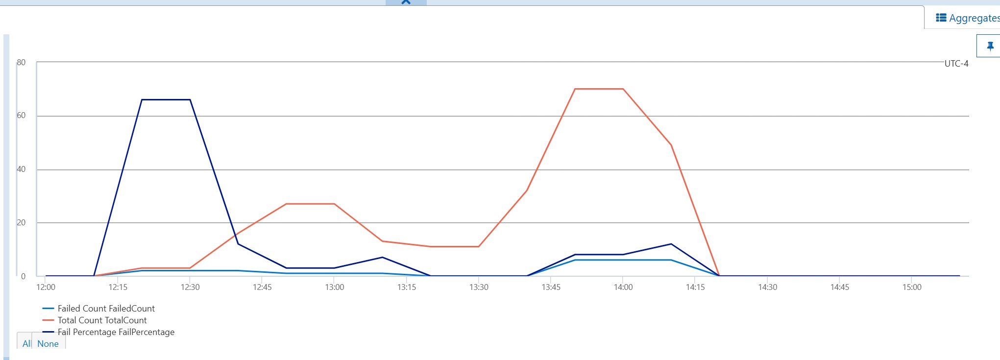
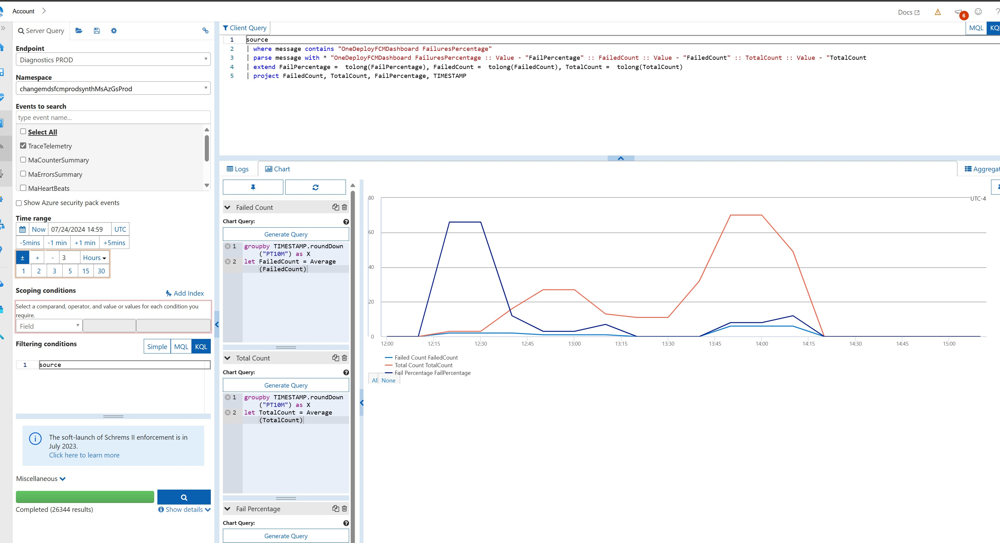

## [OneDeploy FCM Dashboard] Increase in Failure Count


This TSG helps to identify what triggered the incident in the increase in OneDeployFCM Dashboard failure count.


Queries which can be used for immediate debugging, additional queries can be picked from the dashboard shared at the end of this document.


```kusto
.show queries 
| where StartedOn > ago(1h)
| where ClientActivityId contains "d0357802-00ae-48c7-85a2-5cf02d98de77"
| where State == 'Failed' 
| parse Text with "//PageName: " Page:string ", ViewName: " View:string ", EOP//" ignore:string
| project-reorder FailureReason, User, StartedOn, WorkloadGroup, Page, View

```

### Jarvis Dashboard to look at the raw data

Jarvis can be used to look at the raw data which triggered the incident. [Jarvis Link](https://portal.microsoftgeneva.com/logs/dgrep?be=DGrep&ep=Diagnostics%20PROD&ns=changemdsfcmprodsynthMsAzGsProd&en=TraceTelemetry&time=2024-05-01T22:00:00.000Z&offset=~3&offsetUnit=Hours&serverQuery=source&serverQueryType=kql&kqlClientQuery=source%0A|%20where%20message%20contains%20%22OneDeployFCMDashboard%20FailuresPercentage%22%0A|%20parse%20message%20with%20*%20%22OneDeployFCMDashboard%20FailuresPercentage%20::%20Value%20-%20%22FailPercentage%22%20::%20FailedCount%20::%20Value%20-%20%22FailedCount%22%20::%20TotalCount%20::%20Value%20-%20%22TotalCount%0A|%20extend%20FailPercentage%20%3D%20%20tolong(FailPercentage),%20FailedCount%20%3D%20%20tolong(FailedCount),%20TotalCount%20%3D%20%20tolong(TotalCount)%0A|%20project%20FailedCount,%20TotalCount,%20FailPercentage,%20TIMESTAMP&chartsVisible=true&chartEditorVisible=true&chartType=line&chartLayers=[[%22Failed%20Count%22,%22groupby%20TIMESTAMP.roundDown(\%22PT10M\%22)%20as%20X\nlet%20FailedCount%20%3D%20Average(FailedCount)%22],[%22Total%20Count%22,%22groupby%20TIMESTAMP.roundDown(\%22PT10M\%22)%20as%20X\nlet%20TotalCount%20%3D%20Average(TotalCount)%22],[%22Fail%20Percentage%22,%22groupby%20TIMESTAMP.roundDown(\%22PT10M\%22)%20as%20X\nlet%20FailPercentage%20%3D%20Average(FailPercentage)%22]]%20)

```Kusto query
In case the above Jarvis link doesn't work, this query can be used to be run in Jarvis.

- EndPoint - Diagnostic PROD
- Namespace changemdsfcmprodsynthMsAzGsProd
- Event - TraceTelemetry
- Time range - Now - 2 hours

source
|where message contains  "OneDeployFCMDashboard FailuresPercentage"  
| parse message with *  "OneDeployFCMDashboard FailuresPercentage :: Value - " FailPercentage:string " :: FailedCount :: Value - " FailedCount:string " :: TotalCount :: Value - " TotalCount:string
| extend FailPercentage  =  tolong(FailPercentage), FailedCount  =  tolong(FailedCount), TotalCount  =  tolong(TotalCount)  
| project FailedCount, TotalCount, FailPercentage, TIMESTAMP

```






### Monitor Details
Monitor which triggers this incident. [Monitor Link](https://portal.microsoftgeneva.com/manage/monitors/monitor?activity=edit-monitor&version=1&action=3&account=fcmmdsprodaccount&monitorId=9d5c7458-5179-43b9-acf3-4f7bfd895669)

Thresholds which are used on the Monitor are:
- Sev2 is Triggered for > 15% Failures 
- Sev3 is Triggered for > 10% Failures 


### Code Repo for Synthetics
- [Synthetics code for this monitor](https://msazure.visualstudio.com/One/_git/EngSys-ChangeManagement-FCM?path=%2Fsrc%2FFCM%2FSynthetics%2FEntityModel%2FOneDeployFCMDashboardFailures.cs&_a=contents&version=GBmaster)


### OneDeployFCM Metrics Dashboard
[OneDeployFCM Metrics Dashboard](https://kusto.azure.com/dashboards/f6687c24-35db-4cfb-a7db-34a85bdc26ec#b3e15594-5016-47ce-a67d-fa7c049e6ddd). This Dashboard has the details for the last 14 days. Queries from this dashboard can be used to identify the queries which are causing the incident in the last one hour or so


