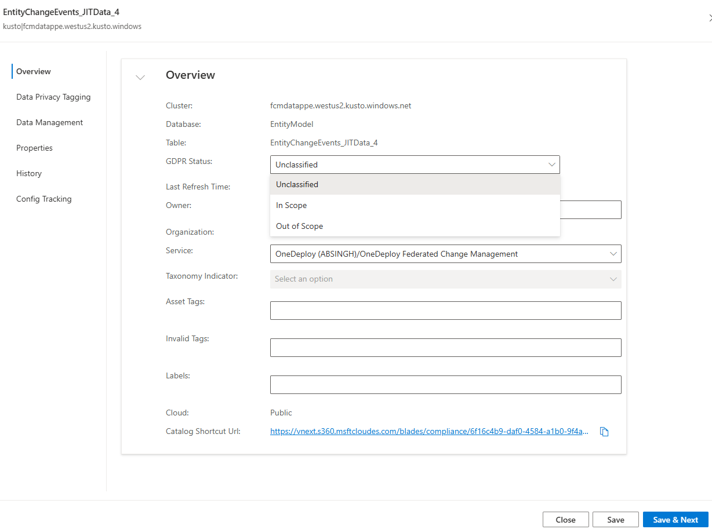
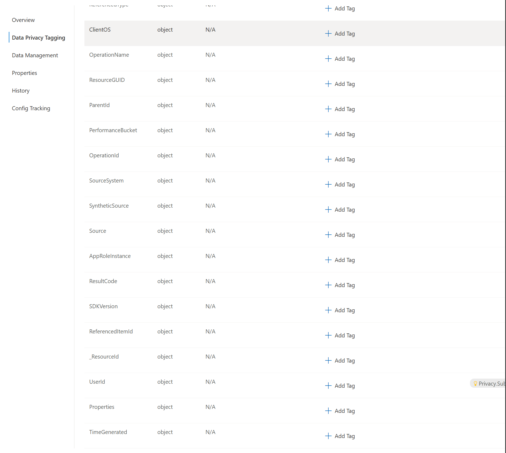
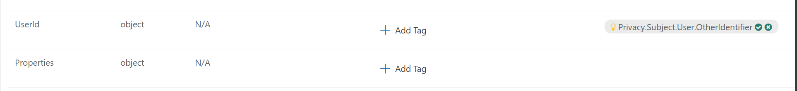
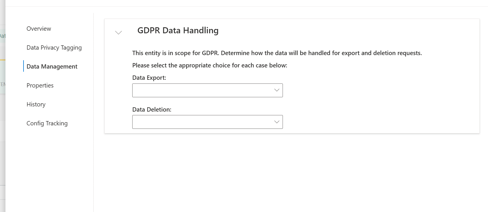

### S360 - GDPR Action Items

This TSG document provides the guidance on how to handle the GDPR Action Items - Data Type Classification, Data Privacy Tagging, Data Management. Whenever there is a new table created, either in Kusto, MDS, AzureLogAnalytics, etc. S360 will flag any new dataset for GDPR data type classification and compliance tagging.

1. **Data Type Classification**
    - Classify the data as 'In Scope' if the table/dataset contains personal information, or 'Out of Scope' if it does not. Examples of classified 'In Scope' data can be found [here](https://global.azure.com/gethelp/Privacy/content/Data-Management/FAQs/Data-Classification-Examples.html?q=classification). If at least one element in the dataset is 'In Scope', the entire dataset should be marked as 'In Scope'
  
    

2. **Data Privacy Tagging**
    - Identify which columns contain personal information and tag them appropriately. Use the [Tag Definitions](https://gethelpweb.azurewebsites.net/gethelp/Privacy/content/Data-Management/Meet-GDPR-Compliance/GDPR-Engineering-Guidance/GDPR-Tag-Definitions.html) document for correct tagging. The GDPR Team [automatically tags](https://gethelpweb.azurewebsites.net/gethelp/Privacy/content/Data-Management/Meet-GDPR-Compliance/GDPR-Engineering-Guidance/Automatic-GDPR-Tag-Detection.html) the data; review and evaluate these tags, and accept or deny the automatically tagged elements.

    
    

3. **Data Management**
    - Identify how to handle Data Export and Data Deletion for 'In Scope' datasets. Refer to the [detailed TSG](https://gethelpweb.azurewebsites.net/gethelp/assets/articles/Privacy/content/Data-Management/Meet-GDPR-Compliance/GDPR-Engineering-Guidance/Stage-6-Apply-Data-Management-Tags.html) on how to tag a column. 

    

Most of our datasets will be out of scope as we don't collect lot of personal information. For example, Cacher Function App runs with a time trigger and all it logs/tables will be out of scope as there is no personal information collected. But there will be instances where we have personal information such as 'EntityChangeEvents' where we have usernames in 'Metadata' column or 'ChangeOwner' column and these needs to be tagged appropriately. We have to review each table/dataset which gets tagged for GDPR compliance and classify them correctly.

#### Additional documentation
1. [S360 GDPR Compliance Portal Overview](https://gethelpweb.azurewebsites.net/gethelp/Privacy/content/Data-Management/Meet-GDPR-Compliance/S360-GDPR-Compliance-Portal/C-AI-Privacy-S360-GDPR-Compliance-Portal-Overview.html)
