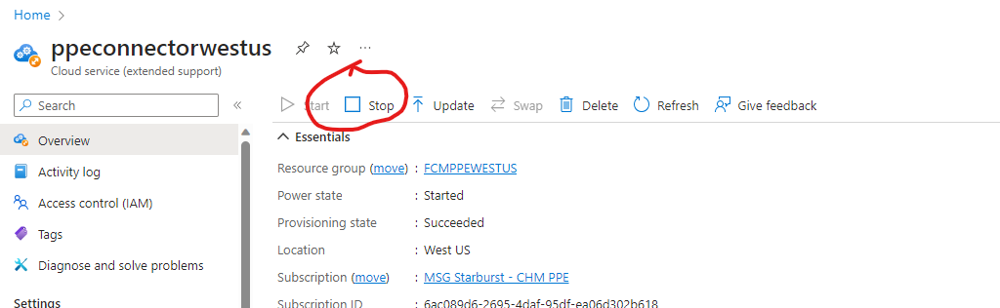
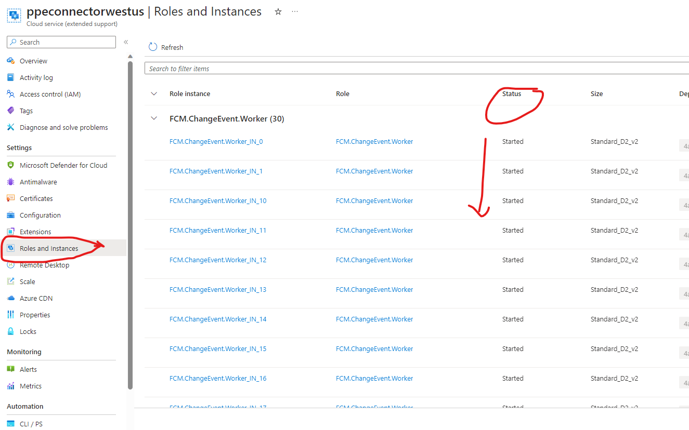

## Shard Remapping

This document discusses the steps involved when moving an external source from one shard to another in the Sql Server. The challenge we faced is that one of the 4 shards in the sql server had external sources which were pumping in lot of data and was eating up lot of space in one shard while other shards had lot of space. Resharding so that the shard does not run out of space.

Please note that:
  1. As part of this process, we will give a new externalsourceid to the externalsource
  2. ChangeEventMaterializedView aggregates record by changerecordId. If there is inprogress record in old shard and completed record in new shard, it will be shown as two different changes instead of one as the changerecordId will be different. This impact should last only for a few days and the data will be cleaner going forward. 

JIT Access Needed to complete the steps listed below:
  1. For doing the Shard remapping in PPE, get the JIT Access to subscription: 6ac089d6-2695-4daf-95df-ea06d302b618
  2. For doing the Shard remapping in PROD, get the JIT Access to subscription: fbc17084-a3a3-42bf-a9dc-8bc7f996a679

### Steps to Move an ExternalSource to a new Shard

1. Identify the External Source Id by querying External Source Table in SQL for the ExternalSource which is having lot of data. 
    
      `Select * from ExternalSource where ExternalSourceName='GenevaActions';`
    
      Here are the SQL Details. We can connect to the SQL Server from the dev machine using the `SQL Server Management Studio`

      | # | Environment  | Write SQL Connection | Database| Username| Password |
      |----|---------|-------------------------------|--|--|--|
      | 1  | PPE  |cvdc20gaea.database.windows.net|MSChange|MSChangeSQLUser|[FCMPPESQLPassword](https://ms.portal.azure.com/#@microsoft.onmicrosoft.com/asset/Microsoft_Azure_KeyVault/Secret/https://fcmintkv.vault.azure.net/secrets/FCMPPESQLPassword)|
      | 2  | PROD |x2altnc1cm.database.windows.net|MSChange|MSChangeSQLUser|[FCMPRODSQLPassword](https://ms.portal.azure.com/#@microsoft.onmicrosoft.com/asset/Microsoft_Azure_KeyVault/Secret/https://fcmintkv.vault.azure.net/secrets/FCMSQLProdPassword)|

    
      
      If you would like to access the SQL Server from the Azure Portal, then JIT Subscription is needed and the portal is accessible only from SAW Machine.

      1. For PPE, get JIT for Subscription: 6ac089d6-2695-4daf-95df-ea06d302b618. 
            1. Link to the [PPE Write SQL Server](https://ms.portal.azure.com/#@MSAzureCloud.onmicrosoft.com/resource/subscriptions/6ac089d6-2695-4daf-95df-ea06d302b618/resourceGroups/Default-SQL-WestUS/providers/Microsoft.Sql/servers/cvdc20gaea/overview)
            2. Link to the [PPE Read SQL Server](https://ms.portal.azure.com/#@MSAzureCloud.onmicrosoft.com/resource/subscriptions/6ac089d6-2695-4daf-95df-ea06d302b618/resourceGroups/Default-SQL-WestUS/providers/Microsoft.Sql/servers/cvdc20gaea/overview)
      2. For PROD, get JIT for Subscription: fbc17084-a3a3-42bf-a9dc-8bc7f996a679. 
            1. Link to the [PROD Write SQL Server](https://ms.portal.azure.com/#@MSAzureCloud.onmicrosoft.com/resource/subscriptions/fbc17084-a3a3-42bf-a9dc-8bc7f996a679/resourceGroups/Default-SQL-WestUS/providers/Microsoft.Sql/servers/x2altnc1cm/overview)
            2. Link to the [PROD Read SQL Server](https://ms.portal.azure.com/#@MSAzureCloud.onmicrosoft.com/resource/subscriptions/fbc17084-a3a3-42bf-a9dc-8bc7f996a679/resourceGroups/Default-SQL-NorthCentralUS/providers/Microsoft.Sql/servers/z8es60cz5v/overview)

2. Identify which shard this external source id is currently mapped to by querying the MSChangeSQL. MinValue contains the externalsource id in hexadecimal format.

	`Select [sg].[ShardId], [DatabaseName],[MinValue]from [__ShardManagement].[ShardsGlobal] sg, [__ShardManagement].[ShardMappingsGlobal] smg
  where sg.ShardId = smg.shardId`

3. Once the existing shard# is identified from the above query, find the shard which has more space by accessing the sql shards overview page from portal.azure.com on SAW machine.  

4. Identify the new External Source Id by getting the max value from the ExternalSource table and adding 1 to it.

5. This new ExternalSourceId will be used to update the shard mapping.

6. Shard Mapping to be updated using the powershell script [AddnewExternalSourceToShardToWrite.ps1](https://msazure.visualstudio.com/One/_git/EngSys-ChangeManagement-FCM?path=/src/FCM/Msdial.Change.Deployment/Shard/Powershell/AddnewExternalSourceToShardToWrites.ps1). Follow the instructions in the comments of the powershell script. You need to update the ExternalSource, which ShardDb the record will go to and the password. Here are the SQL Details:

      | # | Environment  | Write SQL Connection | Database| Username| Password |
      |----|---------|-------------------------------|--|--|--|
      | 1  | PPE  |cvdc20gaea.database.windows.net|MSChange|MSChangeSQLUser|[FCMPPESQLPassword](https://ms.portal.azure.com/#@microsoft.onmicrosoft.com/asset/Microsoft_Azure_KeyVault/Secret/https://fcmintkv.vault.azure.net/secrets/FCMPPESQLPassword)|
      | 2  | PROD |x2altnc1cm.database.windows.net|MSChange|MSChangeSQLUser|[FCMPRODSQLPassword](https://ms.portal.azure.com/#@microsoft.onmicrosoft.com/asset/Microsoft_Azure_KeyVault/Secret/https://fcmintkv.vault.azure.net/secrets/FCMSQLProdPassword)|
  

7. Validate the write DBs. Run this on the Shard Write DB.
    `SELECT [MappingId] ,[Readable] ,[ShardId] ,[ShardMapId] ,[OperationId] ,[MinValue] ,[MaxValue] ,[Status] ,[LockOwnerId] FROM [__ShardManagement].[ShardMappingsGlobal]` 

8. It should show the new externalSource in MinValue field in Hex format. Run this in the specific Shard db where the new mapping is created.
    `SELECT [MappingId] ,[ShardId] ,[ShardMapId] ,[MinValue] ,[MaxValue] ,[Status] ,[LockOwnerId] ,[LastOperationId] FROM [__ShardManagement].[ShardMappingsLocal] ORDER BY MinValue`

9.  Stop the connectors, make sure all conenctor instances are stopped. To stop the connector, get the JIT for the subscription below and navigate to the portal link provided below. Once you navigate to the portal, click on the Stop button. Go to the instances section and make sure all the instances are in destroyed status before going to the next step.
      
      
      1. PPE: 
          1. [PPE Connector](https://ms.portal.azure.com/#@MSAzureCloud.onmicrosoft.com/resource/subscriptions/6ac089d6-2695-4daf-95df-ea06d302b618/resourceGroups/FCMPPEWESTUS/providers/Microsoft.Compute/cloudServices/ppeconnectorwestus/overview)
      2. PROD: 
         1. [PROD Custom Event Connector](https://ms.portal.azure.com/#@MSAzureCloud.onmicrosoft.com/resource/subscriptions/fbc17084-a3a3-42bf-a9dc-8bc7f996a679/resourceGroups/FCMProdWestUS/providers/Microsoft.Compute/cloudServices/prodcustomeventconnectorwestus/overview)
          2. [PROD Standard Deployment Event Connector](https://ms.portal.azure.com/#@MSAzureCloud.onmicrosoft.com/resource/subscriptions/fbc17084-a3a3-42bf-a9dc-8bc7f996a679/resourceGroups/FCMProdWestUS/providers/Microsoft.Compute/cloudServices/prodstandarddeploymenteventconnectorwestus/overview)

10. Stop the webapi writes, make sure all webapi instances are stopped.
      1. PPE:
          1. [PPE WebAPIWrite](https://ms.portal.azure.com/#@MSAzureCloud.onmicrosoft.com/resource/subscriptions/6ac089d6-2695-4daf-95df-ea06d302b618/resourceGroups/FCMPPEWESTUS/providers/Microsoft.Compute/cloudServices/ppewebapiwritewestus/overview)
      2. PROD:
          1. [PROD WebAPIWrite West US](https://ms.portal.azure.com/#@MSAzureCloud.onmicrosoft.com/resource/subscriptions/fbc17084-a3a3-42bf-a9dc-8bc7f996a679/resourceGroups/FCMProdWestUS/providers/Microsoft.Compute/cloudServices/prodwebapiwritewestus/overview)
          2. [PROD WebAPIWrite East US](https://ms.portal.azure.com/#@MSAzureCloud.onmicrosoft.com/resource/subscriptions/fbc17084-a3a3-42bf-a9dc-8bc7f996a679/resourceGroups/FCMProdEastUS/providers/Microsoft.Compute/cloudServices/prodwebapiwriteeastus/overview)

11. We have 4 shards: mschangeshard_0, mschangeshard_1, mschangeshard_2, mschangeshard_3. After getting next number, run the following query in all of those shards to insert the new source system in to the db. Don’t forget to change to value placeholders with the real ones.

    `Update [dbo].[ExternalSource] set ExternalSourceId = ? where ExternalSourceName = ?` Replace the ? mark with the ExternalSourceId(new value from step#5) and ExternalSourceName.

12. Start the web api writes, wait for 15 mins, check all webapi instances are started before going to the next step.

13. Start the Connectors.

14. Insert in the ExternalSource Table in Kusto-FMKustoStore.

    `.ingest inline into table  ExternalSource <| ?,?,?` Replace the ? with the actual values.
  
    Example: .ingest inline into table  ExternalSource <| 90,genevaactions,Source name for geneva actions 