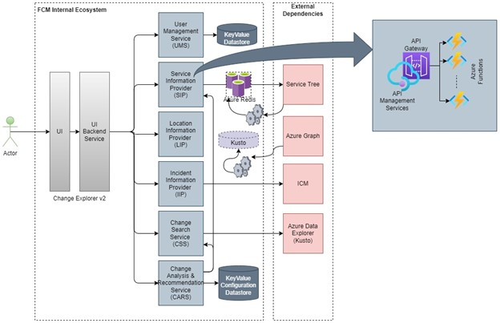
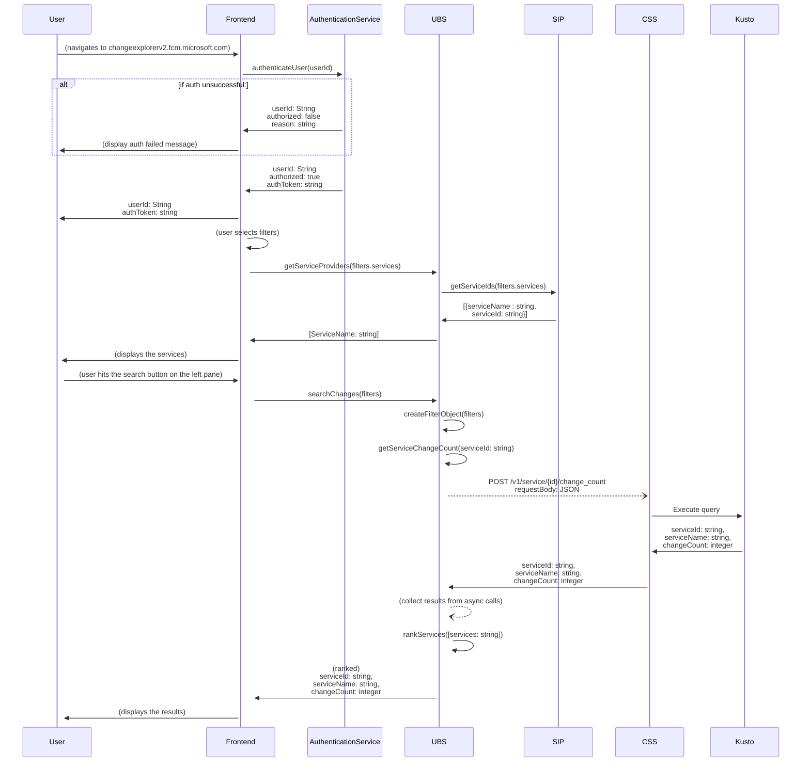
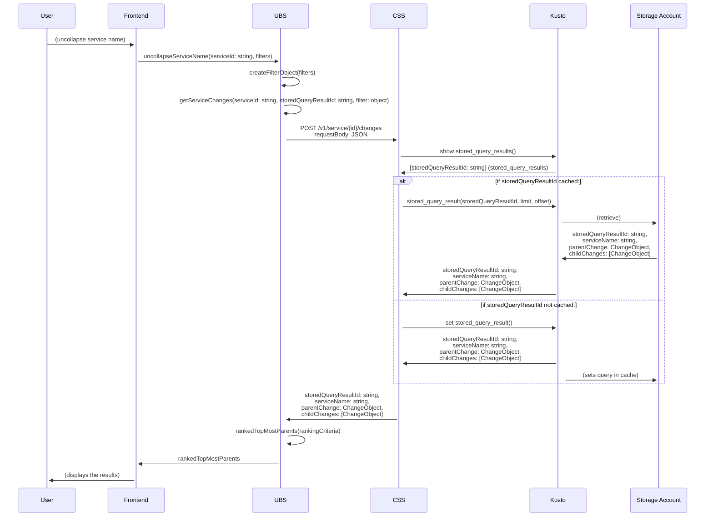
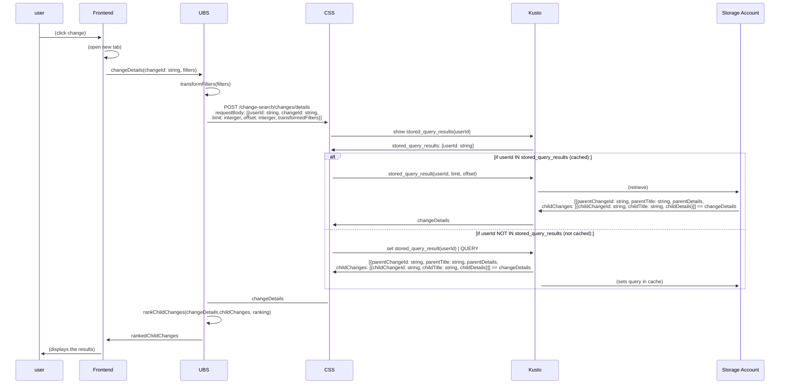

# Change Search Service LLD

## Revision History

|Version|Date|Author|Reviewer|Approver|Comments|
|---|---|---|---|---|---|
|0.1|05/16/2022|andresro@|   |   |Initial Draft|
|   |   |   |   |   |   |

***

## Table of Contents

1. [Introduction](#introduction)
    1. Scope
    2. High Level Design Review
2. [Low Level System Design](#system)
3. API Contracts
4. Testing

## Introduction 

### Scope

The purpose of this document is to define the low level design (LLD) and API contracts for the Change Search Service (CSS hereafter) as described in the high level design (HLD) for [Change Explorer v2](https://microsoft-my.sharepoint.com/:w:/p/abhinavmisra/EXSIlJsYC3pKsG7WciHkcAYBsQSJLZBN4mk_Ee0iG5-NmQ?e=j3VKof). In scope is the CSS component to complete [Milestone 1 (M1) goals](https://microsoft-my.sharepoint.com/:x:/p/naveend/Efr7cba_a5ZGuCL4J_zbBIYBexuxUIsK_gaIV8BqpXa0Rw?e=6sfCyt); none of the other components listed in the HLD will be designed in this document. However, the following two points will be considered:

1. The CSS service interfaces with the UI Backend Services (UBS hereafter). We will conduct rudimentary compatibility requirements with this component for future work. This is because UBS will not be completed in M1 and will directly operate with the frontend service. As such, to complete M1 goals, the frontend will have to temporarily handle some of the logic of UBS (such as ranking). 
2. From (1), we will in addition conduct rudimentary compatibility requirements with the frontend service to ensure that integreation testing and launch of MVP product is ready.
3. For this intial design, we are not consdering the case of grouping by location. We will expand to include location in later milestone goals. The API is designed to not be updated with this change; that is, a `service` is considered a resource abstract from `location`.

### High Level Design

To review, CSS interfaces with the following components:

1. UBS - This is a tightly coupled with the frontend. It's purpose is to transform payload and responses in a manner that is consistent with the frontend. 
2. Azure Data Explorer (Kusto) - Our db where we will find the changes to display.
3. Change Analysis & Recommendation Service (CARS) - Not in scope for MVP product; will likely be replaced by PossibleCauses API.

At a high level, CSS is responsible for executing Kusto queries that are passed from the customer through the frontend. We are primarily going to expose two resources through REST APIs:

1. `service`: An abstraction of a microsoft service. This is not implemented in a db, but is meant to model it as a resource.
2. `change`: An abstract of the change resource from the Kusto db.

## Low Level System Design 

CSS will have three main APIs it will expose to **API Mangement**:

1. **POST** `/v1/service{id}/change_count`
2. **POST** `/v1/service/{id}/changes`
3. **POST** `/v1/change/{id}`

Auth is assumed to be handled at the API management layer.

### Sequence Diagrams

For detailed API contracts, see the API Contracts section. (TODO: Include reference here)

#### **POST** `/v1/service{id}/change_count`

The purpose of this API is to display the count of top most parent changes for a given service. It filters changes further using the `filter` object that is passed through in the *requestBody*. This API will be called multiple times from UBS, as the Service Information Provider (SIP hereafter) will return a list of `serviceIds` to search for before the customer executes the change search functionality of Change Explorer V2. Things to consider:

1. Since no pagination is required, all results will be returned to the frontend as a list of `serviceIds` and counts. As such, ranking should be established by UBS or the frontend service (i.e. dependent services will be shown after target services)
2. There is no need to cache anything. 

#### POST /v1/service/{id}/changes

The purpose of this API is to display the top-most parent changes in a given service based on the search criteria given by the customer. Things to consider:

1. Again, we need to rank the chaanges based on relevancy. The API contract has `time` and `status` as ranking data, but we can add a more sophisticated ranking algorithm as well. In this sequence diagram, it is handled by CSS; again, the alternative is to have it handled by UBS or the frontend. 
2. We will require pagination to display childChanges using the `see more` functionality. Kusto explorer has a built in way of storing query results for fast pagination called [stored query results](https://docs.microsoft.com/en-us/azure/data-explorer/kusto/management/stored-query-results#pagination). We will have to conduct load testing to find the amount of storage space provided by Kusto via the [EngineV3](https://docs.microsoft.com/en-us/azure/data-explorer/engine-v3).

#### POST /change-search/changes/details

The purpose of this API is to display the details of a change and the details of its children in a paginated fashion. 

### Data Design

#### Database

CSS will execute kusto queries on **ChangeMaterializedViews** and **ChangeGroup** tables.

1. **ChangeMaterializedViews**: Provides the latest change information regarding a change event. Establishes the *parent-child* relationshgip between changes. We will utilize the [Change Explorer V2 Schema](https://microsoft.sharepoint.com/:w:/r/teams/WAG/EngSys/ServiceMgmt/ChangeMgmt/Shared%20Documents/Requirements/ChangeSchema_Modified_v21.docx?d=w6cc72dca9a694a68a9b7bbc00968d570&csf=1&web=1).
    - Full schema can be found at https://fcmdata.kusto.windows.net
2. **ChangeGroup**: Groups changes based on group-type (top-most parent, in this case). `groupId` maps to the top most parent; if `groupId` does not exist then it will be considered the top-most parent and utilize its `externalId`.

