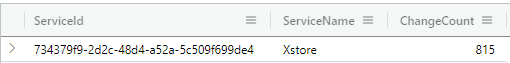
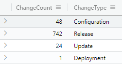
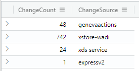
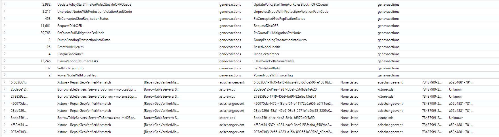
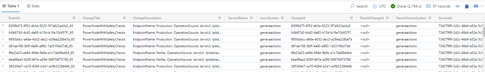

# Geneva Actions

## Background

The current implementation of ChangeSearchService APIs explicitely ommits GenevaActions from search results as they have a different grouping criteria (`HashTitle` as opposed to `TopMostParent`). The key difference here is that:

* `TopMostParent` changes (such as **EV2** or **ADORelease**) follow a hierarchly parent-child relationship (i.e. ChangeA triggers ChangeB triggers ChangeC). We can construct a logical hierarchy from this and display the results to the customers as is the current experience in ChangeExplorerV2.
* `HashTitle` changes (**genevaactions**) do not have this parent-child relationship. They can be considered singletons and currently do not follow a logical grouping.

The aim of this document is to provide a solution for display **GenevaActions** changes to customers.

## Solution

Let's provide a solution at the API level:

### `GetServiceChangeCountsAsync`, `GetChangeTypeCountsAsync`, `GetChangeSourceCountsAsync`

These three APIs are very similar, with the only distinct being that the results they returned are slightly different based on the grouping criteria. 

```sql
let FilteredTimeMaterializedView = materialized_view('ChangeEventMaterializedView', 10m) 
| where StartTime between(ChangeStartTime..ChangeEndTime) 
or EndTime between(ChangeStartTime..ChangeEndTime) 
or ChangeStartTime between(StartTime..EndTime) and EndTime < datetime('9999-01-01') 
or ChangeEndTime between(StartTime..EndTime) and EndTime < datetime('9999-01-01'); 
let AllChangeTypes = FilteredTimeMaterializedView 
| where ServiceTreeGuid in (ServiceId)
and (LocationName in (IncludeLocationIds) or array_length(IncludeLocationIds) == 0) 
and (LocationName !in (ExcludeLocationIds) or array_length(ExcludeLocationIds) == 0) 
and (ActionName !in (ExcludeChangeTypes) or array_length(ExcludeChangeTypes) == 0) 
and (ExternalSourceName !in (ExcludeChangeSources) or array_length(ExcludeChangeSources) == 0) 
| join kind = leftouter(materialized_view('ChangeGroupMaterializedView',10m)) on $left.ExternalId ==$right.ChangeId 
| join kind = leftouter(FilteredTimeMaterializedView) on $left.GroupId == $right.ExternalId 
| extend groupid = case (GroupType == 'TopParent', coalesce(ExternalId1, ExternalId), GroupType == 'HashTitle', Title, isempty(GroupId) == false, GroupId, ExternalId) 
| join kind = leftouter(ChangeExplorer_ServiceTreeServicesMetadata) on $left.ServiceTreeGuid == $right.ServiceId 
where ExternalParentId in ('<null>', 'None Listed');
AllChangeTypes

-----------------------------------------------------------------------------------------------
| summarize ChangeCount = dcount(groupid) by ServiceId=ServiceTreeGuid, ServiceName=ServiceName2
-----------------------------------------------------------------------------------------------
| summarize ChangeCount = dcount(groupid) by ActionName
| project ChangeCount,ChangeType=ActionName
-----------------------------------------------------------------------------------------------
| summarize ChangeCount = dcount(groupid) by ExternalSourceName
| project ChangeCount,ChangeSource=ExternalSourceName
-----------------------------------------------------------------------------------------------
```

Testing this yielded:

* 

* 

* 

### `GetServiceGroupedChangesAsync`

This API works very similar to the ones before, except it has logic to aggregate the results:

```sql
let FilteredTimeMaterializedView = materialized_view('ChangeEventMaterializedView', 10m) 
| where StartTime between(ChangeStartTime..ChangeEndTime) 
or EndTime between(ChangeStartTime..ChangeEndTime) 
or ChangeStartTime between(StartTime..EndTime) and EndTime < datetime('9999-01-01') 
or ChangeEndTime between(StartTime..EndTime) and EndTime < datetime('9999-01-01'); 
let AllChangeTypes = FilteredTimeMaterializedView 
| where ServiceTreeGuid in (ServiceId)
and (LocationName in (IncludeLocationIds) or array_length(IncludeLocationIds) == 0) 
and (LocationName !in (ExcludeLocationIds) or array_length(ExcludeLocationIds) == 0) 
and (ActionName !in (ExcludeChangeTypes) or array_length(ExcludeChangeTypes) == 0) 
and (ExternalSourceName !in (ExcludeChangeSources) or array_length(ExcludeChangeSources) == 0) 
| join kind = leftouter(materialized_view('ChangeGroupMaterializedView',10m)) on $left.ExternalId ==$right.ChangeId 
| join kind = leftouter(FilteredTimeMaterializedView) on $left.GroupId == $right.ExternalId 
| extend groupid = case (GroupType == 'TopParent', coalesce(ExternalId1, ExternalId), GroupType == 'HashTitle', Title, isempty(GroupId) == false, GroupId, ExternalId) 
| join kind = leftouter(ChangeExplorer_ServiceTreeServicesMetadata) on $left.ServiceTreeGuid == $right.ServiceId 
| where ExternalParentId in ('<null>', 'None Listed');
let TopParentGroupedChanges = AllChangeTypes
| where GroupType != 'HashTitle'
| project EventId = strcat(ExternalId, '_', ExternalSource), ChangeTitle = Title, ChangeDescription = Description, ServiceName='', 
SourceSystem = ExternalSourceName, ChangeId = ExternalId, ParentChangeId = ExternalParentId, ParentSourceSystem = ExternalSourceName,
ServiceId = ServiceTreeGuid, Component = ComponentName, PayloadSystem = '', PayloadId = BuildNumber, LocationId = LocationName, 
DeploymentTarget = LocationName, DeploymentTargetType = LocationType, ChangeType = ActionName, ChangeState = Status, StartTime, EndTime, ChangeOwner = '' 
| limit Limit 
| sort by Ranking desc;
let HashTitleGroupedChanges = AllChangeTypes
| where GroupType == 'HashTitle'
| summarize Count = count() by Title
| project EventId = '', Count = Count, ChangeTitle = Title, ChangeDescription = '', ServiceName='', 
SourceSystem = 'genevaactions', ChangeId = Title, ParentChangeId = '', ParentSourceSystem = 'genevaactions',
ServiceId = '', Component = '', PayloadSystem = '', PayloadId = '', LocationId = '', 
DeploymentTarget = '', DeploymentTargetType = '', ChangeType = '', ChangeState = '', StartTime='', EndTime='', ChangeOwner = '' ;
HashTitleGroupedChanges
| union TopParentGroupedChanges
| limit Limit
```

In the above, we are creating two tables; one for **GenevaActions** and one for all other types. We then union these changes together and return the results back to the frontend for display. Below is a sample of the result:



Some considerations:

* I added a `Count` field to the response; this would indicate the number of geneva actions with that title that satisfy the constraints by the customer.
* A lot of the fields are ommited for geneva actions since they can't accurately be consiladated into a single header.
* We can determine in what order we want to display the results to the customer, i.e. if we want geneva actions on top, below, mixed in or some other methodology.

### `GetChangesAsync` 

This would also work very similar as before; the only difference would be the search criteria changing from `ExternalParentId` to `Title`:

```sql
let FilteredTimeMaterializedView = materialized_view('ChangeEventMaterializedView', 10m) 
            | where StartTime between(ChangeStartTime..ChangeEndTime) 
            or EndTime between(ChangeStartTime..ChangeEndTime) 
            or ChangeStartTime between(StartTime..EndTime) and EndTime < datetime('9999-01-01') 
            or ChangeEndTime between(StartTime..EndTime) and EndTime < datetime('9999-01-01'); 
            FilteredTimeMaterializedView 
            | where Title == ChangeTitle 
            and (ComponentName in (ComponentNames) or array_length(ComponentNames) == 0) 
            and (LocationName in (IncludeLocationIds) or array_length(IncludeLocationIds) == 0) 
            and (LocationName !in (ExcludeLocationIds) or array_length(ExcludeLocationIds) == 0) 
            and (ActionName !in (ExcludeChangeTypes) or array_length(ExcludeChangeTypes) == 0) 
            and (ExternalSourceName !in (ExcludeChangeSources) or array_length(ExcludeChangeSources) == 0) 
            | project EventId = strcat(ExternalId, '_', ExternalSource), ChangeTitle = Title, ChangeDescription = Description, ServiceName='', 
            ourceSystem = ExternalSourceName, ChangeId = ExternalId, ParentChangeId = ExternalParentId, ParentSourceSystem = ExternalSourceName, 
            ServiceId = ServiceTreeGuid, Component = ComponentName, PayloadSystem = '', PayloadId = BuildNumber, LocationId = LocationName, 
            DeploymentTarget = LocationName, DeploymentTargetType = LocationType, ChangeType = ActionName, ChangeState = Status, 
            StartTime, EndTime, ChangeOwner = '' 
            | limit Limit 
            | sort by Ranking desc
```

In the previous case of the genevaactions with **PowerNodeWithSafetyChecks**, we had 97 entries; this results in 97 entries being generated:



This would require to modify the API to add an additional field, namely `isGenevaAction` so that we don't waste compute time in the backend determining that (would require a search on Titles in ExternalParentId before executing a search on genevaactions). 