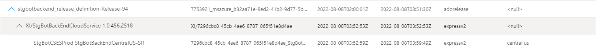
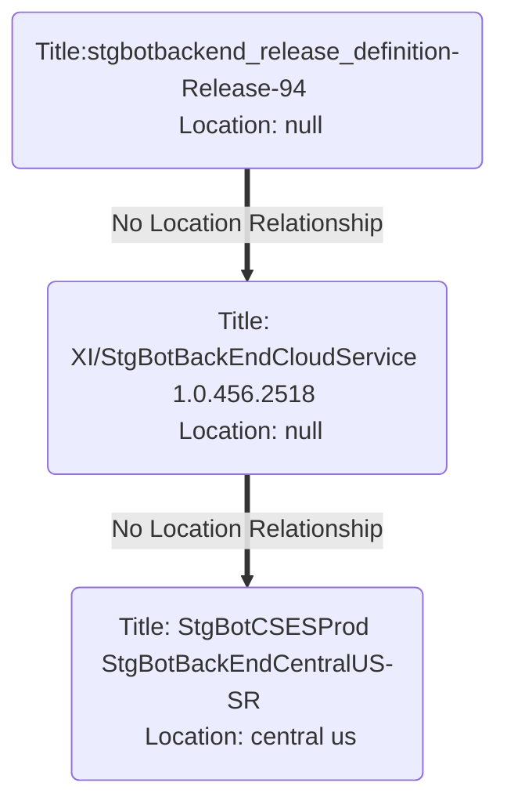
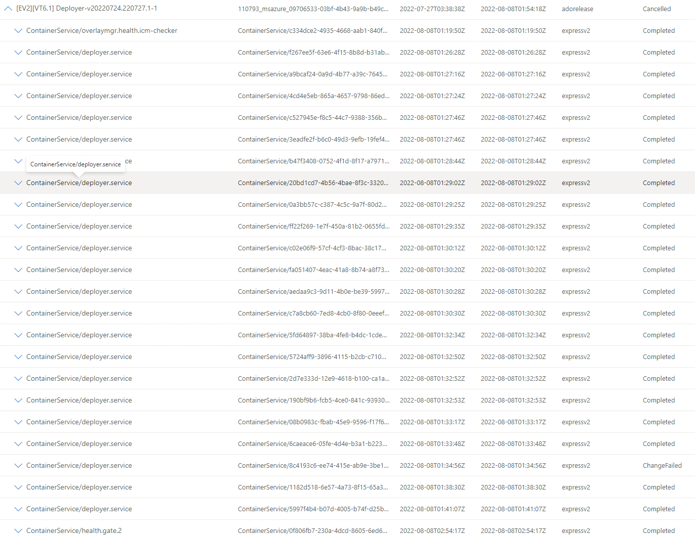
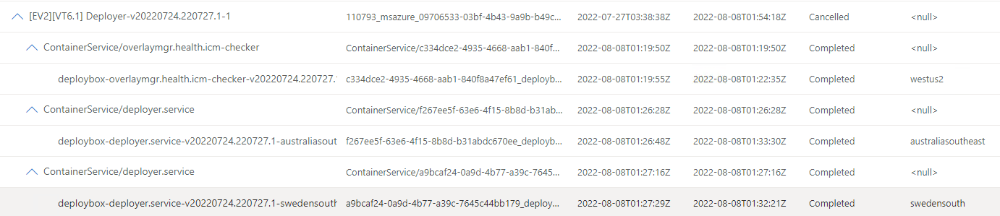
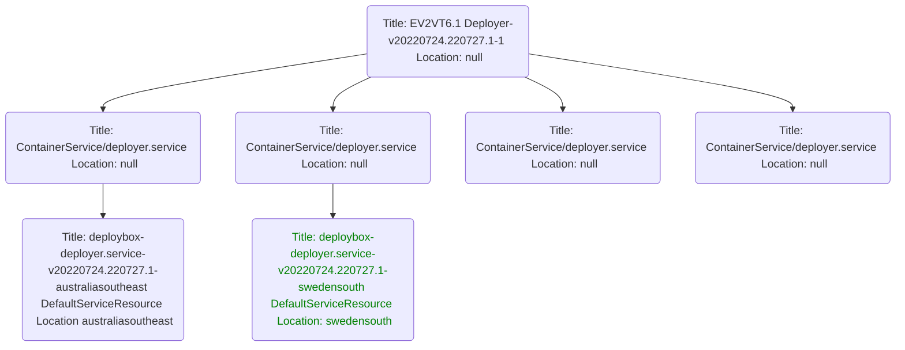
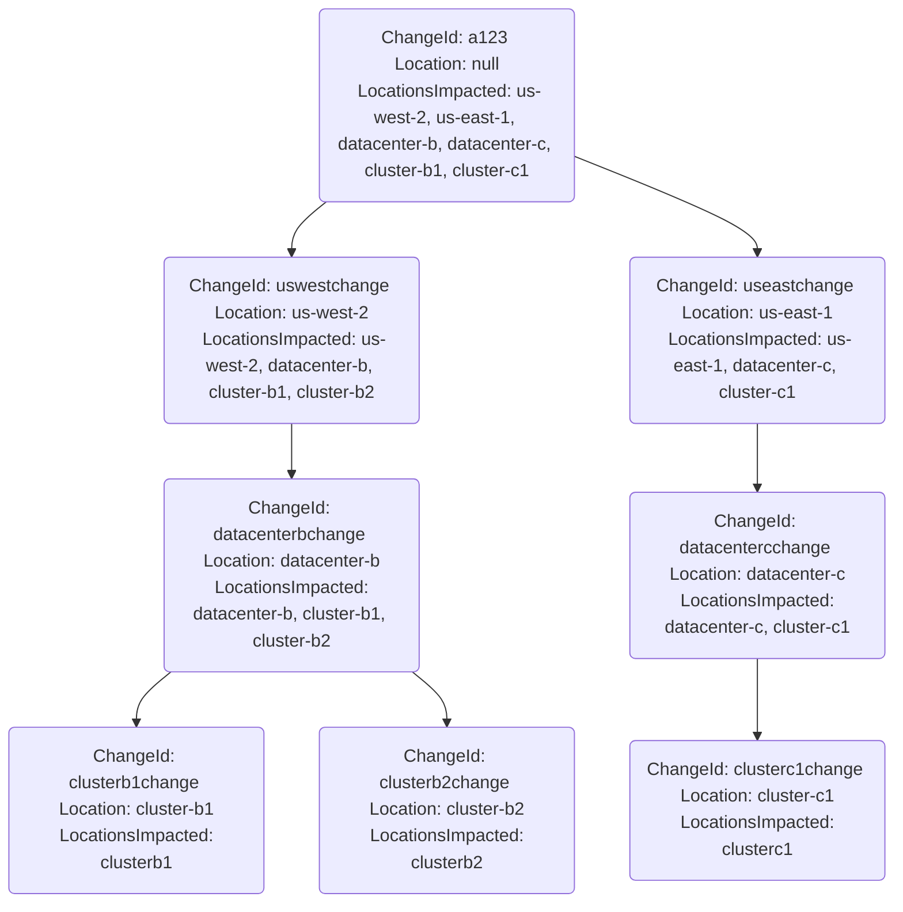

# GetChanges w/ Locations

## Background

**ChangeSearchService**'s function is to provide customers with changes that have been filtered by a set of contrains through the `GetChangesAsync` *POST* or *GET* API. A common scenerio that customers will execute is as follows:

* Customer navigates to the ChangeExplorerV2 portal.
* They select a service by name or **ServiceTreeGuid** in the Service field.
* They select a time range in the Time field.
* They push the **Search** button to invoke `GetServiceChangeCountAsync`, `GetChangeTypeCountAsync` and `GetChangeSourceCountAsync` APIs.
* APIs return additional filter criteria in the filter pane and display the count of top-most parent changes on the right pane grouped by service.
* They expand a service to retrieve the first set of top-most parent changes through the `GetGroupedChangesAsync` API.
* They expand a top-most parent change to view child changes through the *POST* `GetChangesAsync` API.
* They may repeat this action until they have reach the leaf nodes of the parent-child change tree. 

`GetChangesAsync` is a *POST* API who's body contains the following:

```json
{
  "ranking": {
    "time": "asc",
    "status": "completed"
  },
  "componentNames": [
    "string"
  ],
  "includeLocationIds": [
    "string"
  ],
  "excludeLocationIds": [
    "string"
  ],
  "excludeChangeTypes": [
    "code"
  ],
  "excludeChangeSources": [
    "string"
  ],
  "limit": 0,
  "offset": 0,
  "startTime": "2022-08-08T12:37:22.430Z",
  "endTime": "2022-08-08T12:37:22.430Z"
}
```

The initial assumption was that the fields `includeLocationIds` and `excludeLocationIds` would be passed with full location paths into the API call and if ommited would not filter on location. However, this is not the case; **LocationInformationProvider** (LIP) will provide locationIds in the request body but not build the full paths. This means that it is up to CSS to build the logic to handle location filtering. This becomes quite difficult for a number of reasons described below.

## Problems

### Location: \<null\>

Top most parent changes are not guaranteed to have location as part of their data. This means that although a top most parent change is guaranteed to have a child with the correct filtered location (`GetGroupedChangesAsync` will filter based on location then group based on *GroupId*), there is currently no built in location path from parent to child. 

We would have to build the location hierarchy ourselves, but with `<null>` values in the location this would be a difficult task to accomplish. For example, consider the following:



If we pass **central us** as part of the `includeLocationIds`, we will retrieve this top-most parent change but have no way of getting the intermediate change.



This can be solved using backtracking. 

### Backtracking in Fan Out Scenarios 

In the previous example, we had the case where there was a single path from top-most parent to child. The previous problem could be solved with naive graph [backtracking](https://en.wikipedia.org/wiki/Backtracking) and in simple cases this would be sufficient. However, in fan out scenarios this would not be performant.



Suppose we wanted to look for changes just in `swedensouth`; we would have to implement backtracking for all childs at every level to return the filtered list of changes that contain the desired location at every level. 





We could improve on this by caching full paths from root to child change, but this would require changes to the API or data stores that are currently not implemented in the logic of `GetChangesAsync`.

### Complexity of Kusto Queries

The current CSS APIs leverage Kusto to perform all data computations. If we continue to use Kusto to perform the bulk of our computation, we might run into issues with:

* Compute/Storage thresholds throttling requests, resulting in failures.
* Timeouts of long running queries, resulting in dropped requests.
* Latency increases on all `GetChangesAsync` APIs.
* Complex queries with using existing built in functions makes it difficult for developers to know what's going on in the background.

## Solutions


### Naive Backtracking

Since we are already scoped down to a group of changes due to how `GetGroupedChangesAsync` functions, our backtracking algorithm might be sufficient for our purposes. Building graphs and tree structures in Kusto is likely not possible, which would mean we would grab the semi-filtered data through `GetChangesAsync` API and do the processing in the backend to build the result for the customer.

Example:

* Invoke `GetChangesAsync`; get back the list of child changes.
* Invoke `GetLocationHierarchy` for filtered locations; get back location hierarchy.
* Build a tree from this data for location hierarchy.
* Prune the tree of branchs that do not satisfy the location criteria.
* Return only the children of the change invoked with `GetChangesAsync`
* Repeat this process until all changes have been expanded to leaf nodes.

Pros:

* Simple to implement.
* Doesn't require modifications to existing data.

Cons:

* Might not be performant; waste of compute resources if we don't optimize due to redundant calculation.
* Requires a new API, `GetLocationHierarchy` that will be executed concurrently with `GetChangesAsync`. 


### Full Location Path

The existing API uses a list of included and excluded location ids to determine if a change is valid. It might be possible to create a flat location structure as a new column for a given change that is a reflection of all child change locations. Suppose we have the following change tree structure:



Using the above diagram as a reference, we can use a simple list search to determine if a branch of changes has children with applicable changes. For example, if we wanted to find changes in the location `clusterc1`, we would first invoke `GetServiceGroupedChangesAsync` which would return the top-most parent change **a123**. When calling `GetChangesAsync`, we would only return changes that are include `clusterc1` as part of the locations impacted; in this example, we would return the changeId **useastchange**. We would continue down this route until we have satisfied the condition where Location == Location, in which case all changes underneath that change are applicable. In the case of **clusterc1**, if we had cluster spine child change, we would return all of those.

Pros:

* Simple to implement; does not require any API changes.
* Fast, since operation `in` operation for kusto is quick.
* Doesn't require us to offload processing to the backend.

Cons:

* Requires backfilling data.
* Since we're currently not asking customers to provide us with this data, we would have latency on newly generated changes as we would take time to populate this field. This would increase lag times for changes to be properly reflected in the database.
* Might be wasteful of resources if location search is not a very needed feature.

