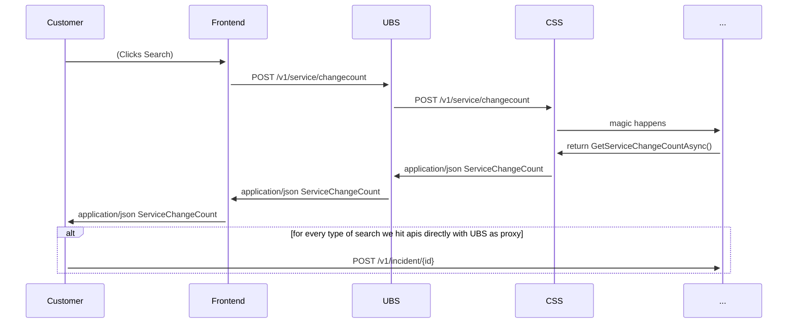
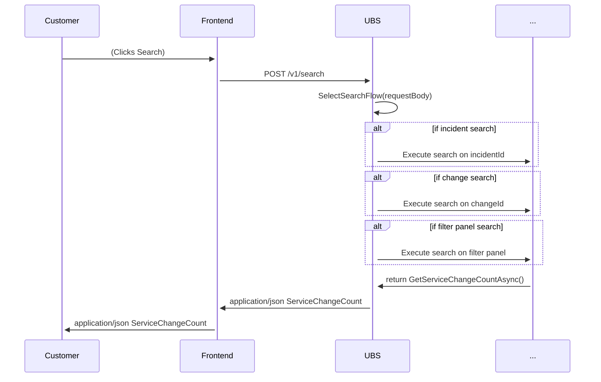

# Incident Information Provider LLD

## Revision History

|Version|Date|Author|Reviewer|Approver|Comments|
|---|---|---|---|---|---|
|0.1|10/12/2022|andresro@|   |   |Initial Draft|
|   |   |   |   |   |   |

***


## Table of Contents

1. [Introduction](#introduction)
    1. Scope
    2. High Level Design Review
2. [Low Level System Design](#system)

## Introduction <a name="introduction"></a>

### Scope

The purpose of this document is to define the low level design (LLD) and API contracts for the Incident Information Provider (IIP hereafter) as described in the high level design (HLD) for [Change Explorer v2](https://microsoft-my.sharepoint.com/:w:/p/abhinavmisra/EXSIlJsYC3pKsG7WciHkcAYBsQSJLZBN4mk_Ee0iG5-NmQ?e=j3VKof). In scope is the IIP component to complete [Milestone 3 (M3) goals](https://microsoft-my.sharepoint.com/:x:/p/naveend/Efr7cba_a5ZGuCL4J_zbBIYBexuxUIsK_gaIV8BqpXa0Rw?e=6sfCyt); none of the other components listed in the HLD will be designed in this document. However, the following two points will be considered:

1. The frontend will interact with the backend via the UI Backend Service (UBS). UBS acts as a proxy service between the front end and back, so some duplicatio of endpoints will be generated and added to this component as part of IIP creation.
2. For testing, we will first treat the IIP component as not having the UBS layer, then introduce the UBS layer for the final end to end workflow.
3. Some modifications to existing APIs will be made. While an attempt to not break existing contracts, this is not guaranteed. Existing contracts can be modified after review with the team.

### High Level Design


To review, IIP interfaces with the following components:

1. UBS - This is a tightly coupled with the frontend. It's purpose is to transform payload and responses in a manner that is consistent with the frontend. This will be modified to account for different client invocations, such as ICM.
2. ICM - We will use ICM APIs to gather parameter data about an incident.
3. LIP(?) - Used to validate location data retrieved from ICM APIs.
4. SIP(?) - Used to retrieve dependent and components for a service returns from ICM API.

At a high level, IIP is responsible for returning the data fields we need to execute the Change Search Service APIs given an ICM Incident. We will support the following use case in IIP:

1. Given an IncidentId, IIP will return
    - The impacted service objects (Services with/without components).
    - Incident start time.
    - Incident end time.

> **What about the other filters in CSS APIs?** At this time we will not support `ExcludeChangeSources`, `ExcludeLocationIds`, `ExcludeChangeTypes`, `Select Only`, etc., because ICM does not provide a way for us to retrieve these types of fields. We will only support the above three parameters.

Given the response, a user will then be able to utilize these parameters to search for changes related to the incident. There are two primary use cases customers will likely execute:

1. From ICM, they want to navigate to the new change explorer from an incident page. Given that, we need to pass over the context of the ICM incident into ChangeExplorer given the URL link, i.e. when I click the ChangeExplorerV2 link from ICM I should carry over the IncidentId.
2. From ChangeExplorer, Customers will input the IncidentId into our filter panel. We will then use IIP to parametrize fields for CSS APIs and return changes.

> - **Should we execute a search on ICM context switch or just input the information into the field for execution via clicking the `Search` Button?**
> - **Should we fill in the filter panel information with the return of IIP for manual modification by the user?**

## Low Level System Design <a name="system"></a>

### Infrastructure

IIP will be built using Isolated Azure functions on premium plans as the our other microservices like SIP, CSS, and LIP. IIP is REST-based and is HTTP triggered. We will achieve high availability through deployment in two Azure regions (`East US` and `West Us`). It will be exposed publicly through an APIM layer with already built auth mechanisms (token based). The APIM layer is configured with an Azure Front Door service that is already built. 

The repo for the project will be our [ChangeExplorerV2 Backend repo](https://msazure.visualstudio.com/One/_git/FCM-ChangeExplorer-Backend). ARM templates will be created for deployment into `INT`, `PPE` and `PROD` subscriptions. Code resources will be built using ADO pipelines in the same vein as other components. A release pipeline will be created to deploy the changes automatically. 

> **Should we use Bicep instead of ARM templates for IIP?**


IIP will have the following API endpoint exposed for usage:

1. **GET** `/v1/incident/{id}`

For detailed API contracts, see the API in [FCM Change Explorer V2 API](https://eng.ms/docs/cloud-ai-platform/azure-core/one-fleet-platform/one-fleet-platform-timmall/federated-change-management/fcm-openapi-docs)


#### **GET** `/v1/incident/{id}`

The purpose of this API is to parametrize fields from an Incident to be used in CSS APIs. The following is the code flow of IIP only: 

```mermaid
sequenceDiagram
    UBS->>+APIM: HTTP GET /v1/incident/IncidentId
    APIM->>+IIP: await getParametersByIncidentIdAsync(IncidentId)
    IIP->>+IIP: await getIcmFieldsAsync(IncidentId)
    IIP->>ICM: await GetIncidentServicesAndTimeRangeAsync(IncidentId)
    alt incident doesn't exist
        ICM->>+IIP: throws IncidentDoesNotExistException
    end
    ICM->>IIP: services: [serviceTreeeGuids]<br/>startTime:datetime<br/>endtime:datetime
    IIP->>+ICM: await GetIncidentLocationsAsync(IncidentId)
    ICM->>+IIP: includeLocatonIds: [locationIds]
    IIP->>+IIP: await ValidateLocationIdsAsync(includeLocationIds)
    IIP->>+LIP: HTTP GET /v1/locations/{id}
    LIP->>+IIP: locationDetails: [application/json LocationDetails]
    IIP->>+IIP: BuildIncidentParameters(startTime, endtime, services, locationDetails)
     alt no service and no valid locations
        LIP->>+IIP: throws NoContentError
    end
    IIP->>+APIM: status: 200<br/>IncidentId:<incidentId><br/>IncidentTitle:<incidenttitle><br/>parameters:<br/>startTime:<startTime><br/>endTime:<endTime><br/>services:[serviceTreeIds]<br/>includeLocationIds:[includeLocationIds]<br/>
    APIM->>+UBS: status: 200<br/>statusIncidentId:<incidentId><br/>IncidentTitle:<incidenttitle><br/>parameters:<br/>startTime:<startTime><br/>endTime:<endTime><br/>services:[serviceTreeIds]<br/>includeLocationIds:[includeLocationIds]<br/>

    alt on incident does not exist exception
        IIP->>+APIM: status: 400<br/> message: BadRequestError
        APIM->>+UBS: status: 400<br/> message: BadRequestError
    end
    alt on failed to resolve service and location fields
        IIP->>+APIM: status: 204<br/> message: NoContent.
        APIM->>+UBS: status: 204<br/> message: NoContent.           
```

#### **Additional APIs Under Consideration**

##### **POST** `/v1/search` in UBS

It might be beneficial to have a generic api for the front end to execute the `Search` functionality. We currently offer only one method of searching for changes (filter panel), but with IIP and later ChangeId search a generic endpoint would be beneficial. Consider the following:



In the above scenario, we haven't leveraged UBS yet to do the heavy lifting in the backend. I propose a new API endpoint that will do that lifting for us.



In this case, we can leverage UBS to handle the logic of figuring out what type of search we will execute rather than having the front end do that. 


##### **GET/POST** `/v1/location/{id?}` in LIP

The LocationDetails API only accepts a single location. In the case of IIP, we might have several locations as part of the response that we will have to validate. In this case, we would make multple calls to LIP that are unnecesary. 

I propose either exposing a new endpoint that accepts a list of `locationids` to validate or modifying the existing endpoint to validate a list of `locationids`. If it's a list, we would change the request type to POST, although this might not be needed if we can ensure that the amount of locations searched is small enough that they will fit in a GET request's query parameters.

Additionally, for fast location validation we might need to cache the results of LIP's location details instead of waiting for them to be pulled up in Kusto. We will need to consider the time cost of executing LIP APIs to our overall Search latency. Another alternative solution is to query kusto directly to validate instead of LIP.

#### **Other Considerations**

>- **Should we include changes that are linked to an ICM as part of our search results**? If changes are linked to an incident, should we display them in ChangeExplorer regardless if they meet the filter criteria defined by IIP API? I think we should, but open to discussion.
>- **Should we populate the filter criteria in the filter panel based on the results of IIP?** This would allow customers to configure the settings (say, extend the range to 24 hours) of a given incident. I think we should.


