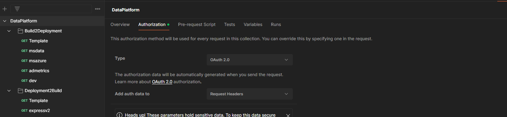
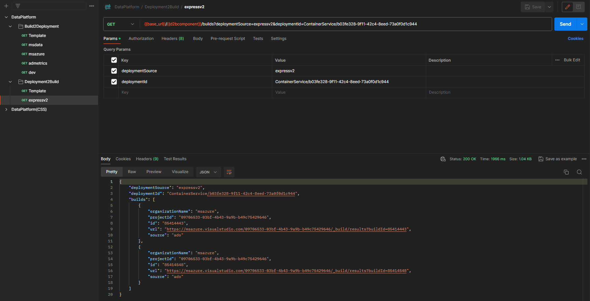

# Build2Deployment & Deployment2Build 


## Postman

[Postman](https://www.postman.com/) is a great tool to test out endpoints. Please use the following to get started:

### Download the Postman Collection and Environment Variable Files

Download the files from sharepoint here: [b2d_d2b_postman_files.zip](https://microsoft.sharepoint.com/:u:/t/FCM/EeKQuYNbgA1Hh_nCelI2CKgBXk5ROZtBqbBUXa1oDU0FrQ?e=6rntXY). If you're having trouble download, you can copy and paste the files below into your local development environment:

**DataPlatform.postman_collection.json**
<details>

```json
{
	"info": {
		"_postman_id": "f3990ab0-9326-4d43-b458-ca0d04b8ca8a",
		"name": "DataPlatform",
		"schema": "https://schema.getpostman.com/json/collection/v2.1.0/collection.json"
	},
	"item": [
		{
			"name": "Build2Deployment",
			"item": [
				{
					"name": "Template",
					"request": {
						"method": "GET",
						"header": [],
						"url": {
							"raw": "{{base_url}}/{{b2dcomponent}}/deployments?adoOrganizationName=&adoProjectId=&adoBuildId=",
							"host": [
								"{{base_url}}"
							],
							"path": [
								"{{b2dcomponent}}",
								"deployments"
							],
							"query": [
								{
									"key": "adoOrganizationName",
									"value": ""
								},
								{
									"key": "adoProjectId",
									"value": ""
								},
								{
									"key": "adoBuildId",
									"value": ""
								}
							]
						}
					},
					"response": []
				},
				{
					"name": "msdata",
					"request": {
						"method": "GET",
						"header": [],
						"url": {
							"raw": "{{base_url}}/{{b2dcomponent}}/deployments?adoOrganizationName=msdata&adoProjectId=ba574a88-a171-48e0-8fcb-5fef6d23739c&adoBuildId=115856310",
							"host": [
								"{{base_url}}"
							],
							"path": [
								"{{b2dcomponent}}",
								"deployments"
							],
							"query": [
								{
									"key": "adoOrganizationName",
									"value": "msdata"
								},
								{
									"key": "adoProjectId",
									"value": "ba574a88-a171-48e0-8fcb-5fef6d23739c"
								},
								{
									"key": "adoBuildId",
									"value": "115856310"
								}
							]
						}
					},
					"response": []
				},
				{
					"name": "msazure",
					"request": {
						"method": "GET",
						"header": [],
						"url": {
							"raw": "{{base_url}}/{{b2dcomponent}}/deployments?adoOrganizationName=msazure&adoProjectId=09706533-03bf-4b43-9a9b-b49c75429646&adoBuildId=85471733",
							"host": [
								"{{base_url}}"
							],
							"path": [
								"{{b2dcomponent}}",
								"deployments"
							],
							"query": [
								{
									"key": "adoOrganizationName",
									"value": "msazure"
								},
								{
									"key": "adoProjectId",
									"value": "09706533-03bf-4b43-9a9b-b49c75429646"
								},
								{
									"key": "adoBuildId",
									"value": "85471733"
								}
							]
						}
					},
					"response": []
				},
				{
					"name": "admetrics",
					"request": {
						"method": "GET",
						"header": [],
						"url": {
							"raw": "{{base_url}}/{{b2dcomponent}}/deployments?adoOrganizationName=admetrics&adoProjectId=c6f597f2-902e-47df-9dbd-f5ee1ac627f2&adoBuildId=69514",
							"host": [
								"{{base_url}}"
							],
							"path": [
								"{{b2dcomponent}}",
								"deployments"
							],
							"query": [
								{
									"key": "adoOrganizationName",
									"value": "admetrics"
								},
								{
									"key": "adoProjectId",
									"value": "c6f597f2-902e-47df-9dbd-f5ee1ac627f2"
								},
								{
									"key": "adoBuildId",
									"value": "69514"
								}
							]
						}
					},
					"response": []
				},
				{
					"name": "dev",
					"request": {
						"method": "GET",
						"header": [],
						"url": {
							"raw": "{{base_url}}/{{b2dcomponent}}/deployments?adoOrganizationName=dev&adoProjectId=505e0832-097c-4d90-947b-777124cc8911&adoBuildId=1531543",
							"host": [
								"{{base_url}}"
							],
							"path": [
								"{{b2dcomponent}}",
								"deployments"
							],
							"query": [
								{
									"key": "adoOrganizationName",
									"value": "dev"
								},
								{
									"key": "adoProjectId",
									"value": "505e0832-097c-4d90-947b-777124cc8911"
								},
								{
									"key": "adoBuildId",
									"value": "1531543"
								}
							]
						}
					},
					"response": []
				}
			]
		},
		{
			"name": "Deployment2Build",
			"item": [
				{
					"name": "Template",
					"request": {
						"method": "GET",
						"header": [],
						"url": {
							"raw": "{{base_url}}/{{d2bcomponent}}/builds?deploymentSource=&deploymentId=",
							"host": [
								"{{base_url}}"
							],
							"path": [
								"{{d2bcomponent}}",
								"builds"
							],
							"query": [
								{
									"key": "deploymentSource",
									"value": ""
								},
								{
									"key": "deploymentId",
									"value": ""
								}
							]
						}
					},
					"response": []
				},
				{
					"name": "expressv2",
					"request": {
						"method": "GET",
						"header": [],
						"url": {
							"raw": "{{base_url}}/{{d2bcomponent}}/builds?deploymentSource=expressv2&deploymentId=ContainerService/b03fe328-9f11-42c4-8eed-73a0f0d1c944",
							"host": [
								"{{base_url}}"
							],
							"path": [
								"{{d2bcomponent}}",
								"builds"
							],
							"query": [
								{
									"key": "deploymentSource",
									"value": "expressv2"
								},
								{
									"key": "deploymentId",
									"value": "ContainerService/b03fe328-9f11-42c4-8eed-73a0f0d1c944"
								}
							]
						}
					},
					"response": []
				}
			]
		}
	],
	"auth": {
		"type": "oauth2",
		"oauth2": [
			{
				"key": "tokenName",
				"value": "Authorization",
				"type": "string"
			},
			{
				"key": "authUrl",
				"value": "https://login.microsoftonline.com/72f988bf-86f1-41af-91ab-2d7cd011db47/oauth2/v2.0/authorize",
				"type": "string"
			},
			{
				"key": "state",
				"value": "12345",
				"type": "string"
			},
			{
				"key": "scope",
				"value": "{{scope}}",
				"type": "string"
			},
			{
				"key": "clientId",
				"value": "{{client_id}}",
				"type": "string"
			},
			{
				"key": "grant_type",
				"value": "implicit",
				"type": "string"
			},
			{
				"key": "useBrowser",
				"value": true,
				"type": "boolean"
			},
			{
				"key": "addTokenTo",
				"value": "header",
				"type": "string"
			}
		]
	},
	"event": [
		{
			"listen": "prerequest",
			"script": {
				"type": "text/javascript",
				"exec": [
					""
				]
			}
		},
		{
			"listen": "test",
			"script": {
				"type": "text/javascript",
				"exec": [
					""
				]
			}
		}
	]
}
```
</details>

**dp-int.postman_environment.json**
<details>

```json
{
	"id": "8b24a332-ad22-4c7f-b196-68faa115e021",
	"name": "dp-int",
	"values": [
		{
			"key": "client_id",
			"value": "c1d07c27-2bf7-4da7-9946-278a86014ae2",
			"type": "default",
			"enabled": true
		},
		{
			"key": "scope",
			"value": "api://b565c703-fa73-48d1-92cf-a002721abe2e/user_impersonation",
			"type": "default",
			"enabled": true
		},
		{
			"key": "base_url",
			"value": "afd-dataplatform-int-apegeggveef0apbq.z01.azurefd.net",
			"type": "default",
			"enabled": true
		},
		{
			"key": "b2dcomponent",
			"value": "b2d",
			"type": "default",
			"enabled": true
		},
		{
			"key": "d2bcomponent",
			"value": "d2b",
			"type": "default",
			"enabled": true
		}
	],
	"_postman_variable_scope": "environment",
	"_postman_exported_at": "2024-01-19T16:00:09.561Z",
	"_postman_exported_using": "Postman/9.31.30"
}
```
</details>

For detailed instructions on importing data, see [import data on postman](https://learning.postman.com/docs/getting-started/importing-and-exporting/importing-data/). To execute a request, first retrieve a token using postman's authorization via browser:



You will utilize the browser to authenticate to `@microsoft.com`; it should trigger a callback automatically to postman. Once that is finished, select the example for `expressv2` or construct your own request with the template function and provided values.



## S2S with AAD

To integrate with a S2S call, use the following example as a guide (note that some fields were ommited for security reasons)

```python
from adal import AuthenticationContext
import requests

authority = 'https://login.microsoftonline.com/'
tenant = '72f988bf-86f1-41af-91ab-2d7cd011db47' # msft tenant
client_id = '' # app id of your service
client_secret = '' # secret; can use other auth methods (like cert) as  well
resource = 'api://b565c703-fa73-48d1-92cf-a002721abe2e' # scope 

d2b_api_endpoint = 'http://afd-dataplatform-int-apegeggveef0apbq.z01.azurefd.net/d2b/builds'
deploymentId = 'ContainerService/b03fe328-9f11-42c4-8eed-73a0f0d1c944'
deploymentSource = 'expressv2'

auth_context = AuthenticationContext(authority + tenant)

token = auth_context.acquire_token_with_client_credentials(resource=resource, client_id=client_id, client_secret=client_secret)

params = {
    'deploymentId': deploymentId,
    'deploymentSource': deploymentSource,
}

headers = {
    'Authorization': 'Bearer ' + token['accessToken']
}

request = requests.get(d2b_api_endpoint, params=params, headers=headers)

print(request.text)
```