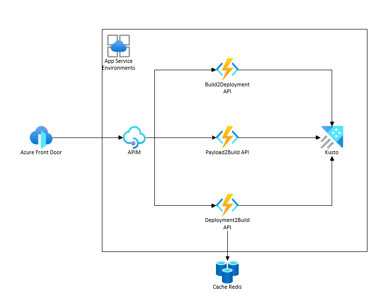
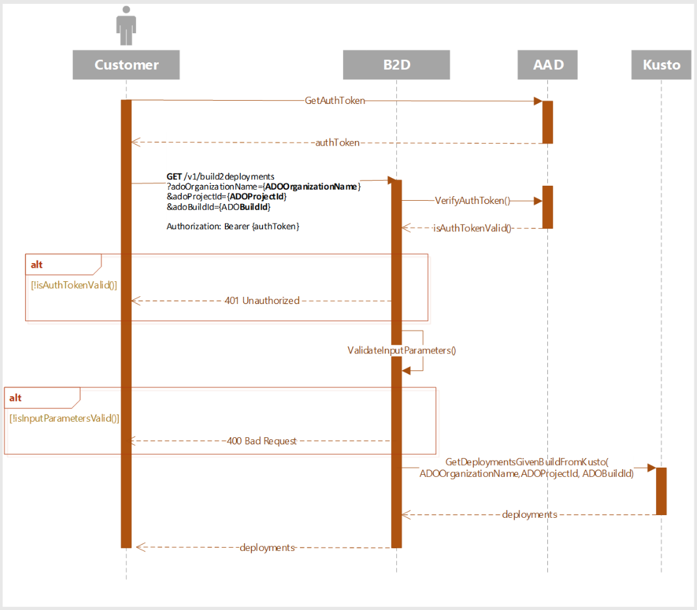
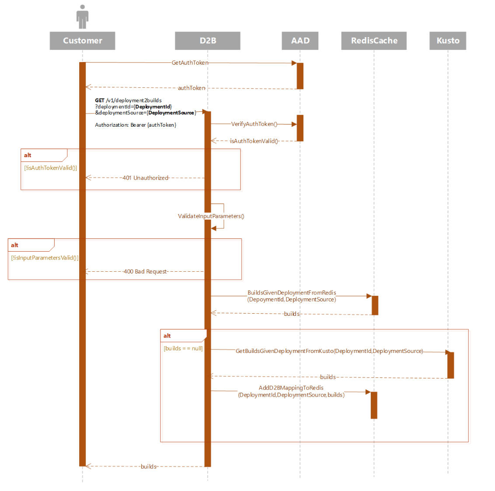
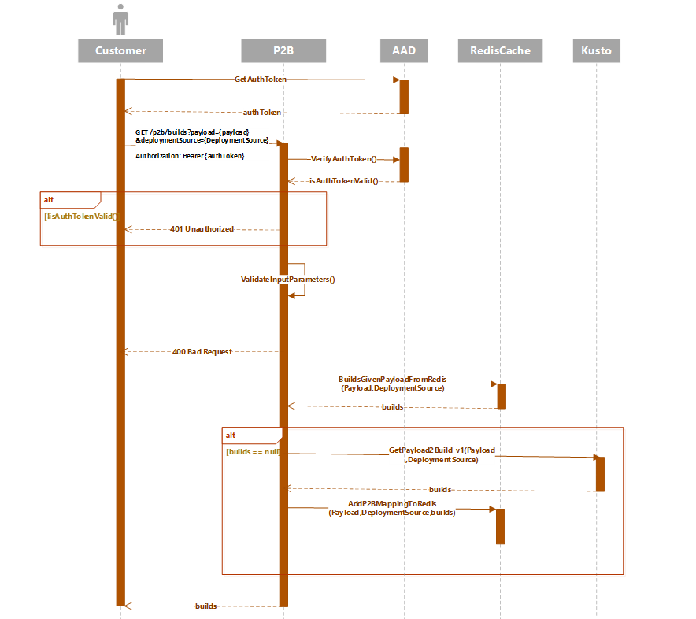

# Build2Deployment, Payload2Build and Deployment2Build APIs Design Document 


| Owner(s)     | Status                   | Approvers | Last Updated |
|--------------|--------------------------|-----------|--------------|
| ontuna, andresro | WIP, **Review**, Approved, Obsolete | -         | 2024-01-05   |


## Summary & Objective

This document proposes the high-level design architecture and also the low-level design for Build2Deployment and Deployment2Build APIs.

Our primary goal is to build functionality which will allow us to give a Azure DevOps (ADO) build provide all the deployment information across different orchestrators, AzDeployer, Pilotfish, ExpressV2 (currently in scope) and vice versa, given a deployment Id and deployment system, we will provide ADO build details. This document presents the API Contracts for the two APIs that FCM Team will implement, Build2Deployment, Payload2Build and Deployment2Build APIs:

- **Build2Deployment(B2D)**: Given an Azure DevOps (ADO) build, namely Azure DevOps Organization Name, Azure DevOps Project ID and AzureDevOps BuildId, return in response a list of all deployment across all deployment systems (AzDeployer, Pilotfish, ExpressV2).  
- **Deployment2Build(D2B)**:  Given a deploymentId and a deployment source, return the list of Azure DevOps (ADO) builds which have been deployed with this deployment.
- **Payload2Build(D2B)**:  Given a payload and a deployment source, return the list of Azure DevOps (ADO) builds.    

## SLAs


| Name         | SLA           | Notes |
|--------------|---------------|-------|
| Availability | **99.89%**        | We arrive at our stated SLA based on: Kusto availability is 99.9%, Individual function apps have 99.95% availability, Multi region redundancy where n>=2 and assume that Azure Frontdoor is able to load balance appropriately, 5 minute interval calculation |
| Latency      | **<1000 milliseconds** | This is work in progress. Realistically, Deployment2Build is on the lower bound due to caching whereas Build2Deployment is on the higher bound. Will require performance testing. |
| TPS          | **200 requests/sec** | Assumes minimum warm pool of instances for burst traffic at max TPS. |

## Requirements

The technical requirements are: 

- Each API must be highly available and horizontally scalable. 
- Every component must have its own test base, health monitors & alarms. The health monitors and alarms must be generated via code. 
- APIs must be deployable in automated fashion meeting coding, deployment, monitoring and security best practices. 
- Infrastructure management must be standardized and source controlled across components. 
- All APIs must be compliant with Azure policies (see Azure Compliance section). 
- All APIs must have integration and load tests for INT, PPE and PROD environments. 
- APIs must be versioned and backwards compatible. API override is not supported. 
- Design docs and TSGs will be onboarded to Engineering Hub.


## High Level Design Architecture




## API Design

### Build2Deployment (B2d) API

#### Sequence Diagram



#### Parameters

##### Input

| Name               | Data type           |  Parameter Type | Description                                         | Required |
|--------------------|---------------------|--------------|---------------------------------------|----------|
| **ADOOrganizationName**| String              | query param | Azure DevOps organization for which the build belongs to | Yes      |
| **ADOProjectId**       | String (Guid)       | query param |Azure Devops Project Id for which the build belongs to | Yes      |
| **ADOBuildId**         | Whole positive number | query param | Id of the build that is being deployed | Yes      |

##### Output


| Name                      | Data type           | Description                                         | Required |
|---------------------------|---------------------|-----------------------------------------------------|----------|
| **ADOOrganizationName**       | String              | Same as input param                                 | Yes      |
| **ADOProjectId**              | String (Guid)       | Same as input param                                 | Yes      |
| **ADOBuildId**                | Whole positive number | Same as input param                                | Yes      |
| **Deployments**               | List<Deployment>    | List of deployments associated with the request     | Yes      |
| **Deployment.Id**             | string              | Unique identifier for a deployment                  | Yes      |
| **Deployment.StartTime**      | datetime            | Time at which the deployment began                  | Yes      |
| **Deployment.EndTime**        | datetime            | Time at which the deployment ended                  | Yes      |
| **Deployment.DeploymentUrl**  | string              | Url link to the deployment from the orchestrator    | Yes      |
| **Deployment.Source**         | String (enum)       | One of “expressv2”, “azdeployer”, or “pilotfish”    | Yes      |
| **Deployment.ChangeOwner**    | string              | Name of the owner for the deployment                | Yes      |
| **Depeloyment.ChangeOwnerType** | string            | Type of owner                                       | Yes      |
| **Deployment.Payloads**       | List<Payload>       | -                                                   | Yes      |
| **Payload.Id**                | string              | Id of the payload that is being deployed            | Yes      |
| **Payload.ProgressionLink**   | string              | Deeplink to OneDeployFCM dashboard payload view     | Yes      |
| **Deployment.Metadata**       | String (dynamic)    | Additional data specific to the deployment mechanism that is not shared across all deployment sources (I.e. VE) | No       |
| **Deployment.LastUpdateTime** | datetime            | Last time the deployment data was updated           | -        |
 
Response Body: 
```json
{
    "ADOOrganizationName": "string",
    "ADOProjectId": "string",
    "ADOBuildId": "int",
    "Deployments": [
        {
            "Id": "string",
            "StartTime": "datetime",
            "EndTime": "datetime",
            "DeploymentUrl": "string",
            "Source": "string",
            "ChangeOwner": "string",
            "ChangeOwnerType": "string",
            "ChangeState": "string",
            "Payloads": [
                {
                    "Id": "string",
                    "ProgressionLink": "string"
                }
            ],
            "LastUpdateTime": "datetime",
            "Metadata": "string"
        }
    ]
}
```

#### Example cURL 

```curl``` -X **GET** https://api.dp.fcm.msftcloudes.com/b2d/build2deployments?adoOrganizationName={```msazure```}&adoProjectId={```b32aa71e-8ed2-41b2-9d77-5bc261222004```}&adoBuildId={```85084651```} ➡️ 


Result:

<details>

```json
{
	"AdoOrganizationName": "msazure",
	"AdoProjectId": "b32aa71e-8ed2-41b2-9d77-5bc261222004",
	"AdoBuildId": "85084651",
	"Deployments": [
		{
			"DeploymentId": "6afbe798-8617-4097-8fc4-dabf6d3b6b73",
			"DeploymentUrl": "https://ev2portal.azure.net/#/Rollout/ContainerApps/6afbe798-8617-4097-8fc4-dabf6d3b6b73?RolloutInfra=Prod",
			"StartTime": "2024-01-02T07:17:51.0000000Z",
			"EndTime": "2024-01-02T07:17:51.0000000Z",
			"LastUpdatedTime": "2024-01-02T07:44:36.7159282Z",
			"ChangeState": "failed",
			"Source": "expressv2",
			"ChangeOwner": "df36aee8-c644-400b-a0ab-fd0f1191211d",
			"ChangeOwnerType": "ServiceId",
			"Payloads": {
				"PayloadId": "1.2.1450.0",
				"PayloadFcmProgressionLink": "https://dataexplorer.azure.com/dashboards/d0357802-00ae-48c7-85a2-5cf02d98de77?p-_entityType=all&p-_payload=1.2.1450.0#84c6c83e-687d-44a3-a599-110f700efce7"
			}
		},
		{
			"DeploymentId": "b27ae913-1f19-4df8-8153-514af777e2f5",
			"DeploymentUrl": "https://ev2portal.azure.net/#/Rollout/ContainerApps/b27ae913-1f19-4df8-8153-514af777e2f5?RolloutInfra=Prod",
			"StartTime": "2024-01-02T06:33:41.0000000Z",
			"EndTime": "2024-01-02T06:33:41.0000000Z",
			"LastUpdatedTime": "2024-01-02T07:09:36.7119570Z",
			"ChangeState": "failed",
			"Source": "expressv2",
			"ChangeOwner": "df36aee8-c644-400b-a0ab-fd0f1191211d",
			"ChangeOwnerType": "ServiceId",
			"Payloads": {
				"PayloadId": "1.2.1450.0",
				"PayloadFcmProgressionLink": "https://dataexplorer.azure.com/dashboards/d0357802-00ae-48c7-85a2-5cf02d98de77?p-_entityType=all&p-_payload=1.2.1450.0#84c6c83e-687d-44a3-a599-110f700efce7"
			}
		},
		{
			"DeploymentId": "8527bbf1-6c36-4edf-bd2b-2e9fc7c1f28b",
			"DeploymentUrl": "https://ev2portal.azure.net/#/Rollout/ContainerApps/8527bbf1-6c36-4edf-bd2b-2e9fc7c1f28b?RolloutInfra=Prod",
			"StartTime": "2024-01-02T08:45:11.0000000Z",
			"EndTime": "2024-01-02T08:45:11.0000000Z",
			"LastUpdatedTime": "2024-01-02T09:09:36.8373008Z",
			"ChangeState": "failed",
			"Source": "expressv2",
			"ChangeOwner": "df36aee8-c644-400b-a0ab-fd0f1191211d",
			"ChangeOwnerType": "ServiceId",
			"Payloads": {
				"PayloadId": "1.2.1450.0",
				"PayloadFcmProgressionLink": "https://dataexplorer.azure.com/dashboards/d0357802-00ae-48c7-85a2-5cf02d98de77?p-_entityType=all&p-_payload=1.2.1450.0#84c6c83e-687d-44a3-a599-110f700efce7"
			}
		},
		{
			"DeploymentId": "f943b37f-d159-47b9-b5c7-10a94fe7921b",
			"DeploymentUrl": "https://ev2portal.azure.net/#/Rollout/ContainerApps/f943b37f-d159-47b9-b5c7-10a94fe7921b?RolloutInfra=Prod",
			"StartTime": "2024-01-02T08:19:08.0000000Z",
			"EndTime": "2024-01-02T08:19:08.0000000Z",
			"LastUpdatedTime": "2024-01-02T08:49:36.7187915Z",
			"ChangeState": "failed",
			"Source": "expressv2",
			"ChangeOwner": "df36aee8-c644-400b-a0ab-fd0f1191211d",
			"ChangeOwnerType": "ServiceId",
			"Payloads": {
				"PayloadId": "1.2.1450.0",
				"PayloadFcmProgressionLink": "https://dataexplorer.azure.com/dashboards/d0357802-00ae-48c7-85a2-5cf02d98de77?p-_entityType=all&p-_payload=1.2.1450.0#84c6c83e-687d-44a3-a599-110f700efce7"
			}
		},
		{
			"DeploymentId": "820c6d27-d5a5-484e-869c-2e901b906a80",
			"DeploymentUrl": "https://ev2portal.azure.net/#/Rollout/ContainerApps/820c6d27-d5a5-484e-869c-2e901b906a80?RolloutInfra=Prod",
			"StartTime": "2024-01-02T07:50:26.0000000Z",
			"EndTime": "2024-01-02T07:50:26.0000000Z",
			"LastUpdatedTime": "2024-01-02T08:14:36.7361635Z",
			"ChangeState": "failed",
			"Source": "expressv2",
			"ChangeOwner": "df36aee8-c644-400b-a0ab-fd0f1191211d",
			"ChangeOwnerType": "ServiceId",
			"Payloads": {
				"PayloadId": "1.2.1450.0",
				"PayloadFcmProgressionLink": "https://dataexplorer.azure.com/dashboards/d0357802-00ae-48c7-85a2-5cf02d98de77?p-_entityType=all&p-_payload=1.2.1450.0#84c6c83e-687d-44a3-a599-110f700efce7"
			}
		},
		{
			"DeploymentId": "0220d503-93eb-4d5a-8ebd-5f45dbda5d75",
			"DeploymentUrl": "https://ev2portal.azure.net/#/Rollout/ContainerApps/0220d503-93eb-4d5a-8ebd-5f45dbda5d75?RolloutInfra=Prod",
			"StartTime": "2024-01-02T13:29:45.0000000Z",
			"EndTime": "2024-01-02T13:29:45.0000000Z",
			"LastUpdatedTime": "2024-01-02T14:09:36.7245944Z",
			"ChangeState": "completed",
			"Source": "expressv2",
			"ChangeOwner": "df36aee8-c644-400b-a0ab-fd0f1191211d",
			"ChangeOwnerType": "ServiceId",
			"Payloads": {
				"PayloadId": "1.2.1450.0",
				"PayloadFcmProgressionLink": "https://dataexplorer.azure.com/dashboards/d0357802-00ae-48c7-85a2-5cf02d98de77?p-_entityType=all&p-_payload=1.2.1450.0#84c6c83e-687d-44a3-a599-110f700efce7"
			}
		},
		{
			"DeploymentId": "0930d4da-4944-469a-a0a8-8d57f93ce68a",
			"DeploymentUrl": "https://ev2portal.azure.net/#/Rollout/ContainerApps/0930d4da-4944-469a-a0a8-8d57f93ce68a?RolloutInfra=Prod",
			"StartTime": "2024-01-02T11:46:56.0000000Z",
			"EndTime": "2024-01-02T11:46:56.0000000Z",
			"LastUpdatedTime": "2024-01-02T12:29:36.7158383Z",
			"ChangeState": "failed",
			"Source": "expressv2",
			"ChangeOwner": "df36aee8-c644-400b-a0ab-fd0f1191211d",
			"ChangeOwnerType": "ServiceId",
			"Payloads": {
				"PayloadId": "1.2.1450.0",
				"PayloadFcmProgressionLink": "https://dataexplorer.azure.com/dashboards/d0357802-00ae-48c7-85a2-5cf02d98de77?p-_entityType=all&p-_payload=1.2.1450.0#84c6c83e-687d-44a3-a599-110f700efce7"
			}
		},
		{
			"DeploymentId": "dc95c2e3-ecc3-46df-9cf7-ea44bf908253",
			"DeploymentUrl": "https://ev2portal.azure.net/#/Rollout/ContainerApps/dc95c2e3-ecc3-46df-9cf7-ea44bf908253?RolloutInfra=Prod",
			"StartTime": "2024-01-02T12:49:13.0000000Z",
			"EndTime": "2024-01-02T12:49:13.0000000Z",
			"LastUpdatedTime": "2024-01-02T13:14:36.7275255Z",
			"ChangeState": "failed",
			"Source": "expressv2",
			"ChangeOwner": "df36aee8-c644-400b-a0ab-fd0f1191211d",
			"ChangeOwnerType": "ServiceId",
			"Payloads": {
				"PayloadId": "1.2.1450.0",
				"PayloadFcmProgressionLink": "https://dataexplorer.azure.com/dashboards/d0357802-00ae-48c7-85a2-5cf02d98de77?p-_entityType=all&p-_payload=1.2.1450.0#84c6c83e-687d-44a3-a599-110f700efce7"
			}
		}
	]
}
```
</details>

#### Supported Result Codes

| Http Code | content-type   | Response |
|-----------|----------------|----------|
| **200**       | application/json | ```Build2Deployments``` response; see above |
| **204**       | N/A            | N/A      |
| **400**       | application/json | ```{"code":"400","message":"Bad Request"}``` |
| **401**       | application/json | ```{"code":"401","message":"Unauthorized"}``` |
| **404**       | application/json | ```{"code":"404","message":"Not Found"}``` |
| **429**       | application/json | ```{"code":"429","message":"Too Many Requests"}``` |
| **500**       | application/json | ```{"code":"500","message":"Internal Server Error"}``` |
| **503**       | application/json | ```{"code":"503","message":"Service Unavailable"}``` |

### Deployment2Build (D2b) API

#### Sequence Diagram



#### Parameters

##### Input

| Parameter name   | Parameter type | Parameter description | Required |
|------------------|----------------|-----------------------|----------|
| **DeploymentSource** | String         | ‘azdeployer’, ‘expressv2’, ‘pilotfish’ | Yes |
| **DeploymentId**     | String         | Unique Identifier for a deployment. For Ev2 it will be `$'{ServiceTreeId}/{ServiceGroup}/{RolloutId}'`, for azdeployer it will be RTOId, for Pilotfish, it will be … | Yes |

##### Output


| Parameter name        | Parameter type | Parameter description                               | Required |
|-----------------------|----------------|-----------------------------------------------------|----------|
| **DeploymentSource**      | String         | Same as input param                                 | Yes      |
| **DeploymentId**          | String         | Same as input param                                 | Yes      |
| **Builds**                | List<Build>    | List of builds associated with the deployment in request | Yes |
| **Build.OrganizationName**| string         | Azure DevOps organization for which the build belongs to | Yes |
| **Build.ProjectId**       | string         | Azure Devops Project Id for which the build belongs to | Yes |
| **Build.Id**              | string         | Id of the build that is being deployed              | Yes      |
| **Build.Url**             | string         | URL link to the build in the build system           | Yes      |
| **Build.Source**          | string         | ‘ADO’                                               | Yes      |

Response Body:
```json
{
    "DeploymentSource": "string",
    "DeploymentId": "string",
    "Builds": [
        {
            "OrganizationName": "string",
            "ProjectId": "string",
            "Id": "int",
            "Url": "string"
        }
    ]
}
```


#### Example cURL 

```curl``` -X **GET** https://api.dp.fcm.msftcloudes.com/d2b/deployment2build?deploymentId={```DeploymentId```}&deploymentSource={```DeploymentSource```}


#### Support Result Codes

| Http Code | content-type   | Response |
|-----------|----------------|----------|
| **200**       | application/json | ```Deployment2Build``` response; see above |
| **204**       | application/json | ```{"code":"204","message":"No builds are found for DeploymentId {deploymentId} from DeploymentSource {deploymentSource}"}```      |
| **400**       | application/json | ```{"code":"400","message":"Bad Request"}``` |
| **401**       | application/json | ```{"code":"401","message":"Unauthorized"}``` |
| **404**       | application/json | ```{"code":"404","message":"DeploymentId {deploymentId} from DeploymentSource {deploymentSource} is not found"}``` |
| **429**       | application/json | ```{"code":"429","message":"Too Many Requests"}``` |
| **500**       | application/json | ```{"code":"500","message":"Internal Server Error"}``` |
| **503**       | application/json | ```{"code":"503","message":"Service Unavailable"}``` |


### Payload2Build (P2B) API

#### Sequence Diagram



#### Parameters

##### Input

| Parameter name   | Parameter type | Parameter description | Required |
|------------------|----------------|-----------------------|----------|
| **DeploymentSource** | String         | ‘azdeployer’, ‘expressv2’, ‘pilotfish’ | Yes |
| **Payload**     | String         | Payload to get the ado build for. For **EV2**: `$'{ServiceTreeId}/{ServiceGroupName}={BuildNumber}'`. For **AzDeployer** it will be `$'{DeploymentTemplate};{BuildBranch};{BuildVersion}'`, for **Pilotfish**, it will be `$'{ServiceComponentName}={BuildLabel}'` | Yes |

##### Output


| Parameter name        | Parameter type | Parameter description                               | Required |
|-----------------------|----------------|-----------------------------------------------------|----------|
| **DeploymentSource**      | String         | Same as input param                                 | Yes      |
| **Payload**          | String         | Returning standardized payload.                                 | Yes      |
| **Builds**                | List<Build>    | List of builds associated with the deployment in request | Yes |
| **Build.OrganizationName**| string         | Azure DevOps organization for which the build belongs to | Yes |
| **Build.ProjectId**       | string         | Azure Devops Project Id for which the build belongs to | Yes |
| **Build.Id**              | string         | Id of the build that is being deployed              | Yes      |
| **Build.Url**             | string         | URL link to the build in the build system           | Yes      |
| **Build.Source**          | string         | ‘ADO’                                               | Yes      |

Response Body:
```json
{
    "DeploymentSource": "string",
    "Payload": "string",
    "Builds": [
        {
            "OrganizationName": "string",
            "ProjectId": "string",
            "Id": "int",
            "Url": "string"
        }
    ]
}
```


#### Example cURL 

```curl``` -X **GET** https://api.dp.fcm.msftcloudes.com/p2b/builds?payload={```Payload```}&deploymentSource={```DeploymentSource```}


#### Support Result Codes

| Http Code | content-type   | Response |
|-----------|----------------|----------|
| **200**       | application/json | ```Payload2Build``` response; see above |
| **400**       | application/json | ```{"code":"400","message":"Bad Request"}``` |
| **401**       | application/json | ```{"code":"401","message":"Unauthorized"}``` |
| **404**       | application/json | ```{"code":"404","message":"Payload {payload} from DeploymentSource {deploymentSource} is not found"}``` |
| **429**       | application/json | ```{"code":"429","message":"Too Many Requests"}``` |
| **500**       | application/json | ```{"code":"500","message":"Internal Server Error"}``` |
| **503**       | application/json | ```{"code":"503","message":"Service Unavailable"}``` |


## Data Layer  

Currently, we do not have any Kusto tables that have deployment to build mappings or build to deployment mappings. However, we have Payload to Deployment mapping in EntityChangeEventsMaterializedView. In order to create these Build2Deployment mapping, we will initially populate a new table called Build2Payload. This table will include ADOBuild to Payload mappings. Then we will use this table to join with EntityChangeEventsMaterializedView to find deployments for given builds or vice versa. (The version below only support getting deployment to build mappings for ExpressV2. We will update the query for other deployment systems once we finalize the right way to create those mappings.):

**MapBuild2PayloadEv2:** 

```sql 
.create-or-alter function with (folder = "KOJobs\\DataPlatformAPIs", docstring = "Mapping Builds to payload", skipvalidation = "true") MapBuild2PayloadEv2(startTime:datetime, endTime:datetime)
{
cluster('fcmdata.kusto.windows.net').database('FCMKustoStore').ChangeEvent
| where (ingestion_time() >= startTime and ingestion_time() < endTime)
| where ExternalSourceName == "expressv2" and Locations == "<null>"
| extend ChangeDescription = parse_json(Description)
| extend AzureDevOps = parse_json(parse_json(ChangeDescription).AzureDevOps)
| extend OrganizationName = tostring(split(split(tostring(AzureDevOps.TeamFoundationCollectionUri), "https://")[1], ".")[0]), ProjectId = tostring(AzureDevOps.TeamProjectId), Id = tostring(AzureDevOps.BuildId), ReleaseWebUrl = tostring(AzureDevOps.ReleaseWebUrl), 
BuildNumber = coalesce(tostring(AzureDevOps.BuildNumber), BuildNumber),
DeploymentServiceName = tostring(split(ExternalId, "/")[0])
| where isnotnull(toint(Id))
| extend BuildUrl = strcat(tostring(AzureDevOps.TeamFoundationCollectionUri), ProjectId, "/_build/results?buildId=",Id)
| project 
          Timestamp = TIMESTAMP,
          OrganizationName,
          ProjectId,
          Id,
          BuildUrl,
          Payload=tolower(strcat(ServiceTreeGuid, "/", DeploymentServiceName, "=", BuildNumber)),
          BuildSource = 'ado',
          DeploymentSource= 'expressv2'
}
```

**MapBuild2PayloadAzDeployer:** 

```sql 
.create-or-alter function with (folder = "KOJobs\\DataPlatformAPIs", docstring = "Mapping Builds to payload", skipvalidation = "true") MapBuild2PayloadAzDeployer(startTime:datetime, endTime:datetime)
{
cluster('azdeployerfollower.eastus.kusto.windows.net').database('AzDeployerKusto').DeploymentAuditEvent
| where ingestion_time() >= startTime and ingestion_time() < endTime
// Filtering out
// 1) Helloworld Changes
// 2) GenevaAction changes 
// 3) Changes with invalid startTime
// 4) Changes that are made on test VEs
// 5) Changes where the tenant is Zeus as those are not cluster level changes.
// 6) We want to get cluster level changes so for azdeployerv2, we need to add tolower(TargetType) == 'cluster' and for azdeployerv1, there is no target type so we would like to include those changes as well.
| where RolloutLabel !contains("HelloWorld_AzDeployer.xml") and RolloutLabel !contains("GenevaAction") and StartDateTime>datetime("2000-01-01") and Payload !contains "onedeploytest" and Tenant !contains "Zeus"
and (isempty(TargetType) or tolower(TargetType) == 'cluster')
| where Build !contains "pilotfish"
| where isnotempty(Payload) and Payload != "<null>"
| extend branch = tostring(split(Build,```\```)[5])
| extend version = tostring(split(Build,```\```)[6])
| project branch, version, Build, Payload
| where isnotempty(branch) and isnotempty(version)
| join kind= inner
(
cluster('1es').database('AzureDevOps').BuildArtifact  
| where BuildArtifactName == "BuildDropLocation"
| extend branch = tostring(split(ResourceData,```\```)[5])
| extend version = tostring(split(ResourceData,```\```)[6])
)
on branch and version
| extend BuildUrl = strcat("https://",OrganizationName,".visualstudio.com/", ProjectId, "/_build/results?buildId=",BuildId)
| extend Timestamp = now()
| distinct  
          Timestamp,
          OrganizationName,
          ProjectId,
          Id=tostring(BuildId),
          BuildUrl,
          Payload=tolower(Payload),
          BuildSource = 'ado',
          DeploymentSource= 'azdeployer'
}
```

**MapBuild2PayloadPF:** 

```sql 
.create-or-alter function with (folder = "KOJobs\\DataPlatformAPIs", docstring = "Mapping Builds to payload", skipvalidation = "true") MapBuild2PayloadPF(startTime:datetime, endTime:datetime)
{
cluster('azdeployer.kusto.windows.net').database('AzDeployerKusto').DeploymentAuditEvent
| where ingestion_time() >= startTime and ingestion_time() < endTime
// Filtering out
// 1) Helloworld Changes
// 2) GenevaAction changes 
// 3) Changes with invalid startTime
// 4) Changes that are made on test VEs
// 5) Changes where the tenant is Zeus as those are not cluster level changes.
// 6) We want to get cluster level changes so for azdeployerv2, we need to add tolower(TargetType) == 'cluster' and for azdeployerv1, there is no target type so we would like to include those changes as well.
| where RolloutLabel !contains("HelloWorld_AzDeployer.xml") and RolloutLabel !contains("GenevaAction") and StartDateTime>datetime("2000-01-01") and Payload !contains "onedeploytest" and Tenant !contains "Zeus"
and (isempty(TargetType) or tolower(TargetType) == 'cluster')
| where Build contains "pilotfish"
// Get changes with valid payload
| where isnotempty(Payload) and Payload != "<null>"
| distinct Payload, RTOIdentifier
  // expand payload to multiple buildversions in order to join with Payload-BuildPathMapping table
 | mv-expand BuildVersions=split(Payload," ")
 // Get the BuildVersion from expanded Payload. Remove the service name if the BuildVersion has '='
 | extend BuildVersion = tolower(tostring(BuildVersions))
 | extend BuildLabel = tolower(iff(BuildVersion contains "=",tostring(split(BuildVersion,"=")[1]), BuildVersion))
 // join with Payload-BuildPathMapping in order to find the Buildpath for payloads.
 | join kind=inner 
 (cluster('azdeployer.kusto.windows.net').database('AzDeployerKusto').GetPFBuilderMessage(startTime-1d, endTime) | extend BuildLabel = tolower(BuildLabel)) on $left.BuildLabel == $right.BuildLabel and $left.RTOIdentifier == $right.RTOId
| where  BuildPath startswith ```\\reddog```
| extend branch = tostring(split(BuildPath,```\```)[5])
| extend version = tostring(split(BuildPath,```\```)[6])
| where isnotempty(branch) and isnotempty(version)
| distinct BuildVersion, BuildLabel, branch, version, BuildPath
// Join with BuilPath-ADOBuild table to get Payload to ADOBuild mapping.
| join kind= inner
(
cluster('1es').database('AzureDevOps').BuildArtifact  
| where BuildArtifactName == "BuildDropLocation"
| extend branch = tostring(split(ResourceData,```\```)[5])
| extend version = tostring(split(ResourceData,```\```)[6])
)
 on branch and version
| extend BuildUrl = strcat("https://",OrganizationName,".visualstudio.com/", ProjectId, "/_build/results?buildId=",BuildId)
| extend Timestamp = now()
| distinct 
          Timestamp,
          OrganizationName,
          ProjectId,
          Id=tostring(BuildId),
          BuildUrl,
          Payload= tolower(BuildVersion),
          BuildSource = 'ado',
          DeploymentSource= 'pilotfish'  
}
```

**GetDeployment2Build_v1:**
```sql 
.create-or-alter function with (folder = "KOJobs\\DataPlatformAPIs", docstring = "Getting list of builds for the given deployments", skipvalidation = "true") GetDeployment2Build_v1(DeploymentSource:string, DeploymentId:string) {
materialized_view('EntityChangeEventsMaterializedView', 10m) 
| where (DeploymentSource == 'expressv2' and Source == DeploymentSource and ChangeActivity == DeploymentId) or 
        (DeploymentSource == 'azdeployer' and Source == DeploymentSource and ParentChangeActivity == DeploymentId) or 
        (DeploymentSource == 'pilotfish' and Source in ('azdeployer','pilotfish') and  ParentChangeActivity == DeploymentId)
| where case(DeploymentSource == 'azdeployer', Source == 'azdeployer' and MetaData !contains 'pilotfishbuildversion',
             Timestamp >= datetime(2024-02-20) and DeploymentSource == 'pilotfish', Source == 'pilotfish',
             Timestamp < datetime(2024-02-20) and DeploymentSource == 'pilotfish', Source == 'azdeployer' and MetaData contains 'pilotfishbuildversion',
             true)
| extend deploymentSource = iff(Source == 'azdeployer' and MetaData contains 'pilotfishbuildversion', 'pilotfish', Source)
| distinct BuildVersion, deploymentSource, ChangeActivity=iff(DeploymentSource == 'expressv2', ChangeActivity, ParentChangeActivity)
| join kind=leftouter Build2Payload on $left.BuildVersion == $right.Payload
| distinct OrganizationName,
          ProjectId,
          Id,
          Url = BuildUrl,
          Source = BuildSource,
          DeploymentId= ChangeActivity,
          DeploymentSource = deploymentSource 
// Next lines are need to return rows with empty ado build information only when the given deployment is actually valid but we couldn't find a matching a build in FCM.
| order by OrganizationName desc
| where not (isempty(Id) and isnotempty(prev(Id)))
| project OrganizationName,
          ProjectId,
          Id,
          Url,
          Source,
          DeploymentId,
          DeploymentSource
}
```

**GetBuild2Deployment_v1**

```sql
.create-or-alter function with (folder = "FCMDataPlatform/Build2Deployment", docstring = "GetBuild2Deployment_v1", skipvalidation = "true")
    GetBuild2Deployment_v1(AdoOrganizationName: string, AdoProjectId: string, AdoBuildId: string) {
     Build2Payload
    | where OrganizationName == AdoOrganizationName
        and ProjectId == AdoProjectId
        and Id == AdoBuildId
    | distinct OrganizationName, ProjectId, Id, Payload
    // grab only rows that have matching records
    | join kind=inner materialized_view('EntityChangeEventsMaterializedView', 10m) on $left.Payload == $right.BuildVersion    
    | where ((Source == 'expressv2' and ChangeActivity matches regex ".*?/[0-9a-fA-F]{8}-([0-9a-fA-F]{4}-){3}[0-9a-fA-F]{12}")) or Source in ('azdeployer', 'pilotfish')
    | extend Source = case(Source == 'azdeployer' and MetaData contains 'pilotfishbuildversion', 'pilotfish', Source)
    | extend DeploymentId = iff(Source == 'expressv2', ChangeActivity, ParentChangeActivity)
    | summarize
        StartTime = min(StartTime),
        EndTime = maxif(EndTime, ChangeState !contains 'blocked'),
        arg_max(ModifiedDate, *)
        by DeploymentId
    // we could have different rolloutinfra such as Test or Mooncake, should take a look at this
    | extend DeploymentRolloutInfra = "Prod"
    | extend DeploymentUrl = case(Source == 'expressv2', strcat('https://ev2portal.azure.net/#/Rollout/', DeploymentId, '?RolloutInfra=', DeploymentRolloutInfra),
                                  Source == 'azdeployer' or Source == 'pilotfish' ,strcat('https://azdeployer.trafficmanager.net/release/', DeploymentId),
                                  '')
    | extend LastUpdatedTime = ModifiedDate
    | extend Payload = tolower(BuildVersion) 
    | extend FcmProgressionLink = strcat('https://dataexplorer.azure.com/dashboards/d0357802-00ae-48c7-85a2-5cf02d98de77?p-_entityType=all&p-_payload=', url_encode(Payload), '#84c6c83e-687d-44a3-a599-110f700efce7')
    | extend MetaData = ""
    | distinct
        DeploymentId,
        DeploymentUrl,
        StartTime,
        EndTime,
        LastUpdatedTime,
        ChangeState,
        Source,
        ChangeOwner,
        ChangeOwnerType,
        Payload,
        FcmProgressionLink,
        MetaData
    | extend Payloads = pack_array(bag_pack_columns(Payload, FcmProgressionLink))
    // Next lines are need to return rows with empty deployment information only when the given ado build is actually valid but we couldn't find a matching a deployment in FCM.
    | order by DeploymentId desc
    | where not (isempty(DeploymentId) and isnotempty(prev(DeploymentId)))
    | project
        DeploymentId,
        DeploymentUrl,
        StartTime,
        EndTime,
        LastUpdatedTime,
        ChangeState,
        Source,
        ChangeOwner,
        ChangeOwnerType,
        MetaData,
        Payloads
 }
```

**GetPayload2Build_v1**
```sql
.create-or-alter function with (folder = "KOJobs\\DataPlatformAPIs", docstring = "Getting list of builds for the given a payload", skipvalidation = "true") GetPayload2Build_v1(DeploymentSourceSystem:string, PayloadId:string) {
let ev2PF=Build2Payload
| where DeploymentSource == DeploymentSourceSystem and DeploymentSourceSystem != 'azdeployer' and Payload == PayloadId
| distinct OrganizationName, ProjectId, Id, Url= BuildUrl, Source = BuildSource, Payload, DeploymentSource;
let azdeployer = BuildVersion2Payload 
| where DeploymentSourceSystem == 'azdeployer' and Source == DeploymentSourceSystem and  BuildVersionTrimmed == PayloadId
| distinct BuildVersion, BuildVersionTrimmed, Payload, Source
| join kind=leftouter (Build2Payload | where DeploymentSource == DeploymentSourceSystem) on $left.BuildVersion == $right.Payload and $left.Source == $right.DeploymentSource
| distinct OrganizationName, ProjectId, Id, Url= BuildUrl, Source = BuildSource, Payload=BuildVersionTrimmed, DeploymentSource=Source;
ev2PF
| union azdeployer
| distinct OrganizationName, ProjectId, Id, Url, Source, Payload, DeploymentSource
// Next lines are need to return rows with empty ado build information only when the given deployment is actually valid but we couldn't find a matching a build in FCM.
| order by OrganizationName desc
| where not (isempty(Id) and isnotempty(prev(Id)))
| project OrganizationName,
          ProjectId,
          Id,
          Url,
          Source,
          Payload,
          DeploymentSource   
}
```


## Caching

### Deployment2Build

With the assumption that all the builds for a given deployment will happen before the deployment, deployment to builds mappings shouldn’t change over time. Thus, in order to provide faster responses and decrease the load on our database, we will use Azure Cache for Redis to store deployment to builds mappings. When a user asks for the builds for deployment, we will first check whether that mapping exists in our cache. If it exists, we will return the mapping, otherwise we will query our database to get that mapping. We will use “{DeploymentSource}-{DeploymentId}” as our Key and the “Builds” object as the value. 

For the caching mechanism, there are two models that we can follow: push-model and pull-model.  If we follow push-model, we will only add values to the cache if there is a miss (deployment to builds mapping is not found in the cache and we queried the database to get that mapping).  

The alternative is to use pull-model in which periodically (ideally during the hours when the traffic is low), we will generate D2B mappings and add these D2B mappings to the cache.   

### Build2Deployments 

Caching in Build2Deployment is less clear. Since we want to use the push model for caching, we will effectively always have to check if a build has a deployment which would mean querying  the Kusto cluster and updating the cache afterwards. In this case, we would always ignore the cache and update it. The only time where this would be possible would be in a pull model where we continuously update the cache, but even then, we would run into race conditions where the cache is not updated before in time before the call is made. In this case, we will have to run some amount of analysis to determine the right frequency at which we would want to pull data into our cache to support the B2d API.


## Authentication

Build2Deployment and Deployment2Build APIs will be enrolled via app registration. Authentication will initially be multi-tenant (AME) via Azure AD. Bearer tokens will be generated and sent with API calls as an authorization header; example below: 

```curl``` -X **GET** -H "Authorization: Bearer {```AccessToken```}" https://api.dp.fcm.msftcloudes.com/d2b/deployment2build?deploymentId={```DeploymentId```}&deploymentSource={```DeploymentSource```}


| Name          | Required | Data type | Description                                       |
|---------------|----------|-----------|---------------------------------------------------|
| **Authorization** | Yes      | String    | Bearer token granted after AAD authentication; single tenant |

## Rate Limiting

Rate limiting will be handled by the Azure Front Door using a web application firewall (waf) in compliance with RedPufferfish DDoS mitigation strategies. Rate limit policies will be configured based on the clientId, ipSource and known malicious actors. For more information on Red Pufferfish, see [Red Pufferfish](https://microsofteur.sharepoint.com/teams/AzRelRedFlag-RedPufferfish). 

## Versioning

Generally, we have the following strategies available to version our API: 

- URI path 
- Query parameter 
- Custom header 

For this set of APIs, we will utilize URI path versioning (easily debugable, less prone to breaking changes, readily modifiable). We will also support past versions of the API up to 1 year before deprecation. For API deprecation, we will create a campaign to support onboarding to the newer version. See [Microsoft Azure API Guidelines](https://github.com/microsoft/api-guidelines/blob/vNext/azure/Guidelines.md) for more information. 

## Metrics and Alarms 

Metrics will be auto-configured via [Application Insights](https://learn.microsoft.com/en-us/azure/azure-monitor/app/app-insights-overview?tabs=net) on all http triggered functions; we will refrain from creating custom logs and metrics whenever possible. On cases where custom metrics are required (such as individual method processing time), we will utilize a dependency injected ILogger interface applicable to [isolated process azure functions](https://learn.microsoft.com/en-us/azure/azure-functions/dotnet-isolated-process-guide#logging) to emit the log for alert triggering. 

Alarms will be configured utilizing either (1) built in metrics or (2) custom log metrics via [Alert Rules](https://learn.microsoft.com/en-us/azure/azure-monitor/alerts/alerts-overview). These alerts will be configured through ARM templates; for further reading, see the [metricAlerts](https://learn.microsoft.com/en-us/azure/templates/microsoft.insights/2018-03-01/metricalerts?pivots=deployment-language-arm-template) documentation. Since email notification is not a sufficient alerting mechanism, we will utilize the FederatedChangemanagement-AzureMonitor ICM connector to generate ICM incidents as part of the alert rule's action group. For further reading on how this is set up, see [Azure Monitor ICM Connector](https://eng.ms/docs/products/icm/developers/connectors/icmaction).

## Scalability

We will utilize isolated out-of-process Azure Functions on a premium plan hosted on Azure. Since these two API endpoints can be used by different set of customers, we want make sure that these APIs can be scaled separately. Thus, we will use two separate Azure Functions. For more details, see [Azure Functions hosting options](https://learn.microsoft.com/en-us/azure/azure-functions/functions-scale) for pros and cons. Additionally, a dedicated or premium plan is required for serverless logging to Geneva/Jarvis.  

Since we are designing this as a high TPS system, what are the limits of a distributed serverless implementation? Assuming we run on Windows, we can expect 100 instances at 400 ACU capacity. This is ideal for high throughput systems with small code executions.

## Testing

### Unit Testing

All code must be unit tested and code coverage reports must be a pre-requisite of pull request approver. We use the following as guidelines: 

- Continued use of NUnit3 as our preferred testing suite. Previously, we implemented very verbose unit tests via Mock packages, but the recommendation moving forward is to utilize tools such as [Autofixture](https://github.com/AutoFixture/AutoFixture) to arrange our test cases to avoid writing big tests. 
- Write small, testable functions; extract large methods into smaller helper methods. Test behavior, not implementation. 
- Install [GitHub Copilot](https://github.com/features/copilot) and utilize it to write tests. There is a directive from senior leaderships to utilize AI-powered tools to increase our productivity. 
- Add code coverage for pull requests. For more info, see [code coverage for pull requests](https://learn.microsoft.com/en-us/azure/devops/pipelines/test/codecoverage-for-pullrequests?view=azure-devops). 

### Integration Testing

For integration testing, we will utlize the testing platform present in ChangeSearchService to send API requests. These tests are configurable via JSON files but will require us onboarding the API endpoints in code. We will likely require these to be refactored. For more information, see the [current pull request here](https://msazure.visualstudio.com/One/_git/FCM-DataPlatform/pullrequest/8688783).  

### Load Testing

For load testing, we will employ the use of [Azure's load testing service](https://azure.microsoft.com/en-us/products/load-testing/) to determine performance and bottlenecks with our services. A couple of things to observe: 

- For load testing, we have two options: either creating a simple GUI based test via the portal with limited configurability or creating a [JMeter load test](https://learn.microsoft.com/en-us/azure/load-testing/how-to-create-and-run-load-test-with-jmeter-script) via JMeter script. Since our team has experience with the latter and it is highly configurable, we will utilize the second option. 
- Load testing will be part of our CI/CD pipeline. This is to ensure that we don't introduce regressions in the form of performance or availability to our application on deployments. For further reading, see [automating load tests with CI/CD](https://learn.microsoft.com/en-us/azure/load-testing/tutorial-identify-performance-regression-with-cicd?tabs=pipelines). 

## Canaries

Our canary solution will make use of [Geneva monitoring and Synthetic jobs](https://eng.ms/docs/products/geneva/runners/synthetics). Previous implementations utilized the built in functions provided by Azure to test simple REST API calls, but it is preferrable to utilize internal tooling as our team has experience with this.  

## Deployments

Assuming we will carry on the DataPlatform moniker, build and release pipelines are already in place to support CI/CD automation. The tasks will have to be updated to support the introduction of two new Azure Functions, in addition to the updated ARM templates that define additional auxillary resources (such as Keyvaults, permissions, etc.).   

If we do not follow the DataPlatform moniker, then we would generate new build and release pipelines based on our deploying environments (INT, PPE and PROD). 

## Microsoft URSA REST API Scans

All REST APIs must be onboarded to the [URSA Web Scanner](https://eng.ms/docs/microsoft-security/security/azure-security/security-health-analytics/unified-remote-scanning-ursa/ursa-web-scanner/onboard/apionboard) for compliance reasons. ChangeExplorerV2 rest APIs are already onboarded onto the platform, so we will utilize the same access resources in each environment (i.e. URSAWebScannerSecretUri) for authentication. Scans will be executed on a monthly cadence as default, but we can choose to execute them as part of our CI/CD pipeline by triggering an immediate scan through the [URSA API](https://ursa.trafficmanager.net/swagger/index.html). 

## Opentelemetry Audit 

As part of Microsoft's effort to maintain security audit logs, we will onboard all our applications (in this case Antares based) to emit audit logs through [OpenTelemetry logging](https://eng.ms/docs/products/geneva/collect/instrument/opentelemetryaudit/overview). We have already onboarded ChangeExplorerV2 components to OpenTel, so this would be a continuation of that. A couple of remarks: 

- ChangeExplorerV2 APIs were read only; if this pattern continues then our logging should be minimal (i.e. log what are application is accessing). If our APIs allow modification of resources or execute privileged actions as defined in the OpenTel doc, we will need to evaluate our workflow to ensure we audit all related instances. 
- Since Geneva Agents (GAs) are tied to service plans for Antares based apps, we will need to create a separate service plan only for use by our B2d/D2b APIs. 

## Infrastructure

We utilize ARM templates and EV2 deployments as our infrastructure solution for deploying our code. We are opting for this instead of tools like Bicep because 

- Ev2 does not natively support Bicep first resource files 
- Our team has extensive experienec with Ev2 ARM templates and has written release/configurations as such. 

We will come to an agreement on what best practices to follow when naming resources so we avoid issues with resource naming across environments in the future. Some best practices for azure can be found in [define your naming convention](https://learn.microsoft.com/en-us/azure/cloud-adoption-framework/ready/azure-best-practices/resource-naming). 

## Appendix
### Initial (Old) Approach for Data Layer
Currently, we do not have any Kusto tables that have deployment to build mappings. Thus, we can create these during the read time or use materialized views to generate these mappings during the ingestion time. In order to have better performance, we will go with the second option and use materialized views. We will create the materialized view with the following query (The version below only support getting deployment to build mappings for ExpressV2. We will update the query for other deployment systems once we finalize the right way to create those mappings.): 

```sql
.create async materialized-view with (docString="Deployment to Build MaterializedView", folder='MaterializedViews') Deployment2BuildMaterializedView on table ChangeEvent { 
    ChangeEvent 
    | where ExternalSourceName =~ "ExpressV2" and (ExternalParentId contains "msazure" or ExternalParentId contains "msdata") 
    | extend AzureDevOps = parse_json(parse_json(Description).AzureDevOps) 
    | extend
        ADOOrganizationName = tostring(split(split(tostring(AzureDevOps.TeamFoundationCollectionUri), "https://")[1], ".")[0]),
        ADOProjectId = tostring(AzureDevOps.TeamProjectId),
        ADOBuildId = toint(AzureDevOps.BuildId),
        ReleaseWebUrl = tostring(AzureDevOps.ReleaseWebUrl),  
        BuildNumber = tostring(AzureDevOps.BuildNumber), 
        DeploymentServiceName = tostring(split(ExternalId, "/")[0]) 
    | where isnotnull(ADOBuildId)   
    | extend BuildUrl = strcat(tostring(AzureDevOps.TeamFoundationCollectionUri), ADOProjectId, "/_build/results?buildId=", ADOBuildId) 
    | project  
        DeploymentId = ExternalId,  
        DeploymentSource = ExternalSourceName,  
        DeploymentUrl= strcat("https://ev2portal.azure.net/#/Rollout/", ExternalId, "?RolloutInfra=prod"), 
        DeploymentStartTime= StartTime,  
        DeploymentEndTime=EndTime, 
        DeploymentLastUpdateTime = Modified, 
        DepoymentStatus = Status, 
        ChangeOwner=ServiceTreeGuid,  
        ChangeOwnerType='ServiceId',  
        Payload=strcat(DeploymentServiceName, "=", BuildNumber), 
        PayloadProgressionLink= case(BuildNumber != "<null>" and BuildNumber != "0.0.0.0" and BuildNumber != "0", strcat("https://dataexplorer.azure.com/dashboards/d0357802-00ae-48c7-85a2-5cf02d98de77?p-_source=all&p-_entityType=all&p-_payload=v-", url_encode(BuildNumber), "#84c6c83e-687d-44a3-a599-110f700efce7"), ""), 
        ADOOrganizationName,  
        ADOProjectId,  
        ADOBuildId,  
        BuildUrl,  
        BuildBranch = '',  
        BuildLocation ='',  
        BuildLocationType = '' 
    | summarize arg_max(DeploymentLastUpdateTime, *) by DeploymentId, DeploymentSource, ADOOrganizationName, ADOProjectId, ADOBuildId 
    } 
```