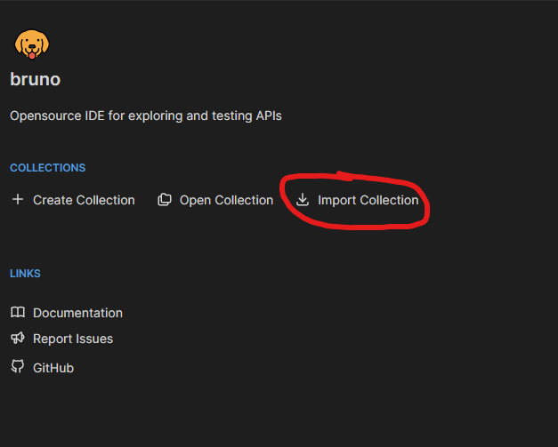
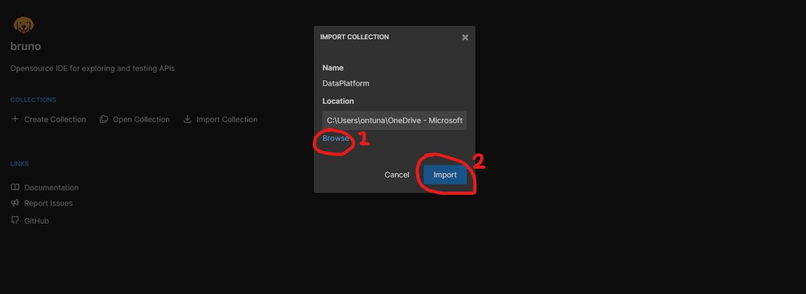
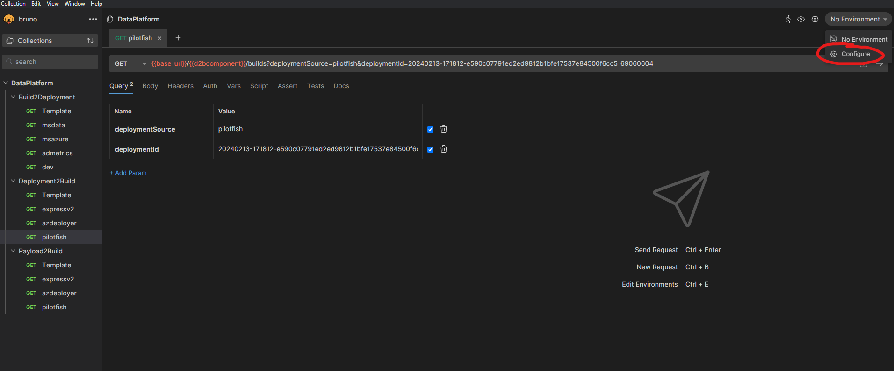
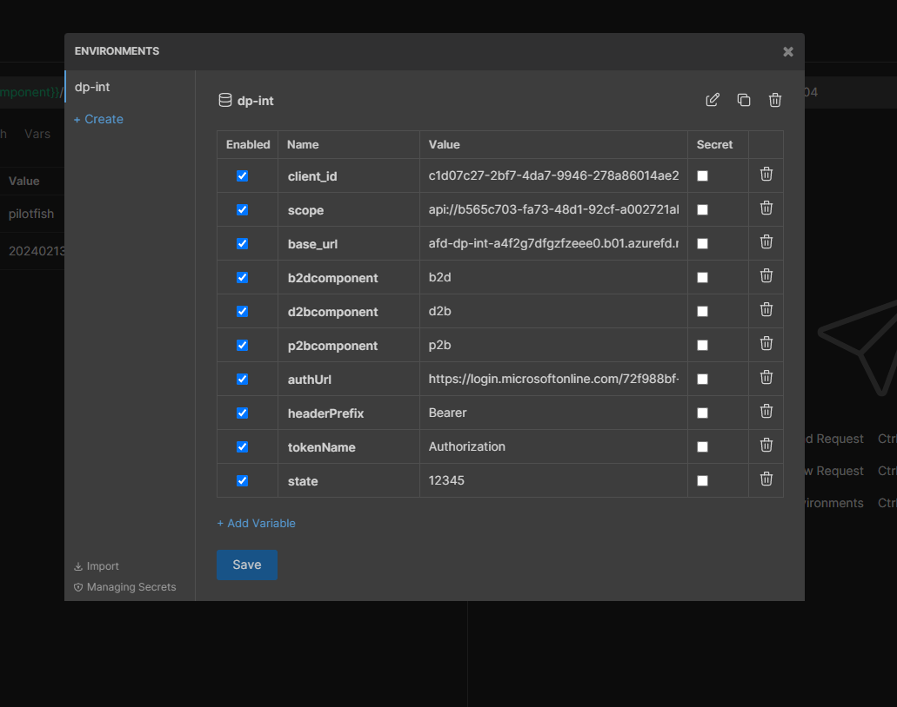
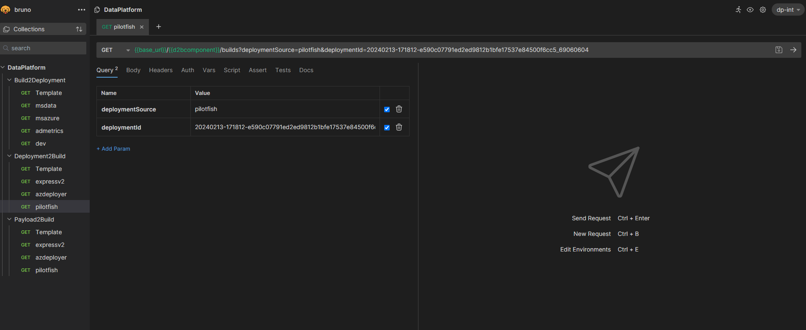
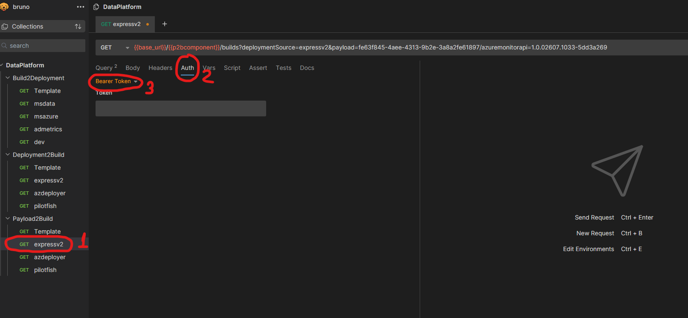
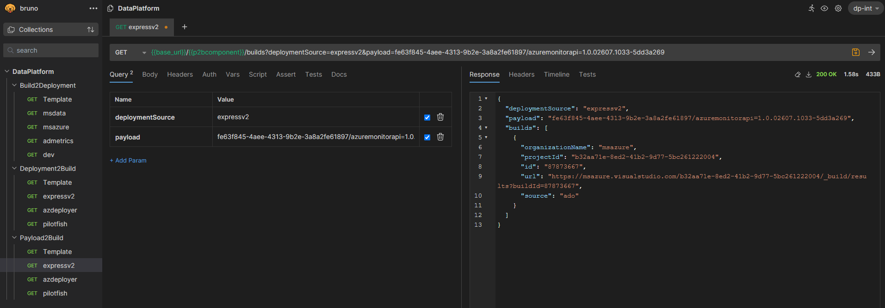
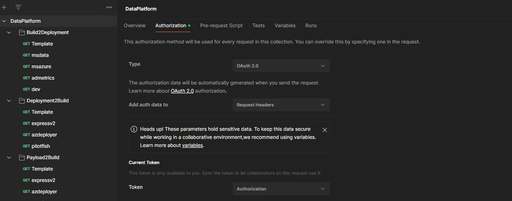
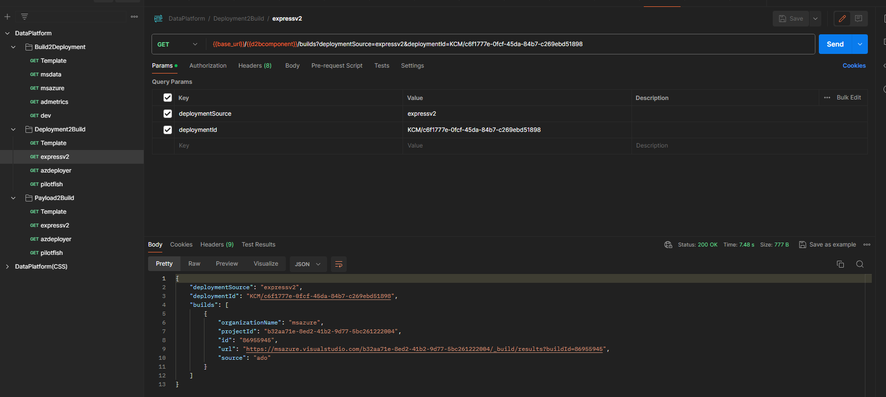

# Build2Deployment & Deployment2Build & Payload2Build

## Endpoints

**INT**: *https://afd-dp-int-a4f2g7dfgzfzeee0.b01.azurefd.net*

**PPE**: *https://afd-dp-ppe-bpa6h8dchaanfweh.b02.azurefd.net*

**PROD**: *https://afd-dp-prod-akgsdsbaadasg7gk.b01.azurefd.net*

## Bruno

[Bruno](https://www.usebruno.com/) is a "Fast and Git-Friendly Opensource API client" that is offline-only.

### Download Bruno Collection and Environment Variable Files

Download the files from sharepoint here: [b2d_d2b_p2b_files.zip](https://microsoft.sharepoint.com/:u:/t/FCM/EbSeHS66eApIuCUrcI7YYogBUY18KtIo6QxY-nRchHLtgQ?e=zlj4La). If you're having trouble download, you can copy and paste the files below into your local development environment:

**DataPlatform.bruno_collection.json**
<details>

```json
{
  "name": "DataPlatform",
  "version": "1",
  "items": [
    {
      "type": "folder",
      "name": "Build2Deployment",
      "items": [
        {
          "type": "http",
          "name": "admetrics",
          "seq": 4,
          "request": {
            "url": "{{base_url}}/{{b2dcomponent}}/deployments?adoOrganizationName=admetrics&adoProjectId=c6f597f2-902e-47df-9dbd-f5ee1ac627f2&adoBuildId=69514",
            "method": "GET",
            "headers": [],
            "body": {
              "mode": "none",
              "formUrlEncoded": [],
              "multipartForm": []
            },
            "auth": {
              "mode": "none",
              "basic": {
                "username": "",
                "password": ""
              },
              "bearer": {
                "token": ""
              }
            },
            "script": {},
            "vars": {},
            "assertions": [],
            "tests": "",
            "query": [
              {
                "name": "adoOrganizationName",
                "value": "admetrics",
                "enabled": true
              },
              {
                "name": "adoProjectId",
                "value": "c6f597f2-902e-47df-9dbd-f5ee1ac627f2",
                "enabled": true
              },
              {
                "name": "adoBuildId",
                "value": "69514",
                "enabled": true
              }
            ]
          }
        },
        {
          "type": "http",
          "name": "dev",
          "seq": 5,
          "request": {
            "url": "{{base_url}}/{{b2dcomponent}}/deployments?adoOrganizationName=dev&adoProjectId=505e0832-097c-4d90-947b-777124cc8911&adoBuildId=1531543",
            "method": "GET",
            "headers": [],
            "body": {
              "mode": "none",
              "formUrlEncoded": [],
              "multipartForm": []
            },
            "auth": {
              "mode": "none",
              "basic": {
                "username": "",
                "password": ""
              },
              "bearer": {
                "token": ""
              }
            },
            "script": {},
            "vars": {},
            "assertions": [],
            "tests": "",
            "query": [
              {
                "name": "adoOrganizationName",
                "value": "dev",
                "enabled": true
              },
              {
                "name": "adoProjectId",
                "value": "505e0832-097c-4d90-947b-777124cc8911",
                "enabled": true
              },
              {
                "name": "adoBuildId",
                "value": "1531543",
                "enabled": true
              }
            ]
          }
        },
        {
          "type": "http",
          "name": "msazure",
          "seq": 3,
          "request": {
            "url": "{{base_url}}/{{b2dcomponent}}/deployments?adoOrganizationName=msazure&adoProjectId=09706533-03bf-4b43-9a9b-b49c75429646&adoBuildId=85471733",
            "method": "GET",
            "headers": [],
            "body": {
              "mode": "none",
              "formUrlEncoded": [],
              "multipartForm": []
            },
            "auth": {
              "mode": "none",
              "basic": {
                "username": "",
                "password": ""
              },
              "bearer": {
                "token": ""
              }
            },
            "script": {},
            "vars": {},
            "assertions": [],
            "tests": "",
            "query": [
              {
                "name": "adoOrganizationName",
                "value": "msazure",
                "enabled": true
              },
              {
                "name": "adoProjectId",
                "value": "09706533-03bf-4b43-9a9b-b49c75429646",
                "enabled": true
              },
              {
                "name": "adoBuildId",
                "value": "85471733",
                "enabled": true
              }
            ]
          }
        },
        {
          "type": "http",
          "name": "msdata",
          "seq": 2,
          "request": {
            "url": "{{base_url}}/{{b2dcomponent}}/deployments?adoOrganizationName=msdata&adoProjectId=ba574a88-a171-48e0-8fcb-5fef6d23739c&adoBuildId=115856310",
            "method": "GET",
            "headers": [],
            "body": {
              "mode": "none",
              "formUrlEncoded": [],
              "multipartForm": []
            },
            "auth": {
              "mode": "none",
              "basic": {
                "username": "",
                "password": ""
              },
              "bearer": {
                "token": ""
              }
            },
            "script": {},
            "vars": {},
            "assertions": [],
            "tests": "",
            "query": [
              {
                "name": "adoOrganizationName",
                "value": "msdata",
                "enabled": true
              },
              {
                "name": "adoProjectId",
                "value": "ba574a88-a171-48e0-8fcb-5fef6d23739c",
                "enabled": true
              },
              {
                "name": "adoBuildId",
                "value": "115856310",
                "enabled": true
              }
            ]
          }
        },
        {
          "type": "http",
          "name": "Template",
          "seq": 1,
          "request": {
            "url": "{{base_url}}/{{b2dcomponent}}/deployments?adoOrganizationName=&adoProjectId=&adoBuildId=",
            "method": "GET",
            "headers": [],
            "body": {
              "mode": "none",
              "formUrlEncoded": [],
              "multipartForm": []
            },
            "auth": {
              "mode": "none",
              "basic": {
                "username": "",
                "password": ""
              },
              "bearer": {
                "token": ""
              }
            },
            "script": {},
            "vars": {},
            "assertions": [],
            "tests": "",
            "query": [
              {
                "name": "adoOrganizationName",
                "value": "",
                "enabled": true
              },
              {
                "name": "adoProjectId",
                "value": "",
                "enabled": true
              },
              {
                "name": "adoBuildId",
                "value": "",
                "enabled": true
              }
            ]
          }
        }
      ]
    },
    {
      "type": "folder",
      "name": "Deployment2Build",
      "items": [
        {
          "type": "http",
          "name": "azdeployer",
          "seq": 3,
          "request": {
            "url": "{{base_url}}/{{d2bcomponent}}/builds?deploymentSource=azdeployer&deploymentId=80561803",
            "method": "GET",
            "headers": [],
            "body": {
              "mode": "none",
              "formUrlEncoded": [],
              "multipartForm": []
            },
            "auth": {
              "mode": "none",
              "basic": {
                "username": "",
                "password": ""
              },
              "bearer": {
                "token": ""
              }
            },
            "script": {},
            "vars": {},
            "assertions": [],
            "tests": "",
            "query": [
              {
                "name": "deploymentSource",
                "value": "azdeployer",
                "enabled": true
              },
              {
                "name": "deploymentId",
                "value": "80561803",
                "enabled": true
              }
            ]
          }
        },
        {
          "type": "http",
          "name": "expressv2",
          "seq": 2,
          "request": {
            "url": "{{base_url}}/{{d2bcomponent}}/builds?deploymentSource=expressv2&deploymentId=KCM/c6f1777e-0fcf-45da-84b7-c269ebd51898",
            "method": "GET",
            "headers": [],
            "body": {
              "mode": "none",
              "formUrlEncoded": [],
              "multipartForm": []
            },
            "auth": {
              "mode": "none",
              "basic": {
                "username": "",
                "password": ""
              },
              "bearer": {
                "token": ""
              }
            },
            "script": {},
            "vars": {},
            "assertions": [],
            "tests": "",
            "query": [
              {
                "name": "deploymentSource",
                "value": "expressv2",
                "enabled": true
              },
              {
                "name": "deploymentId",
                "value": "KCM/c6f1777e-0fcf-45da-84b7-c269ebd51898",
                "enabled": true
              }
            ]
          }
        },
        {
          "type": "http",
          "name": "pilotfish",
          "seq": 4,
          "request": {
            "url": "{{base_url}}/{{d2bcomponent}}/builds?deploymentSource=pilotfish&deploymentId=20240213-171812-e590c07791ed2ed9812b1bfe17537e84500f6cc5_69060604",
            "method": "GET",
            "headers": [],
            "body": {
              "mode": "none",
              "formUrlEncoded": [],
              "multipartForm": []
            },
            "auth": {
              "mode": "none",
              "basic": {
                "username": "",
                "password": ""
              },
              "bearer": {
                "token": ""
              }
            },
            "script": {},
            "vars": {},
            "assertions": [],
            "tests": "",
            "query": [
              {
                "name": "deploymentSource",
                "value": "pilotfish",
                "enabled": true
              },
              {
                "name": "deploymentId",
                "value": "20240213-171812-e590c07791ed2ed9812b1bfe17537e84500f6cc5_69060604",
                "enabled": true
              }
            ]
          }
        },
        {
          "type": "http",
          "name": "Template",
          "seq": 1,
          "request": {
            "url": "{{base_url}}/{{d2bcomponent}}/builds?deploymentSource=&deploymentId=",
            "method": "GET",
            "headers": [],
            "body": {
              "mode": "none",
              "formUrlEncoded": [],
              "multipartForm": []
            },
            "auth": {
              "mode": "none",
              "basic": {
                "username": "",
                "password": ""
              },
              "bearer": {
                "token": ""
              }
            },
            "script": {},
            "vars": {},
            "assertions": [],
            "tests": "",
            "query": [
              {
                "name": "deploymentSource",
                "value": "",
                "enabled": true
              },
              {
                "name": "deploymentId",
                "value": "",
                "enabled": true
              }
            ]
          }
        }
      ]
    },
    {
      "type": "folder",
      "name": "Payload2Build",
      "items": [
        {
          "type": "http",
          "name": "azdeployer",
          "seq": 3,
          "request": {
            "url": "{{base_url}}/{{p2bcomponent}}/builds?deploymentSource=azdeployer&payload=configpush.xml;git_networking_nsm_master;18.3.3.0",
            "method": "GET",
            "headers": [],
            "body": {
              "mode": "none",
              "formUrlEncoded": [],
              "multipartForm": []
            },
            "auth": {
              "mode": "none",
              "basic": {
                "username": "",
                "password": ""
              },
              "bearer": {
                "token": ""
              }
            },
            "script": {},
            "vars": {},
            "assertions": [],
            "tests": "",
            "query": [
              {
                "name": "deploymentSource",
                "value": "azdeployer",
                "enabled": true
              },
              {
                "name": "payload",
                "value": "configpush.xml;git_networking_nsm_master;18.3.3.0",
                "enabled": true
              }
            ]
          }
        },
        {
          "type": "http",
          "name": "expressv2",
          "seq": 2,
          "request": {
            "url": "{{base_url}}/{{p2bcomponent}}/builds?deploymentSource=expressv2&payload=fe63f845-4aee-4313-9b2e-3a8a2fe61897/azuremonitorapi=1.0.02607.1033-5dd3a269",
            "method": "GET",
            "headers": [],
            "body": {
              "mode": "none",
              "formUrlEncoded": [],
              "multipartForm": []
            },
            "auth": {
              "mode": "none",
              "basic": {
                "username": "",
                "password": ""
              },
              "bearer": {
                "token": ""
              }
            },
            "script": {},
            "vars": {},
            "assertions": [],
            "tests": "",
            "query": [
              {
                "name": "deploymentSource",
                "value": "expressv2",
                "enabled": true
              },
              {
                "name": "payload",
                "value": "fe63f845-4aee-4313-9b2e-3a8a2fe61897/azuremonitorapi=1.0.02607.1033-5dd3a269",
                "enabled": true
              }
            ]
          }
        },
        {
          "type": "http",
          "name": "pilotfish",
          "seq": 4,
          "request": {
            "url": "{{base_url}}/{{p2bcomponent}}/builds?deploymentSource=pilotfish&payload=vfpagent=vfpagent_rel_vnet_enc_1_1_2_126_v_1_2_67_41",
            "method": "GET",
            "headers": [],
            "body": {
              "mode": "none",
              "formUrlEncoded": [],
              "multipartForm": []
            },
            "auth": {
              "mode": "none",
              "basic": {
                "username": "",
                "password": ""
              },
              "bearer": {
                "token": ""
              }
            },
            "script": {},
            "vars": {},
            "assertions": [],
            "tests": "",
            "query": [
              {
                "name": "deploymentSource",
                "value": "pilotfish",
                "enabled": true
              },
              {
                "name": "payload",
                "value": "vfpagent=vfpagent_rel_vnet_enc_1_1_2_126_v_1_2_67_41",
                "enabled": true
              }
            ]
          }
        },
        {
          "type": "http",
          "name": "Template",
          "seq": 1,
          "request": {
            "url": "{{base_url}}/{{p2bcomponent}}/builds?deploymentSource=&payload=",
            "method": "GET",
            "headers": [],
            "body": {
              "mode": "none",
              "formUrlEncoded": [],
              "multipartForm": []
            },
            "auth": {
              "mode": "none",
              "basic": {
                "username": "",
                "password": ""
              },
              "bearer": {
                "token": ""
              }
            },
            "script": {},
            "vars": {},
            "assertions": [],
            "tests": "",
            "query": [
              {
                "name": "deploymentSource",
                "value": "",
                "enabled": true
              },
              {
                "name": "payload",
                "value": "",
                "enabled": true
              }
            ]
          }
        }
      ]
    }
  ],
  "environments": []
}
```
</details>

</br>

**dp-int.postman_environment.json**
<details>

```json
{
	"id": "4131f2e6-b1e0-422b-9c57-6737044e89a1",
	"name": "dp-int",
	"values": [
		{
			"key": "client_id",
			"value": "c1d07c27-2bf7-4da7-9946-278a86014ae2",
			"type": "default",
			"enabled": true
		},
		{
			"key": "scope",
			"value": "api://b565c703-fa73-48d1-92cf-a002721abe2e/user_impersonation",
			"type": "default",
			"enabled": true
		},
		{
			"key": "base_url",
			"value": "afd-dp-int-a4f2g7dfgzfzeee0.b01.azurefd.net",
			"type": "default",
			"enabled": true
		},
		{
			"key": "b2dcomponent",
			"value": "b2d",
			"type": "default",
			"enabled": true
		},
		{
			"key": "d2bcomponent",
			"value": "d2b",
			"type": "default",
			"enabled": true
		},
		{
			"key": "p2bcomponent",
			"value": "p2b",
			"type": "default",
			"enabled": true
		},
		{
			"key": "authUrl",
			"value": "https://login.microsoftonline.com/72f988bf-86f1-41af-91ab-2d7cd011db47/oauth2/v2.0/authorize",
			"type": "default",
			"enabled": true
		},
		{
			"key": "headerPrefix",
			"value": "Bearer",
			"type": "default",
			"enabled": true
		},
		{
			"key": "tokenName",
			"value": "Authorization",
			"type": "default",
			"enabled": true
		},
		{
			"key": "state",
			"value": "12345",
			"type": "default",
			"enabled": true
		}
	],
	"_postman_variable_scope": "environment",
	"_postman_exported_at": "2024-02-29T23:22:42.599Z",
	"_postman_exported_using": "Postman/10.23.8"
}
```
</details>

### Setup Bruno:

1) Import Bruno Collection: Click on `Import Collection` and choose `Bruno Collection` from the menu and select `DataPlatform.bruno_collection.json` that you download as part of the `b2d_d2b_p2b_files.zip` file and choose a working directory.






2) Add `dp-int.postman_environment.json` Postman environment file as your Bruno Environment.







 
3) Get an access token
```python
from adal import AuthenticationContext
import requests

authority = 'https://login.microsoftonline.com/'
tenant = '72f988bf-86f1-41af-91ab-2d7cd011db47' # msft tenant
client_id = '' # app id of your service
client_secret = '' # secret; can use other auth methods (like cert) as  well
resource = 'api://b565c703-fa73-48d1-92cf-a002721abe2e' # scope 

auth_context = AuthenticationContext(authority + tenant)

token = auth_context.acquire_token_with_client_credentials(resource=resource, client_id=client_id, client_secret=client_secret)

print(token['accessToken'])
``` 
4) Add access token to `Authorization` header in Bruno



5) Make a request



## Postman

[Postman](https://www.postman.com/) is a great tool to test out endpoints. Please use the following to get started:

### Download the Postman Collection and Environment Variable Files

Download the files from sharepoint here: [b2d_d2b_p2b_files.zip](https://microsoft.sharepoint.com/:u:/t/FCM/EbSeHS66eApIuCUrcI7YYogBUY18KtIo6QxY-nRchHLtgQ?e=zlj4La). If you're having trouble download, you can copy and paste the files below into your local development environment:

**DataPlatform.postman_collection.json**
<details>

```json
{
	"info": {
		"_postman_id": "f3990ab0-9326-4d43-b458-ca0d04b8ca8a",
		"name": "DataPlatform",
		"schema": "https://schema.getpostman.com/json/collection/v2.1.0/collection.json",
		"_exporter_id": "1442359"
	},
	"item": [
		{
			"name": "Build2Deployment",
			"item": [
				{
					"name": "Template",
					"request": {
						"method": "GET",
						"header": [],
						"url": {
							"raw": "{{base_url}}/{{b2dcomponent}}/deployments?adoOrganizationName=&adoProjectId=&adoBuildId=",
							"host": [
								"{{base_url}}"
							],
							"path": [
								"{{b2dcomponent}}",
								"deployments"
							],
							"query": [
								{
									"key": "adoOrganizationName",
									"value": ""
								},
								{
									"key": "adoProjectId",
									"value": ""
								},
								{
									"key": "adoBuildId",
									"value": ""
								}
							]
						}
					},
					"response": []
				},
				{
					"name": "msdata",
					"request": {
						"method": "GET",
						"header": [],
						"url": {
							"raw": "{{base_url}}/{{b2dcomponent}}/deployments?adoOrganizationName=msdata&adoProjectId=ba574a88-a171-48e0-8fcb-5fef6d23739c&adoBuildId=115856310",
							"host": [
								"{{base_url}}"
							],
							"path": [
								"{{b2dcomponent}}",
								"deployments"
							],
							"query": [
								{
									"key": "adoOrganizationName",
									"value": "msdata"
								},
								{
									"key": "adoProjectId",
									"value": "ba574a88-a171-48e0-8fcb-5fef6d23739c"
								},
								{
									"key": "adoBuildId",
									"value": "115856310"
								}
							]
						}
					},
					"response": []
				},
				{
					"name": "msazure",
					"request": {
						"method": "GET",
						"header": [],
						"url": {
							"raw": "{{base_url}}/{{b2dcomponent}}/deployments?adoOrganizationName=msazure&adoProjectId=09706533-03bf-4b43-9a9b-b49c75429646&adoBuildId=85471733",
							"host": [
								"{{base_url}}"
							],
							"path": [
								"{{b2dcomponent}}",
								"deployments"
							],
							"query": [
								{
									"key": "adoOrganizationName",
									"value": "msazure"
								},
								{
									"key": "adoProjectId",
									"value": "09706533-03bf-4b43-9a9b-b49c75429646"
								},
								{
									"key": "adoBuildId",
									"value": "85471733"
								}
							]
						}
					},
					"response": []
				},
				{
					"name": "admetrics",
					"request": {
						"method": "GET",
						"header": [],
						"url": {
							"raw": "{{base_url}}/{{b2dcomponent}}/deployments?adoOrganizationName=admetrics&adoProjectId=c6f597f2-902e-47df-9dbd-f5ee1ac627f2&adoBuildId=69514",
							"host": [
								"{{base_url}}"
							],
							"path": [
								"{{b2dcomponent}}",
								"deployments"
							],
							"query": [
								{
									"key": "adoOrganizationName",
									"value": "admetrics"
								},
								{
									"key": "adoProjectId",
									"value": "c6f597f2-902e-47df-9dbd-f5ee1ac627f2"
								},
								{
									"key": "adoBuildId",
									"value": "69514"
								}
							]
						}
					},
					"response": []
				},
				{
					"name": "dev",
					"request": {
						"method": "GET",
						"header": [],
						"url": {
							"raw": "{{base_url}}/{{b2dcomponent}}/deployments?adoOrganizationName=dev&adoProjectId=505e0832-097c-4d90-947b-777124cc8911&adoBuildId=1531543",
							"host": [
								"{{base_url}}"
							],
							"path": [
								"{{b2dcomponent}}",
								"deployments"
							],
							"query": [
								{
									"key": "adoOrganizationName",
									"value": "dev"
								},
								{
									"key": "adoProjectId",
									"value": "505e0832-097c-4d90-947b-777124cc8911"
								},
								{
									"key": "adoBuildId",
									"value": "1531543"
								}
							]
						}
					},
					"response": []
				}
			]
		},
		{
			"name": "Deployment2Build",
			"item": [
				{
					"name": "Template",
					"request": {
						"method": "GET",
						"header": [],
						"url": {
							"raw": "{{base_url}}/{{d2bcomponent}}/builds?deploymentSource=&deploymentId=",
							"host": [
								"{{base_url}}"
							],
							"path": [
								"{{d2bcomponent}}",
								"builds"
							],
							"query": [
								{
									"key": "deploymentSource",
									"value": ""
								},
								{
									"key": "deploymentId",
									"value": ""
								}
							]
						}
					},
					"response": []
				},
				{
					"name": "expressv2",
					"request": {
						"method": "GET",
						"header": [],
						"url": {
							"raw": "{{base_url}}/{{d2bcomponent}}/builds?deploymentSource=expressv2&deploymentId=KCM/c6f1777e-0fcf-45da-84b7-c269ebd51898",
							"host": [
								"{{base_url}}"
							],
							"path": [
								"{{d2bcomponent}}",
								"builds"
							],
							"query": [
								{
									"key": "deploymentSource",
									"value": "expressv2"
								},
								{
									"key": "deploymentId",
									"value": "KCM/c6f1777e-0fcf-45da-84b7-c269ebd51898"
								}
							]
						}
					},
					"response": []
				},
				{
					"name": "azdeployer",
					"request": {
						"method": "GET",
						"header": [],
						"url": {
							"raw": "{{base_url}}/{{d2bcomponent}}/builds?deploymentSource=azdeployer&deploymentId=80561803",
							"host": [
								"{{base_url}}"
							],
							"path": [
								"{{d2bcomponent}}",
								"builds"
							],
							"query": [
								{
									"key": "deploymentSource",
									"value": "azdeployer"
								},
								{
									"key": "deploymentId",
									"value": "80561803"
								}
							]
						}
					},
					"response": []
				},
				{
					"name": "pilotfish",
					"request": {
						"method": "GET",
						"header": [],
						"url": {
							"raw": "{{base_url}}/{{d2bcomponent}}/builds?deploymentSource=pilotfish&deploymentId=20240213-171812-e590c07791ed2ed9812b1bfe17537e84500f6cc5_69060604",
							"host": [
								"{{base_url}}"
							],
							"path": [
								"{{d2bcomponent}}",
								"builds"
							],
							"query": [
								{
									"key": "deploymentSource",
									"value": "pilotfish"
								},
								{
									"key": "deploymentId",
									"value": "20240213-171812-e590c07791ed2ed9812b1bfe17537e84500f6cc5_69060604"
								}
							]
						}
					},
					"response": []
				}
			]
		},
		{
			"name": "Payload2Build",
			"item": [
				{
					"name": "Template",
					"request": {
						"method": "GET",
						"header": [],
						"url": {
							"raw": "{{base_url}}/{{p2bcomponent}}/builds?deploymentSource=&payload=",
							"host": [
								"{{base_url}}"
							],
							"path": [
								"{{p2bcomponent}}",
								"builds"
							],
							"query": [
								{
									"key": "deploymentSource",
									"value": ""
								},
								{
									"key": "payload",
									"value": ""
								}
							]
						}
					},
					"response": []
				},
				{
					"name": "expressv2",
					"request": {
						"method": "GET",
						"header": [],
						"url": {
							"raw": "{{base_url}}/{{p2bcomponent}}/builds?deploymentSource=expressv2&payload=fe63f845-4aee-4313-9b2e-3a8a2fe61897/azuremonitorapi=1.0.02607.1033-5dd3a269",
							"host": [
								"{{base_url}}"
							],
							"path": [
								"{{p2bcomponent}}",
								"builds"
							],
							"query": [
								{
									"key": "deploymentSource",
									"value": "expressv2"
								},
								{
									"key": "payload",
									"value": "fe63f845-4aee-4313-9b2e-3a8a2fe61897/azuremonitorapi=1.0.02607.1033-5dd3a269"
								}
							]
						}
					},
					"response": []
				},
				{
					"name": "azdeployer",
					"request": {
						"method": "GET",
						"header": [],
						"url": {
							"raw": "{{base_url}}/{{p2bcomponent}}/builds?deploymentSource=azdeployer&payload=configpush.xml;git_networking_nsm_master;18.3.3.0",
							"host": [
								"{{base_url}}"
							],
							"path": [
								"{{p2bcomponent}}",
								"builds"
							],
							"query": [
								{
									"key": "deploymentSource",
									"value": "azdeployer"
								},
								{
									"key": "payload",
									"value": "configpush.xml;git_networking_nsm_master;18.3.3.0"
								}
							]
						}
					},
					"response": []
				},
				{
					"name": "pilotfish",
					"request": {
						"method": "GET",
						"header": [],
						"url": {
							"raw": "{{base_url}}/{{p2bcomponent}}/builds?deploymentSource=pilotfish&payload=vfpagent=vfpagent_rel_vnet_enc_1_1_2_126_v_1_2_67_41",
							"host": [
								"{{base_url}}"
							],
							"path": [
								"{{p2bcomponent}}",
								"builds"
							],
							"query": [
								{
									"key": "deploymentSource",
									"value": "pilotfish"
								},
								{
									"key": "payload",
									"value": "vfpagent=vfpagent_rel_vnet_enc_1_1_2_126_v_1_2_67_41"
								}
							]
						}
					},
					"response": []
				}
			]
		}
	],
	"auth": {
		"type": "oauth2",
		"oauth2": [
			{
				"key": "tokenName",
				"value": "Authorization",
				"type": "string"
			},
			{
				"key": "authUrl",
				"value": "https://login.microsoftonline.com/72f988bf-86f1-41af-91ab-2d7cd011db47/oauth2/v2.0/authorize",
				"type": "string"
			},
			{
				"key": "state",
				"value": "12345",
				"type": "string"
			},
			{
				"key": "scope",
				"value": "{{scope}}",
				"type": "string"
			},
			{
				"key": "clientId",
				"value": "{{client_id}}",
				"type": "string"
			},
			{
				"key": "grant_type",
				"value": "implicit",
				"type": "string"
			},
			{
				"key": "useBrowser",
				"value": true,
				"type": "boolean"
			},
			{
				"key": "addTokenTo",
				"value": "header",
				"type": "string"
			}
		]
	},
	"event": [
		{
			"listen": "prerequest",
			"script": {
				"type": "text/javascript",
				"exec": [
					""
				]
			}
		},
		{
			"listen": "test",
			"script": {
				"type": "text/javascript",
				"exec": [
					""
				]
			}
		}
	]
}
```
</details>

</br>

**dp-int.postman_environment.json**
<details>

```json
{
	"id": "4131f2e6-b1e0-422b-9c57-6737044e89a1",
	"name": "dp-int",
	"values": [
		{
			"key": "client_id",
			"value": "c1d07c27-2bf7-4da7-9946-278a86014ae2",
			"type": "default",
			"enabled": true
		},
		{
			"key": "scope",
			"value": "api://b565c703-fa73-48d1-92cf-a002721abe2e/user_impersonation",
			"type": "default",
			"enabled": true
		},
		{
			"key": "base_url",
			"value": "afd-dp-int-a4f2g7dfgzfzeee0.b01.azurefd.net",
			"type": "default",
			"enabled": true
		},
		{
			"key": "b2dcomponent",
			"value": "b2d",
			"type": "default",
			"enabled": true
		},
		{
			"key": "d2bcomponent",
			"value": "d2b",
			"type": "default",
			"enabled": true
		},
		{
			"key": "p2bcomponent",
			"value": "p2b",
			"type": "default",
			"enabled": true
		},
		{
			"key": "authUrl",
			"value": "https://login.microsoftonline.com/72f988bf-86f1-41af-91ab-2d7cd011db47/oauth2/v2.0/authorize",
			"type": "default",
			"enabled": true
		},
		{
			"key": "headerPrefix",
			"value": "Bearer",
			"type": "default",
			"enabled": true
		},
		{
			"key": "tokenName",
			"value": "Authorization",
			"type": "default",
			"enabled": true
		},
		{
			"key": "state",
			"value": "12345",
			"type": "default",
			"enabled": true
		}
	],
	"_postman_variable_scope": "environment",
	"_postman_exported_at": "2024-02-29T23:22:42.599Z",
	"_postman_exported_using": "Postman/10.23.8"
}
```

</details>

For detailed instructions on importing data, see [import data on postman](https://learning.postman.com/docs/getting-started/importing-and-exporting/importing-data/). To execute a request, first retrieve a token using postman's authorization via browser:



You will utilize the browser to authenticate to `@microsoft.com`; it should trigger a callback automatically to postman. Once that is finished, select the example for `expressv2` or construct your own request with the template function and provided values.



## S2S with AAD 

### Deployment2Build API

To integrate with a S2S call, use the following example as a guide (note that some fields were ommited for security reasons)

```python
from adal import AuthenticationContext
import requests

authority = 'https://login.microsoftonline.com/'
tenant = '72f988bf-86f1-41af-91ab-2d7cd011db47' # msft tenant
client_id = '' # app id of your service
client_secret = '' # secret; can use other auth methods (like cert) as  well
resource = 'api://b565c703-fa73-48d1-92cf-a002721abe2e' # scope 

d2b_api_endpoint = 'https://afd-dp-int-a4f2g7dfgzfzeee0.b01.azurefd.net/d2b/builds'
deploymentId = 'ContainerService/b03fe328-9f11-42c4-8eed-73a0f0d1c944'
deploymentSource = 'expressv2'

auth_context = AuthenticationContext(authority + tenant)

token = auth_context.acquire_token_with_client_credentials(resource=resource, client_id=client_id, client_secret=client_secret)

params = {
    'deploymentId': deploymentId,
    'deploymentSource': deploymentSource,
}

headers = {
    'Authorization': 'Bearer ' + token['accessToken']
}

request = requests.get(d2b_api_endpoint, params=params, headers=headers)

print(request.text)
```

### Build2Deployment API

To integrate with a S2S call, use the following example as a guide (note that some fields were ommited for security reasons)

```python
from adal import AuthenticationContext
import requests

authority = 'https://login.microsoftonline.com/'
tenant = '72f988bf-86f1-41af-91ab-2d7cd011db47' # msft tenant
client_id = '' # app id of your service
client_secret = '' # secret; can use other auth methods (like cert) as  well
resource = 'api://b565c703-fa73-48d1-92cf-a002721abe2e' # scope 

b2d_api_endpoint = 'https://afd-dp-int-a4f2g7dfgzfzeee0.b01.azurefd.net/b2d/deployments'
adoOrganizationName = 'dev'
adoProjectId = '505e0832-097c-4d90-947b-777124cc8911'
adoBuildId = '1531543'

auth_context = AuthenticationContext(authority + tenant)

token = auth_context.acquire_token_with_client_credentials(resource=resource, client_id=client_id, client_secret=client_secret)

params = {
    'adoOrganizationName': adoOrganizationName,
    'adoProjectId': adoProjectId,
    'adoBuildId': adoBuildId
}

headers = {
    'Authorization': 'Bearer ' + token['accessToken']
}

request = requests.get(b2d_api_endpoint, params=params, headers=headers)

print(request.text)
```

### Payload2Build API

To integrate with a S2S call, use the following example as a guide (note that some fields were ommited for security reasons)

```python
from adal import AuthenticationContext
import requests

authority = 'https://login.microsoftonline.com/'
tenant = '72f988bf-86f1-41af-91ab-2d7cd011db47' # msft tenant
client_id = '' # app id of your service
client_secret = '' # secret; can use other auth methods (like cert) as  well
resource = 'api://b565c703-fa73-48d1-92cf-a002721abe2e' # scope 

p2b_api_endpoint = 'https://afd-dp-int-a4f2g7dfgzfzeee0.b01.azurefd.net/p2b/builds'
payload = 'fe63f845-4aee-4313-9b2e-3a8a2fe61897/azuremonitorapi=1.0.02607.1033-5dd3a269'
deploymentSource = 'expressv2'

auth_context = AuthenticationContext(authority + tenant)

token = auth_context.acquire_token_with_client_credentials(resource=resource, client_id=client_id, client_secret=client_secret)

params = {
    'payload': payload,
    'deploymentSource': deploymentSource,
}

headers = {
    'Authorization': 'Bearer ' + token['accessToken']
}

request = requests.get(p2b_api_endpoint, params=params, headers=headers)

print(request.text)
```