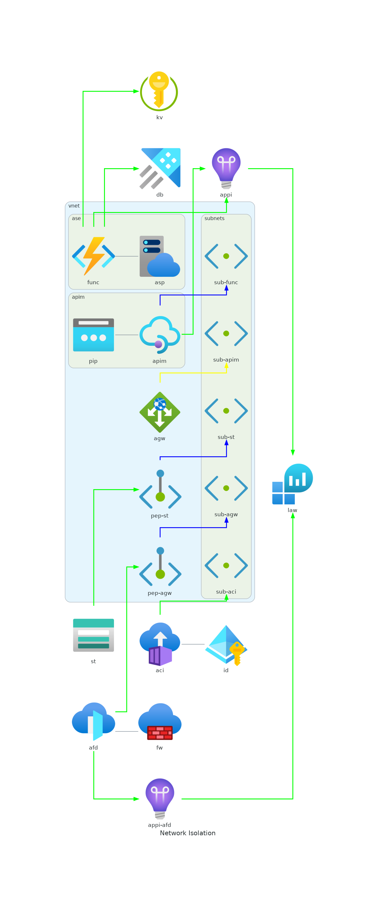
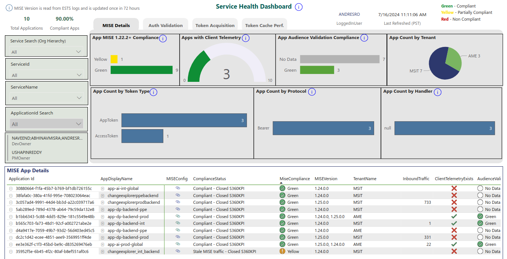

# Revisit API Infrastructure to Remain Compliant

## Purpose

The purpose of this document is to outline a general solution for network isolation focused APIs running natively in Azure. Specifically, FCM utilizes Azure Functions to expose our data to clients. Therefore, this solution will apply to all services using this infrastructure model: ChangeExplorerV2, DataPlatform and FCMAI. The aim of this document is to address the following S360 action items:

- [[SFI-ID4] Safe Secrets Standard](https://vnext.s360.msftcloudes.com/blades/security?blade=AssignedTo:All~KPI:c6876c6f-2376-49a6-bcbd-f15af106d1af~SLA:2~Forums:All~Program:65a010a5-1e3d-4777-bb89-f149470a507d~KPI%20Ranking:All~Tab:Summary~_loc:Security&peopleBasedNodes=ushapinreddy_team;abkmr_team&tile=S360_ServiceId:889acfb9-923f-4e3f-9bf2-2a3f9d95fe4f~_loc:__key__Security__c6876c6f-2376-49a6-bcbd-f15af106d1af&global=4:889acfb9-923f-4e3f-9bf2-2a3f9d95fe4f)
- [[SFI-NS2.2.1] Secure PaaS Resources](https://vnext.s360.msftcloudes.com/blades/security?global=@ANDRESRO%2BAndres%20Rojas%20Sanchez%20(ANDRESRO)&def=&blade=KPI:e3123e2a-615c-42ea-96a8-27e9732fdecd~SLA:3~DueDate:~AssignedTo:All~Forums:All~Program:All~KPI%20Ranking:All~waves:All~_loc:Security&tile=)
- [MISE Compliance](https://eng.ms/docs/initiatives/project-standard/standards-categories/sc-networking/ddos/ads)


## High Level System Architecture

Refer to the diagram below:



The color of the lines mean:
The color of the lines mean:
- <span style="color:green">**Green lines**:</span> authentication via [managed identity](https://learn.microsoft.com/en-us/entra/identity/managed-identities-azure-resources/overview).
- <span style="color:yellow">**Yellow lines**:</span> authentication via certificate, with [OneCert](http://aka.ms/onecert) as CA.
- <span style="color:blue">**Blue lines**:</span> indicate internal network configuration in the virtual network, i.e. private endpoints or subnets.
- **Black lines**: Uses component

Note that not all connections or components are demonstrated in the diagram above (such as subnet to subnet connections, DNS zones or NICs). Below are how the standards are satisfied:

- Safe Secrets Standard:
    - Requirement: [Local auth (i.e. key access)](https://learn.microsoft.com/en-us/azure/storage/common/shared-key-authorization-prevent?tabs=portal) is disabled on all storage accounts. Additionally, disable anonymous blob access. 
    - Solution: Move functions to utilize MSI instead of key access for storage acccess. Previously, we used [Elastic Premium (EP)](https://learn.microsoft.com/en-us/azure/azure-functions/functions-premium-plan?tabs=portal) for our functions but these do not support MSI just yet due to a dependency on file shares. To counter this, we have moved our functions to [Dedicated hosting plans](https://learn.microsoft.com/en-us/azure/azure-functions/dedicated-plan) that support operating without the file share, removing the dependency and allowing MSI auth into the storage account. As of 07/16/2024, all functions except FCMAI's IEP have been transitioned to this MSI model. Additionally, creation of managed identity for Ev2 shell deployments into the storage accounts via azure container instance (aci).
    - Limitations: 
        - There is hard limit of 30 instances per plan per region, in addition to a soft limit on SKU count per region per subscription. This can be increased through an exception to increase app service plan count manually. Components, such as IEP, are currently on hold to transition to MSI because of this.
        - AlwaysOn must be enabled to [avoid cold start issues](https://learn.microsoft.com/en-us/azure/azure-functions/dedicated-plan#always-on).
    - Future Work: When integrating into the vnet, we will create an [app service environment (ase)](https://learn.microsoft.com/en-us/azure/app-service/environment/overview) that will host all service plans for that service. Additionally, the SKUs will migrate to Isolated tier that has greater limit count (100 vs 30 per region, per plan).

- Secure PaaS Resources:
    - Requirement: All PaaS resources (i.e. storage accounts) must be [network isolated](https://eng.ms/docs/products/azure-storage/security/standards/network-isolation). Specifically, we require the following acl policy to block inbound traffic:

    ```json
    Microsoft.Storage/storageAccounts/networkAcls/defaultAction=Deny
    ```
    - Solution: With a virtual network, we can create [private endpoints (pep)](https://learn.microsoft.com/en-us/azure/private-link/private-endpoint-overview) to connect to resources within the network using Azure's network without going through public routes. This pep will be connected to a dedicated [subnet on the vnet](https://learn.microsoft.com/en-us/azure/virtual-network/concepts-and-best-practices) that will connect the storage account to the resources that need to access it. The two resources that will require access have their own dedicated subnets (*subnet-func* and *subnet-aci*) to access the storage account.
    - Limitations:
        - There is a [200 pep limit](https://learn.microsoft.com/en-us/azure/azure-resource-manager/management/azure-subscription-service-limits#storage-limits) on storage accounts.
        - Ensure sufficient address space in the subnet for [scaled out azure functions](https://learn.microsoft.com/en-us/azure/virtual-network/concepts-and-best-practices) in the future.
    - Future Work: Implement the solution above.

- MISE Compliance:
    - Requirement: All tokens that are issued by Azure must be validated by a [MISE compliant library/package](https://identitydivision.visualstudio.com/DevEx/_git/MISE?path=%2Fdocs%2FMigrationGuides%2Fmigrate-web-apis-to-mise-and-sal-handler.md&version=GBmaster&_a=preview&anchor=not-sure-why-you-are-here%3F). In our case, we utilize APIM to managed our APIs and handle JWT token authentiation. This requires use of the [validate-azure-ad-token](https://eng.ms/docs/cloud-ai-platform/devdiv/serverless-paas-balam/serverless-paas-vikr/api-management/api-management-team-docs/first-party/features/mise-compliance) in the APIM's XML config with correct attribution to the backend application id the JWT token is accessing. To go this route, it is require that the APIM and the web API sit within a vnet. We are currently compliant for the token validation portion but not the network isolation:
    
    - Solution: Using the example from Azure quickstart templates for [creating a private api with app gateway and apim](https://github.com/Azure/azure-quickstart-templates/tree/master/quickstarts/microsoft.web/private-webapp-with-app-gateway-and-apim) we construct a similar solutions with the above requirements in mind. Key considerations here are that the authentication of the application gateway to apim will be certificate auth issued by OneCert. An improvement would be to investigate if this can be changed to MSI auth.
    - Limitations:
        - APIM subnet space has to have enough address space to support scaled out functions.
    - Future Work:
        - Implement the above solution with consideration for MSI auth between agw and apim. 
## Appendix

### Python Code to Generate Diagram

```python
from diagrams import Cluster, Diagram, Edge

from diagrams.azure.network import VirtualNetworks
from diagrams.azure.compute import FunctionApps
from diagrams.azure.network import FrontDoors
from diagrams.azure.web import AppServiceEnvironments
from diagrams.azure.web import AppServicePlans
from diagrams.azure.integration import APIManagement
from diagrams.azure.network import ApplicationGateway
from diagrams.azure.storage import StorageAccounts
from diagrams.azure.network import PrivateEndpoint
from diagrams.azure.identity import ManagedIdentities
from diagrams.azure.compute import ContainerInstances
from diagrams.azure.network import Subnets
from diagrams.azure.network import PublicIpAddresses
from diagrams.azure.devops import ApplicationInsights
from diagrams.azure.analytics import LogAnalyticsWorkspaces
from diagrams.azure.network import Firewall
from diagrams.azure.devops import Repos, Pipelines
from diagrams.azure.security import KeyVaults
from diagrams.azure.database import DataExplorerClusters

graph_attr = {
    "layout":"dot"
}

with Diagram("Network Isolation", graph_attr=graph_attr, show=False):

    # resources outside of the vnet
    st = StorageAccounts("st")
    appi = ApplicationInsights("appi")
    appiafd = ApplicationInsights("appi-afd")
    law = LogAnalyticsWorkspaces("law")
    afd = FrontDoors("afd")
    fw = Firewall("fw")
    aci = ContainerInstances("aci")
    id = ManagedIdentities("id")
    kv = KeyVaults("kv")
    db = DataExplorerClusters("db")

    # resources within the vnet
    with Cluster("vnet", direction="LR"):
        agw = ApplicationGateway("agw")
        # resources within the ase
        with Cluster("ase"):
            # resources for the func
            asp = AppServicePlans("asp")
            func = FunctionApps("func")
        # subnets for the vnet
        with Cluster("subnets", direction="LR"):
            subaci = Subnets("sub-aci")
            subfunc = Subnets("sub-func")
            subapim = Subnets("sub-apim")
            subagw = Subnets("sub-agw")
            subst = Subnets("sub-st")
        # resources for the apim
        with Cluster("apim"):
            apim = APIManagement("apim")
            pip = PublicIpAddresses("pip")
        # private endpoints
        pepagw = PrivateEndpoint("pep-agw")
        pepst = PrivateEndpoint("pep-st")

    # ado
    aci - Edge() - id
    aci >> Edge(color="green", style="bold") >> subaci

    # afd
    afd - Edge() - fw
    afd >> Edge(color="green", style="bold") >> appiafd
    afd >> Edge(color="green", style="bold") >> pepagw
    pepagw >> Edge(color="blue", style="bold") >> subagw
    appiafd >> Edge(color="green", style="bold") >> law

    # agw
    agw >> Edge(color="yellow", style="bold") >> subapim

    # apim
    pip - Edge() - apim
    apim >> Edge(color="green", style="bold") >> appi
    apim >> Edge(color="blue", style="bold") >> subfunc

    # func 
    func - Edge() - asp
    func >> Edge(color="green", style="bold") >> appi
    func >> Edge(color="green", style="bold") >> db
    func >> Edge(color="green", style="bold") >> kv

    # storage account
    appi >> Edge(color="green", style="bold") >> law
    st >> Edge(color="green", style="bold") >> pepst
    pepst >> Edge(color="blue", style="bold") >> subst
```

