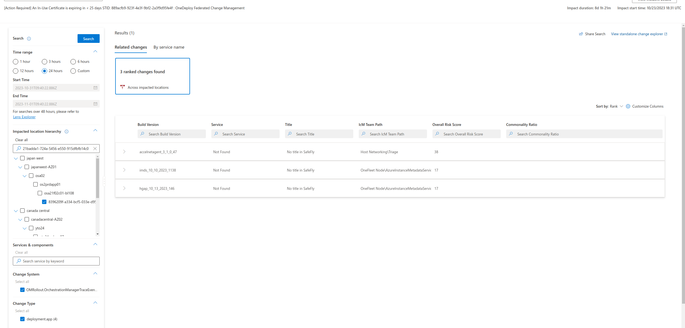

# Bug Bash Test Cases

- [Bug Bash Test Cases](#bug-bash-test-cases)
  - [Scenario 1: Given a service name and time range, explore changes](#scenario-1-given-a-service-name-and-time-range-explore-changes)
    - [Case 1-1](#case-1-1)
    - [Case 1-2](#case-1-2)
    - [Case 1-3](#case-1-3)
  - [Scenario 2: Given a service name, time range and node(s), explore changes](#scenario-2-given-a-service-name-time-range-and-nodes-explore-changes)
    - [Case 2-1](#case-2-1)
    - [Case 2-2](#case-2-2)
    - [Case 2-3](#case-2-3)
  - [Scenario 3: Given a service name, time range and cluster(s), explore changes](#scenario-3-given-a-service-name-time-range-and-clusters-explore-changes)
    - [Case 3-1](#case-3-1)
    - [Case 3-2](#case-3-2)
  - [Scenario 4: Given a service name, time range and region(s), explore changes](#scenario-4-given-a-service-name-time-range-and-regions-explore-changes)
    - [Case 4-1](#case-4-1)
    - [Case 4-2](#case-4-2)
  - [Scenario 5: Given a time range and node(s), explore changes](#scenario-5-given-a-time-range-and-nodes-explore-changes)
    - [Case 5-1](#case-5-1)
    - [Case 5-2](#case-5-2)
  - [Scenario 6: Given an incident, explorer changes](#scenario-6-given-an-incident-explorer-changes)

>[!NOTE] The below test cases were tested on 10/31 in QA environment.

## Scenario 1: Given a service name and time range, explore changes
### Case 1-1

**Repro steps**:
>- Enter the following name in the **Services and components** box: `sdn build`
>- Wait for SIP to resolve the name to `SDN Buildout and Deployments`; select it and wait for the filter panel to populate with the service box checkmarked
>- Select the `24 hours` radio button
>- Click on `Search`

**Expected Output**:

### Case 1-2

**Repro steps**:
>- Enter the following name in the **Services and components** box: `sdn build`
>- Wait for SIP to resolve the name to `SDN Buildout and Deployments`; select it and wait for the filter panel to populate with the service box checkmarked
>- Select the `Custom` radio button and fill in the `StarTime` and `EndTime` boxes with the following:
>    - `StartTime`: 2023-10-31T03:23:33.862Z
>    - `EndTime`: 2023-10-31T13:23:15.883Z
>- Click on `Search`

**Expected Output**:

### Case 1-3

**Repro steps**:
>- Enter the following name in the **Services and components** box: `724c33bf-1ab8-4691-adb1-0e61932919c2`
>- Wait for SIP to resolve the name to `Azure Cosmos DB`; select it and wait for the filter panel to populate with the service box checkmarked
>- Select the `1 hour` radio button
>- Click on `Search`

**Expected output**:

## Scenario 2: Given a service name, time range and node(s), explore changes
### Case 2-1
**Repro steps**:
>- Enter the following name in the **Services and components** box: `a87de371-6668-4b90-8655-0eb206003475`
>- Wait for SIP to resolve the name to `Azure Disk Encryption`; select it and wait for the filter panel to populate with the service box checkmarked
>- Enter the following name in the **Impacted location hierarchy** box: `c9e0ab82-b5c2-4d6d-a04e-2b671e20a7cc`
>- Wait for LIP to resolve the entity to a `node` type; select it and wait for the filter panel to populate with the node location highlighted (the hierarchy should be unchecked but shown)
>- Select the `24 hours` radio button
>- Click on `Search`

**Expected output**:

### Case 2-2
**Repro steps**:
>- Enter the following name in the **Services and components** box: `xstore`
>- Wait for SIP to resolve the name to `XStore Hardware Acceleration`; select it and wait for the filter panel to populate with the service box checkmarked
>- Enter the following name in the **Impacted location hierarchy** box: `e3d45cda-87de-667c-4db9-515d0dda8e45`
>- Wait for LIP to resolve the entity to a `node` type; select it and wait for the filter panel to populate with the node location highlighted (the hierarchy should be unchecked but shown)
>- Select the `24 hours` radio button
>- Click on `Search`

**Expected output**:

### Case 2-3
**Repro steps**:
>- Enter the following name in the **Services and components** box: `cloud hardware`
>- Wait for SIP to resolve the name to `Cloud Hardware Infrastructure Engineering (CHIE)`; select it and wait for the filter panel to populate with the service box checkmarked
>- Enter the following name in the **Impacted location hierarchy** box: `190d6772-e656-4bbc-2ed9-0c115eca71c8`
>- Wait for LIP to resolve the entity to a `node` type; select it and wait for the filter panel to populate with the node location highlighted (the hierarchy should be unchecked but shown)
>- Enter the following name in the **Impacted location hierarchy** box: `d3514b28-e09d-50b6-7e3f-ea43f8a95ab0`
>- Wait for LIP to resolve the entity to a `node` type; select it and wait for the filter panel to populate with the node location highlighted (the hierarchy should be unchecked but shown)
>- Select the `24 hours` radio button
>- Click on `Search`

**Expected output**:

## Scenario 3: Given a service name, time range and cluster(s), explore changes

### Case 3-1
**Repro steps**:
>- Enter the following name in the **Services and components** box: `xstore`
>- Wait for SIP to resolve the name to `Xstore`; select it and wait for the filter panel to populate with the service box checkmarked
>- Enter the following name in the **Impacted location hierarchy** box: `bn8prdstp05`
>- Wait for LIP to resolve the entity to a `cluster` type; select it and wait for the filter panel to populate with the node location highlighted (the hierarchy should be unchecked but shown)
>- Select the `Custom` radio button and fill in the `StarTime` and `EndTime` boxes with the following:
>    - `StartTime`: 2023-10-31T05:08:51.525Z
>    - `EndTime`: 2023-11-01T05:08:51.526Z
>- Click on `Search`

**Expected output**:

>[!IMPORTANT] Related Changes returns 500; `cluster` entityType is incompatible with ranked changes currently. Should return warning message instead.

### Case 3-2
**Repro steps**:
>- Enter the following name in the **Services and components** box: `software load`
>- Wait for SIP to resolve the name to `Software Load Balancer`; select it and wait for the filter panel to populate with the service box checkmarked
>- Enter the following name in the **Impacted location hierarchy** box: `dub21prdapp22`
>- Wait for LIP to resolve the entity to a `cluster` type; select it and wait for the filter panel to populate with the node location highlighted (the hierarchy should be unchecked but shown)
>- Enter the following name in the **Impacted location hierarchy** box: `sel21prdapp20`
>- Wait for LIP to resolve the entity to a `cluster` type; select it and wait for the filter panel to populate with the node location highlighted (the hierarchy should be unchecked but shown)
>- Select the `Custom` radio button and fill in the `StarTime` and `EndTime` boxes with the following:
>    - `StartTime`: 2023-10-31T05:08:51.525Z
>    - `EndTime`: 2023-11-01T05:08:51.526Z
>- Click on `Search`

**Expected output**:

>[!WARNING] Null payload returned in the service name view; will investigate. 

## Scenario 4: Given a service name, time range and region(s), explore changes
### Case 4-1
**Repro steps**:
>- Enter the following name in the **Services and components** box: `724c33bf-1ab8-4691-adb1-0e61932919c2`
>- Wait for SIP to resolve the name to `Azure Cosmos DB`; select it and wait for the filter panel to populate with the service box checkmarked
>- Enter the following name in the **Impacted location hierarchy** box: `east us`
>- Wait for LIP to resolve the entity to a `region` type; select it and wait for the filter panel to populate with the node location highlighted (the hierarchy should be unchecked but shown)
>- Select the `24 hours` radio button
>- Click on `Search`

**Expected output**:

### Case 4-2
**Repro steps**:
>- Enter the following name in the **Services and components** box: `724c33bf-1ab8-4691-adb1-0e61932919c2`
>- Wait for SIP to resolve the name to `Azure Cosmos DB`; select it and wait for the filter panel to populate with the service box checkmarked
>- Enter the following name in the **Services and components** box: `xstore`
>- Wait for SIP to resolve the name to `Xstore`; select it and wait for the filter panel to populate with the service box checkmarked
>- Enter the following name in the **Impacted location hierarchy** box: `east us`
>- Wait for LIP to resolve the entity to a `region` type; select it and wait for the filter panel to populate with the node location highlighted (the hierarchy should be unchecked but shown)
>- Enter the following name in the **Impacted location hierarchy** box: `west us`
>- Wait for LIP to resolve the entity to a `region` type; select it and wait for the filter panel to populate with the node location highlighted (the hierarchy should be unchecked but shown)
>- Select the `24 hours` radio button
>- Click on `Search`

**Expected output**:

>[!IMPORTANT] By service name API call doesn't correctly filter on service selected (in this case `Azure Cosmos DB`.) Second query does not finish completion.

## Scenario 5: Given a time range and node(s), explore changes
### Case 5-1
**Repro steps**:
>- Enter the following name in the **Impacted location hierarchy** box: `cf1568a8-80cd-1fa7-5e91-aef8918e08c2`
>- Wait for LIP to resolve the entity to a `node` type; select it and wait for the filter panel to populate with the node location highlighted (the hierarchy should be unchecked but shown)
>- Select the `Custom` radio button and fill in the `StarTime` and `EndTime` boxes with the following:
>    - `StartTime`: 2023-10-31T05:08:51.525Z
>    - `EndTime`: 2023-11-01T05:08:51.526Z
>- Click on `Search`

**Expected output**:

### Case 5-2
**Repro steps**:
>- Enter the following name in the **Impacted location hierarchy** box: `21badda1-724a-5456-e550-915dfbfb14c0`
>- Wait for LIP to resolve the entity to a `node` type; select it and wait for the filter panel to populate with the node location highlighted (the hierarchy should be unchecked but shown)
>- Enter the following name in the **Impacted location hierarchy** box: `59ccbf3c-b0ba-448b-ce6a-7b6b0bf200ca`
>- Wait for LIP to resolve the entity to a `node` type; select it and wait for the filter panel to populate with the node location highlighted (the hierarchy should be unchecked but shown)
>- Enter the following name in the **Impacted location hierarchy** box: `8396209f-a334-bcf5-033e-d95f39d54cdb`
>- Wait for LIP to resolve the entity to a `node` type; select it and wait for the filter panel to populate with the node location highlighted (the hierarchy should be unchecked but shown)    
>- Select the `Custom` radio button and fill in the `StarTime` and `EndTime` boxes with the following:
>    - `StartTime`: 2023-10-31T05:08:51.525Z
>    - `EndTime`: 2023-11-01T05:08:51.526Z
>- Click on `Search`

**Expected output**:

## Scenario 6: Given an incident, explorer changes

Below is a list of possible incident ids we can take a look at during bug bash:

- 435724214 (cluster: OS2PrdApp01)
- 437414588 (region: west us)
- 

I'm currently getting the following:

