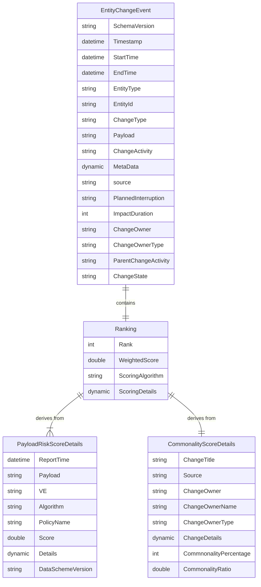

# FCM Data Platform Read APIs

| Owner(s): **Andy (andresro@)** | Status: **WIP**          |
|----------------------------|--------------------------|
| Approvers: **TBD**             | Last Updated: **05/12/2023** |

## Contents
- [FCM Data Platform Read APIs](#fcm-data-platform-read-apis)
  - [Contents](#contents)
  - [Summary](#summary)
  - [Objective](#objective)
  - [Use Cases](#use-cases)
  - [Requirements](#requirements)
  - [API Design](#api-design)
    - [**GetEntityChangeEvent**](#getentitychangeevent)
        - [Parameters](#parameters)
        - [Responses](#responses)
        - [Example cURL](#example-curl)
        - [GetEntityChangeEvent 200 Response](#getentitychangeevent-200-response)
    - [**SearchEntityChangeEvents**](#searchentitychangeevents)
        - [Parameters](#parameters-1)
        - [Responses](#responses-1)
        - [Example cURL](#example-curl-1)
        - [SearchEntityChangeEvents 200 Response](#searchentitychangeevents-200-response)
  - [Risk Score](#risk-score)
    - [Approach 1: Kusto Table Join](#approach-1-kusto-table-join)
    - [Approach 2: API](#approach-2-api)
        - [Parameters](#parameters-2)
        - [Responses](#responses-2)
        - [Example cURL](#example-curl-2)
  - [Pagination](#pagination)
    - [Stateless Offset](#stateless-offset)
    - [Kusto Stored Query Results](#kusto-stored-query-results)
  - [Versioning](#versioning)
  - [Rate Limiting](#rate-limiting)
  - [Ranking](#ranking)
    - [08/02/2023 Update](#08022023-update)
    - [Background](#background)
    - [Use Cases](#use-cases-1)
    - [Data Entities and Relationships](#data-entities-and-relationships)
    - [Scoring Algorithm (Naive)](#scoring-algorithm-naive)
    - [Pivot on Payload](#pivot-on-payload)
  - [Metrics and Alarms](#metrics-and-alarms)
  - [Scalability](#scalability)
  - [Testing](#testing)
    - [Unit Testing](#unit-testing)
    - [Integration Testing](#integration-testing)
    - [Load Testing](#load-testing)
    - [Canaries](#canaries)
  - [Infrastructure](#infrastructure)
    - [Bicep vs ARM](#bicep-vs-arm)
    - [Uniform Resource Naming Conventions](#uniform-resource-naming-conventions)
    - [Region Agnostic Deployment](#region-agnostic-deployment)
  - [Deployments](#deployments)
  - [Azure Compliance](#azure-compliance)
    - [Authentication](#authentication)
        - [cURL](#curl)
        - [Headers](#headers)
    - [Microsoft URSA Rest API Scans](#microsoft-ursa-rest-api-scans)
    - [OpenTelemetry Audit](#opentelemetry-audit)
  - [Open Questions](#open-questions)


<style>
r { color: Red }
o { color: Orange }
g { color: Green }
</style>

## Summary

This document proposes the low-level design to develop FCM’s Data Platform APIs. The purpose is to evaluate different design choices for the API, highlight requirements and outline tasks that must be completed to comply with functional and non-functional requirements. 

For information regarding the high-level design, see [FCM Data Platform](https://microsoft.sharepoint.com/:w:/r/teams/WAG/EngSys/ServiceMgmt/ChangeMgmt/Shared%20Documents/Entity%20Model/Design%20Documents/FCM%20Data%20Platform.docx?d=w07b4c2ca404941f5a4acb334ded64d38&csf=1&web=1&e=5gnhS1). *Note: HLD architecture subject to adjustments*. 

## Objective

FCM DataPlatform will create standard read APIs that satisfy the requirements of exposing the [EntityModel](https://microsoft.sharepoint.com/:w:/t/SilverstoneProject/Eeqg50_nDm1ItTXBogvLcq8BybpPWO41X2Yq7FG-UTHlAA?e=Vyla9Q). To support this, we are creating new APIs that adhere to the following: 

- Support the concept of an EntityModel 
- Expose high quality APIs with predefined SLAs. 

## Use Cases

The following are a set of a use cases that these API will address:

1. Client wants to know the risk score for a given deployment; they can use **GetEntityChangeEvents** to find this information.
2. A team wants to build an experience similar to [ChangeExplorerV2](https://changeexplorer.fcm.azure.microsoft.com/home). They can use this set of APIs to expose the standardized `EntityModel`.
3. Client wants to search for all `EntityChangeEvent`s across various dimensions such as location, service, time range, and entity type. They can utilize **SearchEntityChangeEvents** to find return a paginated list of `EntityChangeEvent`s that adhere to the search criteria.
4. Client has an incident. Given search criteria, they want find all `EntityChangeEvent`s within a given time frame and rank them by risk score. Utilizing **SearchEntityChangeEvents**, they can execute this search. 

## Requirements

The technical requirements are: 

- Each API must be highly available and horizontally scalable.  
- Every component must have its own test base, health monitors & alarms. The health monitors and alarms must be generated via code.
- APIs must be deployable in automated fashion meeting coding, deployment, monitoring and security best practices. 
- Infrastructure management must be standardized and source controlled across components.
- All APIs must be compliant with Azure policies (see [Azure Compliance](#azure-compliance) section).
- All APIs must have integration and load tests for INT, PPE and PROD environments. 
- APIs must be versioned and backwards compatible. API override is not supported. 
- Design docs and TSGs will be onboarded to [Engineering Hub](https://msazure.visualstudio.com/One/_git/FCM-Engineering-Hub). 

## API Design

### **GetEntityChangeEvent**

>**`GET`** /v1/entityChangeEvents?changeActivityId={<g>**ChangeActivity**</g>}&entityId={<g>**EntityId**</g>}

##### Parameters

> | name              |  type     | data type      | description                         |
> |-------------------|-----------|----------------|-------------------------------------|
> | `ChangeActivity`  |  required | string         | Unique Id from the source that tracks the deployment.        |
> | `EntityId`        |  required | string         | Location Id of the deployment.       |

##### Responses

> | http code     | content-type                      | response                                                            |
> |---------------|-----------------------------------|---------------------------------------------------------------------|
> | `200`         | `application/json`                | `EntityChangeEvent`; [see below](#getentitychangeevent-200-response)                                    |
> | `204`         | N/A                               | N/A                                                                 |
> | `400`         | `application/json`                | `{"code":"400","message":"Bad Request"}`                             |
> | `401`         | `application/json`                | `{"code":"401","message":"Unauthorized"}`                            |
> | `404`         | `application/json`                | `{"code":"404","message":"Not Found"}`                               |
> | `429`         | `application/json`                | `{"code":"429","message":"Too Many Requests"}`                              |
> | `500`         | `application/json`                | `{"code":"500","message":"Internal Server Error"}`                   |
> | `503`         | `application/json`                | `{"code":"503","message":"Service Unavailable"}`                     |

##### Example cURL

> ```javascript
>  curl -X GET https://fcmdp.azurefd.com/v1/entityChangeEvents?changeActivityId={ChangeActivity}&entityId={EntityId}
> ```

##### GetEntityChangeEvent 200 Response
>```json
>{
>    "SchemaVersion": "string",
>    "Timestamp": "datetime",
>    "StartTime": "datetime",
>    "EndTime": "datetime", 
>    "EntityType": "string",
>    "EntityId": "string",
>    "ChangeType": "string",
>    "Payload": "string",
>    "ChangeActivity": "string",
>    "MetaData": "dynamic",
>    "Source": "string",
>    "PlannedInterruption": "string",
>    "ImpactDuration": "int",
>    "ChangeOwner": "string",
>    "ChangeOwnerType": "string",
>    "ParentChangeActivity": "string",
>    "ChangeState": "string"
>}
>```

>[!IMPORTANT] The field `EntityCorrelationResult` is subject to change. For now we have commited on utilizing the `LastUpdatedTime` and `Score` (risk score) as required fields but we are unsure of adding in additional fields (such as `MeasureCategory`). We can expand this in the future as needed; the other first class fields in this return value are part of the `EntityChangeEvent` schema.

### **SearchEntityChangeEvents**

>**`GET`** /v1/entityChangeEvents?startTime={<g>**StartTime**</g>}&endTime={<g>**EndTime**</g>}&entity={<g>**{id:"",type:""}**</g>}&serviceTreeId={<g>**ServiceTreeId**</g>}&source={<g>**Source**</g>}&changeType={<g>**ChangeType**</g>}&payload={<g>**Payload**</g>}&changeActivity={<g>**ChangeActivity**</g>}&pageSize={<g>**PageSize**</g>}&offset={<g>**Offset**</g>}

##### Parameters

> | name              |  optional?     | data type | description                         |
> |-------------------|-----------|-----------|-------------------------------------|
> | `StartTime`        |  required | datetime | Start time of `EntityChangeEvent` search. Max 1 week range with `EndTime`.       |
> | `EndTime`          |  required | datetime | End time of `EntityChangeEvent` search. Max 1 week range with `StartTime`.     |
> | `Entity`         |  At least one of `EntityId` or `ServiceTreeId` must be used; see granularity note. | <pre>{<br>    "Id": "string",<br>    "Type": "string"<br>}<br>     | Location Id and type of the deployment.</pre>       |
> | `ServiceTreeId`    |  At least of `EntityId` or `ServiceTreeId` must be used; see granularity note. | string         | [ServiceTreeId](https://microsoftservicetree.com/home) to utilize for search.     |
> | `Source`    |  optional | string   | Optional exclude filter for `Source` column. |
> | `ChangeType`|  optional | string   | Optional exclude filter for `ChangeType` column.|
> | `Payload`          |  optional | string   | Optional filter for `Payload` column. |
> | ~~`Title`~~ *Not Supported*           |  ~~optional~~ | ~~string~~   | ~~Optional filter for `Title` column.~~ |
> | `ChangeActivity`   |  optional | string   | Optional filter for `ChangeActivity` column. |
> | `PageSize`         |  optional | int      | Page size of results to return. Defaults to `50`; max `1000`.     |
> | `Offset`           |  optional | int      | Offset to calculate next set page of results. Defaults to `0`.    |

>[!NOTE] ~~`SearchEntityChangeEvents` requires at least one of `EntityId` and `ServiceTreeId`. In the case a single argument is provided, search scope would be limited to that value (and in the case of location, potentially expanded to include alternate names or child locations). In the case that both arguments are provided, the search will invoke an **AND** union of the arguments (i.e. `EntityChangeEvent`s must satisfy both being in the named service and location). Should this behavior be changed to an **OR**, or should this behavior be set using a flag (such as `UnionKind` that defaults to **AND**)?~~

>[!NOTE] **Granularity**: `SearchEntityChangeEvents` will include the concept of **granularity**, meaning that if the following entity types are provided they ***must include a `serviceId` as part of the request*** to be executed. This is because otherwise the amount of data returned to the client will not be useful as there would be far too many records:
> - Region
> - DataCenter
> - Availability Zone


##### Responses

> | http code     | content-type                      | response                                                            |
> |---------------|-----------------------------------|---------------------------------------------------------------------|
> | `200`         | `application/json`                | Ranked `EntityChangeEvents` by `BuildVersion` [see below](#searchentitychangeevents-200-response)                                     |
> | `204`         | N/A                               | N/A                                                                 |
> | `400`         | `application/json`                | `{"code":"400","message":"Bad Request"}`                             |
> | `401`         | `application/json`                | `{"code":"401","message":"Unauthorized"}`                            |
> | `404`         | `application/json`                | `{"code":"404","message":"Not Found"}`                               |
> | `429`         | `application/json`                | `{"code":"429","message":"Too Many Requests"}`                               |
> | `500`         | `application/json`                | `{"code":"500","message":"Internal Server Error"}`                   |
> | `503`         | `application/json`                | `{"code":"503","message":"Service Unavailable"}`                     |

##### Example cURL

> ```javascript
>  curl -X GET /v1/entityChangeEvents?startTime="2020-07-01"&endTime="2020-07-02"&entity={id:"node123",type:"node"}&entity={id:"node456",type:"node"}&serviceTreeId="889acfb9-923f-4e3f-9bf2-2a3f9d95fe4f"&source="OMRollout"&changeType="Deployment"&payload=null&changeActivity=null&pageSize=100&offset=0
 > ```

 >[!NOTE] Multiple **```Entities```** and **```ServiceTreeIds```** can be searched; the query parameters are overloaded (see `Entities` in the previous example curl)

##### SearchEntityChangeEvents 200 Response

>```json
>{
>    "TotalResultCount": "int",
>    "Offset": "int",
>    "PageSize": "int",
>    "EntityRiskScores": [
>        {
>            "BuildVersion": "string",
>            "IcmTeamPath": "string",
>            "ServiceTreeId": "string",
>            "Rank": "int",
>            "WeightedScore": "double",
>            "ScoringAlgorithm": "string",
>            "ScoringDetails": {
>                "RiskScoreDetails": [
>                    {
>                        "Model": "string",
>                        "Score": "double"
>                    }
>                ],
>                "CommonalityScoreDetails": {
>                    "CommonalityPercentage": "double"
>                }
>            },
>            "EntityChangeEvents": [
>                {
>                    "SchemaVersion": "string",
>                    "Timestamp": "datetime",
>                    "StartTime": "datetime",
>                    "EndTime": "datetime",
>                    "EntityType": "string",
>                    "EntityId": "string",
>                    "ChangeType": "string",
>                    "Payload": "string",
>                    "ChangeActivity": "string",
>                    "MetaData": "dynamic",
>                    "Source": "string",
>                    "ParentChangeActivity": "string",
>                    "ChangeState": "string",
>                    "PlannedInterruption": "string",
>                    "ImpactDuration": "int",
>                    "ChangeOwner": "string",
>                    "ChangeOwnerType": "string"
>                }
>            ]
>        }
>    ]
>}
>```


> | name              |  optional?     | data type | description |
> | ---- | ---- | ---- | ----                         |
> | `BuildVersion` | required | string | This is the `BuildVersion` (sometimes referred to as `Build`, `BuildLabel` or `Payload`) that is used to calculate the `Commonality` and `EntityRiskScore`. A `BuildVersion` exists in a `Payload` and what we want to do is rank the `Payload`s based on which contain the riskiest `BuildVersion`s. This is a better implementation then before where we used a `Payload`'s individual `BuildVersion`s to calculate the risk and then aggregate it, thereby losing detail and misguiding DRIs in their analysis. For further reading, see [the ranking update](#08022023-update).
> | `IcmTeamPath` | required | string | Icm team path for a given `BuildVersion`.
> | `ServiceTree` | required | string | Service tree id for the given `BuidlVersion`.
> | `Rank` | required | int | Rank of the `BuildVersion` given its risk.
> | `WeightedScore` | required | double | The weighted score from the two risk analysis.
> | `ScoringAlgorithm` | required | string | Scoring algorithm used to produce the `WeightedScore`.
> | `ScoringDetails` | required | dynamic | Object containing scoring details per analysis.
> | `EntityChangeEvents` | required | dynamic | A list of `EntityChangeEvent`s that contain the given build version in their `Payload`.

## Risk Score

We would like to attach a risk score to a given ChangeEvent. How best would we do this?

### Approach 1: Kusto Table Join

From the [EntityModel schmea](https://microsoft.sharepoint.com/:w:/t/SilverstoneProject/Eeqg50_nDm1ItTXBogvLcq8BybpPWO41X2Yq7FG-UTHlAA?e=Vyla9Q), we see that the best way to do this would be as a **join** on the `Payload` as it's the pivot:

```sql
EntityChangeEvent
| where ...
| join EntityCorrelationResult on $left.PayLoad = $right.Payload 
```

>[!Note] Open questions:
> - Is the Payload Id the correct key?
> - Is there a lag time on `EntityCorrelationResult` being present in the table?
> - What would be some limitations of this approach?

### Approach 2: API

Is it possible to expose an API for consumption to retrieve the risk score? Using the same as above, we might be able to leverage the following:

**`GET`** /v1/entityCorrelationResult?startTime={<g>**StartTime**</g>}&endTime={<g>**EndTime**</g>}&payload={<g>**Payload**</g>}

##### Parameters

> | name              |  type     | data type      | description                         |
> |-------------------|-----------|----------------|-------------------------------------|
> | `StartTime`       |  required | datetime       | Start time of `EntityCorrelationResult` search. Max 1 week range with `EndTime`.       |
> | `EndTime`         |  required | datetime       | End time of `EntityCorrelationResult` search. Max 1 week range with `StartTime`.     |
> | `Payload`        |  required | string         | Unique identifier of the `EntityCorrelationResult`      |


##### Responses

> | http code     | content-type                      | response                                                            |
> |---------------|-----------------------------------|---------------------------------------------------------------------|
> | `200`         | `application/json`                | `EntityCorrelationResult`s; [see below](#searchentitychangeevents-200-response)                                     |
> | `204`         | N/A                               | N/A                                                                 |
> | `400`         | `application/json`                | `{"code":"400","message":"Bad Request"}`                             |
> | `401`         | `application/json`                | `{"code":"401","message":"Unauthorized"}`                            |
> | `404`         | `application/json`                | `{"code":"404","message":"Not Found"}`                               |
> | `429`         | `application/json`                | `{"code":"429","message":"Too Many Requests"}`                               |
> | `500`         | `application/json`                | `{"code":"500","message":"Internal Server Error"}`                   |
> | `503`         | `application/json`                | `{"code":"503","message":"Service Unavailable"}`                     |

##### Example cURL

> ```javascript
>  curl -X GET https://fcmdp.azurefd.com/v1/EntityCorrelationResult?startTime={StartTime}&endTime={EndTime}&payload={Payload}
> ```

This would return a join of `EntityCorrelationResult`:

>```json
>{
>    "Payload": "string",
>    "VE": "string",
>    "ChangeType": "string",
>    "MeasureName": "string",
>    "Tag": "string",
>    "ImpactedDuration": "int",
>    "PlannedInterruption": "string",
>    "StartTime": "datetime",
>    "EndTime": "datetime",
>    "LastUpdatedTime": "datetime",
>    "EntityTypeUsedForCalculation": "string",
>    "Output": "dynamic",
>    "Score": "double",
>    "MeasureCategory": "string",
>    "Algorithm": "string",
>    "AlgorithmParameters": "dynamic",
>    "OutputMetadata": "dynamic"
>}
>```

> [!NOTE] Open Questions:
> - Is an API available to expose this data?
> - What are the limitations on this approach?


## Pagination

There are two approaches to tackle pagination. We will present both here but are opting for the stateless option.

### Stateless Offset

For the stateless option, we will utilize an `Offset` value to calculate the number of records we will skip to start returning results to the client. We will pass the parameter into our database solution (currently Kusto); example below:

```sql
.create-or-altar SearchEntityChangeEvents(StartTime: datetime, EndTime: datetime, EntityId: dynamic, ..., Offset: int, PageSize: int, SortBy: string) { 
EntityChangeEventMaterializedView
    | where StartTime between ...
    .
    .
    .
    | sort by SortBy
    | where _row > Offset
    | take PageSize
}
```

The benefits of this option are that:

1. We don't have to maintain stored query results in a storage account. Based on user patterns, these might expire often or not be used. 
2. Additionally with (1), we would have to come up with an expulsion mechanism to clean old records.
3. Since this set of API does not have complex queries, we assume that the query time will be low, so rerunning queries should have minimal effect on performance. 


### Kusto Stored Query Results 

Our data lives in Azure Data Explorer (Kusto). Therefore, it would be beneficial to store query results using ADX's built in functionality [Stored query results](https://learn.microsoft.com/en-us/azure/data-explorer/kusto/management/stored-query-results). Below is an example of the workflow:

```sql
.set stored_query_result StoredQueryResultName <| SearchEntityChangeEvents(...);
stored_query_result("StoredQueryResultName")
| where Idx between(StoredQueryResultOffset .. PageSize)
```

Some of the limitations of this are:

- We can't exceed 500 columns; otherwise the stored query results cannot be saved. This is not an issue given the **EntityChangeEvent** model. 
- The query results are saved to a storage account associated with the cluster. If we implement a distributed Kusto cluster and cache for our data, we would have to revisit the complexity of using the built in tools.
- Stored query results last up to 24 hours and can be access by the same service principle. If we find ourselves using an large amount of storage space, we can run a job that clears stored query results in excess of N minutes, likely 15 or 30. 

## Versioning

Generally, we have the following strategies available to version our API:

1. URI path
2. Query parameter
3. Custom header

For this set of APIs, we will utilize **URI path** versioning (easiy debugable, less prone to breaking changes, readily modifyable). We will also support past versions of the API up to 1 year before deprecation. For API deprecation, we will create a campaign to support onboarding to the newer version.

## Rate Limiting

Rate limiting will be handled by an [APIM](https://learn.microsoft.com/en-us/azure/api-management/api-management-key-concepts) layer that sits behind our [Front Door](https://azure.microsoft.com/en-us/products/frontdoor). Since our authentication method will utilize AAD compliant bearer tokens, we will opt for a [rate limit policy set by key](https://learn.microsoft.com/en-us/azure/api-management/rate-limit-by-key-policy) and return a `429` **Too Many Requests** message on exhaustion. See below for an example inbound rule:

```json
<policies>
    <inbound>
        <base />
              <rate-limit-by-key calls="10"
                renewal-period="60"
                counter-key="@(context.Request.Headers.GetValueOrDefault("Authorization","").AsJwt()?.Subject)" />
    </inbound>
    <outbound>
        <base />
    </outbound>
</policies>
```

>[!NOTE]
> Should we utilize the bearer token as part of the authorization header as the `rate-key` or something else?

## Ranking

### 08/02/2023 Update

We are moving to a `BuildVersion` pivot to rank changes rather than `Payload` aggregate approach. The use case scenarios are outlined below:

>| Scenerio | Requires | Outcome | 
>| ------ | ------- | ------- |
>| Client wants to look for **Below ARM** changes | A set of supported `EntityTypes` (for now, the supported types are **node**, **storagetenant** and **cluster**). Note that ***the entities passed along must be of the same `EntityType` to execute the analysis***. If the EntityTypes are not of the same type, we will send back a 400 with the reason. | <table><tbody><tr style="height: 23px;"><td style="height: 23px;">&nbsp;BuildVersion</td><td style="height: 23px;">Rank</td><td style="height: 23px;">RiskScore</td><td style="height: 23px;">CommonalityRatio</td><td style="height: 23px;">EntityChangeEvents</td></tr><tr style="height: 23px;"><td style="height: 23px;">x</td><td style="height: 23px;">1</td><td style="height: 23px;">90</td><td style="height: 23px;">2/2</td><td style="height: 23px;">[Payload <strong>x</strong>yz, Payload ab<strong>x</strong>, payload ijklm<strong>x</strong>a]</td></tr><tr style="height: 23px;"><td style="height: 23px;">y&nbsp;</td><td style="height: 23px;">2</td><td style="height: 23px;">85&nbsp;</td><td style="height: 23px;">1/2</td><td style="height: 23px;">[Payload x<strong>y</strong>z, Payload q<strong>y</strong></td></tr><tr style="height: 23px;"><td style="height: 23px;">z</td><td style="height: 23px;">3</td><td style="height: 23px;">0</td><td style="height: 23px;">1/2</td><td style="height: 23px;">[Payload xy<strong>z</strong>]</td></tr></tbody></table>
>|Client wants to look for **Above ARM** changes | For changes above ARM, we will not support ranking in the initial launch, so ranking will be determined by the default sort `StartTime`. | <table>    <tbody>    <tr style="height: 23px;">    <td style="height: 23px;">&nbsp;BuildVersion</td>    <td style="height: 23px;">Rank</td>    <td style="height: 23px;">RiskScore</td>    <td style="height: 23px;">CommonalityRatio</td>    <td style="height: 23px;">EntityChangeEvents</td>    </tr>    <tr style="height: 23px;">    <td style="height: 23px;">XYZ</td>    <td style="height: 23px;">1</td>    <td style="height: 23px;">N/A</td>    <td style="height: 23px;">N/A</td>    <td style="height: 23px;">Payload XYZ</td>    </tr>    <tr style="height: 23px;">    <td style="height: 23px;">QY</td>    <td style="height: 23px;">2</td>    <td style="height: 23px;">N/A</td>    <td style="height: 23px;">N/A</td>    <td style="height: 23px;">Payload QY</td>    </tr>    <tr style="height: 23px;">    <td style="height: 23px;">ABX</td>    <td style="height: 23px;">3</td>    <td style="height: 23px;">N/A</td>    <td style="height: 23px;">N/A</td>    <td style="height: 23px;">Payload ABX</td>    </tr>    </tbody>    </table>


>[!WARNING] The section below will be updated at a later time; please see the above update for the latest implementation.

### Background


The purpose of this document is to discuss how we will enable ranked changes in FCM DataPlatform APIs. When a client invokes the API, we return a paginated set of `EntityChangeEvent`s (part of [EntityModel](https://microsoft.sharepoint.com/:w:/t/SilverstoneProject/Eeqg50_nDm1ItTXBogvLcq8BybpPWO41X2Yq7FG-UTHlAA?e=Vyla9Q)) that adhere to the request parameters. We want to implement a new category named `Ranking` to highlight changes that are more important first. We will primarily do this through a combination of two approaches:

- **CommonChanges**: Given a set of `EntityId`s, we can find the [common denominator](https://microsoft.sharepoint.com/:w:/r/teams/WAG/EngSys/ServiceMgmt/ChangeMgmt/Shared%20Documents/Design%20Docs/CommonChangesDesignDocument.docx?d=wded5369339984767808a5a1143d985a6&csf=1&web=1&e=K3sQkE) `EntityChangeEvent`s. Events with greater commonlatity ratios indicate a greater degree of impact across the locations.

- **EntityRiskScore**: We can calculate an [EntityRiskScore](https://microsoft.sharepoint.com/:w:/t/AZCompute/onedeploy/EZ5IJr3D2LxGs5CMsuzKjM4Bj6a0oMueMFbI4aCS2AoCKA?e=OcsVkw) based on `StartTime`, `EndTime` and `Payload` to determine a given risk.

### Use Cases

Suppose a DRI is investigating an issue and needs to perform RCA on changes. Two common areas of interest are:

- Given a set of deployment locations (`EntityId`s), what are the common changes shared between them?
- Given a build, what is the risk of deploying it?

Currently, we rank changes based on `StartTime` which does not bubble up this information to the DRI. This hinders the experience, as there is a lot of noise that is not relevant to the RCA. Therefore, by implementing `Ranking` we can create a better experience for the DRI by showing them the changes that matter the most first. With `Ranking`, we can *first highlight changes that are common among all deployment locations* and *then order these changes by risk* as a first naive approach; more scenarious below.

### Data Entities and Relationships



***Ranking***

| Name   | Type | Description | Example    |
|---|---|---|---|
| Rank | `int` | The rank of the `EntityChangeEvent` relative to other events in the search. This score is derived by sorting the `WeightedScore` | 1 |
| WeightedScore | double | The score derived using our `ScoringAlgorithm`. Normalized range `0 - 100` | 83.4
| ScoringAlgorithm| string | The name of the algorithm we use to calculate the `WeightedScore`. For more info, see [scoring algorirthm](#scoring-algorithm) | "NaiveWeighted_CommonalityPayloadRiskScore"
| ScoringDetails | dynamic | Details related to how the `WeightedScore` was derived from `CommonalityScoreDetails` and the `PayloadRiskScore`. | <pre>{<br>    "ScoringDetails": {<br>        "RiskScoreDetails": {<br>            "PayLoad": "Payload-CoolPayload",<br>            "VE": "VE-someEnvironment",<br>            "StartTime": "2023-06-15T01:39:59.882Z",<br>            "EndTime": "2023-06-16T01:39:59.882Z",<br>            "PayloadRiskScore": 24,<br>            "P95": 34.0,<br>            "avg": 14.3,<br>            "max": 36.9,<br>            "min": 0<br>        },<br>        "CommonalityScoreDetails": {<br>            "StartTime": "2023-06-15T01:39:59.882Z",<br>            "EndTime": "2023-06-16T01:39:59.882Z",<br>            "ImpactedEntityIds": ["node-asdsadasd", "cluster-2312asd", "node-231asdasd"],<br>            "ChangeOwner": "889acfb9-923f-4e3f-9bf2-2a3f9d95fe4f",<br>            "IsStrictMatch": false,<br>            "IncludeDependentEntities": true,<br>            "CommonalityPercentage": 84.03<br>        }<br>    }<br>}<br></pre>|

***CommonalityScoreDetails***

The output of the get c function. The `CommonalityRatioPercentage` will be used to calculate the `WeightedScored` along with our `ScoringAlgorithm`. Note that to finetune results, some inputs to the function can be tweaked (such as setting `IncludeDependentServices` to false or setting `IstStrictMatch` to true).

>[!NOTE]
> Open question: Should we allow clients to set these fields to fine tune their results?

***PayloadRiskScore***

Given a `Payload`, `VE` and the time range given in the API request, we will calculate the set of payload risk scores which we can use to generate a risk score. Since auto stop decisions are continously generated every hour, we will calculate the risk score using a `P95` value for all the auto stop decisions returned within that range. We will add additional details (such as count of decisions, mean, max, etc.) as part of `ScoringDetails`. Note that `VE` is not a column of an `EntityChangeEvent`; it will be extracted from the `MetaData` field. To improve performance, we will add this as a column as part of a *materialized-view*.

>![NOTE]
> Open question: Does the scoring above make sense? We can invoke the payload risk score function without time range to retrieve the latest risk score for a given `Payload`, but this might be higher or lower given the continous calculation.

### Scoring Algorithm (Naive)

We want to create a `WeightedScore` that takes into account the commonality and risk score for a given `Payload`. We want to have some flexibility in determining which criteria we want to focus on. Since both the commonality percentage and the risk score can be normalized to a range of `[0..1]`, it is sufficient to add weights to determine the importance of criteria in the score:

$$ WeightedScore = weight_{commonality}*(CommonalityPercentage) + weight_{risk}*(RiskScore/100), \sum_{i=1}^n weight_i = 100 $$

But what should the scores be? One issue from the above is that the weights are static. How do we resolve the case where:

- We have a change event **A** with a high correlation result but a low risk score and a change event **B** with a high risk score but low commonality?
  - If we place more importantance on commonality (80-20), then we rank **A** first.
  - Alternatively, if we place more importance on risk score (20-80), then we rank **B** first.
  - If we assign equal weight (50-50) to the criteria, then the score would be the average of two criteria.
  - 
Does the above make sense? I propose dynamic weights based on which criteria is higher that adhere to thresholds.

$$     weight_{commonality}, weight_{risk}=
\begin{dcases}
    75,25,& \text{if  CommonalityPercentage >  (RiskScore/100) }\\
    25,75,& \text{if  (RiskScore/100) >  (RiskScore/100)} \\
    50,50,& otherwise \\
\end{dcases}
$$

For now, we will keep 50-50 weighting as we evaluate the best way to calculate weights; TBD.

### Pivot on Payload

In this section we consider pivoting on payload as a response to the `SearchEntityChangeEvents` API, namely drawing from inspiration in this [kusto dashboard](https://dataexplorer.azure.com/dashboards/1c005357-cba4-45cb-9667-476d9c0e10f4?p-_startTime=2023-06-27T21-38-00Z&p-_endTime=2023-06-27T22-00-00Z&p-_EntityId=v-cacd6d52-54db-2b31-cab5-11838582383f%2C7a7b59ba-3149-aca2-b085-cf2407ba687f%2Cbb98c85d-1002-7be9-17cd-501e5d2194eb%2Cbb3e4a69-2cfc-5025-240f-0ce6a860ed0d%2Cdf86053b-9c8a-7e94-dbc9-ee4b410c681f%2Ce08194e2-b91c-abcb-5857-d7b73ace9563%2C1a4c1f64-47a5-b9f4-300e-5e50424a3805%2Cfac43be4-2e81-648c-6445-ed181797b59c%2C446dd9e6-c261-1552-e320-4b4b34753636%2C5666c306-8f23-9985-2fe6-1e277e84d2b6%2Ccc9fd1ab-f986-6342-f51d-ccf019ff357c%2Cc613a085-63ec-7af2-23c9-7d2b9816e6cf%2C04d4c248-19be-ae5b-485c-7e8298e651f2%2C88986966-4013-d7a7-5dae-505d91aa2f1f%2C0ababc6b-0db3-abef-6d3e-2c88e6ff4206%2Cc08a5632-0db2-e0f7-e163-619b462beb10%2C16ca5857-36c5-9253-deb2-4903ac6f9020%2C36b060c1-a7b8-c844-160d-ac5d45c3b2e6%2C8825859c-6c70-d4d6-b0d6-9da9128e8ba4%2C6be8764f-c65e-dbfd-b708-5c7ba648b5da%2C25ca8837-65db-40a7-057f-bfa42c22bc70%2C8b0a9c96-7bf9-f78a-0cc7-947d1a254e14&p-_entityType=all&p-_feature=all&p-_ExcludeEntity=all&p-_entityFilter=all#d567c635-0f87-4a0a-ab2f-3f1863f37c2f). Consider the following:

- Pros:
  - The **RiskScore** functions pivot around **Payload**s. Having a grouping around the payload rather than a raw entity change event would make understanding the scoring detail simpler for the DRI.
  - Would add clarity when comparing `EntityChangeEvent`s within the same **Payload** (i.e. how to rank events within the same payload group)
  - Aggregating the function on **Payload** would not require pagination since it is unlikely that records will exceed 1000 payloads; however, the individual change events correlated to every payload will likely be in excess.
- Cons:
  - The API is currently a search for `EntityChangeEvent`s; changing the schema to pivot on **Payload** would be a different REST model.
  - We can clarify some of the confusion regarding risk score by using better naming convetions (such as `PayloadRiskScore` in the ranking) and creating documentation for the customer.

To this end, I believe we should maintain the current API as it is outlined in the doc. However, we might consider creating a new API or setting an aggregation flag to the current API that groups by **Payload**. This way we can expose something similar to the aforementioned Kusto dashboard.


## Metrics and Alarms

Metrics will be auto-configured via [Application Insights](https://learn.microsoft.com/en-us/azure/azure-monitor/app/app-insights-overview?tabs=net) on all http triggered functions; we will refrain from creating custom logs and metrics whenever possible. On cases where custom metrics are required (such as individual method processing time), we will utilize a dependency injected `ILogger` interface applicable to [isolated process azure functions](https://learn.microsoft.com/en-us/azure/azure-functions/dotnet-isolated-process-guide#logging) to emit the log for alert triggering.

Alarms will be configured utilizing either (1) built in metrics or (2) custom log metrics via [Alert Rules](https://learn.microsoft.com/en-us/azure/azure-monitor/alerts/alerts-overview). These alerts will be configured through ARM templates; for further reading, see the [metricAlerts](https://learn.microsoft.com/en-us/azure/templates/microsoft.insights/2018-03-01/metricalerts?pivots=deployment-language-arm-template) documentation. Since email notification is not a sufficient alerting mechanism, we will utilize the **FederatedChangemanagement-AzureMonitor** ICM connector to generate ICM incidents as part of the alert rule's action group. For further reading on how this is set up, see [Azure Monitor ICM Connector](https://eng.ms/docs/products/icm/developers/connectors/icmaction).


## Scalability

We will utilize isolated out-of-process Azure Functions on a premium plan hosted on Azure. For more details, see [Azure Functions hosting options](https://learn.microsoft.com/en-us/azure/azure-functions/functions-scale) and the [ChangeExplorerV2 HLD](https://teams.microsoft.com/_?culture=en-us&country=us#/apps/d7958adf-f419-46fa-941b-1b946497ef84/sections/MyNotebook) for pros and cons. Additionally, a dedicated or premium plan is required for serverless logging to Geneva/Jarvis.

> Since we are designing this as a high TPS system, what are the limits of a distributed serverless implementation? Assuming we run on Windows, we can expecte 100 instances at 400 ACU capacity. This is ideal for high throughput systems with small code executions.

## Testing

### Unit Testing

All code must be unit tested and code coverage reports must be a pre-requisite of pull request approver. We use the following as guidelines:

- Continued use of NUnit3 as our preferred testing suite. Previously, we implemented very verbose unit tests via Mock packages, but the recommendation moving forward is to utilize tools such as [Autofixture](https://github.com/AutoFixture/AutoFixture) to arrange our test cases to avoid writing big tests.
- Write small, testable functions; extract large methods into smaller helper methods. Test behavior, not implementation. 
- Install [GitHub Copilot](https://github.com/features/copilot) and utilize it to write tests. There is a directive from senior leaderships to utilize AI-powered tools to increase our productivity.
- Add code coverage for pull requests. For more info, see [code coverage for pull requests](https://learn.microsoft.com/en-us/azure/devops/pipelines/test/codecoverage-for-pullrequests?view=azure-devops).

### Integration Testing

From documentation, it seems that utilizing the built in Test Plan feature of Azure DevOps is the way to run integration tests (such as with this guide here: [Run Automated tests from test plans](https://learn.microsoft.com/en-us/azure/devops/test/run-automated-tests-from-test-hub?view=azure-devops)); however, I am open to suggestions on this.

>[!NOTE]
> Are there any better solutions for integration testing? Ideally, the solution would be easily integrated with an ADO release pipeline. 

### Load Testing

For load testing, we will employ the use of [Azure's load testing service](https://azure.microsoft.com/en-us/products/load-testing/) to determine performance and bottlenecks with our services. A couple of things to observe:

- For load testing, we have two options: either creating a simple GUI based test via the portal with limited configurability or creating a [JMeter load test](https://learn.microsoft.com/en-us/azure/load-testing/how-to-create-and-run-load-test-with-jmeter-script) via JMeter script. Since our team has experience with the latter and it is highly configurable, we will utilize the second option.
- Load testing will be part of our CI/CD pipeline. This is to ensure that we don't introduce regressions in the form of performance or availability to our application on deployments. For further reading, see [automating load tests with CI/CD](https://learn.microsoft.com/en-us/azure/load-testing/tutorial-identify-performance-regression-with-cicd?tabs=pipelines).

### Canaries

Logs and metrics are emmitted to application insights. Because of this, we can utilize the built in [standard test](https://learn.microsoft.com/en-us/azure/azure-monitor/app/availability-standard-tests#create-a-standard-test) feature to create REST calls to our backend at a configured interval. We can configure our success criteria to be just the status code returned (such as `200 OK`) or a content match (such as a specific json string for an `EntityChangeEvent` object). Alternatively, we can create a cron triggered function that invokes our REST APIs at a configured interval and use the [TrackAvailability](https://learn.microsoft.com/en-us/azure/azure-monitor/app/availability-azure-functions) feature to determine service health.

>[!NOTE] Is there a better way to run canaries? Would prefer a native solution.

## Infrastructure

### Bicep vs ARM

>[!IMPORTANT] After conducting a PoC to determine the viability of utilizing Bicep with EV2, we will decline this option for now and opt for region agnostic conforming ARM templates. EV2 does not natively support Bicep files, which would require us to create ARM templates at build time. This works, but given that (1) our auxilary parameter files are configured for use with the region agnostic model and that (2) Bicep currently doesn't provide an inline solution for parameter population it becomes quite cumbersome to work with both of these at the same time. Thus, we will for now utilize ARM templates and will wait for further support to be released.

We utilize ARM templates and EV2 deployments as our infrastructure solution for deploying our code. Moving forward, we will make it a P0 goal to utilize [Bicep](https://learn.microsoft.com/en-us/azure/azure-resource-manager/bicep/overview?tabs=bicep) to deploy our infrastructure. In essence, Bicep is infrastructure as code; it's Azure's response to AWS's CDK or HashiCorp's Terrraform. For benefits, please see the difference between writing an ARM template vs writing an equivalent [Bicep file](https://learn.microsoft.com/en-us/azure/azure-functions/functions-create-first-function-bicep?tabs=CLI).

> Does EV2 support Bicep? No, EV2 (EV2 MSInternal, i.e. the build step in ADO release pipelines that deploys our code) currently does not natively support Bicep files, although it is in their roadmap to support. To circumvent this, we will generate ARM template file equivalents as a build step in our pipeline until the EV2 natively supports Bicep. For further reading, see this [internal stackoverflow post](https://stackoverflow.microsoft.com/questions/263321).

### Uniform Resource Naming Conventions

One mistake we made with ChangeExplorerV2 is that we deployed resources into production without agreeing on naming conventions. This caused some heartache as we introduced more components into the system, as everyone had their own way of naming resources. Moving forward, we will come to an agreement on what best practices to follow when naming resources so we avoid this issue in the future. Some best pratices for azure can be found in [define your naming convention](https://learn.microsoft.com/en-us/azure/cloud-adoption-framework/ready/azure-best-practices/resource-naming).


### Region Agnostic Deployment

Given the findings in [Bicep vs Arm](#bicep-vs-arm), we will create region agnostic model ARM templates for deployments. Creating these models is defined [in this Ev2 guide](https://ev2docs.azure.net/getting-started/tutorial/add-resources/arm-template.html). Examples of region agnostic models already in use in FCM can be found in this [`RegionAgnosticModel`](https://msazure.visualstudio.com/One/_git/FCM-ChangeExplorer-Backend?path=/.deploy/RegionAgnosticModel&version=GBmain&_a=contents) folder.

## Deployments

We will generate four (4) different pipelines:

- FCM-DataPlatform-PullRequest: A build pipeline that is triggered whenever a new pull request is submmited to the ```develop``` branch. It's purpose it to validate that a pull request meets our team's requirements (such as code coverage, load tests, etc) to be merged. *squash merge* for all successful pull requests.
- FCM-DataPlatform-Official: A build pipeline that is triggered whenever a change is merged into ```main```. *Basic merge* so that changes can be moved from ```develop``` into ```main``` easily with a single pullrequest.
- FCM-DataPlatform-INT: A release pipeline that deploys our code to Azure using EV2. This solely deploys to our INT subscription and does not require the use of approval. 
- FCM-DataPlaform-PPE/PROD: A release pipeline that deploys our code to Azure using EV2. This deploys to our PPE environment first and requires approvals authenticated with JIT for our PPE and PROD subscriptions. 


## Azure Compliance

### Authentication

FCM DataPlatform APIs will be enrolled via app registration. Authentication will initially be single tenant (Microsoft) via [Azure AD](https://azure.microsoft.com/en-us/products/active-directory) with support for multi-tenant in the future if required (see [acceptance criteria for *ME tenants](https://dev.azure.com/msazure/AzureWiki/_wiki/wikis/AzureWiki.wiki/150848/1P-Acceptance-Criteria-into-ME-Tenants) as a start). Bearer tokens will be generated and sent with API calls as an `authorization` header; example below:

##### cURL
> ```javascript
>  curl -X GET -H "Authorization: Bearer {AccessToken}" https://fcmdp.azurefd.com/v1/entityChangeEvents?changeActivityId={ChangeActivity}&entityId={EntityId}
> ```

##### Headers

> | name              |  type     | data type      | description                         |
> |-------------------|-----------|----------------|-------------------------------------|
> | `AccessToken`  |  required | string         | Bearer token granted after AAD authentication; single tenant       |

>[!NOTE]
> Should we support additional authentication methods, such as certificate based authentication?

### Microsoft URSA Rest API Scans

All REST APIs must be onboarded to the [URSA Web Scanner](https://eng.ms/docs/microsoft-security/security/azure-security/security-health-analytics/unified-remote-scanning-ursa/ursa-web-scanner/onboard/apionboard) for compliance reasons. ChangeExplorerV2 rest APIs are already onboarded onto the platform, so we will utilize the same access resources in each environment (i.e. ```URSAWebScannerSecretUri```) for authentication. Scans will be executed **on a monthly cadence as default**, but we can choose to execute them as part of our CI/CD pipeline by triggering an immediate scan through the [URSA API](https://ursa.trafficmanager.net/swagger/index.html).


### OpenTelemetry Audit

As part of Microsoft's effort to maintain security audit logs, we will onboard all of our applications (in this case Antares based) to emit audit logs through [OpenTelemetry logging](https://eng.ms/docs/products/geneva/collect/instrument/opentelemetryaudit/overview). We have already onboarded ChangeExplorerV2 components to OpenTel, so this would be a continuation of that. A couple of remarks:

- ChangeExplorerV2 APIs were **read** only; if this pattern continues then our logging should be minimal (i.e. log what are application is accessing). If our APIs allow modification of resources or execute privileged actions as defined in the OpenTel doc, we will need to evaluate our workflow to ensure we audit all related instances.
- Since Geneva Agents (GAs) are tied to service plans for Antares based apps, we will need to create a separate service plan only for use by our DataPlatform APIs.
- We will generate a new namespace in our Geneva Logs account for each environment, i.e. ```fcmdataplatformint```.


## Open Questions

> 1. Should we utilize the bearer token as part of the authorization header as the `rate-key` or something else?
> 2. Are there better solutions for integration testing? Ideally, the soultion would be easily integrated with an ADO release pipeline.
> 3. Is there a better way to run canaries? Native solution preferred.
> 4. Should we support additional authentication methods, such as certificate based authentication?
> 5. Should `SearchEntityChangeEvents` be union be an **AND**, **OR**, or set by a flag (such as `UnionKind`)?