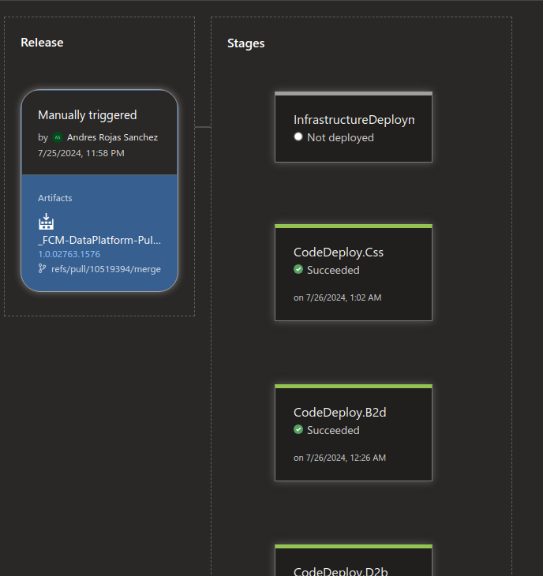
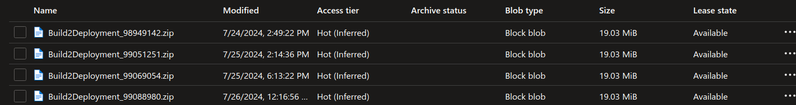
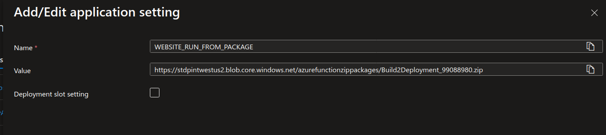
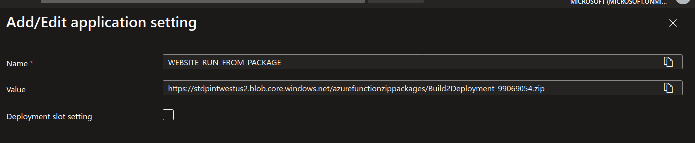
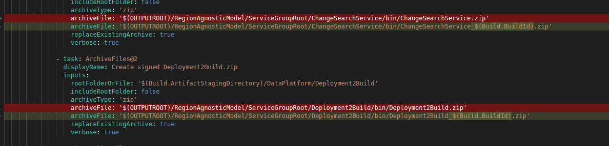
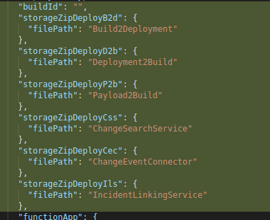
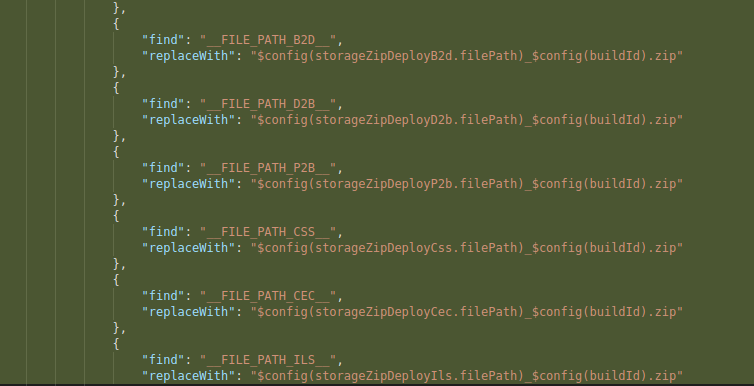
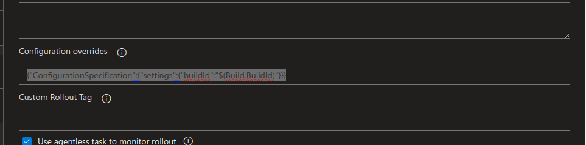

# MSI Rollback for Azure Functions

## Purpose

Purpose of this document is to outline the rollback mechanism for MSI enabled functions. To briefly recap, non-MSI functions use the elastic premium (EP) plan that leverages files shares which are not compatible with MSI. To circumvent this, we moved over to using dedicated premium (P1v) plans that can forego using the file share in favor of using a storage account as the hosting location for code bits. Due to this move, we reconfigured our rollback mechanism to be compliant with MSI while also adhering to standard practices.

## High Level Summary of Changes

- Modify Build pipeline to append `BuildId` to the end of the zip package for tracking purposes. 
- Modify the release pipeline to override `BuildId` in the config json.
- Create a new arm template for only updating the app settings of the staging slot
- Modify `RolloutSpec.CodeDeploy` to be use the new arm template from (3)

## Example Release

- Release: https://msazure.visualstudio.com/DefaultCollection/One/_releaseProgress?releaseId=13876783&_a=release-pipeline-progress
- Build: https://msazure.visualstudio.com/DefaultCollection/One/_build/results?buildId=99088980&view=results


- `BuildId`: 99088980



- Storage Container:



- Production Slot App Settings:



- Staging Slot App Settings:



## Explanation of Changes

For template references, check out the [pull request](https://msazure.visualstudio.com/One/_git/FCM-DataPlatform/pullrequest/10519394?_a=files&path=/.deploy/RegionAgnosticModel/ServiceGroupRoot/Build2Deployment/ArmTemplates/FunctionApp-Staging.AppSettings.Template.json).

### Append `BuildId` to Zip Packages

Modify build pipeline to add `Build.BuildId` to the end of the package:



Add updated package name in the config and scope bindings:







### Modify release pipe

Within the task, override the `BuildId` value with the environment variable from the pipeline:

```json
{"ConfigurationSpecification":{"settings":{"buildId":"$(Build.BuildId)"}}}
```



### Create arm template to only dpeloy app settings for the `staging` slot

Create a new arm template for updating app settings to the `staging` slot (and also the corresponding parameters file):

https://msazure.visualstudio.com/One/_git/FCM-DataPlatform/pullrequest/10519394?_a=files&path=/.deploy/RegionAgnosticModel/ServiceGroupRoot/Deployment2Build/Parameters/FunctionApp-Staging.AppSettings.Parameters.json

### Update Code Rollout Spec

Update the rollout spec for the code deploy to use the new arm template:

https://msazure.visualstudio.com/One/_git/FCM-DataPlatform/pullrequest/10519394?_a=files&path=/.deploy/RegionAgnosticModel/ServiceGroupRoot/RolloutSpecs/RolloutSpec.CodeDeploy.B2d.json