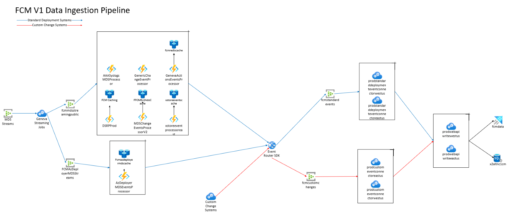
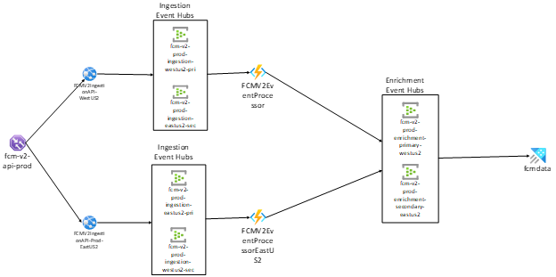

# DRI Onboarding Checklist

## Federated Change Management (FCM) DRI Onboarding Checklist

Welcome to the Team!
An engineer who is joining to FCM on call rotation must complete the following checklist before they join:

1. Have their local setup completed and be able to develop, test and deploy changes to pre-production and production environments.
    1. Change Explorer
    2. Change Card
    3. Change Guard 
2. Understand the architecture of data ingestion pipelines, both V1 and V2, and be able to identify, debug, and mitigate any issues or incidents regarding the availability or latency of the components in the pipeline. 
3. Understand how our possible causes algorithm works 
    1. Complete incident cause analysis challenge and review your answers with the team 
4. Be able to get JIT access to production resources 

    
### 1) Local Setup
- To gain access to repos and projects add yourself to fcmfc SG in idweb [Security Groups (microsoft.com)](https://idweb.microsoft.com/identitymanagement/aspx/groups/AllGroups.aspx)
- To gain access to FCM Kusto add yourself to FCMUsers SG in idweb [Security Groups (microsoft.com)](https://idweb.microsoft.com/identitymanagement/aspx/groups/AllGroups.aspx)
- FCM Production Kusto Cluster: [https://fcmdata.kusto.windows.net](https://fcmdata.kusto.windows.net/)
- FCM PPE Kusto Cluster: https://fcmdatappe.westus2.kusto.windows.net
- ICM Kusto Cluster: [https://icmcluster.kusto.windows.net](https://icmcluster.kusto.windows.net/) (To gain access, email to ICMSupport if you don't have access)
- Request permission to get added to the FCMINTKV Key Vault [here](https://ms.portal.azure.com/#@microsoft.onmicrosoft.com/resource/subscriptions/e1573d42-0032-4eb9-a4e3-2f7a429afb81/resourceGroups/fcmmdspipeint/providers/Microsoft.KeyVault/vaults/FCMINTKV/overview)

#### Change Explorer
-  [Setup FCM WebAPI on your machine (sharepoint.com)](https://microsoft.sharepoint.com/teams/FCMEngineering/_layouts/15/Doc.aspx?sourcedoc=%7Bb08b4c2a-7718-43fb-bb2c-9af02fb88d59%7D&amp;action=edit&amp;wd=target%28Initial%20Setup.one%7C45e89fe3-0ffc-40b8-baf8-eec345d913eb%2FChange%20Explorer%20Initial%20Setup%7Ce3ae5fe8-56b7-4560-9911-109dd7c2dd06%2F%29&amp;share=IgEqTIuwGHf7Q7ssmvAvuI1ZAVQkszzpuwmu9Xx83mZLQEI)

#### Change Card
-  WebAPI: [Setup FCM WebAPI on your machine (sharepoint.com)](https://microsoft.sharepoint.com/teams/FCMEngineering/_layouts/15/Doc.aspx?sourcedoc=%7Bb08b4c2a-7718-43fb-bb2c-9af02fb88d59%7D&amp;action=edit&amp;wd=target%28Initial%20Setup.one%7C45e89fe3-0ffc-40b8-baf8-eec345d913eb%2FRun%20FCM%20Web%20API%20Locally%7C4e80fa52-c2b3-4679-9718-63a15af6cd0f%2F%29&amp;share=IgEqTIuwGHf7Q7ssmvAvuI1ZAVQkszzpuwmu9Xx83mZLQEI)
-  StandAloneWidget: TBD

#### Change Guard
- Pre-requisites: [Change Guard Notebook (sharepoint.com)](https://microsoft.sharepoint.com/teams/WAG/EngSys/ServiceMgmt/ChangeMgmt/ChangeGuard/_layouts/15/Doc.aspx?sourcedoc=%7bb1511488-1e3b-45b8-b1f3-b0b89a26b27a%7d&amp;action=edit&amp;wd=target%28Developer%20Scenario%20Testing.one%7C1bb75088-2e9b-4fe5-b004-eb1adf6d9554%2FLocal%20Machine%20Pre-Requisites%7C154e24e3-8ff4-48d8-89c8-3a0934cd0b1a%2F%29)
- Running Tests Locally: [Change Guard Notebook (sharepoint.com)](https://microsoft.sharepoint.com/teams/WAG/EngSys/ServiceMgmt/ChangeMgmt/ChangeGuard/_layouts/15/Doc.aspx?sourcedoc=%7bb1511488-1e3b-45b8-b1f3-b0b89a26b27a%7d&amp;action=edit&amp;wd=target%28Developer%20Scenario%20Testing.one%7C1bb75088-2e9b-4fe5-b004-eb1adf6d9554%2FRunning%20Scenario%20Tests%20locally%7C73c97c4c-2b56-4c85-b140-d218008ebee4%2F%29)
- Setup UI Locally: [Change Guard Notebook (sharepoint.com)](https://microsoft.sharepoint.com/teams/WAG/EngSys/ServiceMgmt/ChangeMgmt/ChangeGuard/_layouts/15/Doc.aspx?sourcedoc=%7bb1511488-1e3b-45b8-b1f3-b0b89a26b27a%7d&amp;action=edit&amp;wd=target%28Onboarding.one%7C6045f7cd-1d48-4560-83f6-09b0af6785d6%2FChange%20Guard%20UI%20setup%20on%20your%20machine%7Cfd1fa64b-365f-4885-ae5d-9c3adff3ddff%2F%29)
- Deploy Change Guard Backend Prod:
    1. [Watch 'Change Guard KT 5' | Microsoft Stream](https://msit.microsoftstream.com/video/0aba0840-98dc-a228-16b1-f1ec9408e08c?list=studio)
    2. [Watch 'Change Guard KT 6' | Microsoft Stream](https://msit.microsoftstream.com/video/0aba0840-98dc-a228-f19a-f1ec940903a5?list=studio)

        

### 2) Data Ingestion Pipeline

FCM gets data from standard change systems (Ev2, AzDeployer, GenevaActions, etc) and custom change systems, which are the systems that directly send their data to FCM.

In V1 pipeline, we get the changes from standard change systems by reading the events from their MDS streams. In order to do that, FCM team creates the Geneva Streaming Jobs which is composed of a .kql file and .json file. KQL file contains the query that we use to collect the data from MDS stream and it puts the data in the MDS stream in to the format/schema that we want. JSON file is config file that contains information about the MDS stream endpoint, namespace, event that we are going to read the events from. After reading the events from MDS streams, we publish them into Event Hubs.

Then, we read these events from Event Hubs using MDS Event Processors. These processors are Azure Function Apps that we write to process and enrich the data that we published into event hubs. The type of enrichments that we do is to find out some critical information such as the Service Tree Id of the service that owns the change event. After we do these processing, we use the Event Router SDK to send change events to FCM.

From this point forward, everything is the same for standard and custom change systems. Event Router SDK publishes the events into separate event hubs from standard and custom change systems for scalability purposes. Then, we have Cloud Services (Extended Support) connectors, which reads the events from event hubs and calls our Web API to store the data in our Kusto and SQL dbs.

FCM V1 Data Ingestion Pipeline Dashboard (You need JIT access to MSG Starbust - CHM Prod subscription): [FCM Data Ingestion Dashboard - Microsoft Azure](https://ms.portal.azure.com/#@MSAzureCloud.onmicrosoft.com/dashboard/arm/subscriptions/fbc17084-a3a3-42bf-a9dc-8bc7f996a679/resourceGroups/dashboards/providers/Microsoft.Portal/dashboards/cb6ec979-0a80-4601-9760-a0a3a6188c28)

V1 Pipeline Knowledge Transfer Video: [Watch 'Knowledge Transfer' | Microsoft Stream](https://msit.microsoftstream.com/video/fcfaa3ff-0400-85a8-98fa-f1eb7564062b)

#### FCM V2 Ingestion Pipeline:

The new pipeline is designed to ingest data into FCM Kusto using the Change Event V2 Schema. The new pipeline exposes an API endpoint that users can use to send post requests to publish change events to FCM. Once the API call is made, our traffic manager will direct the requests to one of the identical App Services that we have. We have two App Services for scalability and disaster recovery purposes. Then, these app services will publish the events to our ingestion event hubs. These event hubs are configured to have geo-recovery as well. In the diagram below, the event hubs with names that ends with "pri" represents the primary event hubs and the ones that ends with "sec" represent the secondary event hubs which will be used to do failover in case of a disaster. After the events are published to our event hubs, our Azure Function Apps which can be used for processing and enriching events read these change events and then, publish them to our enrichment event hubs. Then, we use streaming ingestion from our enrichment event hubs to our production Kusto cluster in order to store the change events.

ChangeEventV2 Schema: [ChangeSchema\_Modified\_v21.docx](https://microsoft.sharepoint.com/:w:/r/teams/WAG/EngSys/ServiceMgmt/ChangeMgmt/Shared%20Documents/Requirements/ChangeSchema_Modified_v21.docx?d=w6cc72dca9a694a68a9b7bbc00968d570&amp;csf=1&amp;web=1&amp;e=P0SSXS)

FCM V2 Pipeline Dashboard: [FCM V2 Pipeline - Microsoft Azure](https://ms.portal.azure.com/#@MSAzureCloud.onmicrosoft.com/dashboard/arm/subscriptions/8830ba56-a476-4d01-b6ac-d3ee790383dc/resourceGroups/dashboards/providers/Microsoft.Portal/dashboards/b40b5838-1159-4a01-bdf2-de8a23e2aba2)

Repo: [FCM-IngestionPipeline - Repos (visualstudio.com)](https://msazure.visualstudio.com/One/_git/FCM-IngestionPipeline)

### 3) Understanding Possible Causes Algorithm

Possible Causes Algorithm Flow Chart: [PossibleCausesAlgoFlowChart.vsdx](https://microsoft-my.sharepoint.com/:u:/p/ontuna/EY9JD-fy8bpEtV2Y720cDtEB0UlXBeiz1ko-RVby9E5XMA?e=3HE1ct)

Possible Causes Algorithm Knowledge Transfer: [Watch 'Possible Causes Algorithm Review' | Microsoft Stream](https://msit.microsoftstream.com/video/6a13a1ff-0400-b564-b2a1-f1eb6d885048?list=studio)

**Challenge**:

For incident with Id 280298244, answer the following questions:

Incident Related Questions:

1. Incident Owning Service/Owning Team name
1. Incident Owning Service/Team Service Tree Id
1. Is there a valid location provided in the incident? How do you know the location is valid?
1. If there is a valid location, what is it?
1. Is there a change linked to the incident?
    
Change Related Questions:

1. Does the linked change have valid attribution for service?
1. If there is a valid attribution for service, what is the service tree id?
1. Does the linked change have valid attribution for location? How do you know the location is valid?
1. If there is a valid attribution for location, what is the location?

Possible Causes Algorithm Related Questions:

1. Did FCM Change Card show the change before mitigation? If not, why?
1. Did FCM Change Card show the change in top 5? If not, why?
1. If we didn't show the change in top 5 before the mitigation, what's the main reason?
1. Did the service team link the change during post mortem or did any of their change in the incident helped FCM Change Card to show culprit change?

Action Items:

1. Are there any action items for FCM? If there are? what are they?

In order to answer the questions above, you can and should use:
    - PossibleCauses API
    - Kusto tables
         1. ChangeEvent
         2. IncidentChangeLogV3
         3. AzureTopology\_FCM\_Tags\_Search
         4. ServiceTree\_Service
    - ICM and ICM Kusto Cluster

### 4) Getting JIT Access to Production Resources

JIT (Just In Time Access) is required to access to production resources. You can only get this access using your SAW (secure access workspace machine) and by using your YubiKey/SmartCard.

- Request for SAW machine by reaching out to your business admin. This is the same person who has connected with you regarding your Microsoft equipment and devices. The device takes around 2 weeks to get delivered home (during Covid-19 WFH policy) so please follow [these](https://strikecommunity.azurewebsites.net/articles/1069/ame-account-creation-and-yubikey-request.html) steps to request creation of an AME account on your behalf. This account can be created/requested only with AME credentials so someone from the team will create one for you and the manager will then approve their request [here](https://aka.ms/OneIdentityApprovals).
- Request for a YubiKey ([here](https://microsoft.sharepoint.com/teams/cdocidm)). This is required to gain access to the production systems and to get credentials for some local development environments of the team. Follow [these](https://microsoft.sharepoint.com/teams/CDOCIDM/SitePages/YubiKey-Management.aspx) steps to setup your YubiKey once the AME account has been approved.
- Follow these steps to setup your SAW machine ([here](https://microsoft.sharepoint.com/sites/Security_Tools_Services/SitePages/SAS/SAW-Re-Image-or-New-OS-Install-Guide.aspx)). More details about SAW can be found here for curious folks.

Once you have these, you also need to join the following security groups at aka.ms/oneidentity using your SAW machine for getting JIT request for FCM:

- AME\\fcm-approvers
- ame\\sc-fcmsgjit
- ame\\sc-ame-fcmjit

Once you have all of these done, in order to get a JIT access, go to [https:/jitacess.security.core.windows.net/Requests](https:/jitacess.security.core.windows.net/Requests) using your SAW machine.

Go to Submit Requests Tab:
- **Work Item Source:** ICM,
- **Work Item Id:** Any Active Incident that we have (Find our incidents here: [Advanced Incidents Search - IcM (microsofticm.com)](https://portal.microsofticm.com/imp/v3/incidents/search/advanced))
- **Justification:** "Portal Access"
- **Resource Type:** Portal
- **SubscriptionId**:fbc17084-a3a3-42bf-a9dc-8bc7f996a679 ([MSG Starburst - CHM PROD](https://ms.portal.azure.com/#@MSAzureCloud.onmicrosoft.com/resource/subscriptions/fbc17084-a3a3-42bf-a9dc-8bc7f996a679)) or 8830ba56-a476-4d01-b6ac-d3ee790383dc (FCMProduction)
- **Access Level**: Administrator

Then you can submit your JIT Request. Once it's approved, you'll have access to our production resources.

#### Other Important Links:

**TSGs:**

- ChangeCard/ChangeExplorer: [troubleshooting - Repos (visualstudio.com)](https://msazure.visualstudio.com/One/_git/EngSys-ChangeManagement-FCM?path=/enghub/troubleshooting)
- Change Guard: [Change Guard Notebook (sharepoint.com)](https://microsoft.sharepoint.com/teams/WAG/EngSys/ServiceMgmt/ChangeMgmt/ChangeGuard/_layouts/15/Doc.aspx?sourcedoc=%7bb1511488-1e3b-45b8-b1f3-b0b89a26b27a%7d&amp;action=edit&amp;wd=target%28Troubleshooting.one%7C2fdcc0e4-aa93-405a-b163-1619b8f9f12a%2FHow%20to%20add%20an%20approver%20delegate%20for%20Change%20Guard%7Ce11aabfb-06ca-438f-8447-ffa6cdea7366%2F%29)

**Dashboards:**
- Weekly Ops Dashboard (Requires JIT access): [FCM Weekly Ops Dashboard - Microsoft Azure](https://ms.portal.azure.com/#@MSAzureCloud.onmicrosoft.com/dashboard/arm/subscriptions/fbc17084-a3a3-42bf-a9dc-8bc7f996a679/resourceGroups/dashboards/providers/Microsoft.Portal/dashboards/db9015ef-914d-4e59-be0f-e8daa312b247)
- FCM Incidents: [Advanced Incidents Search - IcM (microsofticm.com)](https://portal.microsofticm.com/imp/v3/incidents/search/advanced)

**Other:**
    
All FCM Subscriptions can be found here: [Service: Federated Change Management (msftcloudes.com)](https://servicetree.msftcloudes.com/main.html#/ServiceModel/Service/Subscription/889acfb9-923f-4e3f-9bf2-2a3f9d95fe4f)
