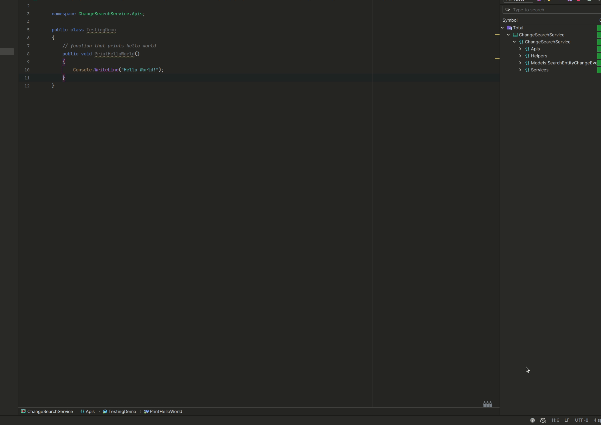

# CoPilot Guide for Development

## What is CoPilot?

CoPilot (officially known as [GitHub CoPilot](https://github.com/features/copilot)) is an AI developer tool to assist programmers in constructing new code. It is multi-platform and can be integrated into many popular existing IDE solutions for various programming languages. It follows the [prompt engineering](https://en.wikipedia.org/wiki/Prompt_engineering) model where in-line comments are evaluated by CoPilot and executed:


Effectively using CoPilot is a great way to [improve developer productivity](https://github.blog/2022-09-07-research-quantifying-github-copilots-impact-on-developer-productivity-and-happiness/), giving programmers more time to work on the things that matter, like feature refinement and system improvements, without getting bogged down by searching [StackOverflow](https://stackoverflow.microsoft.com/) or other internal boards for code assistance. It also helps developers write unit tests to ensure stability in their code, and can even be extended to other tasks, such as ARM template generation (though this one is a bit tricky and still WIP). This document aims to help set up developers to utilize CoPilot effectively.

## Setting up

To start, you must enable CoPilot usage through your GitHub enterprise account. Information can be found at [aka.ms/copilot](https://repos.opensource.microsoft.com/orgs/MicrosoftCopilot).

Your GitHub enterprise account is `[alias]_microsoft` and is tied to Microsoft. You will use this account to authenticate when signing in to GitHub CoPilot in your preferred IDE; not your `[alias]@microsoft.com` id.




>[!WARNING] Make sure to review the [CoPilot guidelines](https://docs.opensource.microsoft.com/legal/cela-guidance/copilot/) and ensure you're using the product appropriately by Microsoft standards.

### VSCode

To install in VSCode, use the instructions found in the [GitHub CoPilot for VSCode](https://marketplace.visualstudio.com/items?itemName=GitHub.copilot) extension page. It can be done either through the extension manage UI or by executing the following command into VSCode Quick Open:

```bash
ext install GitHub.copilot
```

Authorization follows the same flow as above.

### Visual Studio

To install in Visual studio, ensure you are using `version 2022 17.5.5` or later. Instructions can be found in the [GitHub CoPilot for Visual Studio](https://marketplace.visualstudio.com/items?itemName=GitHub.copilotvs) extension page.


### Rider

For folks using C# and IntelliJ, you can follow the instructions on the [GitHub CoPilot for IntelliJ](https://plugins.jetbrains.com/plugin/17718-github-copilot) extension page. 


### CodeSpaces 

For folks who utilize a containerized solution for development, you can pre-package CoPilot into your environment without having to install it using [GitHub CodeSpaces](https://github.com/features/codespaces). This lets you create a container that has all extensions and dependencies needed to run your code that can be easily passed along to folks without having them do their own installation. Below is an example of a codespace we generated for `FCM-DataPlatform` (note that this integrates with ADO repos):

**devcontainer.json**
```json
{
    "name": "Azure Functions & C# - .NET 6 (Isolated)",
    "dockerFile": "Dockerfile",
    "forwardPorts": [
        7071
    ],
    "features": {
        "ghcr.io/microsoft/codespace-features/artifacts-helper:latest": {},
        "ghcr.io/microsoft/codespace-features/external-repository:latest": {
            "cloneUrl": "https://dev.azure.com/msazure/One/_git/FCM-DataPlatform",
            "folder": "/workspaces/ado-repos"
        },
        "ghcr.io/devcontainers/features/azure-cli:1": {}
    },
    "workspaceFolder": "/workspaces/ado-repos",
    "initializeCommand": "mkdir -p ${localWorkspaceFolder}/../ado-repos",
    "postStartCommand": "external-git clone",
    "postAttachCommand": "external-git config",
    "customizations": {
        "vscode": {
            "extensions": [
                "GitHub.copilot",
                "ms-dotnettools.csdevkit",
                "ms-dotnettools.csharp",
                "ms-azuretools.vscode-azurefunctions",
                "ms-vscode.vscode-node-azure-pack",
                "mohsen1.prettify-json",
                "ms-azuretools.vscode-docker"
            ]
        }
    },
    "remoteUser": "vscode"
}
```

**Dockerfile**

```json
# Find the Dockerfile at this URL
# https://github.com/Azure/azure-functions-docker/blob/dev/host/4/bullseye/amd64/dotnet/dotnet-isolated/dotnet-isolated-core-tools.Dockerfile
FROM mcr.microsoft.com/azure-functions/dotnet-isolated:4-dotnet-isolated6.0-core-tools

RUN apt-get update && apt-get install -y xdg-utils
```

For more details on onboarding to CodeSpaces, see the [GIM  (GitHub Inside Microsoft) CodeSpaces](https://eng.ms/docs/more/github-inside-microsoft/troubleshoot/codespaces) guide.

### Azure Dev Box

Finally, for folks who use [Azure Dev Box](https://eng.ms/docs/cloud-ai-platform/azure-core/one-fleet-platform/one-fleet-platform-timmall/azure-core-build-engineering/azure-core-engineering-services/products-and-services/devbox), you can install the plugin after installing any of the IDEs above. Note that for the `C+AI` org, we have a base image with pre-installed software (like VS2022 Enterprise Edition). Similar to the docker container, we could potentially add dependencies so users wouldn't have to install them, but I am not too familiar with this. For further details, see [Cloud Development Environments for C+AI](https://microsoft.sharepoint.com/teams/ESOurWOWCC/SitePages/Cloud-Development-Environment-for-C+AI.aspx#supported-teams-orgs-and-relevant-contacts). 

## Using CoPilot to Develop Code + Unit Tests

Let's take a concrete example to develop a REST API with unit tests. To simplify things, let's imagine we're adding a new api through Azure Functions. We might start with the following prompt:


The output of this first prompt is:

```c#
    // http trigger function that prints hello world
    [FunctionName("PrintHelloWorld")]
    public static async Task<IActionResult> Run(
        [HttpTrigger(AuthorizationLevel.Function, "get", "post", Route = null)] HttpRequest req,
        ILogger log)
    {
        log.LogInformation("C# HTTP trigger function processed a request.");

        PrintHelloWorld();

        return new OkResult();
    }
```

How do we know that it's correct? CoPilot isn't magic, and developer awareness is required when validating that the output is correct. In this instance, we know that [recommended practice is to utilized isolated functions](https://learn.microsoft.com/en-us/azure/azure-functions/dotnet-isolated-process-guide), so the signature of this function is incorrect. Let's see if we can improve it:


```c#
    // http trigger isolated function that prints hello world
    [Function(nameof(PrintHelloWorld))]
    public async Task<HttpResponseData> PrintHelloWorld(
        [HttpTrigger(AuthorizationLevel.Function, "get", Route = "printHelloWorld")]
        HttpRequestData req)
    {
        Console.WriteLine("Hello World!");
        return req.CreateResponse(HttpStatusCode.OK);
    }
```

Notice that being specific, even just a little bit, improves the output of CoPilot vastly. However, it is up to the developer to determine if the output is appropriate based on their needs.

Now let's move onto something a tiny more complex using the following prompt:

```c#
// http trigger isolated function that accepts a datetime query parameter and returns time in epoch
```


Again, let's check if this is outputting the correct information. It's not, since the query parameter is not being parsed anywhere. Let's be a bit more specific with our prompt:


Invoking a request using the url `http://localhost:7071/api/epochTime?dateTime=2023-08-20` yields the following:


Great, so now we have this code to work with; let's write some unit tests.

```c#
namespace ChangeSearchService.Apis;
using System.Net;
using System.Text.Json;
using System.Web;
using Microsoft.Azure.Functions.Worker;
using Microsoft.Azure.Functions.Worker.Http;

public class TestingDemo
{
    // function that prints hello world
    public void PrintHelloWorld()
    {
        Console.WriteLine("Hello World!");
    }

    // http trigger isolated function that takes in a query parameter named dateTime and returns the epoch time
    [Function(nameof(GetEpochTime))]
    public async Task<HttpResponseData> GetEpochTime(
        [HttpTrigger(AuthorizationLevel.Function, "get", Route = "epochTime")]
        HttpRequestData req,
        FunctionContext executionContext)
    {
        var dateTime = HttpUtility.ParseQueryString(req.Url.Query).Get("dateTime");
        var res = req.CreateResponse(HttpStatusCode.OK);
        res.Headers.Add("Content-Type", "application/json; charset=utf-8");
        await res.WriteStringAsync(JsonSerializer.Serialize(new { epochTime = DateTime.Parse(dateTime).ToUniversalTime().Subtract(new DateTime(1970, 1, 1)).TotalSeconds }));
        return res;
    }
}
```

Before we begin, let's check the code coverage (a requirement in Azure Core is 80% code coverage diff on PRs; for more details, see [code coverage onboarding](https://eng.ms/docs/cloud-ai-platform/azure-core/azure-core-docs/development-cycle/test/code-coverage-onboarding))


Let's add code coverage for our `GetEpochTime` API using [NUnit](https://nunit.org/). To start off, let's go with the following skeleton:

```c#
using ChangeSearchService.Apis;
using ChangeSearchServiceTests.TestDoubles;

namespace ChangeSearchServiceTests.Apis;

public class TestingDemoTests
{

    private TestingDemo _testingDemo;

    // setup method to create internal TestingDemo object
    [SetUp]
    public void Setup()
    {
        _testingDemo = new TestingDemo();
    }
    
    // method to test GetEpochTime
    [Test]
    public void GetEpochTimeTest()
    {
    }
```

Now let's build our first test with CoPilot:


We get a successful test:


This is a happy case; what happens when the dateTime query paremeter isn't passed, or is something else? Let's improve our code by having CoPilot do some test driven development (TDD). Notice that as more code is written into the project, CoPilot is better able to understand what the user wants from it. In the first test, I had to comment what I wanted CoPilot to do explicitely; in this test, it knows exactly what to look write. 


And as expected, the test fails because we fail to validate the input.


Let's go back and fix that with CoPilot :)


Our code now is 

```c#
[Function(nameof(GetEpochTime))]
    public async Task<HttpResponseData> GetEpochTime(
        [HttpTrigger(AuthorizationLevel.Function, "get", Route = "epochTime")]
        HttpRequestData req,
        FunctionContext executionContext)
    {
        // validate that the dateTime query parameter is present and be parsed into a datetime object
        if (string.IsNullOrEmpty(HttpUtility.ParseQueryString(req.Url.Query).Get("dateTime")) ||
            !DateTime.TryParse(HttpUtility.ParseQueryString(req.Url.Query).Get("dateTime"), out _))
        {
            return req.CreateResponse(HttpStatusCode.BadRequest);
        }

        var dateTime = HttpUtility.ParseQueryString(req.Url.Query).Get("dateTime");
        var res = req.CreateResponse(HttpStatusCode.OK);
        res.Headers.Add("Content-Type", "application/json; charset=utf-8");
        await res.WriteStringAsync(JsonSerializer.Serialize(new { epochTime = DateTime.Parse(dateTime).ToUniversalTime().Subtract(new DateTime(1970, 1, 1)).TotalSeconds }));
        return res;
    }
```

And rerunning our test again yields the appropriate output:


And again, going back to maintaining a high testing bar, we can run the code coverage check again and see that we have satisfied the requirements set out in Azure Core:


## Final Remarks + Open Questions

I hope this short introduction on how to leverage GitHub CoPilot was helpful for you. By no means am I an expert, and many of my learnings have come with plenty of stumbles and hand holding of the tool. However, once you get the knack of it, the productivity gains are immense. Therefore, I encourage everyone to utilize it whenever possible. 

Questions...?

