# Deployment Guidance

## Purpose

The purpose of this document is to outline fundamental practices we must employ as part of our deployments for FCM components. Before deploying a component, ensure that it meets the following requirements so that we can ensure a high level of confidence and deliver a stable product to our customers. 

- Key takeaways:
    - Ensure that all code is unit tested and approved by at least two people.
    - Ensure that pipeline builds are always healthy and building.
    - Strive to achieve >90% code coverage. 
    - Address any vulnerabitlies as part of codeql.
    - Release gradually from int to ppe to prod.
    - For prod deployments, release in order of canary, pilot and then region pairs with a minimum 4 broad/heavy regions. 
    - Allow the SDP mandated baketime in between deployments.
    - Only deploy using RA Ev2; do not deploy using Ev2 classic.
    - Scrutinize one way door deployments. Sync up with stakeholders to ensure no interruption to clients.
    - Ensure there is an effective rollback mechanism in place. Test it dev and ppe environments before deploying to prod.
    - Ensure that every component has integration tests built into the release pipeline.
    - Do not deploy on a Friday.
    - Create a canary to constantly invoke our service and ensure availability/latency metrics are stable.
    - Utilize a Manual Change Management (MCM) template to document manual testing. 
    - Monitor relevant dashboards to ensure that key metrics, like availability or latency, aren't negatively impacted by the deployment.
    - Ensure that alarms are functional and ICM tickets arising from the deployment at Sev2 priority.
    - DRI is not responsible for monitoring the code. The implementor must ensure successful deployment to the last region.

> [!NOTE] 
> This document will be periodically reviewed and updated with the latest best practices.

## Requirements

### Code Requirements

#### PullRequests:

- All pull requests must have [work items linked](https://learn.microsoft.com/en-us/azure/devops/boards/backlogs/add-link?view=azure-devops) to ensure proper tracking.
- Minimum of [two approvers](https://learn.microsoft.com/en-us/azure/devops/repos/git/branch-policies?view=azure-devops&tabs=browser) to merge; this is set by default as a branch policy to `develop` and `main`.
    - Example [policies](https://msazure.visualstudio.com/DefaultCollection/One/_settings/repositories?_a=policiesMid&repo=25418867-b301-4e54-8e42-f0af51b19a02&refs=refs/heads/develop) for the above two points:

    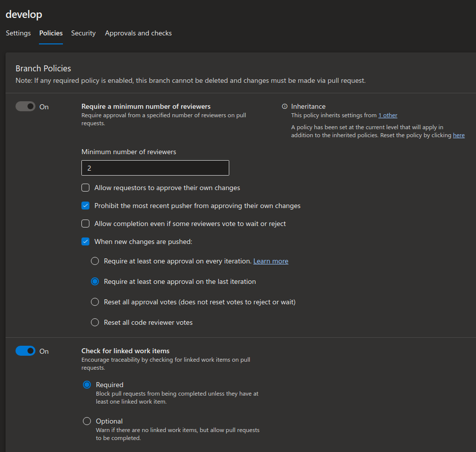
- All comments must be resolved, including nits. For larger tasks that are outside of the scope of the PR create backlog tasks and link them accordingly.
- If a merge to `main` occurs, the deployment to production must be executed immediately to avoid code buildup when syncing from `develop`.
- As part of the PR, the code must build using the `<REPO>-PullRequestBuild` pipeline.
    - Successful [build for cev2](https://msazure.visualstudio.com/DefaultCollection/One/_git/FCM-ChangeExplorer-Backend/pullrequest/10439644) in the PR build pipeline:

    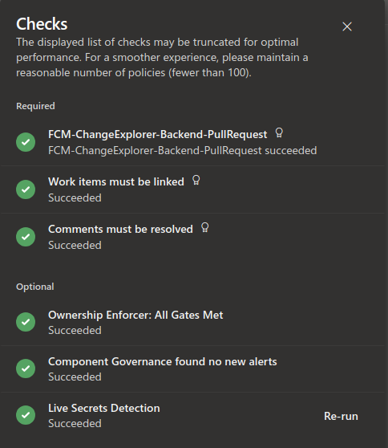


#### Builds:
- Any code merged into the `develop` and `main` branches must build using it's appropriate build pipeline i.e. **PullRequest** or **Official**.
- As part of the build, all vulnerabilities must be indexed and uploaded to [codeql](https://liquid.microsoft.com/Home/Support?copilot=1). Remediate these vulnerabilities as flagged by the tool. *Note that this is done automatically as part of S360*.
    - CodeQL logs can be retrieved from the build output on `Official` builds; [example log](https://msazure.visualstudio.com/DefaultCollection/One/_build/results?buildId=97224658&view=logs&j=1e5b7110-b3d4-52bb-6e5b-213256ced4e3&t=0ba3391b-d4e6-52cb-e383-4f8640a37b59):

```
Upload finished.
##[verbose]Saving environment properties.
##[verbose]Saving configuration variables.
##[verbose]Saving status properties.
__________________________________________________________________________________________________________________________________________
|Language              |Status                     |Message                                                                              |
|______________________|___________________________|_____________________________________________________________________________________|
|csharp                |database finalized         |                                                                                     |
|______________________|___________________________|_____________________________________________________________________________________|
|csharp                |database uploaded          |https://codeql.microsoft.com/job/9c6f2fb5-ec8d-4538-93fd-c1c144ce454e                |
|                      |                           |S360 should be updated within 48 hours after analysis completes in CodeQL Central    |
|                      |                           |See https://aka.ms/codeql3000-faq#how-do-i-know-scans-are-working-and-complete       |
|______________________|___________________________|_____________________________________________________________________________________|
|powershell            |database finalize failed   |Database failed to finalize or no source code was built!                             |
|______________________|___________________________|_____________________________________________________________________________________|
|python                |database finalized         |                                                                                     |
|______________________|___________________________|_____________________________________________________________________________________|
|python                |database uploaded          |https://codeql.microsoft.com/job/7f887f1a-eb95-4e3e-9a1d-0ea84a8ed0d2                |
|                      |                           |S360 should be updated within 48 hours after analysis completes in CodeQL Central    |
|                      |                           |See https://aka.ms/codeql3000-faq#how-do-i-know-scans-are-working-and-complete       |
|______________________|___________________________|_____________________________________________________________________________________|
```

- Ensure that `develop` and `main` pipelines always build prior to merging code; *do not merge code if the pipeline is broken*. Create a separate PR to address the broken build and ensure it's success before merging code updates. 
#### Unit Tests:
- Ensure that any code component has unit tests implemented, typically in [nuint](https://nunit.org/) for C# packages.
    - For an example of implemented tests, see [DataPlatform tests](https://msazure.visualstudio.com/DefaultCollection/One/_git/FCM-DataPlatform?path=/tests)

    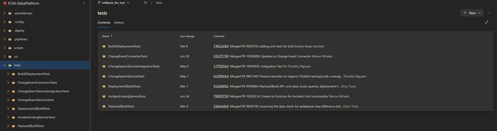
- If a code component does not have unit tests, call it out during standup. Do not wait for someone else to create a skeleton test framework; generate your own. Seek help if you're unsure on how to do this. 
- All tests must run and pass; *do not comment out failing tests or change test criteria to get a successful build*.
- [Test behavior, not implementaiton](https://nunit.org/).
- If testing proves difficult, consider refactoring the code on critical flows to allow more granular testing.
- When reviewing a code PR doesn't have unit tests added/modified, ask why. Let's make it a habit to properly unit test all code.
- Tests should be ran as part of the build and the result should be outputted to the ADO dashboard; an example of [dataplatform unit test output](https://msazure.visualstudio.com/DefaultCollection/One/_build/results?buildId=98936817&view=ms.vss-test-web.build-test-results-tab)

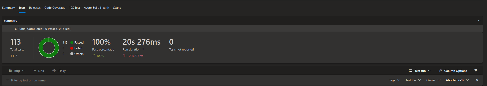

#### Code Coverage:
- As part of builds ensure that [code coverage](https://learn.microsoft.com/en-us/azure/devops/pipelines/test/review-code-coverage-results?view=azure-devops) is emmitted, usually VSTest or XPlat.
    - Example of [code coverage for dataplatform](https://msazure.visualstudio.com/DefaultCollection/One/_build/results?buildId=98936817&view=codecoverage-tab). Note that to enable the code coverage you will have to make the following modication in the build pipeline.

    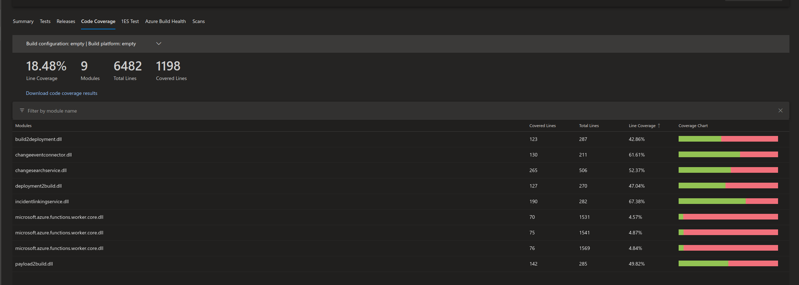

```
              - task: PublishTestResults@2
                displayName: 'Publish test results'
                inputs:
                  testResultsFormat: VSTest
                  testResultsFiles: '$(Build.SourcesDirectory)/TestResults/**/*.trx'
                  failTaskOnFailedTests: true

              - task: PublishCodeCoverageResults@2
                displayName: 'Publish code coverage results'
                inputs:
                  summaryFileLocation: '$(Build.SourcesDirectory)/TestResults/**/*.trx'
```


- Azure guidance has a requirement for [pr code coverage diff](https://eng.ms/docs/cloud-ai-platform/azure-core/azure-core-docs/development-cycle/test/code-coverage), specifically >50% for lines of changed code with a northstar of >80%.
- Internal team goal is code coverage of >90% on all branches with the aforementioned guidelines for PR code diff. 

#### Code Quality
- Code quality is tracked by [codeql](https://liquid.microsoft.com/Home/Support?copilot=1) as well as other automated systems within the ADO pull request. Address these quality concerns on a case by case basis.
- Vulnerabilities (such as updating NUGET packages) must be addressed at Sev2 severity as they are an attack vector on our system and typically an S360 flag.
- Hollistically check code on a regular basis; ask yourself if it makes sense/can be improved. Discuss with team during oncall and create a backlog to address the issues.


### Releases

#### ADO Release Pipeline

- Link releases pipelines to [OneBranch](https://eng.ms/docs/products/onebranch/onebranch). For `Production` pipelines this is mandated.
    - Pipeline linkage can be executed using the [onebranch](https://msazure.visualstudio.com/DefaultCollection/One/_apps/hub/EZStart.management-ux.onebranch-resources) tab on ADO:

    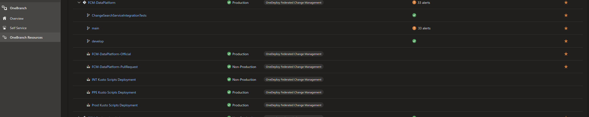
- There must be two pipelines per repo:
    - The first pipeline deploys **development** code to a dev/int environment in the MSFT tenant.
    - The second pipeline deploys **production** code to a ppe and prod environment in the AME tenant.
- If pipelines are not CI/CD, all deployments must be [manually triggered](https://learn.microsoft.com/en-us/azure/devops/pipelines/release/triggers?view=azure-devops). This includes the dev environment.
    - To determine if the pipeline is manually triggered, ensure that the `Lightning Bolt` symbol is [grayed out](https://msazure.visualstudio.com/DefaultCollection/One/_releaseDefinition?definitionId=54453&_a=environments-editor-preview):

    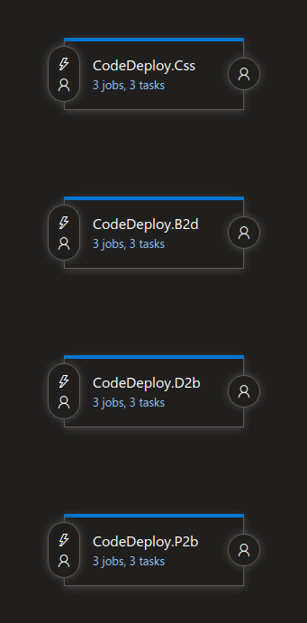
- For deploying POC code, consider generating a [buddy release](https://eng.ms/docs/products/onebranch/release/yamlreleasepipelines/manageyourpipeline) to deploy resources. This helps avoid issues with deploying potentially system breaking changes to the dev environment.
    - As an additional requirement, ensure all resources deployed with the above release are deleted if no longer in use; *do not leave stale/unused resources running as this creates operational overhead*.
- Segment releases to the most granular locations possible; typically for FCM this is at the region level. More on this later.

#### ARM Templates

- Require all changes to be deployed via [Ev2](https://ev2docs.azure.net/getting-started/overview.html) ARM templates.
- Do not use `ev2 classic` for ARM deployments; this is on deprecation. All components, unless marked for deprecation, must be deployed using [region agnostic](https://ev2docs.azure.net/references/api/new-ra-rollout.html?q=region%20agnostic) (RA) Ev2.
    - Infra that was set up initially as `ev2 classic` and then changed to `ev2 ra` would have two directories in the [`.deploy` folder](https://msazure.visualstudio.com/DefaultCollection/One/_git/FCM-DataPlatform?path=/.deploy). We should delete the `ev2 classic` directory if it's no longer in use.:

    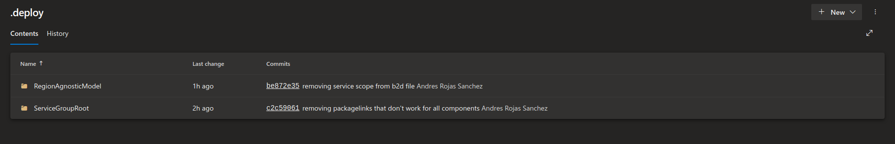
- Configure a minimum wait time/bake time when deploying changes; this is automatically configured as [1 day for deployments to the `prod` environment](https://ev2docs.azure.net/features/rollout-orchestration/managed-validation/overview.html?q=managed%20valida) through SDP.
    - Emergency deployments can have this setting overriden.
- Ev2 deployments through the pipeline will be `code` deployments (i.e. deploying bits to existing infrastructure). `infra` deployments (i.e. deployments that set up resources for the first time in a subscription) can be executed using the CLI. These are typically ran only once and not again.
    - `code` deployments are configured via the `ev2 ra` config. These would just update the code bits and not deploy any new infra, modify existing infra, assign rbac roles, etc. Example of [code config below](https://msazure.visualstudio.com/DefaultCollection/One/_git/FCM-DataPlatform?path=/.deploy/RegionAgnosticModel/ServiceGroupRoot/Config/Test.Config.json):

    ```json
    .
    .
    "monitoringGcsAuthId": "opentelcert.fcm.msftcloudes.com",
    "monitoringConfigVersion": "1.0",
    "openApiServerUrl": "https://afd-dp-int-a4f2g7dfgzfzeee0.b01.azurefd.net",
    "deploymentType": "code",
    "buildId": "98405387",
    "storageZipDeployB2d": {
      "filePath": "Build2Deployment"
    },
    .
    .
    ```

#### Regional Deployment

- Ensure that we are using [Safe deployment practices](https://ev2docs.azure.net/getting-started/sdp.html?tabs=regions) in all of our rollouts. 
- Utilize **region based progression** for all rollouts:

| Stage | Name    | Regions                      | Sequence                              |
| ----- | ------- | ---------------------------- | ------------------------------------- |
| 1     | Canary  | `East US 2 EUAP`             | Serial (these two regions are paired) |
| 2     | Pilot   | `West Central US`            | Parallel or serial                    |
| 3     | Medium  | `East US`                    |                                       |
| 4     | Heavy   | `West US`                    |                                       |
| 5     | Broad 1 | `East US 2` and `Central US` | Parallel or serial                    |
| 6+    | Broad + | For stage 5+ in highly scaled systems, deploy in [region pairs](https://eng.ms/docs/cloud-ai-platform/azure-core/azure-networking/sdn-dbansal/azure-virtual-network-manager/azure-virtual-network-manager/devops/environments/public/region-pairing) as required. | Parallel or serial |

- We must at minimum deploy our service to 1 canary, 1 pilot and 4 heavy/broad regions. All regions must be region paired.
- Bake time is mandated by SDP and auto configured; *do not bypass this* by triggering a secondary stage on the pipeline.
- Ensure that tasks [require successful prior deployment](https://learn.microsoft.com/en-us/azure/devops/pipelines/release/releases?view=azure-devops) to continue fan out.
    - For example, pilot region will require a successful deployment to the canary and the heavy region will require a successful deployment of the pilot, etc. See the [stage rollout](https://msazure.visualstudio.com/DefaultCollection/One/_releaseDefinition?definitionId=65168&_a=environments-editor-preview) as an example below.

    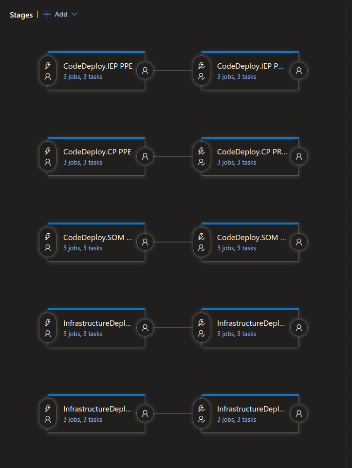
- **Do not execute deployments on Friday**. Deployments on Friday will require the DRI to address any incoming tickets that might be related to the deployment. Deploy on any other weekday during business hours.

#### SafeFly

- All deployments must have an associated [SafeFly R2d](aka.ms/r2d) request submmitted for them. Fill out the request form below prior to deployment:

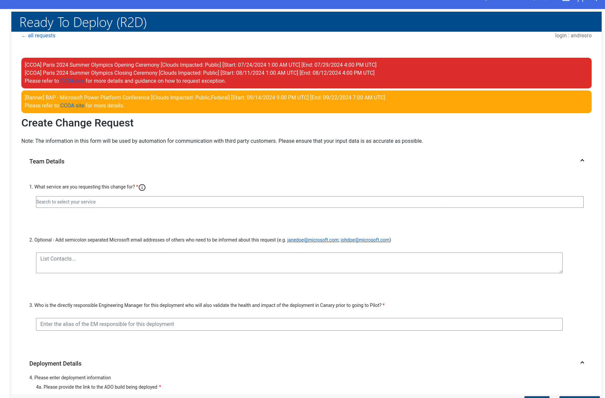


#### Rollbacks

- Before executing a deployment, ask yourself if it is a [one way or two way door](https://medium.com/one-to-n/one-way-two-way-door-decisions-a0e29029e200) deployment.
    - A one way door deployment can be thought of as irreversiable process (i.e. deploying a fixed API contract that clients will depend on).
    - A two way door deployment can be thought of as a reversible process (i.e. updating a config value to point to a different database).
- Deployments that are one way require increased scrutiny as other teams are dependent on them. For these types of changes, **ensure that you deploy in a way that does not break existing usage by clients, such as API versioning**. 
- Deployments that are two way always have rollbacks which are the ability to revert back to a known good state. Effective rollbacks are characterized by their ease of execution and fast recovery into the known good state. They should not be complicated to execute nor take an arbitarily long time to revert.
- **Before a deployment, familiarize yourself with the rollback mechanism and test it the dev and ppe environments before continuing deployment to prod**.
    - As an example, a lot of FCM's code is deployed to Azure Functions. We have opted to utilize a standard [app slot swap rollback](https://learn.microsoft.com/en-us/azure/app-service/deploy-staging-slots?tabs=portal) that is a built-in feature of functions to quickly help rollback any code change that is causing issues.
- **Rolling back problem changes should almost always be the first course of action taken when a problem arises**. In some cases, rolling forward is preferred (i.e. emergency deployment to fix a bug) although this will require manager approval. 
- Rollbacks will **not be automated** until we have confidence in a CI/CD solution. Rollbacks will be initiated by the deploying engineer after looking at relevant metric drops or the ICM ticket queue.
- All rollbacks should be documented using a TSG that has been uploaded onto [engineering hub](aka.ms/enghub). 


### Validation

#### Ev2 Health Checks

[Ev2 Health checks](https://ev2docs.azure.net/features/service-artifacts/actions/health-checks/overview.html) allow you to integrate tests to validate rollouts. There are three main ways to can leverage Ev2 Health Checks in our RA deployments:


##### Azure Monitor Checks

These health checks leverage the build in functionality of Azure Monitor resources (such as Application insights) to determine if a deployment is healthy. For example, the following will ensure that there are no failed requests for this API in the last 1H by checking application insights logs:

```json
{
    "name": "postDeployCheck2",
    "waitDuration": "PT5M",
    "maxElasticDuration": "PT30M",
    "healthyStateDuration": "PT1H",    
    "healthChecks": [
      {
          "name": "Check no failure requests",
          "request": {
            "method": "POST",
            "uri": "https://api.applicationinsights.io/v1/apps/myapp/query",
            "authentication": {
              "type": "ApiKey",
              "name": "x-api-key",
              "in": "Header",
              "valueReference": {
                "provider": "AzureKeyVault",
                "parameters": {
                    "secretId": "https://yourKeyVaultName.vault.azure.net:443/secrets/appInsightsKey"
                  }
              }
            },
            "body": {
              "query": "requests | count"
            }
        },
        "response": {
            "successStatusCodes": [
            "OK"
            ],
            "regex": {
                "matchQuantifier": "All",
                "matches": [
                  "0"
                ]
            }
        }
      }
    ]
  }
```

For more information, see [REST health check](https://ev2docs.azure.net/features/service-artifacts/actions/health-checks/rest-health-check/resthealthcheck.html).

##### ICM Health Check

ICM health checks can be used to configure our rollout to stop whenever an ICM ticket is cut to our queue. The following example demonstrates this:

```json
  [
    {
      "name": "IcMSearch",
      "waitDuration": "PT1M",
      "healthyStateDuration": "PT1M",
      "healthChecks": [
        {
          "name": "NoRecentIcMs",
          "request": {
            "method": "Get",
            "uri": "https://prod.microsofticm.com/api/cert/incidents?$filter=(CreateDate%20gt%20datetime%272022-07-11T00:00:00%27)&$select=Id&$top=101",
            "authentication": {
              "type": "Certificate",
              "valueReference": {
                "provider": "AzureKeyVault",
                "parameters": {
                  "secretId": "https://mykeyvault.vault.azure.net:443/secrets/MyIcmClientCert"
                }
              }
            }
          },
          "response": {
            "successStatusCodes": [
              "Ok"
            ],
            "regex": {
              "matchQuantifier": "Any",
              "matches": [
                "\"value\":\\s*\\[[\\n\\s]*\\]"
              ]
            }
          }
        }
      ]
    }
  ]
```


For more information, see [ICM Health Check](https://ev2docs.azure.net/features/service-artifacts/actions/health-checks/icm/overview.html)

##### Kusto Helath Check

Lastly, we can leverage Kusto health checks as well to change logs that we transfer over with Geneva using jarvis. For more information, see [Kusto Health Check](https://ev2docs.azure.net/features/service-artifacts/actions/health-checks/kusto/overview.html)


#### Integration Tests

- All components must have integrations tests built directly into the release pipeline as part of the deployment. This can be done using [vstest on ado](https://learn.microsoft.com/en-us/azure/devops/test/run-automated-tests-from-test-hub?view=azure-devops) although simpler solutions, such as generating a `*_IntegrationTests.dll` package and executing it will suffice.
    - As an example, take a look at the integration tests created for [ChangeSearchService in DP platform](https://msazure.visualstudio.com/One/_git/FCM-DataPlatform?path=/tests/ChangeSearchServiceIntegrationTests).
    - These tests can be run in the pipeline after the `ev2` release has finished using a VSTest task. As an example, check out [CSS integration tests](https://msazure.visualstudio.com/One/_releaseProgress?_a=release-task-editor&releaseId=10630859&environmentId=42679794) that was part of an intern project.

    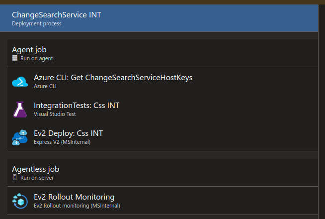
- When deploying new code, add integration tests to validate the deployed changes output the expected behavior. If modifying paths that impact existing code ensure that integration tests succeed locally before continuing with the deployment. Any test failing should be addressed as part of the PR.
- If integration testing fails do not continue the deployment. Fix the tests in a PR.

#### Canary

- Consider creating a canary to periodically invoke our services.
    - Canaries are useful in ensuring that traffic is always flowing into our services, even those that are not used often or have yet to be adopted (such as `Payload2Build`).
- Segment canary traffic into it's own dashboard to distinguish it from regular customer traffic and not introduce noise to genuine service calls.

#### Manual Tests

- If integration tests are not present or the changes deployed cannot be tested in that manner, employ a manual test using the [Manual Change Management](https://microsoft.sharepoint.com/:w:/r/teams/WAG/EngSys/ServiceMgmt/ChangeMgmt/Shared%20Documents/Engineering%20Excellence/MCMs/2024/July/FCM%20Manual%20Change%20Management%20%E2%80%93%20Update%20APIM%20Configs%20for%20DP.docx?d=wc7639d48aa284c82b5cc67e13716bdd0&csf=1&web=1&e=IXfu3R) template.
- Document every test case that will be executed and document it's success/failure to ensure proper tracking.
- Have this document and the deployment procedure review by the DRI prior to deployment into the AME tenant.  

### Monitoring

#### Dashboards

- Before deploying, ensure that you have access to the relevant metrics and logging for the services you are deploying. The key points of interest to look for are:
    - **Availability**: Is there an increase in server errors after code was deployed? If yes, **rollback immediately**.
        - Stable systems, especially those constructed as highly scaleable in the cloud, generally don't fail. Consider any minute uptick in failures as critical.  
    - **Latency**: Has the time for requests to be serviced after deployment increased significantly? If yes, **rollback immediately**.
        - Note that significantly is semi-arbitrary here; we should compare this value at P95.
    - **Exceptions**: Am I receiving more exceptions as part of a code deployment? If yes, **rollback immediately**. 
        - Exceptions can still occur in successful requests via retries. We should consider an uptick in this a failure.
    - **CPU/memory usage**: Has the CPU and/or memory usage increased? Consider if this is siginificant enough to cause degradation in the other metrics.
        - We heavily rely on [kusto](https://azure.microsoft.com/en-us/products/data-explorer) as our database of choice. Monitor the [cluster performance dashboard](https://learn.microsoft.com/en-us/azure/data-explorer/using-metrics) to ensure that it is healthy.
- **Monitor dashboards for one day after deployment completion**. A deployment can be considered **complete** after having been deployed for at least one day in the last stage.
    - Example of a dashboard with operational metrics above can be [seen here](https://kusto.azure.com/dashboards/f6687c24-35db-4cfb-a7db-34a85bdc26ec?p-_startTime=6hours&p-_endTime=now&p-_incidentId=all#20cf7b0e-18ff-4922-b915-4664a93b666e):

    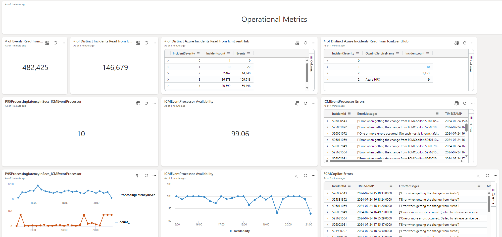

#### ICM Queue

- All of our service components should have alarms configured to alert our team in case of degradation. **Validate that these alarms are working as expected before deployment**.
- View all tickets for the FCM queue using this [ICM query](https://portal.microsofticm.com/imp/v3/incidents/search/advanced?sl=2gmgyntppxt).
- Do not wait for the DRI to engage a ticket that is related to a deployment in execution. Take initiative and mitigate the degrading deployment in addition to mitigating/resolving the ICM ticket. 

#### DRI Engagement

- **All deployments must be reviewed and approved by the DRI**. Any deployment that does not have their blessing will not get deployed.
- It is not the responsibility of the DRI to monitor deployments; take ownership of the code you're deploying and ensure it is successfully deployed to the last region.