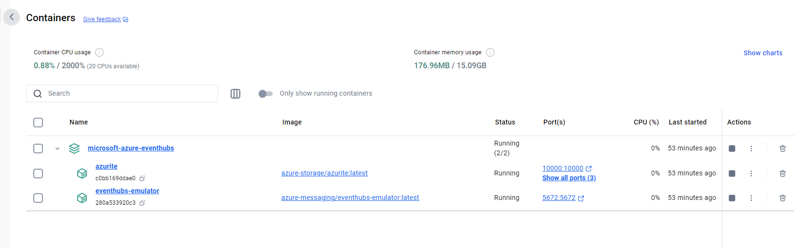

# Seting Up Local Testing Environment and Using Azure Event Hub Emulator

1) Clone [FCMAIChangeSummary](https://msazure.visualstudio.com/One/_git/FCMAIChangeSummary) repo
2) Install [Docker Desktop](https://docs.docker.com/desktop/install/windows-install/#:~:text=Install%20Docker%20Desktop%20on%20Windows%201%20Download%20the,on%20your%20choice%20of%20backend.%20...%20More%20items)
3) Clone [Azure Event Hubs Emulator](https://github.com/Azure/azure-event-hubs-emulator-installer)
4) Follow the instructions [here](https://github.com/Azure/azure-event-hubs-emulator-installer?tab=readme-ov-file#running-the-emulator) for setting up Azure Event Hubs Emulator
    -  Start Powershell in admin mode, `cd ~\azure-event-hubs-emulator-installer\EventHub-Emulator\Scripts\Windows>` and run `.\LaunchEmulator.ps1` 
5) Make sure that both the emulator and azurite is running on your docker by checking docker desktop

6) In order to run the projects locally, you need to create local.settings.json under the per project under the main directory. You can find the relative files here:
    - [FCMCopilot](https://ms.portal.azure.com/#@microsoft.onmicrosoft.com/asset/Microsoft_Azure_KeyVault/Secret/https://fcmintkv.vault.azure.net/secrets/FCMCopilotLocalSettings)
    - [ICMEventProcessor](https://ms.portal.azure.com/#@microsoft.onmicrosoft.com/asset/Microsoft_Azure_KeyVault/Secret/https://fcmintkv.vault.azure.net/secrets/ICMEventProcessorLocalSettings)

7) If you want to test GetIncidentChangesAPI only you can set it as the startup project and run it.

8) In order to test ICMEventProcessor locally, we need to start ICMEventProcessor, FCMCopilot and also LocalEventHubPublisher projects locally.
    1) Right Click on the FCMAIChangeSummary solution in SolutionExplorer and choose 'Configure Startup Projects"
	2) Select "Multiple startup projects:
	3) Create a new Launch profile and rename it accordingly (for example IEPLocal)
	4) Set "Action" column to "Start" for ICMEventProcessor, LocalEventHubPublisher, FCMCopilot projects

5) Start the project that you configured above.

# How to Test with Different Incidents 

In LocalEventHubPublisher project under the FCMAIChangeSummary solution publishes IncidentEvents to the Azure Event Hub Emulator that is running locally in Docker. It reads a list of IncidentEvents defined in JSON format in, `IncidentEvents.json` file, deserializes them to IncidentEvents and publishes those to event hub in the emulator. 

In order to test IEP with different incidents for different scenarios that you have, you can add more IncidentEvents to `IncidentEvents.json`.

