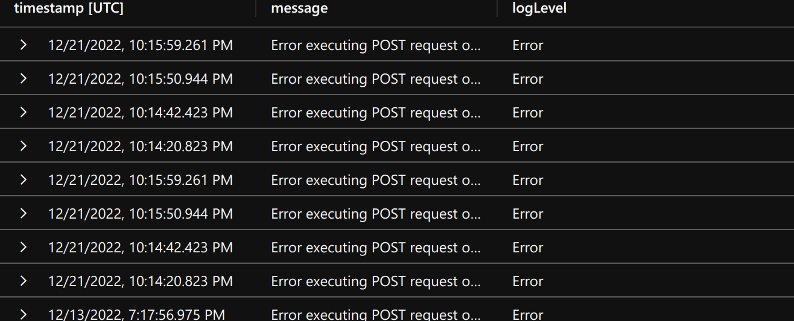

# Location Information Provider API: 5xx ResultCode


## Investigation & Mitigation Steps

> [!TIP] For understanding what we mean by "5xx resultcode", see the wiki page *[5xx server errors](https://en.wikipedia.org/wiki/List_of_HTTP_status_codes#5xx_server_errors)*.

> [!TIP] Most of the required access information below can be retrieved directly from the ticket; see the picture below:
> 

A `5xx` result code has been returned for either of the following LIP APIs (`<OPERATION_NAME>`):

- `GetLocationDetailsAsync`
- `GetMultipleLocationDetailsAsync`
- `SearchLocationsByKeywordAsync`

Investigate the error and mitigate if possible by executing the following steps:

> [!WARNING] If this is not a one-off error (i.e. all requests are failing with `5xx` errors) escalate immediately to the FCM manager. This would be considered an outage, not an availability dip.

- Get JIT access for the relevant subscription (use the auto-cut ticket as request evidence).
  - PPE: 6ac089d6-2695-4daf-95df-ea06d302b618
  - PROD: 8830ba56-a476-4d01-b6ac-d3ee790383dc
- Log into your appropriate `ame.gbl` account on the [Azure Portal](portal.azure.com).
- Go to the related Application Insights.
- Execute the following query to get a list of API requests in descending duration for the past hour (note that you must modify the `<OPERATION_NAME>`, `<ENVIRONMENT>` and `<REGION>` fields in the query below.)

```sql
requests
| project
    timestamp,
    id,
    operation_Name,
    success,
    resultCode,
    duration,
    operation_Id,
    cloud_RoleName,
    invocationId=customDimensions['InvocationId']
| where timestamp > ago(1h)
| where cloud_RoleName =~ 'LocationInformationProvider-<ENVIRONMENT>-<REGION>' and operation_Name =~ '<OPERATION_NAME>'
| where resultCode startswith "5"
```


- For every query that is returned, take note of the `operation_Id`. Join it with the `traces` and `exceptions` table to get the logs for that particular query:

```sql
requests
| project
    timestamp,
    id,
    operation_Name,
    success,
    resultCode,
    duration,
    operation_Id,
    cloud_RoleName,
    invocationId=customDimensions['InvocationId']
| where timestamp > ago(30d)
| where cloud_RoleName =~ 'LocationInformationProvider-<ENVIRONMENT>-<REGION>' and operation_Name =~ 'GetServiceChangeCountsAsync'
| order by timestamp desc
| where resultCode startswith "5"
| project operation_Id, invocationId
| join kind = leftouter traces on $left.operation_Id == $right.operation_Id
| join kind = leftouter exceptions on $left.operation_Id == $right.operation_Id
| extend invocationKeyFromTraces = tostring(customDimensions["InvocationId"])
| where invocationId == invocationKeyFromTraces
| project
    timestamp,
    message = iff(message != '', message, iff(innermostMessage != '', innermostMessage, customDimensions.['prop__{OriginalFormat}'])),
    logLevel = customDimensions.['LogLevel']
| where logLevel == "Error"
```

Results in:



- You will now have the logs. Take a look at the error message to under the issue. For example, you might get something like: `Error executing POST request on `v1/changes/{*id}` endpoint with id: 3956131. Exception Semantic error: Relop semantic error: SEM0023: The total size of the arguments exceeded the allowed limit of 53 MB`  which would help in identifying the issue. Remember to write down your analysis on the ticket so that future oncall engineers can use your findings to resolve issues quickly.

>[!NOTE] It is important to take a look at these errors to improve availability of our system. Do no disregard this type of ticket.


## Common/Known Issues

Use this section to add common/known issues. Additionally, use this section to share learnings with other engineers on how you investigated and resolved a ticket. Utilize the following format

```
### <ICM TICKET ID>: <SOME THOUGHTFUL DESCRIPTION>
```

to add a new sub-section.