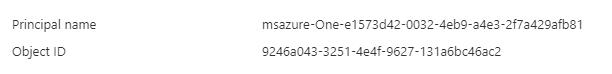
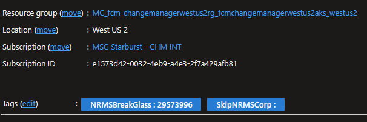

# Steps to follow when setting up an environment:

### Make sure you generate an admin kubeconfig for the cluster and add it to KV:
- The secret name, usually `aksclusterkubeconfig`, can be found in `AKS.[ENV].RolloutParameters.json` file
- The kubecontext must be admin else the token will expire and EV2 won't be able to connect to AKS
  - How to set up
    - Make sure you don't have any information in your local kubeconfig, using the command `kubectl config view`
      - If there is a cluster already saved locally you can unset it using:
        - ``` 
          kubectl config unset clusters
          kubectl config unset contexts
          kubectl config unset users
          kubectl config unset current-context
          ```
        - Double check again that the config is clean: `kubectl config view`
    - Connect to the cluster to get credentials for an admin users and save them locally to your kubeconfig
      - Use either Az CLI **or** AZ Powershell (on SAW machines Az CLI cannot be used)
        - Az CLI version:
          - ```
            az aks get-credentials --resource-group [RESOURCE_GROUP_NAME] --name [AKS_CLUSTER_NAME] --admin
            ```
        - Az Powershell version:
          - ```
            Connect-AzAccount
            Set-AzContext -Subscription $global:SUBSCRIPTION_ID
            # Get the kubeconfig for the AKS cluster and save it locally
            Import-AzAksCredential -ResourceGroupName $RG_Name -Name $AKS_Name -Admin
            ```
      - You should see a result saying `"Merged "[CLUSTER_NAME]-admin" as current context in C:\Users\[YOUR_LOCAL_USER]\.kube\config"`
      - This means your local config has all the details needed to connect to the cluster as an admin
    - Push your local kubeconfig to the KeyVault as a secret
      - Use either Az CLI **or** AZ Powershell (on SAW machines Az CLI cannot be used)
        - Az CLI version:
          - ```
            az keyvault secret set --name aksclusterkubeconfig --vault-name [KEY_VAULT_NAME] --file C:\Users\[YOUR_LOCAL_USER]\.kube\config
            ```
        - Az Powershell version:
          - ```
            $text = Get-Content "C:\Users\[YOUR_LOCAL_USER]\.kube\config" -Raw
            $secret = ConvertTo-SecureString -String $text -AsPlainText -Force
            Set-AzKeyVaultSecret -VaultName [KEY_VAULT_NAME] -Name "aksclusterkubeconfig" -SecretValue $secret
            ``` 
      - Clean up your local config by following the above mentioned "unset" commands.

### Managed identity needs to have access to ACR
- Got to `ACR -> Access Control (IAM)` -> check access for the managed identity present in the deployment scripts (`UploadLinux.[ENV].Rollout.json` -> identity parameter)
  - If it doesn't have access -> `Add new role assignment` -> Select `Contributor role` -> Select subscription, `User-assigned managed identity` and search for it by name
    - Assign access

### Managed identity needs to have access to KV
- Got to `KV-> Access Control (IAM)` -> check access for the managed identity present in deployment scripts (`UploadLinux.[ENV].Rollout.json` -> identity parameter)
  - If it doesn't have access -> `Add new role assignment` -> Select `Contributor` role -> Select subscription, `User-assigned managed identity` and search for it by name
    - Assign access 

### No access policy for EV2 to retrieve secrets from KV
- Error: `The user, group or application 'appid=5744bc69-8a73-45f7-958d-4640d865f04d;oid=9246a043-3251-4e4f-9627-131a6bc46ac2;iss= https://sts.windows.net/72f988bf-86f1-41af-91ab-2d7cd011db47/ ' does not have secrets get
permission on key vault 'fcm-changemanager-kv;location=westus2'. For help resolving this issue, please see https://go.microsoft.com/fwlink/?linkid=2125287. Request
Uri: ' https://fcm-changemanager-kv.vault.azure.net/secrets/aksclusterkubeconfig/?api-version=7.0 '. StatusCode:'Forbidden'.`
- Solution: 
  - You need to create a [Compound Identity](https://docs.microsoft.com/en-us/azure/key-vault/key-vault-secure-your-key-vault#active-directory-authentication) permission model: AKS's Service Principal + Ev2 Identity
    - Details on how to set it up can be found here: [Permissions | Ev2 Docs (azure.net)](https://ev2docs.azure.net/features/security/secrets/permissions.html)
    - The EV2 identities for Prod and Non-Prod can also be found there
      - **Note:** The User is considered the one that approved the deployment. That being said, the best approach is to create the compounded identity from an Group (of all possible users) + EV2 Identity
  - Example from INT environment:
    - 
  - After the setup is done, check the `KV > Access policies` -> for a Compound Identity with `Get (Secrets) + Get (Certificate)` permissions 

### Containers in Creating status with error reflecting to "secrets-store-creds" 
- Info regarding `secrets-store-creds`: 
  - While setting up the environment, a new `Service Principal` is created, used to access Azure resources from the AKS cluster. 
  - The AppId and Password of the newly create Service Principal are added as secrets (`aks-sp-appid` and `aks-sp-pwd`) to the Key Vault. 
    - The password can only be accessed when created, hence both the AppId and the Password are saved into KeyVault. 
  - The Service Principal is given permissions to `get` and `list` certificates, secrets, keys and storage at the KeyVault policy level. 
  - A Kubernetes secret is then created (`secrets-store-creds`) to enable access to Key Vault, using the two secrets created above. 
    - ``` 
      kubectl create secret generic secrets-store-creds --from-literal clientid=$AKS_SP_APPId --from-literal clientsecret=$AKS_SP_Pwd -n $Kubectl_Namespace 
      ```
- In the above scenario, to fix the error, we need to check that: 
  - The Service Principal exists.
    - If it doesn't exist, it needs to be created and the AppId and Password saved into KeyVault 
      - https://stackoverflow.com/questions/60535578/how-do-i-retrieve-the-service-principal-password-after-creation-using-the-azure 
      - Az CLI version:
        - ```
	      $SP_Info = az ad sp create-for-rbac --skip-assignment -n $global:AKS_SP_Name -o tsv --query "[appId,password]" 
		  $global:AKS_SP_AppId = $SP_Info[0] 
		  $global:AKS_SP_Pwd = $SP_Info[1] 
		  az keyvault secret set --vault-name $global:KeyVault_Name --name "aks-sp-appid" --value $global:AKS_SP_AppId 
		  az keyvault secret set --vault-name $global:KeyVault_Name --name "aks-sp-pwd" --value $global:AKS_SP_Pwd
          ```
      - AZ Powershell version: 
        - ```
		  $sp = New-AzADServicePrincipal -DisplayName $global:AKS_SP_Name  
		  Set-AzKeyVaultSecret -VaultName $global:KeyVault_Name -Name "aks-sp-appid" -SecretValue $sp.Id 
		  Set-AzKeyVaultSecret -VaultName $global:KeyVault_Name -Name "aks-sp-pwd" -SecretValue $sp.PasswordCredentials.SecretText  
          ```
  - The Service Principal has access to 'get' and 'list': certificates, secrets, keys and storage from the KeyVault 
    - It can be added throught the Portal OR 
    - Added using Az CLI:
      - ```
        az keyvault set-policy -n $global:KeyVault_Name --spn $global:AKS_SP_AppId --secret-permissions get list --certificate-permissions get list --key-permissions get list --storage-permissions get list 
        ```
  - The AppId and Password of the Service Principal are available inside KeyVault, inside the above mentioned secrets 
  - If the Service Principal or the AppId / Password were changed, we need to delete the `secret-store-creds` using kubectl, created again and restart the cluster 
    - In case we need to delete the Kubernetes secret, in order to to create it again, we can use the following command: 
      - ```
	    kubectl delete secret secrets-store-creds --ignore-not-found  -n $Kubectl_Namespace
        ```
    - Create it again  
      - ```
        kubectl create secret generic secrets-store-creds --from-literal clientid=$AKS_SP_APPId --from-literal clientsecret=$AKS_SP_Pwd -n $Kubectl_Namespace 
        ```
    - Restart the cluster from the portal by stopping and starting the service 
  - Check the status of the PODs if the logs are still showing the `secrets-store-creds` error 

### CxpRetrieval service failing when connecting to retrieve the latest events due to a certificate error 
- The CxpRetrieval job uses a certificate to call the Cxp Team's endpoint and retrieve the latest events.
  - The used certificate varies from environment to environment and can be seen inside the "appsettingssecrets.json" which can be found inside the environment's KeyVault, under the secret name "appsettingssecretsjson" 
- The certificates used are base64 encoded and saved as secrets inside the KeyVault, under the names: 
  - `chggrd-client-cer-dev-scrt` (secret name in KeyVault) , `chggrd-client-cer-dev.pfx` (name used inside the service's codebase) 
  - `chggrd-client-cer-ppe-scrt` (secret name in KeyVault) , `chggrd-client-cer-ppe.pfx` (name used inside the service's codebase) 
  - `chggrd-client-cer-prod-scrt` (secret name in KeyVault) , `chggrd-client-cer-prod.pfx` (name used inside the service's codebase) 
- Validate if the certificate used by the environment is valid.
  - Double check that the certificates are valid and match the encoded ones inside the KV secrets.
    - Go to Key Vault -> Certificates -> `chggrd-client-cer-[ENV]` -> Select Current version-> Download in PFX format 
    - Convert it to base64 encoded 
      - Open a Powershell window at the location the PFX file was downloaded and type:   
        - ```
          $pfxfile = "<pfx-file>"   
          Set-Content -LiteralPath "chggrd-client-cer-[ENV].pfx.b64" -Encoding ascii -Value ([convert]::ToBase64String((Get-Content -path "$pfxfile" -AsByteStream )))  
          ```
    - Update the corresponding `chggrd-client-cer-[ENV]-scrt` secret inside the Key Vault with the content of the new generated .b64 file 
      - You can do this either manually by copy & paste  
      - OR by running the command:
        - ```
          az keyvault secret set --name chggrd-client-cer-[ENV]-scrt --vault-name chggrd-api-kv-[ENV]--encoding utf-8 --file chggrd-client-cer-[ENV].pfx.b64 
          ```
- Check results 
  - Validate the service is no longer failing when connecting to the CxP endpoint 
  - Validate that the services are added to the DB table: `[EventsRetrieval].[Events]` 
  - Validate that the service updates the `LastUpdateDate` inside the DB table: `[EventsRetrieval].[LastUpdate]`

### Errors while pulling the images from the ACR (ImagePullBackOff or ErrImagePull) 
- The AKS cluster cannot connect or find the images to retrieve.
  - Check that the image URL is valid.
    - The ACR name 
    - The Image name 
    - The Image Tag 
  - Check that the AKS cluster can connect to the ACR.
    - The error in the POD logs will be similar to: `Failed to pull image "chggrdapiacrppe.azurecr.io/cxpretrieval:V_1.00.06.RC8ga": rpc error: code = Unknown desc = failed to pull and unpack image "chggrdapiacrppe.azurecr.io/cxpretrieval:V_1.00.06.RC8ga": failed to resolve reference "chggrdapiacrppe.azurecr.io/cxpretrieval:V_1.00.06.RC8ga": failed to authorize: failed to fetch anonymous token: unexpected status: 401 Unauthorized` 
    - Solution: Attach the ACR to the AKS cluster  
      - [Integrate Azure Container Registry with Azure Kubernetes Service - Azure Kubernetes Service | Microsoft Learn](https://learn.microsoft.com/en-us/azure/aks/cluster-container-registry-integration?tabs=azure-powershell#attach-an-acr-to-an-aks-cluster)
      - https://www.thorsten-hans.com/3-ways-to-integrate-acr-with-aks (3rd solution: Azure Active Directory Service Principal) 
      - Run the following Az CLI command:  
        - ```
          # Attach using acr-name 
          az aks update -n myAKSCluster -g myResourceGroup --attach-acr <acr-name> 
          ``` 
      - **OR** Run the coresponding AzAks Powershell command : 
        - ```
          Set-AzAksCluster -Name myAKSCluster -ResourceGroupName myResourceGroup -AcrNameToAttach <acr-name> 
          ```


### AKS cluster / Public IP is not reachable through the network/internet 
- The cluster is healthy and running but all the calls to it are timing out (e.g.: Calls from Postman to the DNS/IP address time out) 
- Check that the virtual network for the cluster has a certain `NRMSBreakGlass : 29573996` tag added to it 
  - Search for the virtual network of the cluster 
    - It is usually in another resource group than the cluster, named by default in the form of `MC_[AKS_RESOURCEGROUP_NAME]_[AKS_CLUSTER_NAME]_[LOCATION]` 
      - e.g.: on INT environment, the resource group is named `MC_fcm-changemanagerwestus2rg_fcmchangemanagerwestus2aks_westus2`
    - Go to the virtual network, usually named `aks-vnet-[ID]`  
      - e.g.: on INT environment it is named `aks-vnet-12339343` 
    - Go to Overview -> Tags -> Edit 
      - Add the new tag:  
        - Name: "NRMSBreakGlass" 
        - Value: "29573996" 
      - Add new tag: 
        - Name: "SkipNRMSCorp" 
        - Value: "" 
    - Save the new tag 
      - e.g.:  
      - 
- More info about the Tag: 
  - https://eng.ms/docs/microsoft-security/security/azure-security/security-health-analytics/network-isolation/tsgs/azurenetworkmanager/programoverview
  - https://eng.ms/docs/microsoft-security/security/azure-security/security-health-analytics/network-isolation/tsgs/azurenetworkmanager/anmnrmsbreakglass


### After an AKS version upgrade, the cluster is not reachable from Postman 
- As per previous point (AKS cluster is not reachable through the network/internet) , the VNET needs the abovementioned Tags to be accessible.
- When an upgrade is performed, at the cluster level, the tags will be deleted (will no longer be found at the VNET level) and will need to be re-added.
