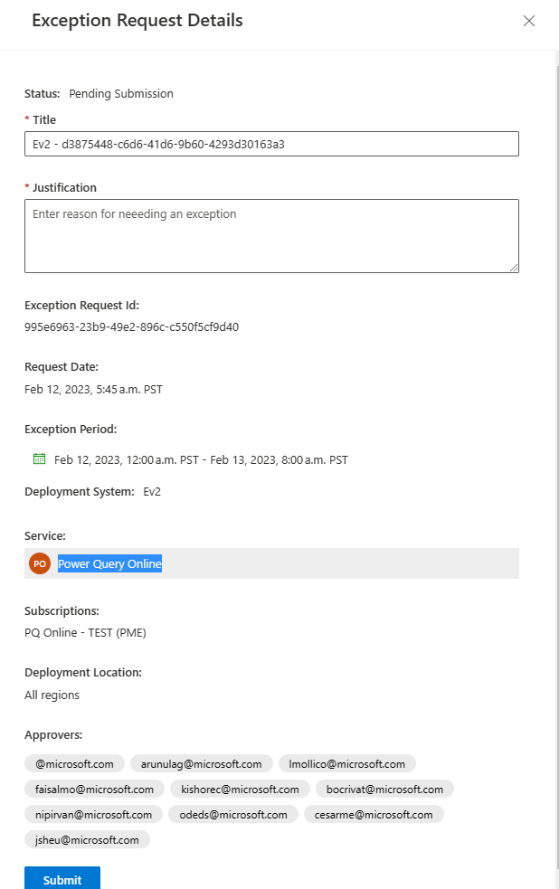
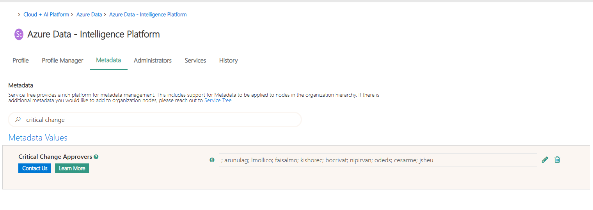
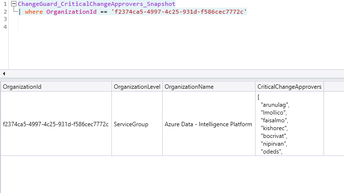

# Exception Request Creation email failed to be sent

### One possible reason for this would be invalid email addresses from approvers.(e.g.: [ICM Incident - 367211386](https://portal.microsofticm.com/imp/v3/incidents/details/367211386/home))

1. Check the errors inside the logic apps.
    - Resource Group: **chggrd-api-prod-westus2**
    - Logic App: **chggrd-api-wf-reqexc-prod**
      - e.g.:
        ```  {
        "body": {
        "status": 400,
        "message": "One or more recipients are invalid.\r\nclientRequestId: 3f2a2596-3d82-46a4-9afa-22fecf91c485\r\nserviceRequestId: 23759cda-000f-0921-a537-34c32df681fd",
        "error": {
        "message": "One or more recipients are invalid.",
        "code": "ErrorInvalidRecipients",
        "originalMessage": "At least one recipient is not valid., Recipient '@microsoft.com' is not resolved. All recipients must be resolved before a message can be submitted."
        },
        "source": "office365-wus2.azconn-wus2-001.p.azurewebsites.net"
        } ```
2. Check the approvers inside the Change Guard portal, for that specific Exception.
    - e.g.:
    - 
3. If the portal has an invalid email address, go to ServiceTree, search for that service, go to Metadata and check the **"Critical Change Approvers"** email addresses there.
    - e.g.:
    - 
4. Depending on which data is incorrect, it needs to either be corrected in ServiceTree or during import into our Kusto/SQL DB.
5. To fix it on our side, we need to sanitize the data where are importing, using the Lens Orchestrator job: [ChangeGuard Update Services Information](https://lens.msftcloudes.com/#/jobs/list?_g=(selectedJob:f581a6f8bf7c4b76b2267189f3cdc4ff,ws:cee2f53f-2d2a-40b4-a0c7-a33918652522)).
  - Add the logic to sanitize data at import.
     - The data is imported from ```cluster('genevareference.westcentralus.kusto.windows.net').database('Shared').DataStudio_ServiceTree_OrganizationMetadata_Snapshot| where Type == "CriticalChangeApprovers"```
     - In our case we added a trim() for invalid characters when parsing the CriticalChangeApprovers string:
        > CriticalChangeApprovers = split(**trim(@"[^a-z]+"**, replace_string(tolower(tostring(parse_json(Value)["CriticalChangeApprovers"]))," ","")),";")
     - Rerun the Lens Orchestrator job to update the data in Kusto
       - Check if the data is updated after the run
       - e.g.: 
  - Check that the data in SQL is also updated and correct
    - Check **[ServicesInfo].[v_SubscriptionOwners]** for that ServiceId  
    - Check which Exceptions have invalid **'Approvers'** inside the **[ExceptionRequest].[ExceptionRequest]** SQL table.
      - You might need to manually fix the data for those exceptions.
  - Fix the payload inside the logic apps runs that failed and rerun the trigger to send the emails.

> [!NOTE] For this particular case, the ICM incident mentioned above is a good example on how to fix a similar scenario. 

 