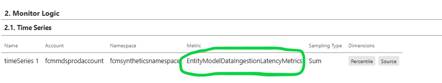
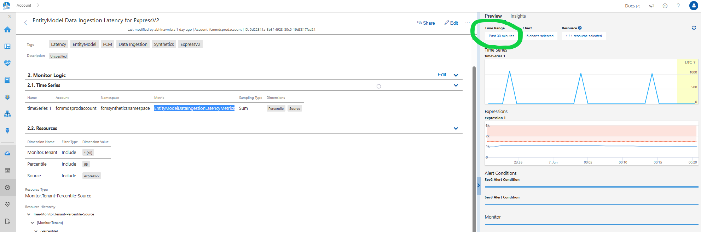

Debug Steps:
1. Open the monitor associated with the incident. 
1. In the Jarvis monitor locate the 'Metric' name under Monitor Logic -> TimeSeries
	
1. Go to EngSys-ChangeManagement-FCM repo and search the Metric name in the code. 
	a. The .json file will show the Synthetic Job configuration. This will help you to find the run frequency and the deployed location of the synthetics job. 
	b. The C# code will show the runtime code. This will help you to find the Kusto function/query that is responsible for generating the datapoints that the synthetic jobs push to Jarvis and on top of which Jarvis Health Metrics and Alarms run. 
1. Once you know the kusto function/query you can then play around with it to see what data is getting emitted. 
1. To see the past monitor health and performance please change the time period of the monitor in the preview section:
		
