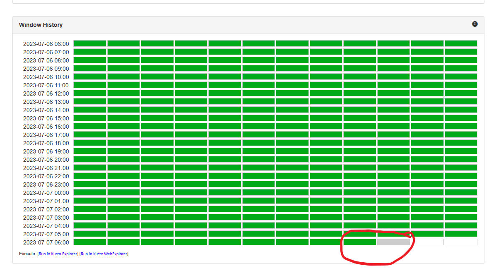
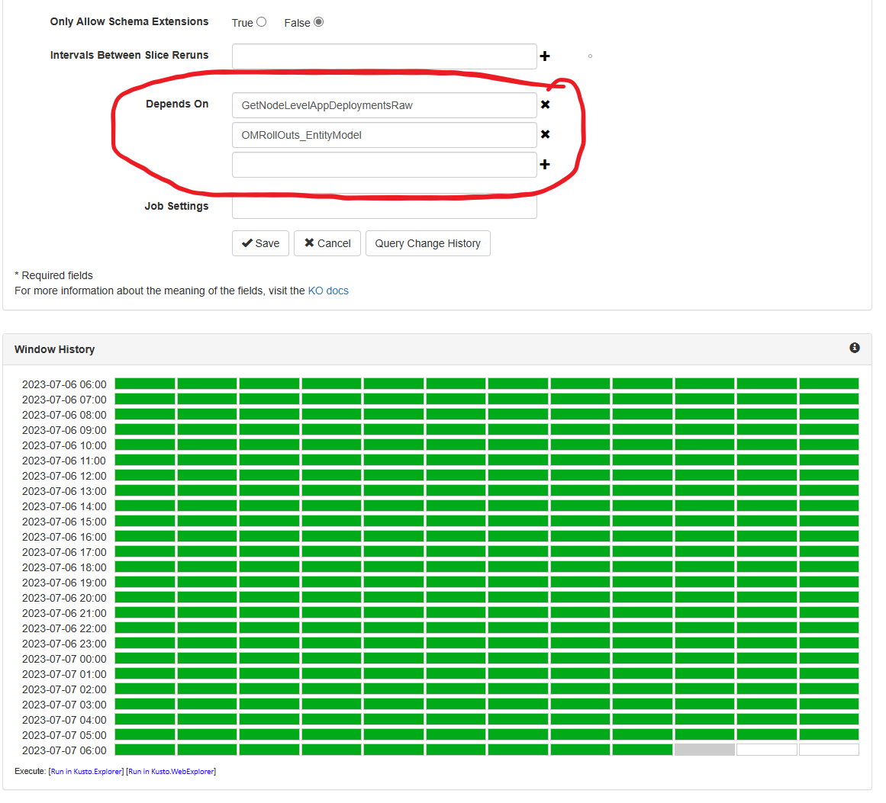
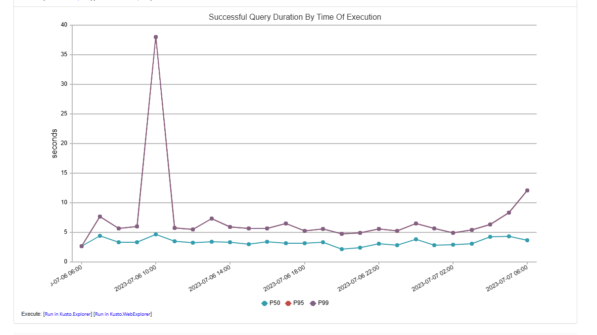

1. Find all the [necessary details for the monitor](FindAllDetailsForTheFailingMonitor.md) which will be required for debugging.
1. Proceed to the Kusto Job using [KO Portal](https://kustoorchestrator.azcompute.com/).
1. Firstly, check in the source table whether there is delay in their ingestion or not.  				
   - Please refer to this [incident](https://portal.microsofticm.com/imp/v3/incidents/details/403963957/home) for more details. 
   - If the issue is at the source side, then please reach out to the owning team of the source via email/incident to figure out the root cause. 
   - If not, then proceed to step two. 
1. Find what's the execution window that the KO Job is using
	
	1. If the time range is in the past then and the difference of currentTime - executionWindowStartTime justifies the delay in the latency:
		1. Check the same thing for the KO Jobs that this KO Job depends on
		
		This will help you to identify the job which is actually causing the delay (the bottleneck).
	1. Now there can be two possible reasons behind this delay:
		1. Increase in the execution time of the KO Job query or any of its dependency:
		   
			- In this case please reach out to the team to figure out what changed. You can also look at the Kusto functions and Repo history to find what changes had been made.
		1. If this is not the case then increasing the number of [`Max Parallelism`](https://eng.ms/docs/products/kusto/orchestrator/concepts/maxparallelism)
		  will help to process the ingestion load faster and can reduce the latency. 
			- Note: **DO NOT** increase the parallelism count drastically.
			- Example: if the current configured value is 5 then increase it to 7 or 8 and let the job catch up gradually instead of bombarding the source cluster with huge traffic.
			- This may cause congestion in their Kusto cluster and impact their other business critical use-cases. 