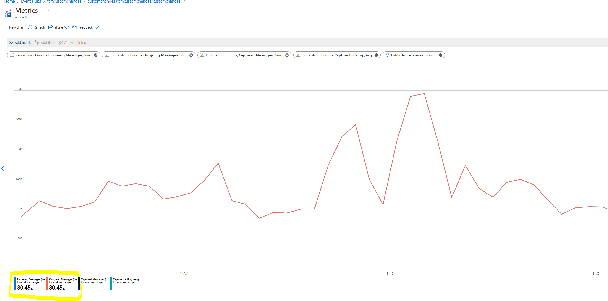

The incident occurs when there is more than 1 hr delay in event processing. The delay is measure from the time the event is ingested and the time it is being processed by the connectors. 

There are 2 types of connectors which drains the incoming data 

1. Standard deployment event conenctors – Which drains data pulled my FCM from standard deployment systems like EV2, AzDeployer, GenevaAction etc 

2. Custom Event Connectors – This drains data being ingested to FCM by customers using our SDK. 

Note : Most of the time the delay is mostly because of standard deployment data, because of the volume being high. 

**Step1: Measure latency**
    
   For the standard deploymet use Jarvis Query below and make sure the timelines are set properly          
         
   - StandardEvents Jarvis Url : https://portal.microsoftgeneva.com/s/8EB4065F         

   Note:  If there's only one tenant, it will show at the bottom of the pane; you can expand to all columns by clicking on '5 of 6 columns' and including the missing column in the list.  

  

   For the custom deploymet use Jarvis Query below and make sure the timelines are set properly   
   - Custome Events Javis Url : https://portal.microsoftgeneva.com/s/80DD558A 

   The query will return which partitions are being slowly processed and which tenant is processing it.  
   We have noticed east instances drain very slowly compared to west. 
   Stopping the east will allows the west to process the records and catchup. 

   Note: We need to investigate and get RCA why east is slower 
 

**Step2 :  Check the eventhub if there is change in ingress of data**

  Check the ingress and outgress of the eventhubs if the ingress is greater than outgress then we are not draining the queue faster. This could be either issue with the connectors reading the messages from eventhub or WebAPI's latency 

  StandardEvents Event hub fcmstandardevents - Microsoft Azure 

https://ms.portal.azure.com/#@MSAzureCloud.onmicrosoft.com/resource/subscriptions/8830ba56-a476-4d01-b6ac-d3ee790383dc/resourceGroups/fcmeraccounts/providers/Microsoft.EventHub/namespaces/fcmstandardevents/overview

  As shown in the below chart , the incoming and outgoing messages should overlay on each other and outgoing messages = incoming messages. 

  

  CustomEvents Event hub customchanges (fcmcustomchanges/customchanges) - Microsoft Azure 

  https://ms.portal.azure.com/#@MSAzureCloud.onmicrosoft.com/resource/subscriptions/8830ba56-a476-4d01-b6ac-d3ee790383dc/resourceGroups/fcmeraccounts/providers/Microsoft.EventHub/namespaces/fcmcustomchanges/eventhubs/customchanges/overview

  As shown in the below chart , the incoming and outgoing messages should overlay on each other and outgoing messages = incoming messages.

  If there is influx of messages and the connectors are not sufficient, increase the instances of connectors.  

**Step3 : Check the connectors cloud services**

  Go to the portal for the below services and make sure they are healthy and running 

  Standardevent processing cloudservice -  

   East  US - prodstandarddeploymenteventconnectoreastus - Microsoft Azure 

https://ms.portal.azure.com/#@MSAzureCloud.onmicrosoft.com/resource/subscriptions/fbc17084-a3a3-42bf-a9dc-8bc7f996a679/resourceGroups/FCMPRODEASTUS/providers/Microsoft.Compute/cloudServices/prodstandarddeploymenteventconnectoreastus/overview

   West US - prodstandarddeploymenteventconnectorwestus - Microsoft Azure 

https://ms.portal.azure.com/#@MSAzureCloud.onmicrosoft.com/resource/subscriptions/fbc17084-a3a3-42bf-a9dc-8bc7f996a679/resourceGroups/FCMPRODWESTUS/providers/Microsoft.Compute/cloudServices/prodstandarddeploymenteventconnectorwestus/overview

  Customevent processing cloudservice -  

  East  US - prodcustomeventconnectoreastus - Microsoft Azure

https://ms.portal.azure.com/#@MSAzureCloud.onmicrosoft.com/resource/subscriptions/fbc17084-a3a3-42bf-a9dc-8bc7f996a679/resourceGroups/FCMPRODEASTUS/providers/Microsoft.Compute/cloudServices/prodcustomeventconnectoreastus/overview

  West US - prodcustomeventconnectorwestus - Microsoft Azure 

 https://ms.portal.azure.com/#@MSAzureCloud.onmicrosoft.com/resource/subscriptions/fbc17084-a3a3-42bf-a9dc-8bc7f996a679/resourceGroups/FCMPRODWESTUS/providers/Microsoft.Compute/cloudServices/prodcustomeventconnectorwestus/overview

**Step 4:Check the WebAPI cloud services**

  Go to the portal for the below services and make sure they are healthy and running 

  East US WebAPI:

https://ms.portal.azure.com/#@MSAzureCloud.onmicrosoft.com/resource/subscriptions/fbc17084-a3a3-42bf-a9dc-8bc7f996a679/resourceGroups/FCMProdEastUS/providers/Microsoft.Compute/cloudServices/prodwebapiwriteeastus/overview
  West US WebAPI:

https://ms.portal.azure.com/#@MSAzureCloud.onmicrosoft.com/resource/subscriptions/fbc17084-a3a3-42bf-a9dc-8bc7f996a679/resourceGroups/FCMProdWestUS/providers/Microsoft.Compute/cloudServices/prodwebapiwritewestus/overview
   

     **Check the latency of WebAPI**

   Check webapi latency and any issues 

   https://portal.microsoftgeneva.com/s/D7CAB95B"https://portal.microsoftgeneva.com/s/D7CAB95B 

   The expected latency is around 300ms  
   If the latencies are high, check the database status 

**Step 5: Check Database status**

		Shard 0 - ﷟HYPERLINK "https://ms.portal.azure.com/#@MSAzureCloud.onmicrosoft.com/resource/subscriptions/fbc17084-a3a3-42bf-a9dc-8bc7f996a679/resourceGroups/Default-SQL-WestUS/providers/Microsoft.Sql/servers/x2altnc1cm/databases/MSChangeShard_0/overview"MSChangeShard_0 (x2altnc1cm/MSChangeShard_0) - Microsoft Azure 

		Shard 1 - ﷟HYPERLINK "https://ms.portal.azure.com/#@MSAzureCloud.onmicrosoft.com/resource/subscriptions/fbc17084-a3a3-42bf-a9dc-8bc7f996a679/resourceGroups/Default-SQL-WestUS/providers/Microsoft.Sql/servers/x2altnc1cm/databases/MSChangeShard_1/overview"MSChangeShard_1 (x2altnc1cm/MSChangeShard_1) - Microsoft Azure 

		Shard2 - ﷟HYPERLINK "https://ms.portal.azure.com/#@MSAzureCloud.onmicrosoft.com/resource/subscriptions/fbc17084-a3a3-42bf-a9dc-8bc7f996a679/resourceGroups/Default-SQL-WestUS/providers/Microsoft.Sql/servers/x2altnc1cm/databases/MSChangeShard_2/overview"MSChangeShard_2 (x2altnc1cm/MSChangeShard_2) - Microsoft Azure 

		Shard3-﷟HYPERLINK "https://ms.portal.azure.com/#@MSAzureCloud.onmicrosoft.com/resource/subscriptions/fbc17084-a3a3-42bf-a9dc-8bc7f996a679/resourceGroups/Default-SQL-WestUS/providers/Microsoft.Sql/servers/x2altnc1cm/databases/MSChangeShard_3/overview"MSChangeShard_3 (x2altnc1cm/MSChangeShard_3) - Microsoft Azure 

		ShardMap - MSChange (x2altnc1cm/MSChange) - Microsoft Azure 

 

**Step 6: Check the Errors . If there are errors being encountered, we can use appinsights to look for any errors**

  Run the below query, Make sure you are using correct time lines. 
  Go to Log Analytics and run query 

https://ms.portal.azure.com#@33e01921-4d64-4f8c-a055-5bdaffd5e33d/blade/Microsoft_Azure_Monitoring_Logs/LogsBlade/resourceId/%2Fsubscriptions%2Ffbc17084-a3a3-42bf-a9dc-8bc7f996a679%2FresourceGroups%2Fprodchangeapiuswest1%2Fproviders%2Fmicrosoft.insights%2Fcomponents%2Fmsdial.change.core.webapi/source/LogsBlade.AnalyticsShareLinkToQuery/q/H4sIAAAAAAAAA4WPwUrDUBBF9%252F2K8dFFsnGlyyxEaglSlSyEruSRd9M8TWfizAS76MfbFEQUwe053OGM4n2CuR3po4eCOO5BrbDHzFaEVhEdoSTR32oa01ktjq%252BSmd4yp2pA5zI5tMChxehZ2E5bpuVsLmWExhm%252B1Kmqlpp3%252FU%252B4%252BMooFDYNfisJ1EcbFV0%252BULgKc8jf7jpQGTlRZobuxXwDs7gDXXw33z02q3r9QPer7fyJuZ64h393z1mGcyNJR09NvblptvORUH4CYn8BvkABAAA%253D/timespan/P1D

 

**Miscellaneous**

The more detailed logs are also available in Jarvis 

All the logs are available in Jarvis Namespace : changemdsfcmprod 

and Events are 

ChangeEventConnector 

ChangeWebapi 

QosEventPartC 